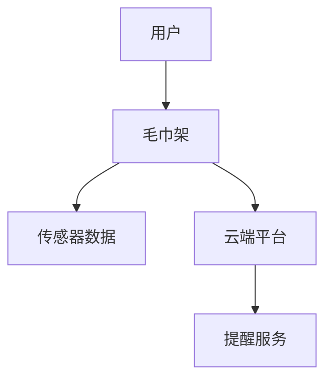
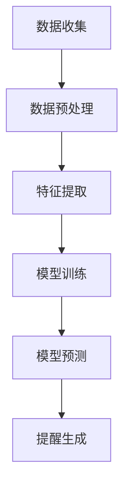
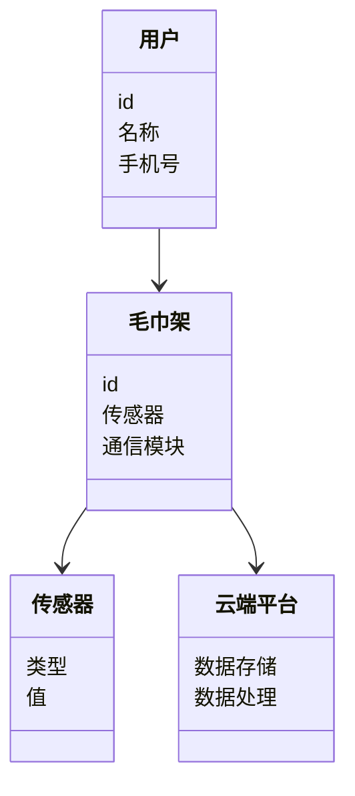
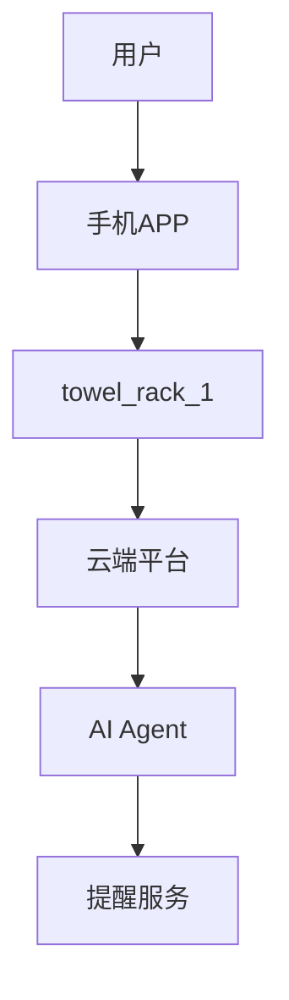
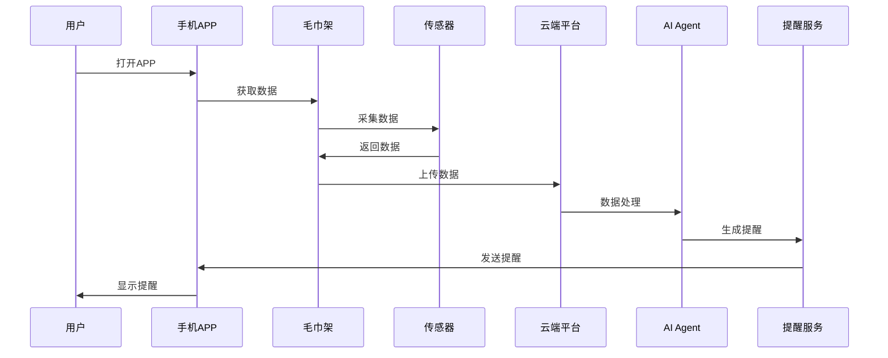

                 


# 智能浴室毛巾架：AI Agent的毛巾更换提醒

> 关键词：智能浴室毛巾架，AI Agent，物联网，智能传感器，毛巾更换提醒

> 摘要：本文详细介绍了智能浴室毛巾架的设计与实现，结合AI Agent和物联网技术，通过智能传感器和数据处理算法，实现毛巾更换提醒功能。文章从背景分析、核心概念、算法原理、系统架构到项目实战，全面阐述了智能浴室毛巾架的设计思路和实现过程。

---

# 第一部分: 智能浴室毛巾架的背景与问题分析

## 第1章: 智能浴室毛巾架的背景与问题描述

### 1.1 问题背景

#### 1.1.1 浴室环境与毛巾使用习惯
浴室是家庭中使用频率较高的空间，毛巾作为日常清洁用品，通常被挂在毛巾架上。然而，毛巾的使用习惯往往存在以下问题：
- **毛巾使用周期不明确**：用户通常不会定期更换毛巾，导致毛巾可能在使用较长时间后才被更换。
- **毛巾潮湿问题**：浴室环境中湿度较高，毛巾容易发霉、滋生细菌，影响健康。
- **用户习惯的不规范性**：部分用户可能忘记或忽略毛巾的使用情况，导致毛巾长期未更换。

#### 1.1.2 毛巾更换的常见问题
毛巾的更换频率直接影响到卫生和健康。如果毛巾长时间不更换，可能引发以下问题：
- **细菌滋生**：潮湿的环境容易导致细菌繁殖，毛巾成为细菌滋生的温床。
- **毛巾发臭**：长期使用的毛巾容易产生异味，影响使用体验。
- **毛巾损坏**：毛巾在长期使用后可能会出现破损、掉毛等问题，影响使用寿命。

#### 1.1.3 智能化毛巾管理的需求
随着智能家居技术的发展，用户对生活便利性的需求日益增加。智能化的毛巾管理可以为用户提供以下优势：
- **智能化管理**：通过传感器和AI算法，实现毛巾更换的智能化提醒。
- **健康保障**：通过实时监测毛巾的使用状态，确保毛巾的卫生和健康。
- **便捷性**：用户无需手动记录毛巾的使用情况，系统自动提醒更换。

### 1.2 问题描述

#### 1.2.1 毛巾使用周期的定义
毛巾的使用周期通常是指从毛巾开始使用到更换的间隔时间。根据行业标准和用户习惯，毛巾的使用周期一般建议为2-4周。然而，实际使用中，用户往往忽视更换时间，导致毛巾使用周期过长。

#### 1.2.2 智能毛巾架的功能需求
智能毛巾架需要具备以下核心功能：
- **实时监测**：通过传感器实时监测毛巾的使用状态，包括湿度、重量、使用频率等。
- **智能提醒**：根据监测数据，判断是否需要更换毛巾，并通过手机APP或其他方式提醒用户。
- **数据存储与分析**：将监测数据上传至云端，进行分析和统计，为用户提供使用建议和历史记录。

#### 1.2.3 用户痛点分析
通过调研和分析，我们总结出以下用户痛点：
- **忘记更换毛巾**：用户常常因为忙碌或其他原因，忘记更换毛巾。
- **毛巾使用状态无法实时掌握**：用户无法直观了解毛巾的当前状态，如是否需要更换。
- **缺乏个性化建议**：用户需要根据自身习惯获得个性化的毛巾更换建议。

### 1.3 问题解决思路

#### 1.3.1 AI Agent的核心作用
AI Agent（智能代理）在智能毛巾架系统中扮演着核心角色，其主要功能包括：
- **数据收集与处理**：通过传感器收集毛巾的使用数据，并进行预处理。
- **决策与提醒**：基于收集的数据，判断是否需要更换毛巾，并通过手机APP或语音助手提醒用户。
- **学习与优化**：通过机器学习算法，优化提醒策略，提高系统的智能化水平。

#### 1.3.2 智能传感器的应用
智能传感器是智能毛巾架实现智能化的关键技术之一。常用的传感器包括：
- **湿度传感器**：用于监测毛巾的湿度，判断是否需要晾干。
- **重量传感器**：通过检测毛巾的重量变化，判断是否需要更换。
- **温度传感器**：用于监测环境温度，辅助判断毛巾的使用状态。

#### 1.3.3 云端数据处理的优势
将传感器数据上传至云端，可以实现以下功能：
- **数据存储**：长期保存毛巾的使用数据，便于分析和回顾。
- **数据处理**：通过大数据分析，提取有用的使用模式和趋势。
- **个性化服务**：基于用户数据，提供个性化的毛巾更换建议。

### 1.4 系统边界与外延

#### 1.4.1 系统的功能边界
智能毛巾架系统的功能边界包括：
- **数据采集**：通过传感器采集毛巾的使用数据。
- **数据处理**：对采集的数据进行分析和处理。
- **提醒服务**：根据分析结果，向用户发送更换提醒。

#### 1.4.2 系统的外延功能
系统的外延功能包括：
- **远程控制**：用户可以通过手机APP远程控制毛巾架的某些功能。
- **数据共享**：用户可以将毛巾使用数据分享给家人或健康管理平台。
- **智能推荐**：系统可以根据用户的使用习惯，推荐合适的毛巾品牌和更换周期。

#### 1.4.3 系统与外部环境的交互
智能毛巾架系统需要与外部环境进行交互，主要包括：
- **用户交互**：通过手机APP或语音助手与用户进行交互。
- **云端交互**：与云端数据处理平台进行数据传输和分析。
- **设备交互**：与智能家居设备（如智能门锁、灯光系统）进行联动。

### 1.5 系统的核心要素组成

#### 1.5.1 物理组件
智能毛巾架的物理组件包括：
- **毛巾架主体**：用于悬挂毛巾。
- **传感器模块**：包括湿度传感器、重量传感器等。
- **通信模块**：用于与手机APP或其他设备进行数据传输。

#### 1.5.2 软件组件
智能毛巾架的软件组件包括：
- **AI Agent**：负责数据处理和决策。
- **手机APP**：用户界面，用于显示数据和接收提醒。
- **云端平台**：用于存储和分析数据。

#### 1.5.3 数据流与信息交互
智能毛巾架的数据流包括：
1. **传感器数据采集**：传感器采集毛巾的使用数据。
2. **数据传输**：数据通过通信模块传输至手机APP或云端。
3. **数据处理**：AI Agent对数据进行分析和处理。
4. **提醒生成**：根据分析结果，生成毛巾更换提醒。
5. **用户反馈**：用户通过手机APP或语音助手接收提醒并进行反馈。

---

# 第二部分: 核心概念与联系

## 第2章: AI Agent与物联网的核心概念

### 2.1 AI Agent的基本原理

#### 2.1.1 AI Agent的定义
AI Agent（智能代理）是指能够感知环境、自主决策并执行任务的智能实体。在智能毛巾架系统中，AI Agent负责数据处理、决策和提醒生成。

#### 2.1.2 AI Agent的核心特征
- **感知能力**：能够通过传感器感知环境和数据。
- **决策能力**：能够根据感知数据做出决策。
- **执行能力**：能够通过执行机构或通信模块执行决策。

#### 2.1.3 AI Agent与传统算法的区别
AI Agent与传统算法的主要区别在于：
- AI Agent具有自主性和适应性，能够根据环境变化动态调整行为。
- AI Agent能够通过学习和优化，不断提高自身的决策能力。

### 2.2 物联网技术的核心原理

#### 2.2.1 物联网的定义
物联网是指通过信息传感设备，按照约定的协议，把任何物品与互联网连接起来，进行信息交换和通信，以实现智能化识别、定位、跟踪、监控和管理。

#### 2.2.2 物联网的关键技术
- **传感器技术**：用于采集物理世界中的数据。
- **通信技术**：用于数据的传输和通信。
- **云计算技术**：用于数据的存储和处理。

#### 2.2.3 物联网在智能设备中的应用
物联网技术在智能设备中的应用包括：
- **智能家居**：通过物联网技术实现家居设备的联动控制。
- **智能监控**：通过物联网技术实现设备的远程监控和管理。

### 2.3 核心概念的对比分析

#### 2.3.1 AI Agent与物联网的对比表格

| 特性       | AI Agent                     | 物联网                     |
|------------|----------------------------|-----------------------------|
| 定义       | 智能代理，用于感知和决策     | 通过传感器和网络实现物物相连 |
| 核心技术   | 人工智能、机器学习          | 传感器、通信、云计算        |
| 应用场景   | 智能助手、自动化决策        | 智能家居、智能监控          |

#### 2.3.2 系统的ER实体关系图


---

# 第三部分: 算法原理

## 第3章: AI Agent的算法原理与实现

### 3.1 数据收集与预处理

#### 3.1.1 数据收集的实现
传感器数据的收集是AI Agent的第一步。在智能毛巾架中，主要的传感器包括湿度传感器和重量传感器。

#### 3.1.2 数据预处理的方法
数据预处理包括：
- **去噪处理**：去除传感器数据中的噪声。
- **归一化处理**：将数据归一化到统一的范围内。

### 3.2 特征提取与决策模型

#### 3.2.1 特征提取的实现
通过传感器数据提取有用的特征，例如：
- **湿度特征**：最大湿度、平均湿度等。
- **重量特征**：重量变化率、重量波动幅度等。

#### 3.2.2 决策模型的构建
基于提取的特征，构建决策模型。常用的算法包括：
- **随机森林**：用于分类和回归。
- **支持向量机**：用于分类和回归。

#### 3.2.3 决策模型的优化
通过交叉验证和网格搜索，优化模型的参数，提高模型的准确率。

### 3.3 算法流程与代码实现

#### 3.3.1 算法流程图


#### 3.3.2 算法实现的Python代码示例
```python
import numpy as np
from sklearn.ensemble import RandomForestClassifier

# 数据预处理
def preprocess(data):
    # 去噪处理
    filtered_data = data.drop(columns=['noise'])
    return filtered_data

# 特征提取
def extract_features(data):
    features = data[['humidity', 'weight']]
    return features

# 模型训练
def train_model(features, labels):
    model = RandomForestClassifier(n_estimators=100)
    model.fit(features, labels)
    return model

# 模型预测
def predict_model(model, features):
    return model.predict(features)

# 提醒生成
def generate_reminder(prediction):
    if prediction == 1:
        return "请更换毛巾"
    else:
        return "无需更换毛巾"

# 主函数
def main():
    # 数据加载
    data = pd.read_csv('towel_data.csv')
    # 数据预处理
    processed_data = preprocess(data)
    # 特征提取
    features = extract_features(processed_data)
    # 标签提取
    labels = processed_data['label']
    # 模型训练
    model = train_model(features, labels)
    # 模型预测
    prediction = predict_model(model, features)
    # 提醒生成
    reminder = generate_reminder(prediction)
    print(reminder)

if __name__ == "__main__":
    main()
```

### 3.4 数学模型与公式

#### 3.4.1 随机森林算法的数学模型
随机森林是一种基于决策树的集成算法，其数学模型如下：
$$
\text{随机森林} = \{ \text{决策树}_1, \text{决策树}_2, \ldots, \text{决策树}_n \}
$$
预测时，随机森林通过投票机制得到最终结果。

#### 3.4.2 决策树的分类公式
决策树的分类公式如下：
$$
\text{分类结果} = \argmax_{i} \sum_{j=1}^{n} \text{决策树}_j(i)
$$

---

# 第四部分: 系统分析与架构设计

## 第4章: 智能毛巾架的系统架构设计

### 4.1 系统功能设计

#### 4.1.1 领域模型设计
智能毛巾架的领域模型包括以下实体：
- **用户**：系统的主要用户。
- **毛巾架**：系统的物理载体。
- **传感器**：用于采集数据的设备。
- **云端平台**：用于存储和处理数据。

#### 4.1.2 领域模型类图


### 4.2 系统架构设计

#### 4.2.1 系统架构图


#### 4.2.2 接口设计
- **用户接口**：手机APP提供用户与系统的交互界面。
- **设备接口**：毛巾架与传感器之间的通信接口。
- **云端接口**：系统与云端平台之间的数据接口。

#### 4.2.3 交互流程


---

# 第五部分: 项目实战

## 第5章: 智能毛巾架的实现与案例分析

### 5.1 环境安装与配置

#### 5.1.1 硬件环境
- **处理器**：Intel i5 或更高
- **内存**：8GB 或更高
- **开发板**：Raspberry Pi 4
- **传感器**：DHT22湿度传感器、重量传感器

#### 5.1.2 软件环境
- **操作系统**：Ubuntu 20.04
- **开发工具**：Python 3.8、Jupyter Notebook
- **库依赖**：numpy、pandas、scikit-learn

### 5.2 系统核心实现

#### 5.2.1 传感器数据采集
```python
import Adafruit_DHT
import time

sensor = Adafruit_DHT.DHT22
pin = 4
humidity, temperature = Adafruit_DHT.read_retry(sensor, pin)
print("湿度: {}% 坍温度: {}C".format(humidity, temperature))
```

#### 5.2.2 数据处理与分析
```python
import pandas as pd
from sklearn.ensemble import RandomForestClassifier

data = pd.read_csv('towel_data.csv')
processed_data = preprocess(data)
features = extract_features(processed_data)
model = train_model(features, labels)
```

#### 5.2.3 提醒服务实现
```python
def generate_reminder(prediction):
    if prediction == 1:
        return "请更换毛巾"
    else:
        return "无需更换毛巾"
```

### 5.3 案例分析与优化

#### 5.3.1 系统性能分析
通过实验数据分析系统性能，包括：
- **准确率**：模型预测的准确率。
- **响应时间**：系统从数据采集到提醒生成的响应时间。

#### 5.3.2 系统优化建议
- **传感器选择**：选择更高精度的传感器。
- **算法优化**：尝试其他机器学习算法，如支持向量机、K-近邻等。
- **系统稳定性**：优化系统架构，提高系统的稳定性和可扩展性。

---

# 第六部分: 最佳实践与总结

## 第6章: 项目总结与经验分享

### 6.1 最佳实践

#### 6.1.1 系统设计
- **模块化设计**：系统设计时，尽量模块化，便于后期维护和扩展。
- **数据安全**：确保用户数据的安全性，避免数据泄露。

#### 6.1.2 开发规范
- **代码规范**：遵循PEP8等代码规范，提高代码可读性。
- **版本控制**：使用Git进行版本控制，便于团队协作。

### 6.2 项目小结

#### 6.2.1 系统优势
- **智能化**：通过AI Agent实现智能化管理。
- **便捷性**：用户可以通过手机APP方便地查看数据和接收提醒。
- **健康保障**：通过实时监测，确保毛巾的卫生和健康。

#### 6.2.2 系统不足
- **成本较高**：智能传感器和AI算法的实现成本较高。
- **用户体验**：部分功能可能需要用户适应一段时间。

### 6.3 注意事项

#### 6.3.1 系统维护
- **定期检查**：定期检查传感器和通信模块，确保系统正常运行。
- **数据备份**：定期备份系统数据，防止数据丢失。

#### 6.3.2 用户教育
- **使用培训**：为用户提供使用培训，帮助用户更好地使用系统。
- **用户反馈**：收集用户反馈，不断优化系统功能。

### 6.4 拓展阅读

#### 6.4.1 推荐书籍
- 《机器学习实战》
- 《物联网技术与应用》

#### 6.4.2 推荐博客
- [AI Agent技术博客](https://example.com)
- [物联网技术博客](https://example.com)

---

# 结语

智能浴室毛巾架通过结合AI Agent和物联网技术，为用户提供了智能化的毛巾管理解决方案。本文从背景分析、核心概念、算法原理、系统架构到项目实战，全面阐述了智能浴室毛巾架的设计思路和实现过程。希望本文能为相关领域的研究和实践提供有价值的参考。

