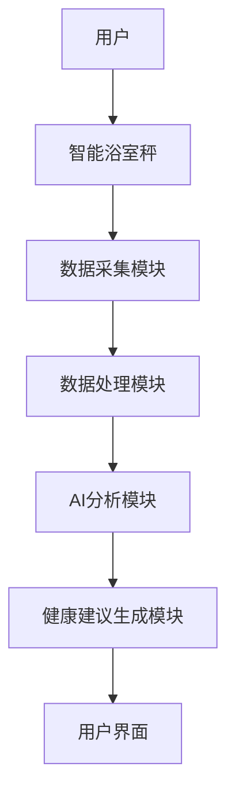

                 


# 智能浴室秤：AI Agent的身体成分分析与健康建议

> 关键词：智能浴室秤，AI Agent，身体成分分析，健康建议，机器学习，传感器数据，系统架构

> 摘要：智能浴室秤通过AI Agent技术，能够实时采集和分析身体成分数据，并根据个体需求提供个性化健康建议。本文从背景、技术原理、系统设计、项目实战到最佳实践，详细探讨智能浴室秤的工作机制和应用场景。

---

## 第一部分：智能浴室秤的背景与概念

### 第1章：智能浴室秤的发展与应用

#### 1.1 智能浴室秤的定义与特点
智能浴室秤是一种结合了传感器技术和人工智能（AI）的智能设备，用于测量用户的体重、体脂、肌肉量等身体成分数据，并通过AI算法提供健康建议。其特点包括：
- **实时测量**：快速获取身体成分数据。
- **AI驱动**：通过AI算法分析数据，提供个性化建议。
- **智能化**：能够与手机、智能手表等设备联动，提供连续的健康监测。

#### 1.2 AI Agent的基本概念与作用
AI Agent是一种智能体，能够感知环境并采取行动以实现目标。在智能浴室秤中，AI Agent负责：
- 数据采集与处理。
- 身体成分分析。
- 健康建议生成。

#### 1.3 智能浴室秤的应用场景
智能浴室秤广泛应用于家庭健康监测、健身房会员管理、医疗健康领域等场景。通过AI Agent技术，用户可以实时了解自己的身体状况，并根据建议调整生活习惯。

### 第2章：智能浴室秤的核心功能与技术实现

#### 2.1 身体成分分析的基本原理
身体成分分析包括体重、体脂、肌肉量、水分含量等指标。通过传感器采集数据后，AI算法进行分析，生成身体成分报告。

#### 2.2 AI Agent在健康建议中的应用
AI Agent根据身体成分分析结果，结合用户年龄、性别、饮食习惯等信息，生成个性化的健康建议，例如饮食调整、运动计划等。

---

## 第二部分：智能浴室秤的核心技术与算法

### 第3章：AI Agent的核心算法原理

#### 3.1 传感器数据的采集与处理
- **传感器类型**：压力传感器、重量传感器等。
- **数据预处理**：去噪、归一化。
- **特征提取**：提取体重、体脂等关键特征。

#### 3.2 身体成分分析的机器学习模型
- **线性回归模型**：用于预测体脂含量。
- **支持向量机（SVM）**：用于分类健康与亚健康状态。
- **神经网络模型**：用于复杂的身体成分分析。

#### 3.3 健康建议生成的算法实现
- **基于规则的健康建议**：根据身体成分指标生成初步建议。
- **基于机器学习的个性化建议**：利用用户数据优化建议。

### 第4章：健康建议生成的算法实现

#### 4.1 数据预处理与特征提取
- **数据清洗**：处理缺失值和异常值。
- **特征提取**：提取体重、体脂、肌肉量等关键特征。

#### 4.2 机器学习模型的选择与训练
- **模型选择**：根据数据集选择合适的算法。
- **模型训练**：利用训练数据优化模型参数。

#### 4.3 健康建议的生成与优化
- **个性化建议**：根据用户特征生成定制化建议。
- **动态调整**：根据反馈优化建议内容。

---

## 第三部分：智能浴室秤的系统分析与架构设计

### 第5章：系统架构设计

#### 5.1 系统组成部分
- **硬件部分**：智能浴室秤、传感器。
- **软件部分**：数据处理模块、AI算法模块、用户界面。

#### 5.2 系统架构图


#### 5.3 系统交互流程
- 用户使用智能浴室秤测量身体成分数据。
- 数据传输至数据处理模块，进行预处理和特征提取。
- AI分析模块利用机器学习模型生成身体成分报告。
- 健康建议生成模块根据报告生成个性化建议。
- 用户通过界面查看报告和建议。

---

## 第四部分：智能浴室秤的项目实战

### 第6章：项目实战

#### 6.1 环境安装
- **安装Python**：`python --version`
- **安装依赖库**：`pip install numpy pandas scikit-learn`

#### 6.2 核心代码实现

##### 数据预处理代码
```python
import numpy as np
import pandas as pd

# 读取数据
data = pd.read_csv('body_data.csv')

# 数据清洗
data.dropna(inplace=True)
data = data[~data['weight'].isnull()]
```

##### 机器学习模型训练代码
```python
from sklearn.model import LinearRegression

# 创建模型
model = LinearRegression()

# 训练模型
model.fit(X_train, y_train)
```

#### 6.3 实际案例分析
- 数据采集：用户体重、体脂、肌肉量等数据。
- 数据分析：利用机器学习模型预测体脂含量。
- 健康建议：根据分析结果生成饮食和运动计划。

---

## 第五部分：智能浴室秤的最佳实践

### 第7章：最佳实践

#### 7.1 小结
- 智能浴室秤通过AI Agent技术，实现了身体成分的智能化分析与健康建议生成。
- 机器学习模型的应用是关键。

#### 7.2 注意事项
- 数据隐私保护：确保用户数据的安全性。
- 算法优化：持续优化模型以提高准确性。
- 用户体验：设计友好的用户界面，提升用户体验。

#### 7.3 拓展阅读
- 《机器学习实战》
- 《人工智能：一种现代的方法》

---

## 附录

### 附录A：完整代码

```python
import numpy as np
import pandas as pd
from sklearn.model import LinearRegression

# 数据预处理
data = pd.read_csv('body_data.csv')
data.dropna(inplace=True)

# 特征工程
features = data[['weight', 'age', 'gender']]
target = data['body_fat']

# 模型训练
model = LinearRegression()
model.fit(features, target)

# 预测
new_sample = np.array([[70, 30, 1]])
prediction = model.predict(new_sample)
print("预测体脂率：", prediction[0])
```

---

通过以上内容，我们详细探讨了智能浴室秤的技术原理、系统设计和实际应用，希望对读者有所帮助。

