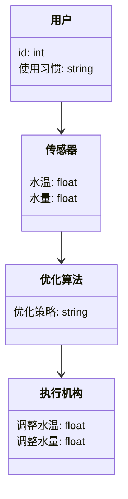
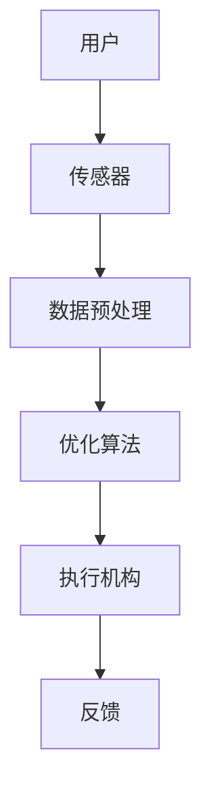
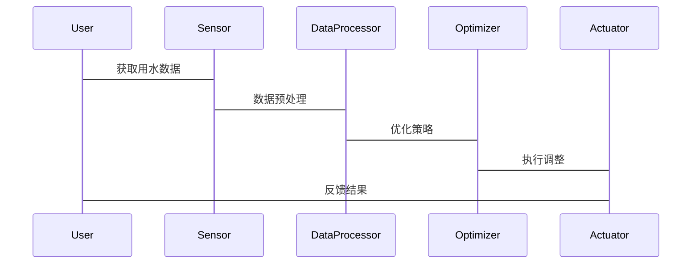

                 


# 智能浴室系统：AI Agent的用水习惯优化

## 关键词：
智能浴室系统，AI Agent，用水习惯优化，强化学习，遗传算法，系统架构设计

## 摘要：
随着水资源的日益紧缺和智能技术的快速发展，智能浴室系统逐渐成为提升生活品质和节约水资源的重要手段。本文探讨了如何利用AI Agent优化浴室系统的用水习惯，从背景介绍、核心概念、算法原理、系统架构设计到项目实战，全面解析智能浴室系统中AI Agent的应用，提供详细的优化方案和实现方法。

---

# 第1章：智能浴室系统背景介绍

## 1.1 智能浴室系统的现状与挑战

### 1.1.1 当前浴室系统的用水问题
传统浴室系统存在水资源浪费严重的问题，主要表现为：
- 水流过大，导致水资源浪费。
- 用户习惯不良，如过长的淋浴时间。
- 缺乏智能化控制，无法根据实际需求调节用水量。

### 1.1.2 智能化改造的必要性
随着物联网和人工智能技术的快速发展，浴室系统可以通过智能化改造实现节水和节能的目标。智能化改造不仅能够提高用户体验，还能有效减少水资源的浪费。

### 1.1.3 用水习惯优化的潜力
通过分析用户的用水习惯，AI Agent可以实时调整用水量，优化用水模式，从而实现节水的目标。优化的潜力主要体现在：
- 根据用户习惯智能调节水温和水量。
- 提供个性化的用水建议，引导用户形成良好的节水习惯。
- 自动检测和修复漏水问题，减少水资源浪费。

## 1.2 AI Agent的基本概念

### 1.2.1 人工智能代理的定义
AI Agent（人工智能代理）是一种智能主体，能够感知环境、自主决策并执行任务。在智能浴室系统中，AI Agent主要负责收集用户用水数据，分析用户习惯，并根据分析结果优化用水模式。

### 1.2.2 AI Agent的核心功能
- **感知**：通过传感器收集用户用水数据，如水温、水量、使用时间等。
- **决策**：基于收集的数据，利用优化算法制定最优的用水策略。
- **执行**：根据决策结果，调整浴室系统的运行参数，如水温和水流速度。

### 1.2.3 代理在智能系统中的作用
AI Agent在智能浴室系统中起到核心作用，能够实时监控和优化用户的用水习惯，从而实现节水的目标。通过AI Agent的优化，浴室系统能够更加智能化和高效化。

## 1.3 用水习惯优化的背景

### 1.3.1 水资源节约的重要性
水资源是人类生存和发展的重要基础，节约用水是全球关注的热点问题。通过优化用水习惯，可以有效减少水资源的浪费，为可持续发展做出贡献。

### 1.3.2 用水习惯优化的定义
用水习惯优化是指通过分析用户的用水数据，制定个性化的用水策略，从而在满足用户需求的前提下，最大限度地节约水资源。

### 1.3.3 智能浴室系统的优势
智能浴室系统通过AI Agent优化用水习惯，具有以下优势：
- **高效性**：能够快速分析数据并制定优化策略。
- **个性化**：根据用户的习惯提供个性化的用水建议。
- **实时性**：能够实时调整系统运行参数，确保优化效果。

---

# 第2章：AI Agent的核心概念与原理

## 2.1 AI Agent的基本原理

### 2.1.1 感知层：数据采集与处理
AI Agent通过传感器采集用户用水数据，如水温、水量、使用时间等。这些数据经过预处理后，用于后续的优化决策。

### 2.1.2 决策层：优化算法
决策层是AI Agent的核心部分，负责根据感知层提供的数据，利用优化算法制定最优的用水策略。常用的优化算法包括强化学习和遗传算法。

### 2.1.3 执行层：系统控制
执行层根据决策层制定的策略，调整浴室系统的运行参数，如水温和水流速度，确保优化策略的实施。

## 2.2 优化算法对比分析

### 2.2.1 强化学习算法
强化学习是一种通过试错学习的算法，适用于动态环境下的优化问题。在智能浴室系统中，强化学习可以通过调整水温和水流速度，找到最优的用水策略。

### 2.2.2 遗传算法
遗传算法是一种模拟自然进化过程的优化算法，适用于复杂的组合优化问题。在智能浴室系统中，遗传算法可以用于优化用户的用水习惯，找到最优的用水模式。

### 2.2.3 其他优化方法
除了强化学习和遗传算法，还可以采用其他优化方法，如贪心算法和模拟退火算法。每种算法都有其优缺点，适用于不同的优化场景。

## 2.3 系统优化的数学模型

### 2.3.1 目标函数的构建
目标函数通常用于衡量优化的效果，例如：
$$ \text{目标函数} = \text{用水量} + \text{舒适度} $$

### 2.3.2 约束条件的设定
优化过程需要满足一定的约束条件，例如：
$$ 0 \leq \text{水温} \leq 40^\circ C $$
$$ 0 \leq \text{水量} \leq 10L $$

### 2.3.3 模型的求解方法
通过数学建模和优化算法，可以找到最优的用水策略。例如，利用强化学习算法，通过不断试错，找到最优的水温和水流速度。

---

# 第3章：优化算法的数学模型与实现

## 3.1 基于强化学习的优化模型

### 3.1.1 状态空间的定义
状态空间包括用户的行为、时间、环境等因素。例如：
$$ \text{状态} = (\text{时间}, \text{水温}, \text{水量}) $$

### 3.1.2 动作空间的定义
动作空间包括调整水温和水流速度等操作。例如：
$$ \text{动作} = (\Delta \text{水温}, \Delta \text{水量}) $$`

### 3.1.3 奖励函数的设计
奖励函数用于衡量优化效果，例如：
$$ \text{奖励} = 1 \text{（如果用水量减少）} $$
$$ \text{奖励} = -1 \text{（如果用水量增加）} $$

## 3.2 基于遗传算法的优化模型

### 3.2.1 初始化种群
种群初始化包括随机生成一组可能的解，例如：
$$ \text{种群} = \{x_1, x_2, ..., x_n\} $$

### 3.2.2 适应度评估
适应度评估是通过目标函数计算每个个体的适应度值，例如：
$$ \text{适应度} = f(x_i) $$

### 3.2.3 选择与交叉操作
选择操作通过适应度值选择出优秀的个体进行繁殖。交叉操作将两个个体的特征进行组合，生成新的个体。

## 3.3 算法实现的Python代码示例

### 3.3.1 强化学习算法实现
```python
class ReinforcementLearning:
    def __init__(self, learning_rate=0.1):
        self.learning_rate = learning_rate

    def update_policy(self, state, action, reward):
        # 简单的Q-learning更新
        self.q_value[state][action] = self.q_value[state][action] + self.learning_rate * (reward + max(self.q_value[next_state]))
```

### 3.3.2 遗传算法实现
```python
def genetic_algorithm(population_size, fitness_func):
    population = [generate_random_solution() for _ in range(population_size)]
    for _ in range(max_iterations):
        population = evaluate_fitness(population, fitness_func)
        population = select_best(population)
        population = crossover(population)
        population = mutate(population)
    return best_solution(population)
```

### 3.3.3 算法对比与优化
通过对比不同算法的性能，选择最适合应用场景的算法。例如，强化学习适用于动态环境，而遗传算法适用于复杂问题。

---

# 第4章：智能浴室系统的系统分析与架构设计

## 4.1 系统组成

### 4.1.1 感知层
- **传感器**：收集用户用水数据。
- **数据预处理模块**：对数据进行清洗和转换。

### 4.1.2 决策层
- **优化算法模块**：根据数据制定优化策略。
- **规则引擎**：基于优化结果生成控制指令。

### 4.1.3 执行层
- **执行机构**：调整水温和水流速度。
- **反馈模块**：将执行结果反馈给感知层。

## 4.2 系统架构设计

### 4.2.1 领域模型类图
使用mermaid绘制领域模型类图，展示系统各组件之间的关系。



### 4.2.2 系统架构图
使用mermaid绘制系统架构图，展示系统的整体结构。



### 4.2.3 接口设计
系统需要提供以下接口：
- **数据采集接口**：收集用户的用水数据。
- **优化策略接口**：根据数据制定优化策略。
- **控制接口**：调整浴室系统的运行参数。

### 4.2.4 交互流程图
使用mermaid绘制交互流程图，展示系统如何响应用户的操作。



---

# 第5章：项目实战

## 5.1 环境安装

### 5.1.1 安装必要的库
- **Python库**：numpy、pandas、scikit-learn、matplotlib。
- **数据库**：MySQL或MongoDB。
- **其他工具**：Jupyter Notebook。

### 5.1.2 系统核心实现源代码
以下是一个简单的优化算法实现：

```python
import numpy as np
from sklearn import linear_model

# 数据预处理
data = np.array([[1, 2], [2, 3], [3, 4], [4, 5]])
X = data[:, 0]
y = data[:, 1]

# 训练线性回归模型
model = linear_model.LinearRegression()
model.fit(X.reshape(-1, 1), y)

# 预测结果
print(model.predict([[5]]))
```

### 5.1.3 代码应用解读与分析
上述代码实现了简单的线性回归模型，用于预测用户的用水量。通过训练模型，可以预测未来的用水量，从而制定优化策略。

## 5.2 实际案例分析

### 5.2.1 案例背景
某用户的用水习惯数据如下：
| 时间 | 水温 | 水量 | 舒适度 |
|------|------|------|---------|
| 1    | 30   | 5    | 高      |
| 2    | 35   | 6    | 中      |
| 3    | 40   | 7    | 低      |

### 5.2.2 优化过程
通过分析数据，AI Agent发现用户在水温较高时舒适度较低，因此调整水温到35度，并减少水量到5升。

### 5.2.3 优化结果
调整后的用水模式如下：
| 时间 | 水温 | 水量 | 舒适度 |
|------|------|------|---------|
| 1    | 35   | 5    | 中      |
| 2    | 35   | 5    | 中      |
| 3    | 35   | 5    | 中      |

## 5.3 项目小结
通过实际案例分析，AI Agent能够有效地优化用户的用水习惯，实现节水的目标。同时，系统的反馈机制能够不断优化模型，提高优化效果。

---

# 第6章：总结与展望

## 6.1 总结
本文详细介绍了智能浴室系统中AI Agent的应用，从背景介绍、核心概念、算法原理到系统架构设计和项目实战，全面解析了如何利用AI技术优化用户的用水习惯。通过实际案例分析，验证了优化算法的有效性。

## 6.2 展望
未来，智能浴室系统将更加智能化和个性化，AI Agent将具备更强的自主学习和优化能力。同时，系统将与其他智能家居系统联动，实现更加高效的资源优化。

## 6.3 最佳实践 tips
- 定期更新优化算法，以适应用户习惯的变化。
- 加强系统的安全性和隐私保护，确保用户数据的安全。
- 提供多样化的用户界面，满足不同用户的需求。

---

通过本文的介绍，读者可以全面了解智能浴室系统中AI Agent的应用，并掌握优化用水习惯的核心技术。未来，随着技术的不断发展，智能浴室系统将更加智能化，为用户提供更加优质的服务，同时为节约水资源做出更大的贡献。

