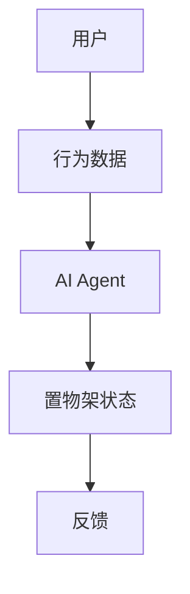
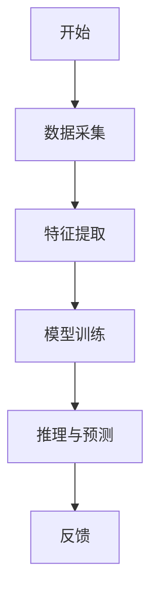
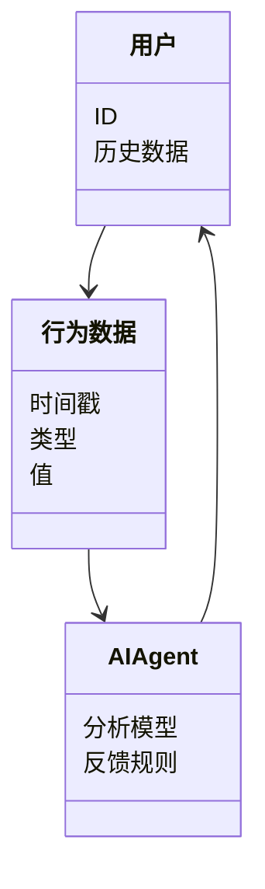
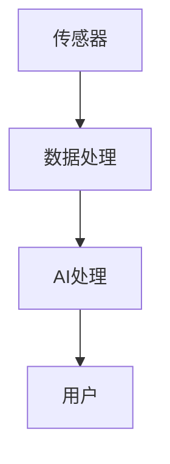
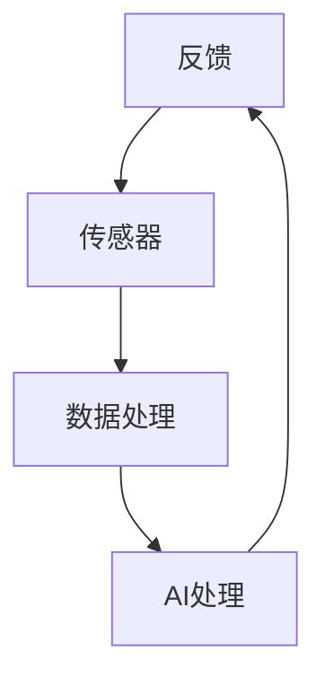

                 


# 智能浴室置物架：AI Agent的个人卫生习惯分析

**关键词：** AI Agent、智能浴室置物架、个人卫生、物联网、传感器技术

**摘要：** 本文深入探讨了AI Agent在智能浴室置物架中的应用，分析了个人卫生习惯的智能化管理。通过背景介绍、核心概念、算法原理、系统设计和项目实战，详细阐述了如何利用AI技术提升卫生习惯的监测和改善。文章结合理论与实践，为读者提供了全面的技术视角。

---

## 目录

1. **背景介绍**
   - 1.1 问题背景与目标
   - 1.2 问题描述与解决思路
   - 1.3 问题解决与边界
   - 1.4 本章小结

2. **核心概念与联系**
   - 2.1 核心概念原理
   - 2.2 核心概念属性对比
   - 2.3 ER实体关系图
   - 2.4 本章小结

3. **算法原理讲解**
   - 3.1 算法原理
   - 3.2 算法流程图
   - 3.3 本章小结

4. **系统分析与架构设计**
   - 4.1 系统功能设计
   - 4.2 系统架构设计
   - 4.3 系统交互设计
   - 4.4 本章小结

5. **项目实战**
   - 5.1 环境安装与配置
   - 5.2 核心代码实现
   - 5.3 功能测试与优化
   - 5.4 本章小结

6. **总结与展望**
   - 6.1 小结与收获
   - 6.2 注意事项与建议
   - 6.3 拓展阅读与学习方向
   - 6.4 本章小结

---

## 正文

### 第一部分: 背景介绍

#### 第1章: 智能浴室置物架与AI Agent概述

##### 1.1 问题背景与目标
- **1.1.1 个人卫生习惯的重要性**  
  个人卫生习惯直接关系到健康和生活质量。通过智能化手段监测和改善这些习惯，可以预防疾病，提升生活品质。

- **1.1.2 智能浴室置物架的应用场景**  
  在现代浴室中，置物架不仅是存储物品的工具，更是智能化健康管理的载体。通过集成传感器和AI技术，可以实时监测用户的卫生习惯。

- **1.1.3 AI Agent在个人卫生管理中的作用**  
  AI Agent（智能体）能够分析用户的卫生行为数据，提供个性化建议，优化卫生习惯。

##### 1.2 问题描述与解决思路
- **1.2.1 卫生习惯分析的难点**  
  传统方法依赖人工记录，存在数据不准确、难以持续的问题。智能化分析需要处理多源异构数据，并实时反馈。

- **1.2.2 智能浴室置物架的设计目标**  
  设计一个能够感知环境、分析数据、提供反馈的智能系统，帮助用户优化卫生习惯。

- **1.2.3 AI Agent如何实现卫生习惯的智能化分析**  
  通过传感器收集数据，AI Agent进行分析和推理，提供个性化建议。

##### 1.3 问题解决与边界
- **1.3.1 AI Agent的核心功能**  
  数据采集、行为分析、个性化反馈。

- **1.3.2 智能浴室置物架的边界与外延**  
  系统专注于卫生习惯分析，不涉及其他浴室功能。

- **1.3.3 系统的核心要素与组成**  
  传感器、AI处理模块、用户交互界面。

##### 1.4 本章小结
  本章介绍了智能浴室置物架的背景、目标及核心功能，为后续分析奠定基础。

---

### 第二部分: 核心概念与联系

#### 第2章: AI Agent与智能浴室置物架的核心概念

##### 2.1 核心概念原理
- **2.1.1 AI Agent的基本原理**  
  AI Agent通过感知环境、分析数据，执行任务。应用于卫生习惯分析时，AI Agent接收传感器数据，进行推理，提供反馈。

- **2.1.2 智能浴室置物架的功能模块**  
  数据采集模块、分析模块、反馈模块。

- **2.1.3 AI Agent与智能硬件的交互机制**  
  传感器采集数据，AI Agent处理数据并生成反馈，反馈至硬件或用户。

##### 2.2 核心概念属性对比
- 表2-1: AI Agent与传统传感器的属性对比  
| 属性       | AI Agent                  | 传统传感器                |
|------------|----------------------------|--------------------------|
| 功能       | 数据分析、推理、反馈      | 数据采集                 |
| 智能性     | 高                        | 低                      |
| 可扩展性   | 高                        | 低                      |

##### 2.3 ER实体关系图


##### 2.4 本章小结
  本章通过对比和图形化展示，清晰阐述了AI Agent与智能浴室置物架的核心概念及交互机制。

---

### 第三部分: 算法原理讲解

#### 第3章: AI Agent的核心算法与实现

##### 3.1 算法原理
- **3.1.1 基于规则的推理算法**  
  通过预设规则对数据进行分类。例如，若用户连续两天未清洁洗手盆，则触发提醒。

- **3.1.2 基于机器学习的分类算法**  
  使用决策树或随机森林等模型，学习用户行为模式，预测卫生习惯。

- **3.1.3 算法选择与优化**  
  根据数据特性选择最优算法，进行参数调优。

##### 3.2 算法流程图


##### 3.3 本章小结
  本章详细讲解了AI Agent的核心算法及其在卫生习惯分析中的应用。

---

### 第四部分: 系统分析与架构设计

#### 第4章: 系统设计与实现

##### 4.1 系统功能设计
- **4.1.1 功能模块划分**  
  数据采集、行为分析、用户反馈。

- **4.1.2 领域模型类图**


##### 4.2 系统架构设计
- **4.2.1 分层架构**  
  传感器层、数据处理层、用户交互层。

- **4.2.2 系统架构图**


##### 4.3 系统交互设计
- **4.3.1 交互流程图**


##### 4.4 本章小结
  本章详细设计了系统的架构和交互流程，为后续实现提供指导。

---

### 第五部分: 项目实战

#### 第5章: 项目实施与测试

##### 5.1 环境安装与配置
- **5.1.1 硬件安装**  
  安装传感器、置物架和通信模块。

- **5.1.2 软件环境**  
  安装Python、机器学习库（如Scikit-learn）。

##### 5.2 核心代码实现
- **5.2.1 数据采集代码**
```python
import sensor

def collect_data():
    return sensor.read_data()
```

- **5.2.2 分析算法代码**
```python
from sklearn.tree import DecisionTreeClassifier

def train_model(data):
    model = DecisionTreeClassifier()
    model.fit(data)
    return model
```

##### 5.3 功能测试与优化
- **5.3.1 测试用例设计**  
  测试不同场景下的反馈效果。

- **5.3.2 性能优化**  
  优化算法，提高分析效率。

##### 5.4 本章小结
  本章通过实战展示了系统的实现过程，验证了设计的可行性。

---

### 第六部分: 总结与展望

#### 第6章: 总结与未来展望

##### 6.1 小结与收获
  本文全面分析了AI Agent在智能浴室置物架中的应用，展示了如何利用技术提升个人卫生习惯。

##### 6.2 注意事项与建议
- 数据隐私保护
- 系统稳定性和可靠性
- 用户体验优化

##### 6.3 拓展阅读与学习方向
- 深度学习在行为分析中的应用
- 多模态数据融合技术
- 高效算法优化方法

##### 6.4 本章小结
  本文总结了研究成果，并展望了未来发展方向。

---

### 关键词
AI Agent、智能浴室置物架、个人卫生、物联网、传感器技术

### 摘要
本文深入探讨了AI Agent在智能浴室置物架中的应用，分析了个人卫生习惯的智能化管理。通过背景介绍、核心概念、算法原理、系统设计和项目实战，详细阐述了如何利用AI技术提升卫生习惯的监测和改善。文章结合理论与实践，为读者提供了全面的技术视角。

