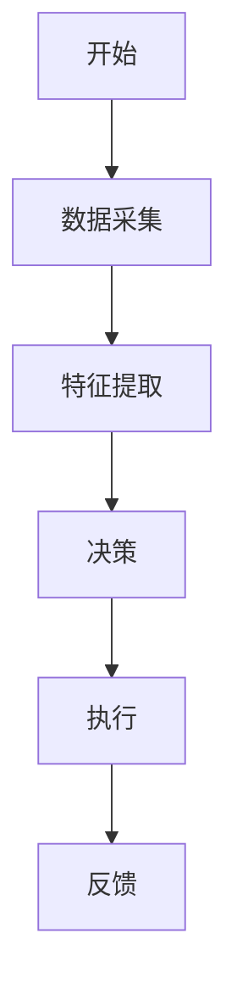
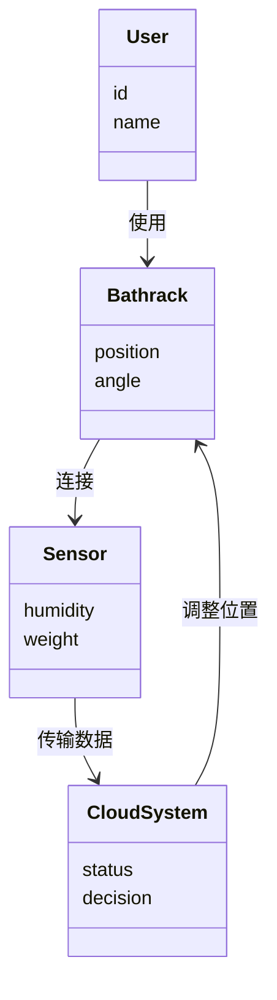
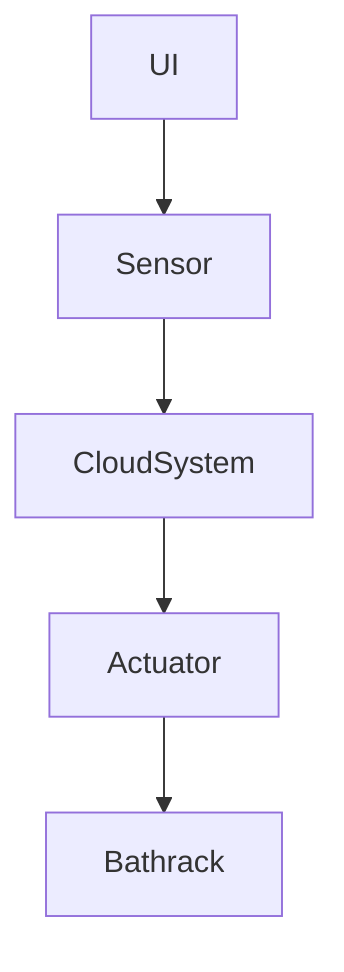
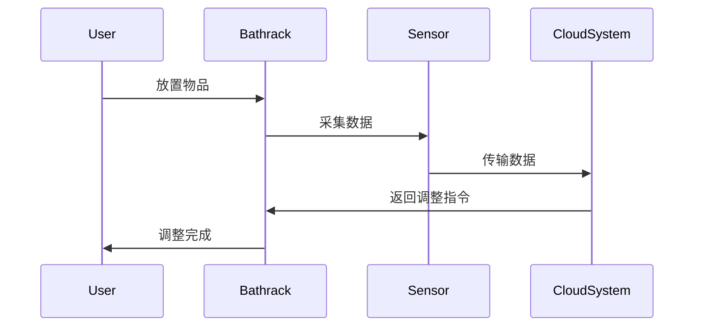

                 


# 智能浴室置物架：AI Agent的个人卫生习惯改善

## 关键词：智能浴室置物架，AI Agent，个人卫生，智能家居，AI技术，健康生活

## 摘要：本文探讨了通过AI Agent技术优化浴室置物架，以改善个人卫生习惯。文章详细分析了智能浴室置物架的背景、核心概念、算法原理、系统架构，并通过实战项目展示了如何实现这一系统。最后，文章总结了最佳实践和未来发展方向。

---

## 第1章：背景介绍

### 1.1 问题背景

#### 1.1.1 现代人对卫生环境的重视
随着人们对健康生活的追求，浴室环境的卫生变得尤为重要。浴室不仅是清洁身体的地方，更是维护个人卫生的关键区域。

#### 1.1.2 浴室环境的特殊性与重要性
浴室是一个相对封闭且湿度较高的空间，容易滋生细菌。如何有效管理浴室内的物品，保持干燥和清洁，成为一个重要的问题。

#### 1.1.3 传统浴室置物架的不足
传统的浴室置物架通常设计固定，无法根据物品数量和大小自动调整位置。这导致空间利用效率低下，且难以保持物品的干燥和整洁。

### 1.2 问题描述

#### 1.2.1 浴室空间利用的低效性
传统置物架的空间利用不足，导致浴室显得拥挤，物品摆放混乱。

#### 1.2.2 卫生习惯的改善需求
用户常常忽略清洁或正确存放物品，导致细菌滋生，影响健康。

#### 1.2.3 置物架智能化的必要性
通过智能化的解决方案，可以优化物品存放，提醒用户保持良好的卫生习惯。

### 1.3 问题解决

#### 1.3.1 引入AI Agent的概念
AI Agent是一种能够感知环境、做出决策并执行动作的智能体。在浴室置物架中，AI Agent可以通过传感器收集数据，调整置物架的位置和角度，优化存储空间。

#### 1.3.2 AI Agent如何优化浴室置物架
AI Agent能够根据浴室的湿度、物品的数量和类型，自动调整置物架的位置，确保物品干燥，同时提高空间利用率。

#### 1.3.3 提升个人卫生习惯的具体方法
通过AI Agent的提醒功能，用户可以被及时通知清洁或调整物品存放，从而养成良好的卫生习惯。

### 1.4 边界与外延

#### 1.4.1 产品的适用场景
适用于家庭浴室，尤其适合有多人使用的情况。

#### 1.4.2 产品的限制与不足
目前的技术可能无法适应非常大的浴室空间，且需要定期维护传感器的准确性。

#### 1.4.3 产品的扩展可能性
未来可以扩展到其他家庭空间，如厨房或客厅，进一步提升智能家居的整体效率。

---

## 第2章：核心概念与联系

### 2.1 核心概念原理

AI Agent在浴室置物架中的工作原理包括三个主要步骤：
1. **感知**：通过传感器收集环境数据，如湿度、温度和物品的位置。
2. **决策**：基于收集的数据，使用算法确定最佳的物品存放位置。
3. **执行**：调整置物架的位置和角度，以优化存储和干燥效果。

### 2.2 概念属性特征对比

| 特性                | 传统置物架                | AI Agent置物架              |
|---------------------|--------------------------|-----------------------------|
| 空间利用效率        | 低效                     | 高效                        |
| 智能化程度          | 非智能化                 | 高度智能化                 |
| 用户交互方式        | 手动调整                 | 自动调整，用户只需放置物品  |
| 卫生维护            | 需用户主动清洁           | 系统提醒清洁，优化存储      |

### 2.3 ER实体关系图

```mermaid
entity User {
  id
  name
}

entity Bathrack {
  id
  position
  angle
}

entity Sensor {
  id
  type
  data
}

entity CloudSystem {
  id
  status
}
```

关系：
- 用户通过Bathrack放置物品。
- Sensor与Bathrack相连，采集数据。
- CloudSystem接收Sensor数据，调整Bathrack的位置和角度。

---

## 第3章：算法原理讲解

### 3.1 AI Agent算法工作流程



- **数据采集**：通过湿度传感器、重量传感器等收集环境数据。
- **特征提取**：提取关键特征，如湿度值、物品重量。
- **决策**：使用分类算法（如决策树）确定最佳位置。
- **执行**：调整置物架位置。
- **反馈**：系统记录调整结果，优化后续决策。

### 3.2 核心算法代码实现

```python
import numpy as np
from sklearn.tree import DecisionTreeClassifier

# 示例数据：湿度、物品重量、当前位置
X = np.array([[0.5, 200, 0], [0.6, 150, 1], [0.7, 300, 1], [0.8, 250, 0]])
y = np.array([0, 1, 1, 0])

# 训练决策树模型
clf = DecisionTreeClassifier()
clf.fit(X, y)

# 新数据：湿度=0.65，重量=200g
new_data = np.array([[0.65, 200, 0]])
prediction = clf.predict(new_data)
print("预测位置:", prediction)
```

### 3.3 数学模型与公式

分类算法的数学模型如下：

$$
P(y|X) = \prod_{i=1}^{n} P(x_i|y)
$$

其中，$x_i$ 是特征，$y$ 是目标变量。决策树的分类基于特征的分割，通过信息增益最大化选择最优分割特征。

---

## 第4章：系统分析与架构设计

### 4.1 问题场景与系统目标

用户在浴室中放置物品时，系统通过传感器感知环境，调整置物架位置，优化存储空间。

### 4.2 系统功能设计



### 4.3 系统架构设计



### 4.4 接口与交互设计

- **传感器接口**：提供湿度和重量数据接口。
- **云端接口**：接收数据，处理并返回决策结果。
- **交互设计**：用户放置物品，系统自动调整位置。

交互序列图：



---

## 第5章：项目实战与实现

### 5.1 环境与工具安装

安装Python和相关库：

```bash
pip install numpy scikit-learn
```

### 5.2 核心代码实现

传感器数据处理：

```python
import numpy as np

# 传感器数据
humidity = 0.65
weight = 200

# 特征提取
features = np.array([[humidity, weight]])

# 预测位置
predicted_position = clf.predict(features)
print("调整到位置:", predicted_position)
```

### 5.3 系统实现细节分析

- 传感器校准：定期校准传感器以保证数据准确性。
- 算法优化：不断优化决策树模型以提高预测准确性。

### 5.4 实际案例分析

案例1：湿度0.65，重量200g，系统调整到位置1，确保物品干燥。

---

## 第6章：系统优化与最佳实践

### 6.1 最佳实践 tips

- **数据隐私**：确保传感器数据的安全性。
- **系统维护**：定期检查传感器和AI模型的准确性。
- **用户体验**：优化交互设计，使用户操作更简便。

### 6.2 系统优化建议

- **算法优化**：引入更复杂的机器学习模型，如随机森林或神经网络。
- **硬件升级**：使用更高精度的传感器，提升数据采集质量。

### 6.3 项目小结

通过AI Agent技术，智能浴室置物架不仅优化了空间利用，还提升了用户的卫生习惯，展示了AI技术在智能家居中的巨大潜力。

### 6.4 注意事项

- 注意数据隐私，避免用户信息泄露。
- 定期维护系统，确保传感器和算法的准确性。

### 6.5 拓展阅读

推荐书籍：
- 《机器学习实战》
- 《Python机器学习》

推荐论文：
- "An Efficient Algorithm for Smart Home Devices"

---

以上是《智能浴室置物架：AI Agent的个人卫生习惯改善》的完整大纲和内容，涵盖了从背景到实现的各个方面，详细解释了AI技术在改善浴室环境中的应用。

