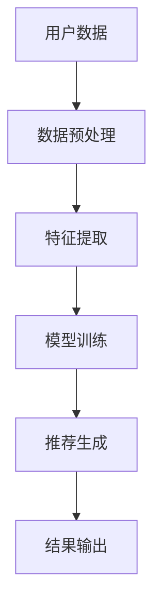
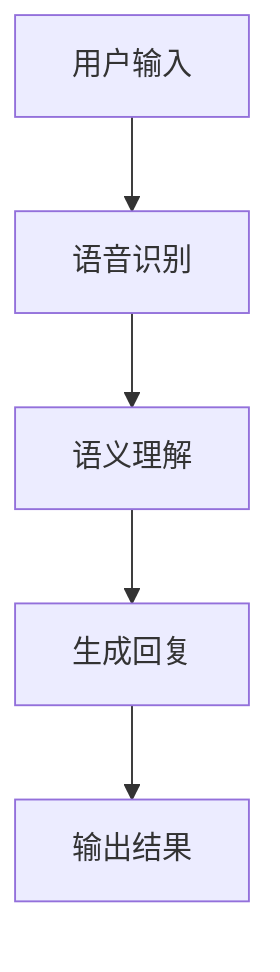
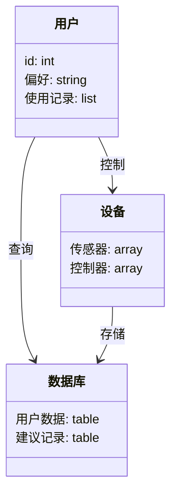

                 


# 智能浴室置物架：AI Agent的个人护理建议

> 关键词：AI Agent, 智能浴室置物架, 个人护理, 智能家居, 数据采集与分析

> 摘要：本文将深入探讨AI Agent在智能浴室置物架中的应用，分析其如何通过数据采集与分析为用户提供个性化的个人护理建议。通过系统架构设计、算法原理和项目实战，本文将详细阐述AI Agent如何优化浴室置物架的功能，使其成为用户日常生活中的智能助手。

---

# 第一部分：智能浴室置物架与AI Agent的背景与概述

## 第1章：智能浴室置物架的概念与背景

### 1.1 问题背景

#### 1.1.1 浴室置物架的传统问题与痛点
传统的浴室置物架主要功能是放置洗漱用品，但在实际使用中存在诸多痛点：
- 空间利用效率低下：用户常因置物架空间有限而无法充分利用。
- 功能单一：传统置物架仅用于存储，无法提供额外的服务或建议。
- 缺乏个性化：无法根据用户的使用习惯或需求进行调整。

#### 1.1.2 智能化的需求与趋势
随着智能家居的普及，用户对浴室设备的智能化需求日益增长。智能浴室置物架不仅是存储工具，更应成为用户日常生活中的智能助手。

#### 1.1.3 AI Agent在浴室场景中的应用潜力
AI Agent（智能代理）能够通过数据采集、分析和推理，为用户提供个性化的服务和建议。在浴室场景中，AI Agent可以通过传感器、语音交互等方式，实时感知用户的使用习惯，并提供相应的优化建议。

### 1.2 问题描述

#### 1.2.1 浴室空间利用效率低下
传统置物架的固定设计可能导致空间浪费，而AI Agent可以通过动态调整存储位置，提高空间利用率。

#### 1.2.2 个人护理需求的多样化与个性化
用户对个人护理的需求日益多样化，例如不同的肤质、发质和健康状况需要不同的护理方案。AI Agent可以通过分析用户的使用数据，提供个性化的护理建议。

#### 1.2.3 置物架功能的局限性与智能化升级的必要性
传统置物架的功能单一，无法与用户进行交互或提供额外服务。通过智能化升级，置物架可以成为用户日常生活中的智能助手，提供多种服务。

### 1.3 问题解决与边界

#### 1.3.1 AI Agent如何解决浴室置物架的问题
AI Agent可以通过以下方式解决浴室置物架的问题：
- 数据采集与分析：通过传感器采集用户的使用习惯和偏好。
- 个性化推荐：基于分析结果，为用户提供个性化的存储建议和护理方案。
- 实时交互：通过语音或App与用户进行实时交互，提供动态建议。

#### 1.3.2 系统的边界与外延
系统的主要边界包括：
- 硬件设备：智能置物架、传感器、语音交互设备。
- 软件系统：AI Agent算法、数据处理模块、用户界面。
- 用户范围：家庭用户为主，暂不考虑公共浴室场景。

#### 1.3.3 核心功能与非核心功能的界定
核心功能：
- 数据采集与存储
- AI算法分析与推荐
- 个性化建议生成
- 实时交互

非核心功能：
- 设备管理与维护
- 系统升级与优化

### 1.4 核心概念与系统架构

#### 1.4.1 ER实体关系图（Mermaid）

```mermaid
erDiagram
    actor 用户
    actor 系统
    actor 设备
    actor 数据库
    用户 --> 系统: 交互
    系统 --> 设备: 控制
    设备 --> 数据库: 数据存储
    用户 --> 数据库: 数据查询
```

---

# 第二部分：AI Agent的核心概念与原理

## 第2章：AI Agent的核心概念与原理

### 2.1 核心概念

#### 2.1.1 AI Agent的定义与特征
AI Agent是一种智能代理系统，能够通过传感器、摄像头等设备感知环境，并通过算法进行分析和推理，为用户提供个性化的服务和建议。其主要特征包括：
- 智能性：能够理解和分析用户需求。
- 交互性：支持多种交互方式（如语音、App）。
- 实时性：能够实时感知和响应用户需求。

#### 2.1.2 智能浴室置物架中的AI Agent角色
在智能浴室置物架中，AI Agent主要负责：
- 数据采集与分析：通过传感器采集用户的使用习惯和偏好。
- 个性化推荐：基于数据分析结果，为用户提供存储建议和护理方案。
- 实时交互：通过语音或App与用户进行实时对话，提供动态建议。

### 2.2 核心概念对比表

| 概念       | 特性1       | 特性2       | 特性3       |
|------------|------------|------------|------------|
| AI Agent   | 智能性      | 交互性      | 实时性      |
| 智能置物架 | 存储功能    | 个性化建议 | 动态调整    |
| 数据采集   | 实时性      | 多维度      | 高精度      |

---

## 第3章：AI Agent的算法原理与实现

### 3.1 推荐算法

#### 3.1.1 推荐算法原理
推荐算法是AI Agent的核心算法之一。基于用户的使用数据，AI Agent可以通过协同过滤、内容推荐等方式，为用户提供个性化的存储建议。

#### 3.1.2 推荐算法流程图（Mermaid）



#### 3.1.3 推荐算法的数学模型

- 协同过滤算法：
  $$sim(i,j) = \frac{\sum_{k=1}^{n} (r_{ik} - \bar{r_i})(r_{jk} - \bar{r_j})}{\sqrt{\sum_{k=1}^{n} (r_{ik} - \bar{r_i})^2} \cdot \sqrt{\sum_{k=1}^{n} (r_{jk} - \bar{r_j})^2}}$$

- 内容推荐算法：
  $$score = \sum_{i=1}^{m} w_i \cdot f_i$$
  其中，$w_i$是特征的重要性权重，$f_i$是特征的值。

---

### 3.2 语音识别与自然语言处理

#### 3.2.1 语音识别原理
语音识别技术通过将用户的语音输入转化为文本，实现人机交互。常用算法包括隐马尔可夫模型（HMM）和深度学习模型（如卷积神经网络CNN）。

#### 3.2.2 自然语言处理（NLP）原理
NLP技术用于理解和分析用户输入的文本内容。常用的NLP任务包括分词、句法分析、情感分析等。

#### 3.2.3 语音交互流程图（Mermaid）



---

## 第4章：系统架构设计与实现

### 4.1 系统功能设计

#### 4.1.1 领域模型（Mermaid 类图）



---

通过以上分析与设计，智能浴室置物架结合AI Agent能够为用户提供个性化的存储建议和护理方案，显著提升用户体验和空间利用率。后续章节将详细介绍系统的实现与优化方法。

