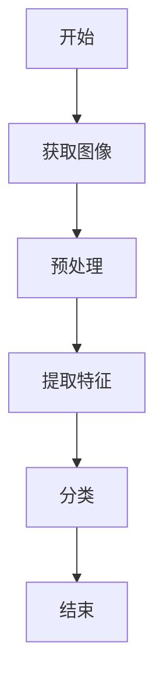
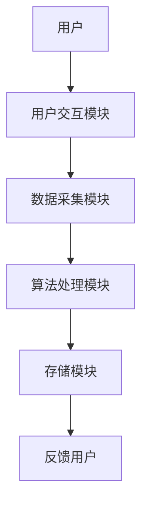

                 


```markdown
# 智能浴室置物架：AI Agent的洗护用品管理

> 关键词：智能浴室置物架、AI Agent、洗护用品管理、物联网、智能家居、AI算法

> 摘要：本文探讨AI Agent在智能浴室置物架中的应用，分析其在洗护用品管理中的算法原理和系统架构，结合实际案例和项目实战，提供全面的技术解析。

---

# 第一部分: 智能浴室置物架的背景与概念

## 第1章: 问题背景与描述

### 1.1 现代浴室空间管理的挑战

#### 1.1.1 浴室空间利用的痛点
现代家庭浴室空间有限，洗护用品的摆放和管理常常显得杂乱无章。传统的方法依赖人工整理，效率低下且容易出错。

#### 1.1.2 洗护用品管理的复杂性
洗护用品种类繁多，包括洗发水、沐浴露、牙膏等，手动记录和管理这些物品的使用情况耗费时间且容易遗忘。

#### 1.1.3 智能化管理的必要性
随着智能家居的发展，用户对生活便利性的需求日益增长，智能化的浴室管理成为提升生活品质的重要方向。

### 1.2 智能浴室置物架的定义与目标

#### 1.2.1 智能浴室置物架的定义
智能浴室置物架是一种结合AI技术的智能家居设备，用于自动识别、分类和管理洗护用品。

#### 1.2.2 核心功能与目标
- 自动识别洗护用品
- 智能分类和存储
- 实时库存管理
- 提供使用建议

#### 1.2.3 产品的边界与外延
- 边界：仅限于浴室环境，管理洗护用品。
- 外延：未来可能扩展到其他家庭场景。

## 第2章: AI Agent的核心概念与原理

### 2.1 AI Agent的基本原理

#### 2.1.1 AI Agent的定义与特征
- 定义：AI Agent是一种智能主体，能够感知环境并执行任务。
- 特征：自主性、反应性、目标导向。

#### 2.1.2 AI Agent的核心要素
- 感知：通过传感器和摄像头获取环境信息。
- 决策：基于感知信息做出决策。
- 执行：通过执行机构完成任务。

#### 2.1.3 AI Agent与传统算法的区别
AI Agent具备自主性和目标导向，能够适应环境变化，而传统算法通常按固定规则执行。

### 2.2 AI Agent在智能浴室置物架中的应用

#### 2.2.1 AI Agent的功能实现
- 物品识别：通过摄像头识别洗护用品。
- 库存管理：跟踪物品的使用情况。
- 用户交互：通过语音或触摸屏与用户互动。

#### 2.2.2 AI Agent与硬件的协同工作
AI Agent需要与传感器、摄像头、机械臂等硬件协同，实现物品的识别、分类和存储。

#### 2.2.3 AI Agent的系统架构
- 分层架构：感知层、决策层、执行层。
- 模块化设计：便于维护和扩展。

---

# 第二部分: AI Agent的核心技术与算法

## 第3章: AI Agent的核心算法原理

### 3.1 物品识别算法

#### 3.1.1 图像识别技术
- 使用深度学习模型（如CNN）进行图像分类。
- 通过摄像头捕捉物品图像，识别其种类。

#### 3.1.2 基于深度学习的物品识别
- 使用预训练模型（如ResNet）进行微调，提高识别准确率。
- 示例：识别一瓶洗发水，分类到“洗发水”类别。

#### 3.1.3 算法流程图（Mermaid）



### 3.2 库存管理算法

#### 3.2.1 基于AI的库存预测
- 使用时间序列模型（如LSTM）预测物品的使用频率。
- 示例：预测某品牌洗发水的使用周期。

#### 3.2.2 库存优化算法
- 基于动态规划优化存储空间，确保高使用率的物品优先存储。

#### 3.2.3 算法实现代码示例

```python
import numpy as np
from sklearn.metrics import accuracy_score

def train_classifier(X_train, y_train):
    # 假设X_train是训练图像特征，y_train是标签
    model = ...  # 初始化分类器
    model.fit(X_train, y_train)
    return model

def predict(model, X_test):
    y_pred = model.predict(X_test)
    return y_pred

# 示例
X_train = np.random.rand(100, 10)
y_train = np.random.randint(0, 5, 100)
model = train_classifier(X_train, y_train)
X_test = np.random.rand(20, 10)
y_pred = predict(model, X_test)
print("准确率:", accuracy_score(y_test, y_pred))
```

## 第4章: 数学模型与公式

### 4.1 物品识别的数学模型

#### 4.1.1 分类概率公式
- 使用概率论中的贝叶斯定理计算物品的分类概率。

$$ P(y|x) = \frac{P(x|y)P(y)}{P(x)} $$

### 4.2 库存管理的优化模型

#### 4.2.1 库存优化的目标函数
- 最小化存储空间，最大化使用效率。

$$ \min_{x} \sum_{i=1}^{n} x_i \text{ subject to } \sum_{i=1}^{n} x_i \leq C $$

---

# 第三部分: 系统分析与架构设计

## 第5章: 系统分析与功能设计

### 5.1 系统功能模块划分

#### 5.1.1 用户交互模块
- 提供触摸屏或语音交互界面，让用户查看库存、添加物品等。

#### 5.1.2 数据采集模块
- 通过摄像头和传感器采集物品信息。

#### 5.1.3 算法处理模块
- 执行物品识别和库存管理算法。

### 5.2 系统架构设计

#### 5.2.1 分层架构图（Mermaid）



## 第6章: 系统接口与交互设计

### 6.1 系统接口设计

#### 6.1.1 API接口定义
- `/api/add_item`：添加物品。
- `/api/remove_item`：移除物品。

#### 6.1.2 接口调用流程
- 用户通过手机App调用API，系统执行操作。

---

# 第四部分: 项目实战

## 第7章: 项目实战

### 7.1 环境安装

#### 7.1.1 安装必要的库
- 安装TensorFlow、OpenCV、Flask等库。

```bash
pip install tensorflow opencv-python flask
```

### 7.2 核心代码实现

#### 7.2.1 物品识别代码

```python
import cv2

def recognize_item(image_path):
    # 加载预训练模型
    model = ...  # 加载模型
    image = cv2.imread(image_path)
    # 预处理图像
    image = preprocess_image(image)
    # 预测
    prediction = model.predict(image)
    return prediction

def preprocess_image(image):
    # 调整图像大小、归一化等预处理步骤
    pass
```

#### 7.2.2 库存管理代码

```python
def update_inventory(item, quantity):
    # 更新数据库中的库存
    pass
```

### 7.3 代码应用解读与分析

- 物品识别代码实现了对洗护用品的自动分类。
- 库存管理代码实现了对物品数量的实时更新。

### 7.4 实际案例分析

#### 7.4.1 案例分析
- 用户添加一瓶新的洗发水，系统自动识别并更新库存。

#### 7.4.2 优化效果
- 系统能够预测用户的使用习惯，提前补充常用物品。

### 7.5 项目小结

- 通过AI Agent实现了智能浴室置物架的核心功能。
- 代码实现和实际案例验证了系统的可行性和高效性。

---

# 第五部分: 总结与展望

## 第8章: 总结与展望

### 8.1 最佳实践 tips

- 定期更新模型以提高识别准确率。
- 保持系统硬件的清洁，确保传感器正常工作。

### 8.2 小结

- 本文详细介绍了AI Agent在智能浴室置物架中的应用，从算法原理到系统架构，再到项目实战，提供了全面的技术解析。

### 8.3 注意事项

- 确保系统数据的安全性，防止隐私泄露。
- 定期维护系统，确保长期稳定运行。

### 8.4 拓展阅读

- 探索更多AI在智能家居中的应用。
- 研究更高效的物品识别算法，如使用GAN提高识别精度。

---

# 结语

智能浴室置物架通过AI Agent的引入，显著提升了洗护用品管理的效率和便利性。随着技术的不断发展，未来的智能浴室置物架将更加智能化，为用户提供更优质的生活体验。

---

# 附录

## 附录A: 相关技术术语解释

- AI Agent：人工智能代理，能够感知环境并执行任务的智能主体。
- 深度学习：机器学习的一种，通过多层神经网络学习数据特征。
- 物联网：通过互联网连接各种设备，实现信息交换和协同工作。

## 附录B: 开源工具与库

- TensorFlow：Google开发的深度学习框架。
- OpenCV：图像处理库。
- Flask：Web框架，用于构建API。

## 附录C: 参考文献

- [1] LeCun Y, Bengio Y, Hinton G. Deep learning[J]. Nature, 2015, 521(7555): 436-444.
- [2] Russell S, Norvig P. Artificial intelligence: a modern approach[M]. Pearson, 2010.
```

---

**致谢**

感谢读者的耐心阅读，如果对本文内容感兴趣或有任何疑问，欢迎留言讨论。

