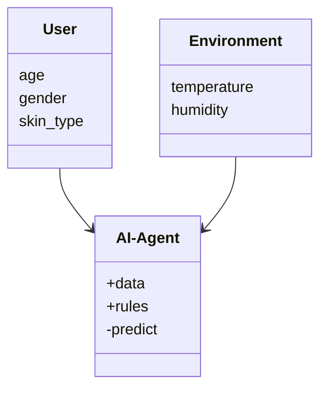
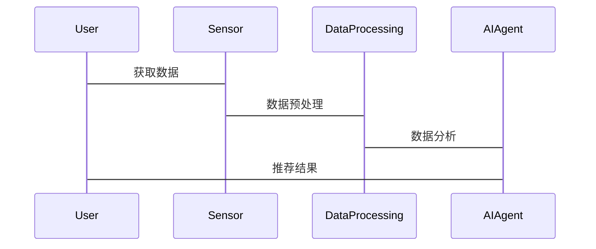

                 


# 智能浴室镜柜：AI Agent的个人护理计划制定

## 关键词：
智能浴室镜柜、AI Agent、个人护理计划、物联网、人工智能、数据采集、个性化推荐

## 摘要：
本文探讨了AI Agent在智能浴室镜柜中的应用，详细介绍了如何通过AI技术制定个人护理计划。从背景到技术原理，从系统设计到项目实战，全面解析了AI在浴室镜柜中的实现过程，展示了如何通过传感器数据、AI算法和系统架构设计，为用户提供个性化的护理建议。

---

## 第一部分: 背景与概念

### 第1章: 智能浴室镜柜与AI Agent的定义

#### 1.1 智能浴室镜柜的背景与现状

##### 1.1.1 浴室镜柜的传统功能与局限性
传统的浴室镜柜主要用于存储物品和化妆，功能单一，无法满足现代用户对智能化、个性化的需求。用户在使用传统镜柜时，难以获取个人护理建议，缺乏智能化的管理功能。

##### 1.1.2 智能化趋势的推动
随着物联网和人工智能技术的发展，智能家居设备逐渐普及。浴室镜柜作为智能家居的一部分，也在向智能化方向发展。AI技术的应用为浴室镜柜带来了新的可能性。

##### 1.1.3 当前市场中的智能浴室镜柜产品
目前市场上的智能浴室镜柜产品逐渐增多，部分产品已经具备了智能温控、镜面除雾、LED灯光调节等功能。然而，如何通过AI技术为用户提供个性化的护理计划，仍是市场的主要挑战。

#### 1.2 AI Agent的定义与特点

##### 1.2.1 人工智能代理（AI Agent）的定义
AI Agent是一种能够感知环境、执行任务的智能实体。它能够通过传感器获取数据，利用算法进行分析和决策，并通过执行器完成任务。

##### 1.2.2 AI Agent的核心特点
- **自主性**：AI Agent能够自主决策，无需人工干预。
- **反应性**：能够实时感知环境变化并做出反应。
- **学习能力**：通过数据学习，不断提高自身的智能水平。
- **交互性**：能够与用户和其他设备进行交互。

##### 1.2.3 AI Agent在智能浴室镜柜中的应用
在智能浴室镜柜中，AI Agent主要用于数据采集、分析和个性化推荐。它能够通过传感器获取用户的生理数据和环境数据，结合用户的偏好，制定个性化的护理计划。

#### 1.3 个人护理计划的制定需求

##### 1.3.1 个人护理计划的核心要素
- 用户的基本信息（年龄、性别、肤质、健康状况等）
- 环境数据（温度、湿度、空气质量等）
- 时间因素（早晨、晚上、季节变化等）
- 用户的护理需求（保湿、防晒、清洁等）

##### 1.3.2 用户需求分析
用户希望浴室镜柜能够根据自身的肤质、健康状况和环境因素，提供个性化的护理建议。例如，早晨镜面显示今日天气和护肤建议，晚上提供护肤总结和建议。

##### 1.3.3 智能浴室镜柜的个性化服务目标
通过AI技术，智能浴室镜柜能够为用户提供定制化的护理计划，帮助用户更好地管理个人健康和美容需求。

---

### 第2章: 智能浴室镜柜的AI Agent系统架构

#### 2.1 系统核心模块

##### 2.1.1 数据采集模块
数据采集模块负责采集用户的生理数据和环境数据，包括：
- **生理数据**：皮肤状况、体温、心率等。
- **环境数据**：温度、湿度、空气质量等。

##### 2.1.2 数据处理模块
数据处理模块对采集到的数据进行预处理和特征提取，包括数据清洗、归一化处理等。

##### 2.1.3 AI推理模块
AI推理模块基于处理后的数据，结合用户的偏好和历史行为，进行个性化推荐。

##### 2.1.4 个性化推荐模块
个性化推荐模块将推理结果转化为具体的护理计划，并通过镜面显示或移动终端推送。

#### 2.2 系统功能模块的交互关系

##### 2.2.1 数据流分析
数据从传感器采集，经过数据处理模块，进入AI推理模块进行分析，最后通过推荐模块输出结果。

##### 2.2.2 功能模块的协同工作
- 数据采集模块与AI推理模块协同，确保数据的准确性和实时性。
- 个性化推荐模块与用户交互模块协同，提供实时反馈和建议。

##### 2.2.3 系统架构的优化
通过模块化设计，确保系统的可扩展性和可维护性。

---

### 第3章: AI Agent的核心算法与数学模型

#### 3.1 数据预处理与特征提取

##### 3.1.1 数据预处理
- 数据清洗：去除异常值和噪声。
- 数据归一化：将数据标准化，便于模型训练。

##### 3.1.2 特征提取
- 使用主成分分析（PCA）提取特征。
- 示例代码：
  ```python
  from sklearn.decomposition import PCA
  pca = PCA(n_components=2)
  features = pca.fit_transform(data)
  ```

#### 3.2 AI推理算法

##### 3.2.1 知识表示
- 使用知识图谱表示用户需求和环境数据。

##### 3.2.2 推理机制
- 基于规则的推理：根据预设规则进行推理。
- 基于概率的推理：使用贝叶斯网络进行概率推理。

##### 3.2.3 决策优化
- 使用强化学习优化决策过程。
- 示例代码：
  ```python
  import numpy as np
  from tensorflow.keras import layers, models
  model = models.Sequential()
  model.add(layers.Dense(64, activation='relu', input_shape=(n_features,)))
  model.add(layers.Dense(1, activation='sigmoid'))
  model.compile(optimizer='adam', loss='binary_crossentropy')
  ```

---

## 第四部分: 系统分析与架构设计方案

### 第4章: 系统架构设计

#### 4.1 问题场景介绍
智能浴室镜柜需要实时采集用户数据，通过AI算法进行分析，并提供个性化建议。

#### 4.2 项目介绍
项目目标是开发一款基于AI的智能浴室镜柜，能够为用户提供个性化的护理计划。

#### 4.3 系统功能设计

##### 4.3.1 领域模型


#### 4.4 系统架构设计

##### 4.4.1 系统架构
```mermaid
containerDiagram
    container Web Service {
        Service Layer
        Database
    }
    container AI Module {
        Data Processing
        Inference Engine
    }
    Web Service --> AI Module
```

#### 4.5 系统接口设计

##### 4.5.1 接口设计
- 数据采集接口：用于采集用户数据。
- 推荐接口：用于返回个性化推荐。

#### 4.6 系统交互流程

##### 4.6.1 交互流程


---

## 第五部分: 项目实战

### 第5章: 项目实战

#### 5.1 环境搭建

##### 5.1.1 系统环境
- 操作系统：Linux
- 开发工具：Python、Jupyter Notebook
- 依赖库：TensorFlow、Keras、Scikit-learn

#### 5.2 系统核心实现

##### 5.2.1 数据采集与预处理
```python
import pandas as pd
from sklearn.preprocessing import StandardScaler

# 数据加载
data = pd.read_csv('user_data.csv')

# 数据预处理
scaler = StandardScaler()
scaled_data = scaler.fit_transform(data)
```

##### 5.2.2 AI推理与个性化推荐
```python
from tensorflow.keras.models import Sequential
from tensorflow.keras.layers import Dense

# 模型训练
model = Sequential()
model.add(Dense(64, activation='relu', input_shape=(n_features,)))
model.add(Dense(1, activation='sigmoid'))
model.compile(optimizer='adam', loss='binary_crossentropy')
model.fit(scaled_data, labels, epochs=10, batch_size=32)
```

#### 5.3 案例分析

##### 5.3.1 案例分析
假设用户A为25岁女性，皮肤偏干，早晨温度25℃，湿度60%。AI Agent会根据这些数据推荐保湿霜和防晒霜。

##### 5.3.2 实施步骤
1. 数据采集：获取用户的生理数据和环境数据。
2. 数据预处理：清洗和归一化数据。
3. 模型训练：训练个性化推荐模型。
4. 推荐输出：根据模型结果输出护理计划。

---

## 第六部分: 最佳实践与小结

### 第6章: 总结与展望

#### 6.1 最佳实践 tips
- 数据采集要准确，确保模型训练的有效性。
- 系统设计要模块化，便于维护和扩展。
- 交互设计要简洁，提升用户体验。

#### 6.2 小结
本文详细介绍了AI Agent在智能浴室镜柜中的应用，从背景到技术，从设计到实现，全面解析了如何利用AI技术为用户提供个性化的护理计划。

#### 6.3 注意事项
- 数据隐私保护要重视，确保用户数据的安全。
- 系统要具备可扩展性，方便后续功能的添加。

#### 6.4 拓展阅读
建议进一步研究多模态数据融合技术，提升AI Agent的推理能力。

---

通过以上步骤，我们详细解析了智能浴室镜柜中AI Agent的实现过程，展示了如何通过技术手段为用户提供个性化的护理计划。希望本文对读者有所帮助，激发更多的思考和实践。

