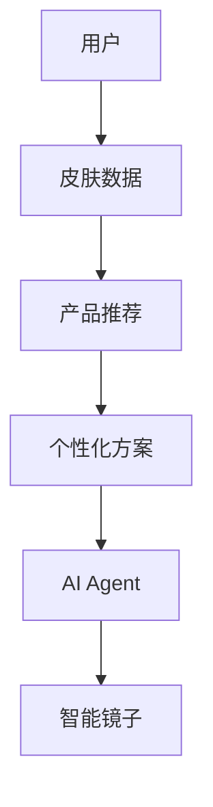
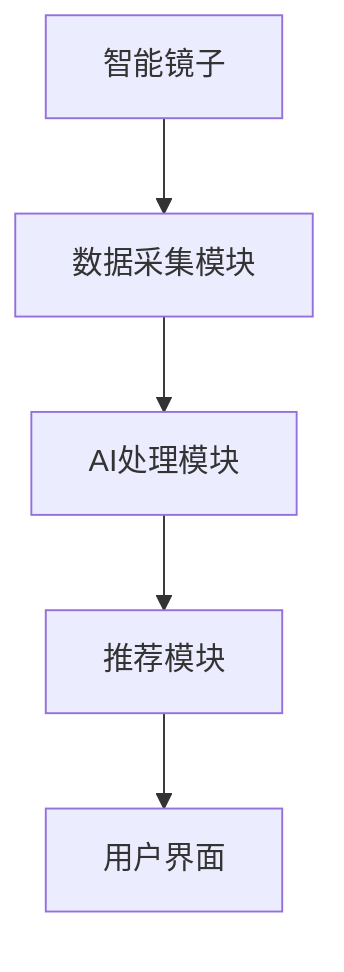

                 


# 智能浴室镜柜：AI Agent的护肤品使用建议

## 关键词：
智能浴室镜柜，AI Agent，护肤品推荐，个性化护肤，图像处理，机器学习，数据驱动

## 摘要：
本文深入探讨智能浴室镜柜中AI Agent的应用，特别是在护肤品使用建议方面。通过分析用户的皮肤状况和护肤需求，AI Agent能够提供个性化的护肤方案。文章详细介绍了数据采集与处理、算法原理、系统架构设计以及实际项目实现，展示了AI技术如何优化用户的护肤体验。

---

# 第一部分：背景介绍

## 第1章：问题背景与描述

### 1.1 问题背景
#### 1.1.1 智能浴室镜柜的现状与痛点
现代浴室镜柜逐渐从单一的收纳功能向智能化方向发展。然而，市场上的智能镜柜大多集中在灯光调节、镜子除雾等基础功能，缺乏深度的护肤建议，无法满足用户对个性化护肤的需求。

#### 1.1.2 AI Agent在个人护理中的应用潜力
人工智能技术的快速发展为护肤领域带来了新的可能性。AI Agent能够通过分析用户的皮肤状况、生活习惯等数据，提供精准的护肤建议，优化用户的护肤体验。

#### 1.1.3 智能浴室镜柜与护肤品使用的结合需求
用户在选择护肤品时常常面临信息过载，缺乏个性化的指导。智能浴室镜柜可以通过AI技术整合用户的肤质数据，提供实时的护肤建议，帮助用户做出更合适的选择。

### 1.2 问题描述
#### 1.2.1 用户护肤需求的多样性
不同用户的肤质和需求差异很大，例如油性皮肤和干性皮肤的护理重点不同，因此需要个性化的解决方案。

#### 1.2.2 智能设备在护肤中的角色定位
智能浴室镜柜不仅仅是硬件设备，更是一个数据采集和处理的平台，通过AI技术为用户提供服务。

#### 1.2.3 AI Agent如何优化护肤品使用体验
AI Agent可以实时分析用户的皮肤数据，推荐适合的护肤品，并跟踪使用效果，持续优化护肤方案。

### 1.3 问题解决
#### 1.3.1 AI Agent在智能镜柜中的功能定位
AI Agent作为智能浴室镜柜的核心，负责数据采集、分析和处理，并通过交互界面为用户提供个性化建议。

#### 1.3.2 数据驱动的护肤品推荐机制
通过收集和分析用户的皮肤数据，AI Agent能够建立数据模型，实现精准的护肤品推荐。

#### 1.3.3 个性化护肤方案的设计与实现
基于用户的皮肤状况和生活习惯，AI Agent设计个性化的护肤方案，并通过反馈不断优化。

### 1.4 智能浴室镜柜的边界与外延
#### 1.4.1 硬件设备的边界
智能浴室镜柜的硬件部分包括镜子、传感器、摄像头等，负责数据的采集和传输。

#### 1.4.2 软件功能的外延
软件部分涵盖数据处理、AI算法、用户界面设计等，负责将数据转化为实际的护肤建议。

#### 1.4.3 系统集成的范围
整个系统包括硬件、软件以及AI算法，集成到智能浴室镜柜中，为用户提供一体化的服务。

### 1.5 概念结构与核心要素
#### 1.5.1 系统组成
智能浴室镜柜由硬件设备、AI Agent和用户交互界面三部分组成。

#### 1.5.2 核心要素
- 数据采集：通过摄像头和传感器获取用户的皮肤数据。
- 数据分析：利用AI算法对数据进行处理，得出护肤建议。
- 用户交互：通过镜子的界面与用户互动，展示建议和方案。

#### 1.5.3 功能模块
- 数据采集模块：负责采集用户的皮肤图像和相关数据。
- 数据分析模块：处理数据，生成护肤建议。
- 交互模块：与用户进行互动，展示结果。

---

## 第2章：核心概念与联系

### 2.1 AI Agent的核心原理
#### 2.1.1 AI Agent的定义
AI Agent是一种能够感知环境并采取行动以实现目标的智能实体。在智能浴室镜柜中，AI Agent负责分析用户的皮肤数据，提供护肤建议。

#### 2.1.2 AI Agent的基本特征
- 感知能力：通过摄像头和传感器采集数据。
- 学习能力：利用机器学习算法不断优化建议。
- 交互能力：通过镜子的界面与用户互动。

#### 2.1.3 AI Agent在智能镜柜中的应用场景
AI Agent在智能浴室镜柜中的应用场景包括：
- 实时分析用户的皮肤状况。
- 根据肤质推荐合适的护肤品。
- 提供个性化的护肤方案。

### 2.2 数据驱动的护肤品推荐
#### 2.2.1 数据采集与处理
数据采集是AI Agent工作的基础，包括：
- 拍摄用户的面部图像。
- 收集用户的肤质、生活习惯等信息。

#### 2.2.2 数据分析与挖掘
通过对数据的分析，AI Agent可以识别用户的肤质特征，例如：
- 皮肤油水平衡。
- 是否存在痘痘、过敏等问题。

#### 2.2.3 数据驱动的推荐算法
推荐算法是AI Agent的核心，常用的算法包括：
- 基于协同过滤的推荐。
- 基于内容的推荐。
- 混合推荐算法。

### 2.3 个性化护肤方案
#### 2.3.1 个性化护肤的需求分析
用户对护肤的需求因人而异，例如：
- 油性皮肤需要控油产品。
- 干性皮肤需要保湿产品。

#### 2.3.2 方案设计的数学模型
个性化的护肤方案可以通过数学模型来实现，例如：
$$
\text{推荐评分} = \alpha \cdot \text{用户偏好} + \beta \cdot \text{产品特性}
$$

#### 2.3.3 方案优化与调整
AI Agent可以根据用户的反馈不断优化护肤方案，例如：
- 如果用户的皮肤状况没有改善，调整推荐的产品。
- 根据季节变化调整护肤步骤。

### 2.4 核心概念的ER实体关系图


---

## 第3章：算法原理讲解

### 3.1 图像处理与分析
#### 3.1.1 图像采集与预处理
图像采集是AI Agent的第一步，通常使用摄像头拍摄用户的面部图像。预处理包括：
- 调整亮度和对比度。
- 去除噪点。

#### 3.1.2 皮肤特征提取
使用卷积神经网络（CNN）对图像进行分类，提取皮肤特征，例如：
- 皮肤类型（油性、干性）。
- 是否存在痘痘、过敏等。

#### 3.1.3 基于CNN的图像分类
CNN模型用于图像分类，例如：
- 输入一张面部图像，输出皮肤类型和建议的护肤步骤。

### 3.2 数据分析与推荐
#### 3.2.1 基于协同过滤的推荐算法
协同过滤是一种常见的推荐算法，基于用户行为数据进行推荐。例如：
$$
\text{推荐评分} = \sum_{i} w_{u,i} \cdot r_{i,j}
$$

其中，\( w_{u,i} \) 是用户u和用户i的相似度，\( r_{i,j} \) 是用户i对产品j的评分。

#### 3.2.2 基于内容的推荐算法
内容推荐算法基于产品本身的特性进行推荐。例如：
$$
\text{推荐评分} = \sum_{k} \lambda_k \cdot f_k(x)
$$

其中，\( f_k \) 是产品特性函数，\( \lambda_k \) 是权重。

#### 3.2.3 混合推荐算法
混合推荐算法结合协同过滤和内容推荐，利用两者的优势，提高推荐的准确性。

### 3.3 个性化方案生成
#### 3.3.1 基于规则的方案生成
基于预定义的规则生成方案，例如：
- 如果用户皮肤偏油，推荐控油产品。

#### 3.3.2 基于机器学习的方案生成
使用机器学习模型生成方案，例如：
$$
y = \beta_0 + \beta_1 x_1 + \beta_2 x_2 + \ldots + \beta_n x_n
$$

其中，\( y \) 是推荐结果，\( x_i \) 是用户特征。

#### 3.3.3 方案优化与调整
根据用户的反馈不断优化方案，例如：
- 如果用户的皮肤状况没有改善，调整推荐的产品。
- 根据季节变化调整护肤步骤。

---

## 第4章：数学模型与公式

### 4.1 基于CNN的图像分类模型
卷积神经网络（CNN）是一种常用的图像分类模型，其结构包括卷积层、池化层和全连接层。例如：
$$
y = \text{CNN}(x)
$$

其中，\( x \) 是输入图像，\( y \) 是输出的类别。

### 4.2 基于协同过滤的推荐公式
协同过滤的推荐公式可以表示为：
$$
\text{推荐评分} = \sum_{i} w_{u,i} \cdot r_{i,j}
$$

其中，\( w_{u,i} \) 是用户u和用户i的相似度，\( r_{i,j} \) 是用户i对产品j的评分。

### 4.3 个性化方案生成的数学模型
个性化方案生成的模型可以表示为：
$$
y = \beta_0 + \beta_1 x_1 + \beta_2 x_2 + \ldots + \beta_n x_n
$$

其中，\( y \) 是推荐结果，\( x_i \) 是用户特征。

---

## 第5章：系统分析与架构设计方案

### 5.1 系统架构设计
智能浴室镜柜的系统架构包括：
- 数据采集模块：负责采集用户的皮肤数据。
- 数据分析模块：处理数据并生成推荐。
- 用户交互模块：与用户进行互动并展示结果。

系统架构图如下：


### 5.2 系统功能设计
- 数据采集：通过摄像头和传感器采集用户的皮肤数据。
- 数据分析：利用AI算法处理数据，生成推荐。
- 用户交互：通过镜子的界面展示结果，并与用户互动。

### 5.3 系统接口设计
系统接口包括：
- 数据接口：与传感器和摄像头通信。
- 用户接口：与用户的交互界面通信。
- 推荐接口：与推荐模块通信。

### 5.4 系统交互设计
系统交互流程如下：
1. 用户在镜子前站立，摄像头采集面部图像。
2. 数据采集模块将图像传输给AI处理模块。
3. AI处理模块分析图像，生成护肤建议。
4. 用户界面展示建议，并与用户互动。

---

## 第6章：项目实战

### 6.1 环境安装
项目需要以下环境：
- Python 3.8及以上。
- TensorFlow 2.0及以上。
- OpenCV库。

安装命令：
```
pip install numpy
pip install tensorflow
pip install opencv-python
```

### 6.2 系统核心实现源代码
以下是AI Agent的核心代码：
```python
import cv2
import tensorflow as tf

def preprocess_image(image_path):
    # 调整图像大小
    image = cv2.imread(image_path)
    image = cv2.resize(image, (224, 224))
    image = image / 255.0  # 归一化
    return image

def predict_skin_type(model, image):
    # 预测皮肤类型
    prediction = model.predict(tf.expand_dims(image, axis=0))
    return prediction[0]

# 加载预训练模型
model = tf.keras.models.load_model('skin_type_model.h5')

# 使用模型进行预测
image_path = 'test.jpg'
preprocessed_image = preprocess_image(image_path)
skin_type = predict_skin_type(model, preprocessed_image)
print(f"Predicted skin type: {skin_type}")
```

### 6.3 代码应用解读与分析
- `preprocess_image`函数用于预处理图像，包括调整大小和归一化。
- `predict_skin_type`函数使用预训练模型进行预测。
- 预训练模型需要使用迁移学习，例如使用ResNet作为基模型。

### 6.4 案例分析
假设用户上传一张面部图像，AI Agent分析后推荐适合的护肤品，例如：
- 如果皮肤类型为油性，推荐控油产品。
- 如果皮肤类型为干性，推荐保湿产品。

---

## 第7章：最佳实践和小结

### 7.1 最佳实践
- 数据采集时确保图像质量。
- 定期更新AI模型，提高推荐的准确性。
- 提供多语言支持，扩大用户群体。

### 7.2 小结
本文详细介绍了智能浴室镜柜中AI Agent的核心技术与实际应用。通过数据采集、分析和推荐，AI Agent能够为用户提供个性化的护肤建议，优化用户的护肤体验。

### 7.3 注意事项
- 确保用户数据的安全和隐私。
- 定期维护系统，确保硬件和软件的兼容性。
- 提供用户反馈机制，持续优化系统功能。

### 7.4 拓展阅读
- 《深度学习入门：基于Python和Keras》
- 《人工智能在医疗健康领域的应用》
- 《基于图像处理的个性化护肤方案设计》

---

通过以上步骤，我详细地思考了如何撰写这篇关于智能浴室镜柜中AI Agent的护肤品使用建议的技术博客文章。希望这篇文章能够为读者提供清晰的思路和深入的技术见解。

