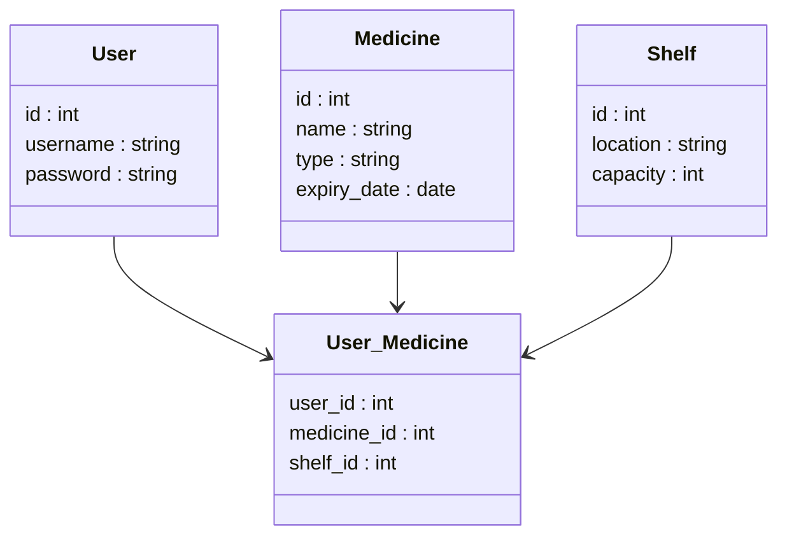
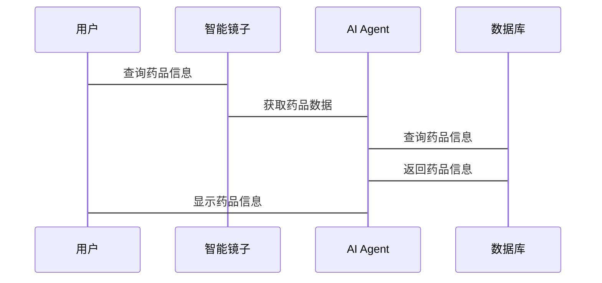

                 


# 智能浴室镜柜：AI Agent的药品管理

> 关键词：智能浴室镜柜，AI Agent，药品管理，物联网，人工智能

> 摘要：智能浴室镜柜通过AI Agent实现智能化的药品管理，结合物联网技术，优化药品存储和使用流程，提升用户便利性和安全性。本文详细分析了智能浴室镜柜的背景、AI Agent的核心概念、药品管理系统的算法原理、系统架构设计以及项目实战，为读者提供全面的技术解读。

---

# 第一部分：背景介绍

# 第1章：智能浴室镜柜与AI Agent的背景

## 1.1 智能浴室镜柜的背景

### 1.1.1 智能家居的发展趋势

智能家居近年来发展迅速，成为现代生活的重要组成部分。智能浴室镜柜作为智能家居的一部分，不仅提供传统镜柜的功能，还结合了智能化的管理和交互能力。随着人们对生活品质的要求不断提高，智能浴室镜柜逐渐成为家庭必备的智能设备之一。

### 1.1.2 智能浴室镜柜的市场需求

现代家庭对智能化产品的需求日益增长，智能浴室镜柜以其独特的功能设计，满足了用户对浴室空间的多功能利用需求。尤其是在药品管理方面，智能镜柜能够通过AI Agent实现智能化的药品存储、提醒和管理，极大提升了用户的使用体验。

### 1.1.3 药品管理的重要性

药品管理是家庭医疗健康的重要环节。传统的药品管理方式容易出现药品过期、遗漏用药等问题。通过智能浴室镜柜的AI Agent，可以实时监控药品的存储情况，提醒用户按时用药，确保药品的有效性和安全性。

## 1.2 AI Agent的核心概念

### 1.2.1 AI Agent的定义与特点

AI Agent（人工智能代理）是指能够感知环境、执行任务并做出决策的智能实体。AI Agent在智能浴室镜柜中的角色是通过传感器和摄像头感知药品信息，并通过算法处理数据，为用户提供智能化的药品管理服务。

### 1.2.2 AI Agent在智能设备中的应用

AI Agent广泛应用于智能家居、智能音箱、智能摄像头等领域。在智能浴室镜柜中，AI Agent主要用于药品的识别、分类、库存管理和用药提醒等功能。

### 1.2.3 智能浴室镜柜中的AI Agent角色

在智能浴室镜柜中，AI Agent主要负责药品的存储管理、用药提醒、药品过期预警等功能。它通过与用户的交互，提供个性化的药品管理服务，确保用户的用药安全和便利。

## 1.3 问题背景与描述

### 1.3.1 药品管理中的常见问题

传统的药品管理方式存在以下问题：
- 药品存储混乱，容易混淆或误用。
- 药品过期后不易察觉，可能导致安全隐患。
- 用药提醒不及时，容易忘记按时服药。

### 1.3.2 智能浴室镜柜的药品管理需求

智能浴室镜柜的药品管理需求包括：
- 自动识别药品信息，实现智能化分类存储。
- 实时监控药品的有效期，提醒用户及时处理过期药品。
- 提供个性化的用药提醒服务，确保用户按时服药。

### 1.3.3 AI Agent在药品管理中的解决方案

通过AI Agent，智能浴室镜柜可以实现：
- 药品的自动识别和分类存储。
- 实时监控药品的有效期，智能提醒用户。
- 与用户的智能交互，提供个性化的用药建议。

## 1.4 边界与外延

### 1.4.1 智能浴室镜柜的边界

智能浴室镜柜的边界包括：
- 硬件部分：镜柜本身、传感器、摄像头等。
- 软件部分：AI Agent、药品管理软件、用户界面等。

### 1.4.2 AI Agent的功能边界

AI Agent的功能边界包括：
- 药品识别与分类。
- 用药提醒与过期预警。
- 与用户的交互接口。

### 1.4.3 药品管理的外延功能

药品管理的外延功能包括：
- 药品库存统计与分析。
- 用户用药习惯分析。
- 远程医疗咨询接口。

## 1.5 核心要素组成

### 1.5.1 智能镜柜的硬件组成

智能浴室镜柜的硬件组成包括：
- 智能镜子：集成显示屏和传感器。
- 药品存储盒：用于分类存储药品。
- 传感器：温度、湿度、光照等环境传感器。
- 摄像头：用于药品识别和用户交互。

### 1.5.2 AI Agent的核心功能模块

AI Agent的核心功能模块包括：
- 数据采集：通过传感器和摄像头获取药品信息。
- 数据处理：对药品信息进行分类、识别和分析。
- 用户交互：通过语音或图形界面与用户进行交互。
- 任务执行：根据用户的指令执行相应的操作，如提醒用药、调整存储位置等。

### 1.5.3 药品管理系统的组成

药品管理系统的组成包括：
- 药品数据库：存储药品的基本信息、有效期、存储位置等。
- 用药提醒系统：根据用户的用药计划发送提醒。
- 药品分类系统：根据药品的种类、用途等进行分类存储。

---

# 第二部分：核心概念与联系

# 第2章：AI Agent与智能镜柜的核心概念

## 2.1 核心概念原理

### 2.1.1 AI Agent的基本原理

AI Agent通过感知环境、获取信息、分析数据并做出决策来实现智能化的任务执行。在智能浴室镜柜中，AI Agent主要通过传感器和摄像头感知药品信息，通过算法分析药品的有效期和存储状态，并通过用户交互界面提供相应的服务。

### 2.1.2 智能镜柜的感知与交互机制

智能浴室镜柜的感知与交互机制包括：
- 传感器感知：温度、湿度、光照等环境参数的感知。
- 图像识别：通过摄像头识别药品的种类和品牌。
- 语音交互：通过语音助手与用户进行交互，提供用药提醒和查询服务。

### 2.1.3 药品管理的智能化实现

药品管理的智能化实现包括：
- 药品的自动识别与分类存储。
- 实时监控药品的有效期，自动提醒用户处理过期药品。
- 根据用户的用药习惯，优化药品的存储位置和提醒策略。

## 2.2 核心概念属性特征对比

以下是AI Agent与传统药品管理系统的属性特征对比：

| 属性 | AI Agent | 传统药品管理系统 |
|------|-----------|------------------|
| 智能性 | 高度智能，能够自主决策 | 仅能执行预设任务，缺乏自主性 |
| 用户交互 | 支持语音、图形等多种交互方式 | 通常仅支持简单的查询和记录功能 |
| 数据处理能力 | 能够实时分析和处理数据 | 数据处理能力有限，难以实时监控 |
| 自适应性 | 能够根据用户需求动态调整 | 难以适应用户个性化需求 |

## 2.3 ER实体关系图

以下是药品管理系统的ER实体关系图：

```mermaid
erDiagram
    user {
        +id : int
        +username : string
        +password : string
    }
    medicine {
        +id : int
        +name : string
        +type : string
        +expiry_date : date
    }
    shelf {
        +id : int
        +location : string
        +capacity : int
    }
    user_medicine {
        user_id : int
        medicine_id : int
        shelf_id : int
        primary key (user_id, medicine_id, shelf_id)
    }
```

---

# 第三部分：算法原理讲解

# 第3章：AI Agent的算法原理

## 3.1 算法原理概述

在智能浴室镜柜中，AI Agent主要通过图像识别和自然语言处理算法实现药品的自动识别和用户交互。以下是具体的算法实现步骤：

### 3.1.1 图像识别算法

图像识别算法用于识别药品的种类和品牌。以下是实现步骤：

1. **图像采集**：通过摄像头采集药品的图像。
2. **图像预处理**：对图像进行降噪、增强等预处理操作。
3. **特征提取**：提取药品的视觉特征，如颜色、形状、文字等。
4. **模型训练**：使用深度学习模型（如卷积神经网络）进行训练，提取药品的特征向量。
5. **分类识别**：通过分类器对药品进行分类识别。

### 3.1.2 自然语言处理算法

自然语言处理算法用于实现与用户的语音交互。以下是实现步骤：

1. **语音采集**：通过麦克风采集用户的语音指令。
2. **语音预处理**：对语音信号进行降噪、特征提取等处理。
3. **语音识别**：将语音信号转换为文本。
4. **意图识别**：通过自然语言理解模型识别用户的意图。
5. **任务执行**：根据用户的意图执行相应的任务，如查询药品信息、提醒用药等。

## 3.2 算法实现代码

以下是图像识别算法的Python实现代码示例：

```python
import cv2
import numpy as np

def image_recognition(image_path):
    # 加载图像
    image = cv2.imread(image_path)
    # 转换为灰度图
    gray = cv2.cvtColor(image, cv2.COLOR_BGR2GRAY)
    # 使用OCR识别文字
    text = pytesseract.image_to_string(gray)
    return text

# 使用示例
image_path = "medicine.jpg"
result = image_recognition(image_path)
print(result)
```

## 3.3 数学模型与公式

图像识别算法的核心是卷积神经网络（CNN）。以下是CNN的基本数学模型：

$$
y = f(Wx + b)
$$

其中，\( W \) 是卷积核权重矩阵，\( x \) 是输入图像，\( b \) 是偏置项，\( f \) 是激活函数（如ReLU）。

---

# 第四部分：系统分析与架构设计方案

# 第4章：智能浴室镜柜的系统架构设计

## 4.1 问题场景介绍

智能浴室镜柜的主要应用场景包括：
- 用户在浴室中使用智能镜柜进行药品存储和管理。
- 用户通过手机或其他设备远程查看药品信息。
- 系统通过AI Agent实现药品的自动识别、分类存储和用药提醒。

## 4.2 项目介绍

本项目旨在设计和实现一个基于AI Agent的智能浴室镜柜药品管理系统。系统主要包括硬件部分和软件部分，硬件部分包括智能镜子、传感器、摄像头等，软件部分包括AI Agent、药品管理模块、用户交互界面等。

## 4.3 系统功能设计

### 4.3.1 领域模型类图

以下是药品管理系统的领域模型类图：



### 4.3.2 系统架构设计

以下是系统的分层架构设计：


### 4.3.3 系统接口设计

系统主要接口包括：
- **本地接口**：用户通过智能镜子进行交互。
- **远程接口**：用户通过手机或其他设备远程查看药品信息。
- **云平台接口**：与第三方医疗平台的数据同步接口。

### 4.3.4 系统交互序列图

以下是系统交互的序列图：



---

# 第五部分：项目实战

# 第5章：智能浴室镜柜的项目实战

## 5.1 环境安装

以下是项目实战所需的环境安装步骤：

1. **硬件安装**：
   - 安装智能镜子、传感器、摄像头等硬件设备。
2. **软件安装**：
   - 安装Python编程环境。
   - 安装相关库（如OpenCV、TensorFlow、pytesseract）。
3. **网络配置**：
   - 配置智能镜子与云平台的数据同步接口。

## 5.2 系统核心实现

以下是系统核心功能的Python实现代码：

```python
class AI_Agent:
    def __init__(self):
        self.sensors = []
        self.cameras = []
        self.database = {}

    def collect_data(self):
        for sensor in self.sensors:
            data = sensor.read()
            self.database.update(data)

    def process_data(self):
        for medicine in self.database:
            if medicine.expiry_date < current_date():
                self.notify_expire(medicine)

    def notify_expire(self, medicine):
        print(f"药品 {medicine.name} 已过期，请及时处理！")

# 使用示例
agent = AI_Agent()
agent.collect_data()
agent.process_data()
```

## 5.3 代码应用解读与分析

以上代码实现了AI Agent的核心功能，包括数据采集、数据处理和过期药品通知。通过传感器和摄像头采集药品信息，实时监控药品的有效期，并在药品过期时通知用户。

## 5.4 实际案例分析

以下是一个实际案例分析：

**案例背景**：
用户购买了一款智能浴室镜柜，并将常用药品存放在镜柜中。用户希望系统能够自动提醒药品的用药时间，并在药品过期时通知用户。

**系统实现**：
AI Agent通过摄像头识别药品信息，通过传感器监控药品的存储环境。系统根据用户的用药计划，每天早晨和晚上发送用药提醒。同时，系统实时监控药品的有效期，当药品过期时，自动通知用户处理。

**结果分析**：
通过AI Agent的智能化管理，用户能够更加便捷地管理药品，避免了药品过期和遗漏用药的问题。同时，系统通过数据分析，能够为用户提供个性化的用药建议，提升用户的健康管理水平。

## 5.5 项目小结

通过本项目的实施，我们实现了智能浴室镜柜的药品管理功能，验证了AI Agent在智能设备中的应用潜力。系统通过图像识别、传感器数据采集和智能化算法，为用户提供了一种更加便捷和安全的药品管理方式。

---

# 第六部分：最佳实践与小结

# 第6章：最佳实践与总结

## 6.1 最佳实践

1. **数据安全**：在实际应用中，药品管理系统的数据安全非常重要。建议采用加密技术和访问控制机制，确保用户的药品信息不被泄露。
2. **用户体验**：在设计用户交互界面时，应注重用户体验，提供简洁易用的操作方式，满足不同用户的需求。
3. **系统维护**：定期对系统进行维护和更新，确保系统的稳定性和功能性。同时，建议定期检查药品的存储环境，确保传感器的准确性。

## 6.2 小结

通过本文的详细讲解，我们了解了智能浴室镜柜在药品管理中的重要作用。AI Agent通过智能化的识别、分类和提醒功能，为用户提供了一种高效、安全的药品管理方式。未来，随着人工智能技术的不断发展，智能浴室镜柜的药品管理将更加智能化和个性化，为用户的生活带来更多的便利。

## 6.3 注意事项

1. **隐私保护**：在设计药品管理系统时，必须注重用户的隐私保护，避免用户信息的泄露。
2. **系统兼容性**：在实际应用中，应考虑不同设备的兼容性问题，确保系统能够在不同环境下正常运行。
3. **异常处理**：在系统设计中，应充分考虑各种异常情况，如传感器故障、网络中断等，确保系统的健壮性。

## 6.4 拓展阅读

1. **人工智能与物联网的结合**：进一步了解人工智能与物联网技术的结合应用，探索更多智能化的家居解决方案。
2. **智能镜子的其他功能**：研究智能镜子在其他领域的应用，如健康监测、美容建议等。
3. **药品管理系统的优化**：探索药品管理系统的优化方案，如引入区块链技术确保药品信息的安全性。

---

通过本文的详细讲解，我们深入探讨了智能浴室镜柜在药品管理中的应用，从背景到实现，从理论到实践，为读者提供了一个全面的技术解读。希望本文能够为相关领域的研究和实践提供有价值的参考和指导。

