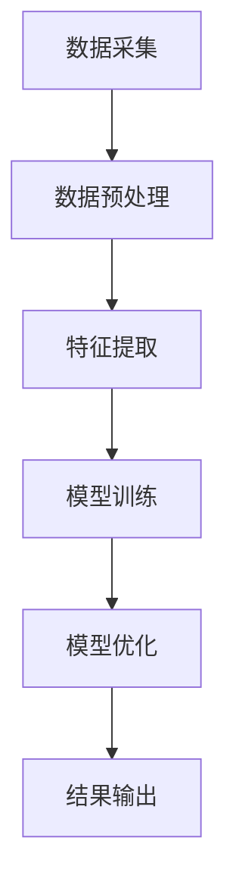
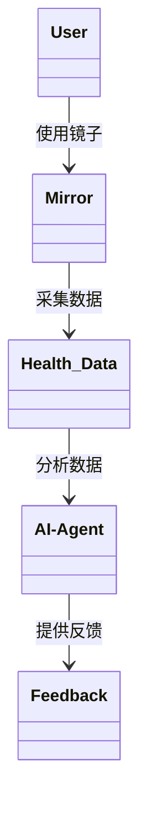
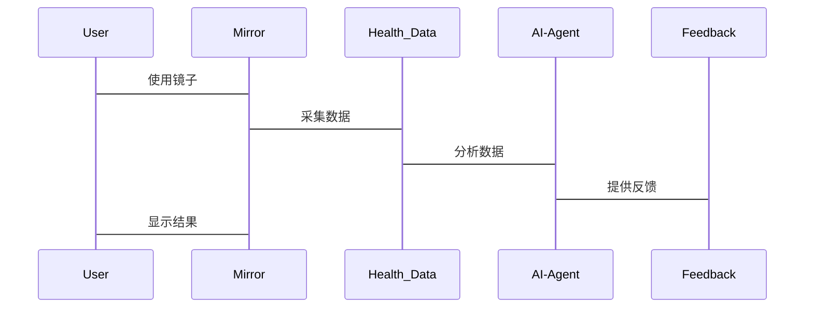

                 


# 智能浴室镜：AI Agent的健康状态分析

## 关键词：智能浴室镜, AI Agent, 健康管理, 多模态数据, 算法实现, 系统架构

## 摘要

智能浴室镜是一种结合了人工智能（AI）技术的智能家居设备，通过多模态数据采集和AI Agent的分析，能够实现对人体健康状态的实时监测和个性化健康管理。本文从问题背景、核心概念、算法原理、系统架构、项目实战等方面详细分析了智能浴室镜的设计与实现过程。通过对AI Agent的工作原理、多模态数据处理技术、系统架构设计的深入探讨，本文旨在为读者提供一个全面的技术视角，帮助理解智能浴室镜在现代健康管理中的重要性及其技术实现的细节。

---

## 第一部分：智能浴室镜的背景与概念

### 第1章：问题背景与描述

#### 1.1 问题背景
##### 1.1.1 当前健康管理的趋势
随着生活水平的提高和健康意识的增强，人们对健康管理的需求日益增长。传统的健康管理方式（如定期体检、手动记录健康数据）存在效率低、数据分散等问题，难以满足现代人的需求。

##### 1.1.2 智能家居的发展现状
智能家居技术的快速发展为家庭健康监测提供了新的可能性。通过将健康监测设备与智能家居环境结合，可以实现更加便捷和个性化的健康管理。

##### 1.1.3 健康监测技术的演变
健康监测技术从简单的体征测量（如体温、心率）逐步发展到基于AI的多模态数据分析，技术的进步使得健康监测更加精准和智能化。

#### 1.2 问题描述
##### 1.2.1 健康监测的痛点分析
传统健康监测设备存在数据采集单一、用户互动性差、数据处理复杂等问题，难以提供全面的健康评估和个性化的建议。

##### 1.2.2 智能浴室镜的定义与目标
智能浴室镜是一种集成AI技术的智能镜子，通过多模态数据采集（如面部特征、体态、动作）和AI Agent的分析，实现对人体健康状态的实时监测和个性化健康管理。

##### 1.2.3 用户需求与场景分析
用户需求包括：
- 实时健康监测（如心率、血氧、皮肤状态）
- 个性化健康建议
- 数据可视化与历史记录
- 隐私保护与数据安全

#### 1.3 问题解决与边界
##### 1.3.1 智能浴室镜的功能边界
智能浴室镜的功能限于健康监测和数据管理，不涉及医疗诊断或其他专业健康服务。

##### 1.3.2 技术实现的范围界定
主要基于AI图像处理、语音交互和云数据存储技术，不涉及硬件制造和网络通信。

##### 1.3.3 产品的使用场景与限制
适用于家庭和个人用户，不适用于医疗机构或其他专业健康监测场景。

---

### 第2章：核心概念与联系

#### 2.1 AI Agent的基本原理
##### 2.1.1 AI Agent的定义与特征
AI Agent是一种能够感知环境、执行任务的智能实体，具有自主性、反应性、目标导向性和社会性特征。

##### 2.1.2 基于AI Agent的健康监测机制
AI Agent通过多模态数据采集和深度学习算法，实时分析用户的健康状态，并提供个性化建议。

##### 2.1.3 实体关系图（ER图）
```mermaid
erDiagram
    user[用户]
    mirror[智能浴室镜]
    health_data[健康数据]
    ai_agent[AI Agent]
    feedback[反馈]

    user --> mirror: 使用镜子
    mirror --> health_data: 采集数据
    health_data --> ai_agent: 分析数据
    ai_agent --> feedback: 提供反馈
```

#### 2.2 智能镜子的功能模块
##### 2.2.1 多模态数据采集
智能镜子通过摄像头、传感器等设备，采集用户的面部特征、体态、动作等多模态数据。

##### 2.2.2 数据分析与处理
AI Agent对采集的数据进行清洗、特征提取和模型训练，生成健康评估结果。

##### 2.2.3 用户反馈与交互
系统通过语音或屏幕反馈健康数据和建议，与用户进行实时互动。

#### 2.3 核心概念对比表
| 对比项           | AI Agent                     | 传统算法                     |
|------------------|------------------------------|------------------------------|
| 数据处理能力     | 支持多模态数据，实时性强     | 单一数据源，处理效率较低     |
| 适应性           | 高度灵活，适应不同场景       | 较低，需要手动调整参数         |
| 学习能力         | 具备自学习能力               | 无自学习能力                 |

---

## 第二部分：算法原理与数学模型

### 第3章：AI Agent的算法原理

#### 3.1 数据采集与预处理
- 数据来源：摄像头图像、传感器数据。
- 预处理步骤：去噪、归一化、特征提取。

#### 3.2 模型训练与优化
- 使用卷积神经网络（CNN）进行图像分类和回归任务。
- 优化目标：最小化损失函数。
  $$ L = \frac{1}{n}\sum_{i=1}^{n}(y_i - \hat{y_i})^2 $$
- 优化算法：Adam优化器。
  $$ \theta_{new} = \theta - \eta \frac{\partial L}{\partial \theta} $$

#### 3.3 模型实现
以下是基于Keras的模型训练代码示例：
```python
import tensorflow as tf
from tensorflow.keras import layers

model = tf.keras.Sequential([
    layers.Conv2D(32, (3,3), activation='relu', input_shape=(64,64,3)),
    layers.MaxPooling2D((2,2)),
    layers.Conv2D(64, (3,3), activation='relu'),
    layers.MaxPooling2D((2,2)),
    layers.Flatten(),
    layers.Dense(128, activation='relu'),
    layers.Dense(1, activation='sigmoid')
])

model.compile(optimizer='adam', loss='binary_crossentropy', metrics=['accuracy'])
model.fit(x_train, y_train, epochs=10, batch_size=32)
```

#### 3.4 算法流程图


---

## 第三部分：系统分析与架构设计

### 第4章：系统架构设计

#### 4.1 系统功能设计
- **功能模块**：数据采集、数据分析、用户反馈。
- **领域模型图**：


#### 4.2 系统架构设计
- **分层架构**：数据采集层、数据处理层、用户交互层。
- **架构图**：
```mermaid
rect left, top, 400, 200
    title 系统架构
    Mirror --> Cloud_Server: 数据上传
    Cloud_Server --> AI-Agent: 模型调用
    AI-Agent --> Mirror: 反馈结果
```

#### 4.3 系统交互流程图


---

## 第四部分：项目实战

### 第5章：项目实现与案例分析

#### 5.1 项目环境安装
- Python 3.8+
- TensorFlow 2.5+
- Keras
- OpenCV

#### 5.2 核心代码实现
以下是数据采集和模型训练的代码示例：
```python
import cv2
import numpy as np
from tensorflow.keras.models import load_model

# 数据采集
cap = cv2.VideoCapture(0)
while True:
    ret, frame = cap.read()
    cv2.imshow('Camera', frame)
    if cv2.waitKey(1) & 0xFF == ord('q'):
        break

# 模型加载与预测
model = load_model('health_model.h5')
 prediction = model.predict(frame)
 print(prediction)
```

#### 5.3 实际案例分析
通过实际案例分析智能浴室镜在健康管理中的应用，展示系统的功能和效果。

---

## 第五部分：最佳实践与小结

### 第6章：总结与展望

#### 6.1 最佳实践
- 数据采集时注意隐私保护。
- 模型训练时确保数据多样性和代表性。

#### 6.2 小结
智能浴室镜通过AI Agent的健康监测技术，为用户提供了一种便捷、高效的健康管理方式。未来，随着AI技术的进一步发展，智能浴室镜的功能将更加智能化和个性化。

#### 6.3 注意事项
- 确保系统的数据安全和隐私保护。
- 定期更新模型以适应新的健康监测需求。

#### 6.4 拓展阅读
- 《深度学习实战》
- 《人工智能系统设计》

---

通过以上分析，智能浴室镜作为一个结合了AI技术的健康监测设备，其在现代健康管理中的应用前景广阔。希望本文能够为相关领域的研究和实践提供有价值的参考。

