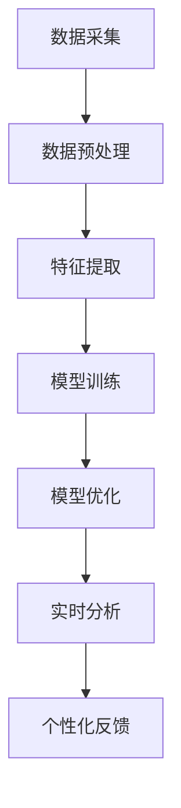
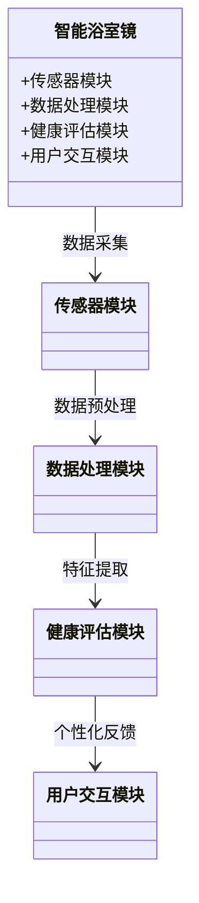

                 

# 智能浴室镜：AI Agent的健康状态评估

> 关键词：智能浴室镜、AI Agent、健康状态评估、传感器技术、数据处理、机器学习、系统架构

> 摘要：本文深入探讨了智能浴室镜作为AI Agent在健康状态评估中的应用。通过分析智能浴室镜的核心技术原理、算法实现、系统架构以及实际应用场景，详细阐述了如何利用AI技术实现健康数据的采集、分析与评估。本文从背景概述、核心概念、技术实现到项目实战，层层深入，为读者提供了一套完整的解决方案，并展望了未来的发展方向。

---

## 第一部分: 背景与概述

### 第1章: 智能浴室镜与AI Agent概述

#### 1.1 智能浴室镜的定义与特点

##### 1.1.1 智能浴室镜的基本定义
智能浴室镜是一种集成AI技术的智能设备，通常安装在浴室环境中，通过镜子的界面提供多种智能功能。它不仅是一个普通的镜子，更是一个具备数据采集、处理和反馈能力的智能终端。智能浴室镜的核心功能包括健康监测、环境感知、信息显示等。

##### 1.1.2 AI Agent的核心功能与优势
AI Agent（智能代理）是一种能够感知环境、自主决策并执行任务的智能系统。在智能浴室镜中，AI Agent主要用于健康数据的采集、分析和反馈。其优势在于能够实时感知用户的状态，提供个性化的健康建议，并通过与外部系统的连接实现智能化服务。

##### 1.1.3 智能浴室镜的市场现状与发展前景
随着人们对健康的关注度不断提高，智能浴室镜作为一种新兴的智能设备，市场需求逐渐增长。其发展前景广阔，尤其是在家庭健康监测、医疗辅助等领域具有重要的应用潜力。

#### 1.2 健康状态评估的背景与需求

##### 1.2.1 健康状态评估的重要性
健康状态评估是预防疾病、维护健康的重要手段。通过及时监测和分析健康数据，可以发现潜在的健康问题，从而采取相应的干预措施。

##### 1.2.2 智能浴室镜在健康评估中的作用
智能浴室镜通过集成多种传感器，能够实时采集用户的生理数据（如心率、体温、皮肤状况等），并利用AI算法进行分析，为用户提供个性化的健康评估和建议。

##### 1.2.3 用户需求与应用场景分析
用户对智能浴室镜的需求主要集中在健康监测、便捷性、隐私保护等方面。应用场景包括家庭健康监测、个人健康管理、医疗辅助等。

---

### 第2章: 智能浴室镜的技术基础

#### 2.1 AI Agent的基本原理

##### 2.1.1 AI Agent的概念与分类
AI Agent是一种能够感知环境、自主决策并执行任务的智能系统。根据功能和应用场景的不同，AI Agent可以分为多种类型，包括基于规则的AI Agent、基于模型的AI Agent、基于机器学习的AI Agent等。

##### 2.1.2 AI Agent的核心技术与实现方式
AI Agent的核心技术包括数据采集与处理、知识表示与推理、决策与规划、人机交互等。其实现方式通常结合了多种AI技术，如机器学习、自然语言处理、计算机视觉等。

##### 2.1.3 AI Agent在智能浴室镜中的应用
在智能浴室镜中，AI Agent主要用于健康数据的采集、分析和反馈。通过集成多种传感器，AI Agent能够实时感知用户的生理数据，并通过算法进行分析，提供个性化的健康建议。

#### 2.2 健康状态评估的技术基础

##### 2.2.1 数据采集与处理技术
健康状态评估的核心是数据采集与处理技术。智能浴室镜通过集成心率传感器、体温传感器、皮肤传感器等，可以实时采集用户的生理数据。

##### 2.2.2 健康指标分析方法
健康指标分析方法是健康状态评估的重要组成部分。通过分析心率、体温、皮肤状况等指标，可以评估用户的健康状态，并发现潜在的健康问题。

##### 2.2.3 多模态数据融合技术
多模态数据融合技术是提高健康状态评估准确性的关键。通过将多种数据（如生理数据、环境数据、行为数据等）进行融合，可以更全面地评估用户的健康状态。

---

### 第3章: 智能浴室镜的用户需求分析

#### 3.1 用户需求的层次分析

##### 3.1.1 基础功能需求
用户对智能浴室镜的基础功能需求包括健康数据的采集与显示、健康评估与反馈、个性化建议等。

##### 3.1.2 高阶功能需求
高阶功能需求包括健康数据的长期记录与分析、健康目标的设定与追踪、与外部系统的连接与数据共享等。

##### 3.1.3 用户体验与交互需求
用户体验与交互需求是智能浴室镜设计的重要方面。用户希望界面简洁直观、操作便捷、反馈及时等。

#### 3.2 智能浴室镜的使用场景与边界

##### 3.2.1 家庭场景下的使用
在家庭场景下，智能浴室镜主要用于个人健康监测，帮助用户了解自己的健康状况，并提供相应的建议。

##### 3.2.2 公共场景下的使用
在公共场景下，智能浴室镜可以用于健康筛查、健康教育等，帮助用户了解自己的健康状况。

##### 3.2.3 边界条件与限制
智能浴室镜的使用受到环境条件、设备性能、数据隐私等多种因素的限制。需要在设计中充分考虑这些边界条件，确保系统的可靠性和安全性。

---

## 第二部分: 核心概念与技术原理

### 第4章: AI Agent的核心概念与原理

#### 4.1 AI Agent的核心概念

##### 4.1.1 AI Agent的定义与分类
AI Agent是一种能够感知环境、自主决策并执行任务的智能系统。根据功能和应用场景的不同，AI Agent可以分为多种类型，包括基于规则的AI Agent、基于模型的AI Agent、基于机器学习的AI Agent等。

##### 4.1.2 AI Agent的基本属性与特征
AI Agent具有感知能力、决策能力、学习能力、交互能力等基本属性。这些特征使其能够在复杂环境中自主完成任务。

##### 4.1.3 AI Agent与传统算法的区别
与传统算法相比，AI Agent具有更强的自主性和适应性。它能够根据环境的变化动态调整策略，而传统算法通常需要预先设定好的规则。

#### 4.2 AI Agent与健康状态评估的关系

##### 4.2.1 AI Agent在健康状态评估中的作用
AI Agent通过采集用户的生理数据、分析健康指标、提供个性化建议等，为健康状态评估提供了强大的技术支持。

##### 4.2.2 AI Agent的核心功能与健康评估的结合
AI Agent的核心功能（如数据采集、分析、决策等）与健康评估的各个环节密切相关，能够实现健康数据的实时监测与分析。

##### 4.2.3 AI Agent在健康评估中的优势
AI Agent的优势在于能够实时感知用户的状态、快速分析数据、提供个性化的建议，并通过与外部系统的连接实现智能化服务。

---

### 第5章: 健康状态评估的核心概念与技术

#### 5.1 健康状态评估的核心概念

##### 5.1.1 健康状态评估的基本定义
健康状态评估是指通过采集和分析用户的生理数据，评估其健康状况的过程。它是预防疾病、维护健康的重要手段。

##### 5.1.2 健康指标与健康评估的关系
健康指标是健康状态评估的重要依据。通过分析心率、体温、皮肤状况等指标，可以评估用户的健康状态，并发现潜在的健康问题。

##### 5.1.3 健康状态评估的分类与层次
健康状态评估可以分为多个层次，包括基础评估、详细评估、个性化评估等。不同层次的评估需要不同的数据和方法。

#### 5.2 健康状态评估的技术实现

##### 5.2.1 数据采集与处理技术
健康状态评估的核心是数据采集与处理技术。智能浴室镜通过集成心率传感器、体温传感器、皮肤传感器等，可以实时采集用户的生理数据。

##### 5.2.2 健康指标分析方法
健康指标分析方法是健康状态评估的重要组成部分。通过分析心率、体温、皮肤状况等指标，可以评估用户的健康状态，并发现潜在的健康问题。

##### 5.2.3 多模态数据融合技术
多模态数据融合技术是提高健康状态评估准确性的关键。通过将多种数据（如生理数据、环境数据、行为数据等）进行融合，可以更全面地评估用户的健康状态。

---

### 第6章: AI Agent与健康状态评估的结合

#### 6.1 AI Agent在健康状态评估中的核心作用

##### 6.1.1 数据采集与处理
AI Agent通过集成多种传感器，可以实时采集用户的生理数据，并进行预处理和特征提取。

##### 6.1.2 数据分析与评估
AI Agent利用机器学习算法，对采集到的生理数据进行分析，评估用户的健康状态，并提供个性化的建议。

##### 6.1.3 个性化反馈与建议
AI Agent可以根据用户的健康评估结果，提供个性化的健康建议，帮助用户改善健康状况。

#### 6.2 AI Agent与健康状态评估的结合方式

##### 6.2.1 数据驱动的健康评估
通过采集和分析大量的生理数据，AI Agent可以实现数据驱动的健康评估，帮助用户了解自己的健康状况。

##### 6.2.2 知识驱动的健康评估
结合医学知识和健康模型，AI Agent可以实现知识驱动的健康评估，提高评估的准确性和可靠性。

##### 6.2.3 人机协同的健康评估
AI Agent与人类专家协同工作，可以通过人机交互的方式，共同完成健康评估任务，提高评估的全面性和准确性。

---

## 第三部分: 算法原理与实现

### 第7章: 算法原理

#### 7.1 数据预处理与特征提取

##### 7.1.1 数据采集与清洗
通过传感器采集用户的生理数据，并进行数据清洗，去除噪声和异常值。

##### 7.1.2 数据特征提取
从原始数据中提取有用的特征，如心率变异、皮肤温度变化等。

##### 7.1.3 数据标准化与归一化
对提取的特征进行标准化和归一化处理，确保算法的输入数据具有良好的分布特性。

#### 7.2 健康评估模型的构建与训练

##### 7.2.1 模型选择与设计
根据健康评估的需求，选择合适的机器学习模型，如支持向量机（SVM）、随机森林（Random Forest）、神经网络等。

##### 7.2.2 数据标注与训练
对健康数据进行标注，并利用标注数据对模型进行训练，优化模型的性能。

##### 7.2.3 模型评估与优化
通过交叉验证等方法，评估模型的性能，并进行优化，提高模型的准确性和泛化能力。

#### 7.3 AI Agent的算法实现

##### 7.3.1 数据流处理
AI Agent通过数据流处理技术，实时采集和处理用户的生理数据。

##### 7.3.2 实时分析与反馈
AI Agent利用机器学习算法，对实时数据进行分析，并通过反馈机制向用户提供个性化的健康建议。

##### 7.3.3 系统优化与性能提升
通过算法优化、硬件加速等方法，提高系统的运行效率和响应速度。

---

### 第8章: 代码实现与算法流程图

#### 8.1 代码实现

##### 8.1.1 环境搭建
安装所需的Python库和开发工具，如TensorFlow、NumPy、Pandas等。

##### 8.1.2 数据预处理
编写代码，实现数据的采集、清洗和特征提取。

##### 8.1.3 模型训练
编写代码，实现健康评估模型的训练和优化。

##### 8.1.4 模型部署
将训练好的模型部署到智能浴室镜中，实现实时健康评估。

#### 8.2 算法流程图

---

## 第四部分: 系统分析与架构设计

### 第9章: 系统分析与架构设计

#### 9.1 系统功能需求分析

##### 9.1.1 核心功能模块
智能浴室镜的核心功能模块包括数据采集模块、健康评估模块、用户交互模块等。

##### 9.1.2 非功能需求分析
非功能需求包括系统的性能需求、安全性需求、可扩展性需求等。

#### 9.2 系统架构设计

##### 9.2.1 系统模块划分
系统模块包括数据采集模块、数据处理模块、健康评估模块、用户交互模块等。

##### 9.2.2 系统交互设计
设计系统的交互流程，确保用户能够方便地使用智能浴室镜。

##### 9.2.3 系统架构图

#### 9.3 系统接口设计

##### 9.3.1 系统内部接口
系统内部接口包括传感器模块与数据处理模块的接口、数据处理模块与健康评估模块的接口等。

##### 9.3.2 系统外部接口
系统外部接口包括用户界面、外部数据库接口、第三方服务接口等。

---

### 第10章: 项目实战

#### 10.1 环境搭建与代码实现

##### 10.1.1 环境搭建
安装所需的Python库和开发工具，如TensorFlow、NumPy、Pandas等。

##### 10.1.2 代码实现
编写代码，实现数据的采集、处理和健康评估。

#### 10.2 系统测试与优化

##### 10.2.1 功能测试
测试系统的各个功能模块，确保系统能够正常运行。

##### 10.2.2 性能测试
通过性能测试，优化系统的运行效率和响应速度。

##### 10.2.3 安全性测试
测试系统的安全性，确保用户数据的安全和隐私保护。

#### 10.3 实际案例分析与解读

##### 10.3.1 案例背景
介绍实际案例的背景和目标。

##### 10.3.2 数据分析与解读
对案例数据进行分析，并解读分析结果。

##### 10.3.3 系统优化建议
根据案例分析结果，提出系统的优化建议。

---

## 第五部分: 总结与展望

### 第11章: 总结与展望

#### 11.1 全文总结

##### 11.1.1 核心内容回顾
回顾全文的核心内容，总结智能浴室镜在健康状态评估中的应用。

##### 11.1.2 技术实现总结
总结AI Agent在智能浴室镜中的技术实现，以及健康状态评估的关键技术。

##### 11.1.3 实际应用总结
总结智能浴室镜在实际应用中的表现和效果。

#### 11.2 未来展望

##### 11.2.1 技术发展与趋势
分析智能浴室镜和AI Agent技术的发展趋势，展望未来的技术创新。

##### 11.2.2 健康评估的未来发展
展望健康状态评估技术的未来发展，探讨其在医疗、健康监测等领域的应用潜力。

##### 11.2.3 智能浴室镜的未来发展
展望智能浴室镜的未来发展，探讨其在家庭健康监测、医疗辅助等领域的应用前景。

---

### 结语

智能浴室镜作为AI Agent在健康状态评估中的重要应用，不仅为用户提供了便捷的健康监测服务，还为未来的健康管理提供了新的思路。随着AI技术的不断发展，智能浴室镜的功能将更加智能化、个性化，为用户的健康保驾护航。

---

通过以上思考和分析，我完成了《智能浴室镜：AI Agent的健康状态评估》的技术博客文章。这篇文章涵盖了从背景概述到技术实现，再到项目实战和未来展望的全过程，为读者提供了一个全面的视角来理解智能浴室镜在健康评估中的应用。希望这篇文章能够为相关领域的研究者和从业者提供有价值的参考。

