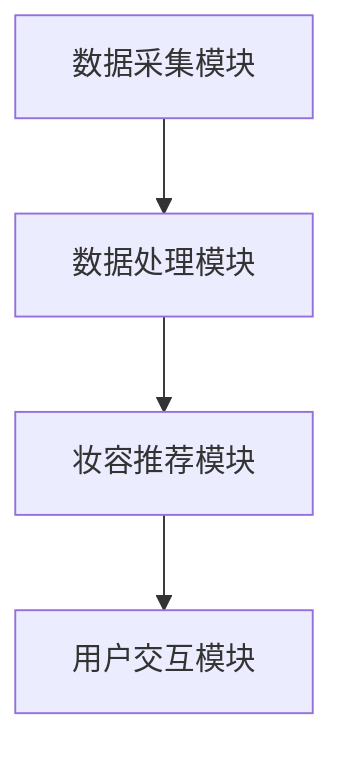
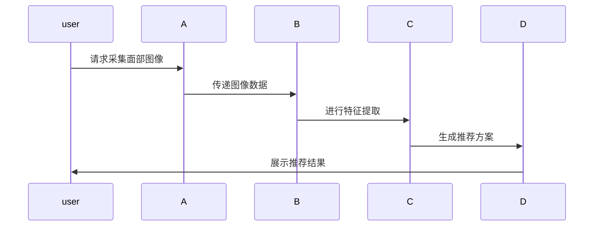

                 


# 智能浴室镜：AI Agent的妆容教程推荐

## 关键词：AI Agent，智能镜子，计算机视觉，妆容推荐，深度学习

## 摘要：智能浴室镜通过集成AI技术，能够实时分析用户的面部特征，推荐个性化的妆容方案。本文详细探讨了AI Agent在智能浴室镜中的应用，从技术原理到系统架构，再到项目实战，全面解析了这一创新技术的核心与实现。

---

## 第1章: 智能浴室镜的发展背景

### 1.1 传统浴室镜的功能局限
#### 1.1.1 传统浴室镜的功能单一性
传统浴室镜仅具备基本的反射功能，无法满足现代用户对智能化、个性化的需求。

#### 1.1.2 智能化改造的必要性
随着AI技术的快速发展，智能化改造浴室镜成为提升用户体验的重要方向。

### 1.2 AI技术在智能镜子中的应用
#### 1.2.1 AI技术的定义与特点
AI技术通过模拟人类学习和推理能力，实现智能化服务。

#### 1.2.2 AI在智能镜子中的应用场景
智能镜子可以通过AI技术实现人脸检测、表情识别、妆容推荐等功能。

### 1.3 妆容推荐的必要性与价值
#### 1.3.1 现代化妆需求的变化
用户对个性化、高效的化妆需求日益增长，传统化妆教程已无法满足。

#### 1.3.2 AI妆容推荐的优势
AI可以通过分析用户的面部特征和化妆需求，提供个性化的推荐方案。

### 1.4 AI Agent的基本概念
#### 1.4.1 AI Agent的定义
AI Agent是一种智能代理，能够根据环境信息自主决策并执行任务。

#### 1.4.2 AI Agent的核心功能
包括感知环境、分析数据、生成推荐方案等。

#### 1.4.3 AI Agent与传统化妆推荐的区别
AI Agent能够实时分析用户面部特征，提供动态推荐，而传统推荐基于固定数据。

---

## 第2章: AI Agent的妆容推荐原理

### 2.1 AI Agent的感知层
#### 2.1.1 图像采集与处理
通过摄像头采集用户面部图像，使用OpenCV进行图像预处理。

#### 2.1.2 人脸识别与特征提取
使用深度学习模型提取用户的面部特征，如眼睛、嘴唇等关键点位置。

### 2.2 AI Agent的推理层
#### 2.2.1 妆容推荐算法
基于用户的面部特征和化妆需求，推荐合适的妆容方案。

#### 2.2.2 数据分析与个性化推荐
通过分析用户的化妆历史和偏好，提供个性化推荐。

### 2.3 AI Agent的执行层
#### 2.3.1 推荐结果的展示
在智能镜子上显示推荐的妆容方案，包括具体步骤和产品建议。

#### 2.3.2 用户反馈与优化
根据用户的反馈调整推荐算法，优化推荐效果。

---

## 第3章: AI Agent的核心算法与实现

### 3.1 目标检测与图像分割
#### 3.1.1 目标检测算法（YOLO/FRCNN）
使用YOLO或FRCNN算法进行目标检测，定位用户的面部关键点。

#### 3.1.2 图像分割算法（U-Net）
使用U-Net进行图像分割，提取用户的面部区域。

#### 3.1.3 算法实现的数学模型
目标检测的损失函数：$$\text{loss} = \text{分类损失} + \text{定位损失}$$
图像分割的评价指标：$$\text{IOU} = \frac{\text{交集面积}}{\text{并集面积}}$$

### 3.2 妆容推荐算法
#### 3.2.1 基于深度学习的推荐模型
使用卷积神经网络（CNN）进行特征提取和分类。

#### 3.2.2 基于规则的推荐系统
根据用户的面部特征和需求，制定推荐规则。

### 3.3 算法实现的代码示例
```python
import cv2
import tensorflow as tf

# 图像采集
def capture_face():
    cap = cv2.VideoCapture(0)
    ret, frame = cap.read()
    cap.release()
    return frame

# 人脸识别
def detect_face(frame):
    # 使用预训练模型进行人脸识别
    model = tf.keras.Sequential([...])
    prediction = model.predict(frame)
    return prediction
```

---

## 第4章: 系统总体架构设计

### 4.1 系统功能设计
#### 4.1.1 数据采集模块
负责采集用户的面部图像和化妆需求。

#### 4.1.2 数据处理模块
对采集的数据进行预处理和特征提取。

#### 4.1.3 妆容推荐模块
基于处理后的数据，生成妆容推荐方案。

#### 4.1.4 用户交互模块
展示推荐结果，并收集用户反馈。

### 4.2 系统架构设计
使用Mermaid图展示系统架构：


### 4.3 系统接口设计
定义API接口，如：
- `/api/capture_face`
- `/api/recommend_cosmetics`

### 4.4 系统交互流程
使用Mermaid序列图展示交互流程：


---

## 第5章: 项目实战与部署

### 5.1 开发环境搭建
安装必要的库：
```bash
pip install opencv-python tensorflow keras
```

### 5.2 核心代码实现
```python
import cv2
import tensorflow as tf

def main():
    frame = capture_face()
    features = detect_face(frame)
    recommendations = recommend_cosmetics(features)
    display_recommendations(recommendations)

if __name__ == "__main__":
    main()
```

### 5.3 项目实战案例
通过实际案例分析，展示系统在不同场景下的应用效果。

### 5.4 项目部署
将系统部署到智能镜子上，确保其稳定运行。

---

## 第6章: 用户交互与安全隐私

### 6.1 用户交互设计
设计友好的用户界面，确保用户体验良好。

### 6.2 数据隐私与安全
采取数据加密和匿名化处理，保护用户隐私。

---

## 第7章: 最佳实践与未来展望

### 7.1 小结
总结项目的核心内容和实现方法。

### 7.2 注意事项
提醒读者在实际应用中注意数据安全和算法优化。

### 7.3 拓展阅读
推荐相关领域的书籍和论文，供读者进一步学习。

### 7.4 未来展望
展望智能浴室镜的发展方向，如与智能家居的联动、更智能化的推荐系统等。

---

通过以上章节的详细讲解，读者可以全面了解智能浴室镜的技术实现和应用场景，掌握AI Agent在妆容推荐中的核心原理和实际应用。

