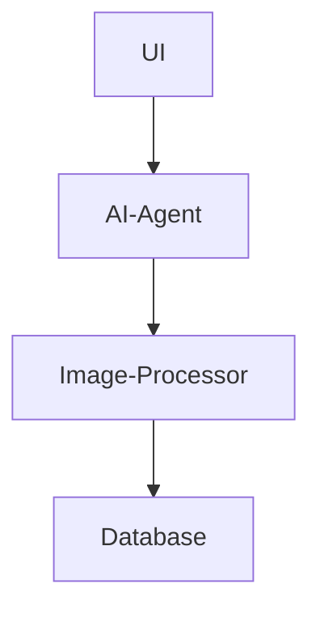
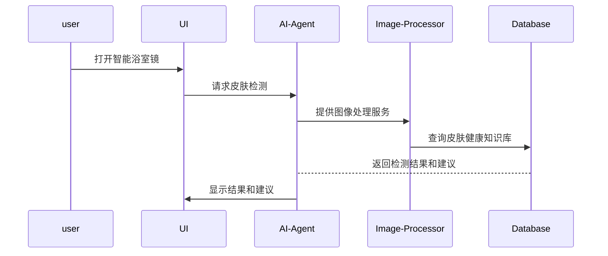

                 


# 智能浴室镜：AI Agent的皮肤状况分析

## 关键词：
智能浴室镜，AI Agent，皮肤检测，图像处理，机器学习

## 摘要：
本文详细探讨了智能浴室镜在皮肤健康监测中的应用，结合AI Agent技术，分析了皮肤状况的检测方法和实现原理。通过介绍图像处理技术和机器学习算法，阐述了智能浴室镜的工作机制，并提供了实际的系统设计和项目实现方案。

---

# 第一部分: 智能浴室镜的背景与概念

## 第1章: 皮肤健康与智能检测的背景

### 1.1 皮肤健康的重要性
皮肤是人体最大的器官，不仅起到保护身体的作用，还能反映整体健康状况。现代生活方式中，环境污染、压力、饮食不均衡等因素导致皮肤问题日益普遍。传统的皮肤健康管理依赖于医生的主观判断，效率低且难以实时监测。

### 1.2 智能浴室镜的出现
智能浴室镜通过集成AI技术，能够实时捕捉用户的皮肤状态，提供个性化的健康建议。它不仅改变了传统的皮肤护理方式，还为用户提供了便捷的健康管理工具。智能浴室镜的核心在于AI Agent，它能够处理图像数据、分析皮肤状况并提供建议。

---

## 第2章: AI Agent的基本概念

### 2.1 AI Agent的定义与分类
AI Agent是一种智能体，能够感知环境、自主决策并执行任务。根据应用场景的不同，AI Agent可以分为简单反射型、基于模型的反应型、目标驱动型和实用驱动型。在智能浴室镜中，AI Agent主要用于图像处理和数据分析。

### 2.2 AI Agent在智能浴室镜中的应用
AI Agent在智能浴室镜中主要负责以下几个方面：
1. **图像采集与处理**：通过摄像头采集用户皮肤图像，进行预处理、分割和特征提取。
2. **皮肤状况分析**：利用机器学习算法对图像进行分类，识别皮肤问题（如痘痘、色斑、过敏等）。
3. **个性化建议**：根据分析结果，为用户提供针对性的护肤建议。

---

# 第二部分: 智能浴室镜的核心技术

## 第3章: 皮肤检测的图像处理技术

### 3.1 图像处理技术的基本原理
图像处理是智能浴室镜的核心技术之一。以下是图像处理的主要步骤：
1. **图像采集**：通过高分辨率摄像头获取用户皮肤图像。
2. **预处理**：包括去噪、亮度调整和对比度增强，以改善图像质量。
3. **图像分割**：将皮肤区域与其他区域（如背景、头发）分离。
4. **特征提取**：提取皮肤颜色、纹理等特征，用于后续分类。

### 3.2 基于AI的皮肤检测算法
AI Agent在皮肤检测中的应用主要依赖深度学习算法。常用的算法包括卷积神经网络（CNN）和迁移学习。以下是实现流程：
1. **数据准备**：收集多样化的皮肤图像，标注皮肤问题。
2. **模型训练**：使用CNN进行监督学习，训练皮肤分类模型。
3. **模型优化**：通过数据增强、超参数调整等方法提升模型性能。

---

## 第4章: AI Agent的算法原理

### 4.1 AI Agent的核心算法
AI Agent在智能浴室镜中的核心算法包括：
1. **机器学习算法**：用于模式识别和分类。
2. **深度学习算法**：用于图像识别和特征提取。
3. **自然语言处理算法**：用于生成个性化的护肤建议。

### 4.2 算法的实现与优化
以下是一个基于卷积神经网络的皮肤检测算法实现示例：

```python
import tensorflow as tf
from tensorflow.keras import layers

# 数据预处理
def preprocess_image(image):
    # 调整图像大小
    image = tf.image.resize(image, (128, 128))
    # 标准化
    image = tf.image.per_image_standardization(image)
    return image

# 模型定义
def skin_classifier_model():
    model = tf.keras.Sequential()
    model.add(layers.Conv2D(32, (3, 3), activation='relu', input_shape=(128, 128, 3)))
    model.add(layers.MaxPooling2D((2, 2)))
    model.add(layers.Conv2D(64, (3, 3), activation='relu'))
    model.add(layers.MaxPooling2D((2, 2)))
    model.add(layers.Flatten())
    model.add(layers.Dense(128, activation='relu'))
    model.add(layers.Dense(1, activation='sigmoid'))
    return model

# 模型训练
def train_model(model, train_images, train_labels):
    model.compile(optimizer='adam', loss='binary_crossentropy', metrics=['accuracy'])
    model.fit(train_images, train_labels, epochs=10, batch_size=32)
    return model

# 使用模型进行预测
def predict_skin_type(model, test_image):
    test_image = preprocess_image(test_image)
    prediction = model.predict(tf.expand_dims(test_image, axis=0))
    return prediction[0][0]
```

---

# 第三部分: 系统分析与架构设计

## 第5章: 智能浴室镜的系统架构

### 5.1 系统功能模块设计
智能浴室镜的系统功能模块包括：
1. **用户界面模块**：显示皮肤检测结果和建议。
2. **图像采集模块**：通过摄像头获取皮肤图像。
3. **AI分析模块**：处理图像数据并生成分析结果。
4. **结果展示模块**：以可视化方式呈现检测结果。

### 5.2 系统架构设计
智能浴室镜的系统架构采用分层架构，分为数据层、业务逻辑层和用户界面层。以下是系统的架构图：



---

## 第6章: 系统接口与交互设计

### 6.1 系统接口设计
智能浴室镜的系统接口主要分为：
1. **摄像头接口**：用于图像采集。
2. **AI Agent接口**：用于与后端服务交互。
3. **用户界面接口**：用于展示结果。

### 6.2 系统交互设计
以下是智能浴室镜的交互流程：



---

# 第四部分: 项目实战

## 第7章: 环境安装与核心代码实现

### 7.1 环境安装
安装必要的依赖：
```bash
pip install tensorflow numpy opencv-python
```

### 7.2 核心代码实现
以下是AI Agent的核心代码：

```python
import cv2
import numpy as np
import tensorflow as tf

# 加载预训练模型
model = tf.keras.models.load_model('skin_classifier.h5')

# 拍摄照片
cap = cv2.VideoCapture(0)
while True:
    ret, frame = cap.read()
    if not ret:
        continue
    # 预处理图像
    preprocessed_frame = preprocess_image(frame)
    # 进行预测
    prediction = predict_skin_type(model, preprocessed_frame)
    print(f"皮肤类型预测结果：{prediction}")
```

---

## 第8章: 项目小结与注意事项

### 8.1 项目小结
智能浴室镜通过AI Agent技术，能够实时检测用户的皮肤状况并提供个性化建议。这种创新的解决方案不仅提升了用户体验，还为健康管理提供了新的可能性。

### 8.2 注意事项
1. 数据隐私保护：确保用户的图像数据不会被滥用。
2. 系统稳定性：确保AI Agent的算法在不同光照条件下都能准确运行。
3. 用户教育：引导用户正确使用智能浴室镜并理解检测结果。

---

# 第五部分: 总结与展望

## 第9章: 总结

智能浴室镜通过AI Agent技术实现了皮肤状况的智能检测，为用户提供了便捷的健康管理工具。本文详细介绍了其核心技术、系统架构和实现方案，为后续的研究和应用提供了参考。

## 第10章: 未来展望

随着AI技术的不断发展，智能浴室镜的功能将更加智能化和多样化。未来的智能浴室镜可能会集成更多健康监测功能，如血压、心率检测，甚至提供个性化的健康管理方案。

---

以上是《智能浴室镜：AI Agent的皮肤状况分析》的技术博客文章的完整内容，涵盖了从理论到实践的各个方面，希望对读者有所帮助。

