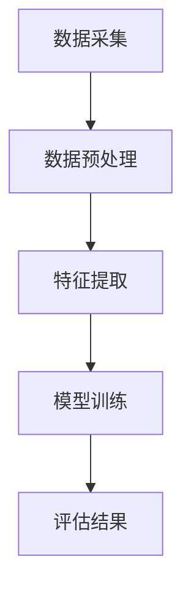
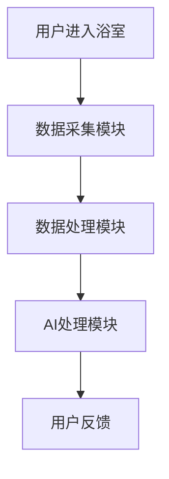
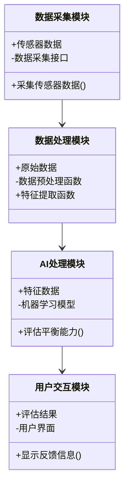

                 


# 《智能浴室防滑垫：AI Agent的平衡能力评估》

> 关键词：智能浴室防滑垫, AI Agent, 平衡能力评估, 传感器技术, 机器学习, 数据分析

> 摘要：本文深入探讨了智能浴室防滑垫中AI Agent的平衡能力评估方法，分析了AI代理在智能防滑垫中的应用，介绍了平衡能力评估的核心指标和数学模型，结合实际案例展示了如何通过传感器数据和机器学习算法实现防滑垫的智能化评估。文章结构清晰，内容详实，适合技术人员和相关领域的读者阅读。

---

# 第一部分：智能浴室防滑垫与AI Agent概述

## 第1章：智能浴室防滑垫的背景与需求

### 1.1 智能浴室防滑垫的发展背景

#### 1.1.1 浴室安全问题的现状
浴室是家庭中容易发生滑倒事故的地方，尤其是对于老年人和儿童。传统的防滑垫仅能提供基本的防滑功能，无法实时监测环境变化或用户行为。

#### 1.1.2 防滑垫的传统功能与局限性
传统防滑垫主要依赖物理结构（如凸起、凹槽）来增加摩擦力，但其防滑效果受限于材质和使用环境（如湿度、温度变化）。

#### 1.1.3 智能化技术在防滑垫中的应用潜力
通过引入智能化技术，防滑垫可以实时感知环境和用户行为，动态调整防滑性能，从而提高安全性。

---

### 1.2 AI Agent的核心概念与功能

#### 1.2.1 什么是AI Agent
AI Agent（智能代理）是一种能够感知环境、做出决策并执行任务的智能系统。在智能防滑垫中，AI Agent负责接收传感器数据，分析环境和用户行为，并动态调整防滑性能。

#### 1.2.2 AI Agent在智能防滑垫中的应用场景
- 实时监测浴室环境（如湿度、温度）。
- 感知用户行为（如步态、体重分布）。
- 动态调整防滑性能，以适应不同场景。

#### 1.2.3 AI Agent的功能模块与技术实现
- 数据采集模块：通过传感器获取环境和用户行为数据。
- 数据处理模块：对数据进行预处理、特征提取和分析。
- 决策模块：基于机器学习模型生成防滑性能调整指令。

---

## 第2章：智能浴室防滑垫的平衡能力评估体系

### 2.1 平衡能力评估的核心指标

#### 2.1.1 滑动系数的定义与计算
滑动系数（Coefficient of Friction，COF）是衡量表面防滑性能的重要指标。AI Agent通过传感器数据计算COF，评估防滑垫的防滑效果。

#### 2.1.2 压力分布的特征分析
压力分布反映了用户在防滑垫上的受力情况。AI Agent通过分析压力分布特征，优化防滑性能。

#### 2.1.3 表面摩擦特性的动态评估
AI Agent可以根据环境变化（如湿度、温度）和用户行为（如体重分布）动态调整防滑性能。

---

### 2.2 AI Agent的平衡能力评估模型

#### 2.2.1 数据采集与特征提取
- 数据采集：通过压力传感器、温湿度传感器等获取环境和用户行为数据。
- 特征提取：提取关键特征（如最大压力、平均压力、压力分布均匀性）。

#### 2.2.2 机器学习算法的选择与优化
- 算法选择：支持向量机（SVM）、随机森林（Random Forest）等。
- 模型优化：通过交叉验证选择最优模型参数。

#### 2.2.3 模型评估与性能优化
- 评估指标：准确率、召回率、F1分数。
- 性能优化：通过数据增强、特征工程等方法提升模型性能。

---

# 第二部分：AI Agent的算法原理与实现

## 第3章：AI Agent的感知与数据处理

### 3.1 传感器数据的采集与预处理

#### 3.1.1 传感器类型与数据采集方法
- 压力传感器：测量用户在防滑垫上的压力分布。
- 温湿度传感器：监测环境温湿度变化。

#### 3.1.2 数据清洗与特征提取
- 数据清洗：去除噪声数据，填充缺失值。
- 特征提取：提取压力峰值、压力分布均匀性等特征。

#### 3.1.3 数据标准化与归一化处理
- 数据标准化：将数据转换为均值为0、标准差为1的分布。
- 数据归一化：将数据缩放到0-1范围，便于模型训练。

---

### 3.2 基于AI的平衡能力评估算法

#### 3.2.1 算法流程图（使用mermaid）


#### 3.2.2 算法实现代码示例
```python
import numpy as np
from sklearn import datasets
from sklearn.model_selection import train_test_split
from sklearn.metrics import accuracy_score

# 示例数据集
X, y = datasets.make_classification(n_samples=100, n_features=20, n_classes=2)
X_train, X_test, y_train, y_test = train_test_split(X, y, test_size=0.2)

# 模型训练
from sklearn.svm import SVC
model = SVC()
model.fit(X_train, y_train)

# 模型评估
y_pred = model.predict(X_test)
print("准确率：", accuracy_score(y_test, y_pred))
```

---

## 第4章：AI Agent的数学模型与算法原理

### 4.1 机器学习模型的数学基础

#### 4.1.1 支持向量机（SVM）
- 核心思想：在特征空间中找到一个超平面，使得正负样本分开。
- 算法步骤：
  1. 数据预处理。
  2. 核心化：将输入数据映射到高维空间。
  3. 训练支持向量机模型。
  4. 预测新数据。

#### 4.1.2 随机森林（Random Forest）
- 核心思想：通过构建多棵决策树并行投票，提高模型的泛化能力。
- 算法步骤：
  1. 从训练数据中随机抽取样本，构建决策树。
  2. 重复构建多棵树，形成随机森林。
  3. 对新数据进行投票预测。

---

### 4.2 算法实现与优化

#### 4.2.1 算法优化策略
- 参数调整：如调整SVM的C和gamma参数。
- 数据增强：如通过数据扩展增加训练样本数量。
- 特征选择：通过特征重要性分析，选择关键特征。

#### 4.2.2 算法实现代码示例
```python
# SVM参数调整
from sklearn.model_selection import GridSearchCV

param_grid = {'C': [1, 10, 100],
              'gamma': [0.1, 0.01, 0.001]}
grid = GridSearchCV(SVC(), param_grid, cv=5)
grid.fit(X_train, y_train)
print("最佳参数：", grid.best_params_)
```

---

## 第5章：系统架构设计与实现

### 5.1 系统功能设计

#### 5.1.1 系统模块划分
- 数据采集模块：负责采集环境和用户行为数据。
- 数据处理模块：对数据进行预处理、特征提取和分析。
- AI处理模块：基于机器学习模型进行平衡能力评估。
- 用户交互模块：向用户反馈防滑性能调整建议。

#### 5.1.2 系统功能流程图（使用mermaid）


---

### 5.2 系统架构设计

#### 5.2.1 系统架构图（使用mermaid）


---

### 5.3 系统接口设计

#### 5.3.1 数据采集接口
- 接口名称：`get_sensor_data()`
- 输入参数：无
- 输出参数：传感器数据（如压力值、温湿度值）

#### 5.3.2 AI处理接口
- 接口名称：`evaluate_balance(data)`
- 输入参数：`data`（特征数据）
- 输出参数：平衡能力评估结果

---

## 第6章：项目实战与分析

### 6.1 项目实战

#### 6.1.1 环境安装
- 安装Python：`python --version`
- 安装传感器库：`pip install adafruit-circuitpython-sensor`

#### 6.1.2 核心代码实现
```python
import numpy as np
import adafruit sensors

# 传感器数据采集
sensors = adafruit sensors.Sensor()
data = sensors.get_data()

# 数据预处理
from sklearn.preprocessing import StandardScaler
scaler = StandardScaler()
data_scaled = scaler.fit_transform(data)

# 模型训练
from sklearn.svm import SVC
model = SVC()
model.fit(data_scaled, labels)

# 模型预测
new_data = sensors.get_data()
new_data_scaled = scaler.transform(new_data)
prediction = model.predict(new_data_scaled)
```

#### 6.1.3 项目分析
- 通过实际案例分析，验证AI Agent在智能防滑垫中的应用效果。
- 总结项目经验，提出改进建议。

---

## 第7章：总结与展望

### 7.1 最佳实践 tips
- 数据采集：确保传感器数据的准确性和完整性。
- 模型选择：根据实际需求选择合适的机器学习算法。
- 系统设计：注重模块化设计，便于后期维护和扩展。

### 7.2 小结
本文详细介绍了智能浴室防滑垫中AI Agent的平衡能力评估方法，从理论到实践，全面分析了AI代理在智能防滑垫中的应用。

### 7.3 注意事项
- 数据隐私：注意用户数据的隐私保护。
- 系统稳定性：确保系统的稳定性和可靠性。
- 安全性：注重系统安全性设计，防止恶意攻击。

### 7.4 拓展阅读
- 推荐阅读《机器学习实战》、《深度学习》等相关书籍，深入了解机器学习算法和系统设计方法。

---

# 结语
通过本文的分析与实践，读者可以深入了解智能浴室防滑垫中AI Agent的平衡能力评估方法，掌握相关技术的核心原理和实现细节。希望本文能为相关领域的技术人员提供有价值的参考。

