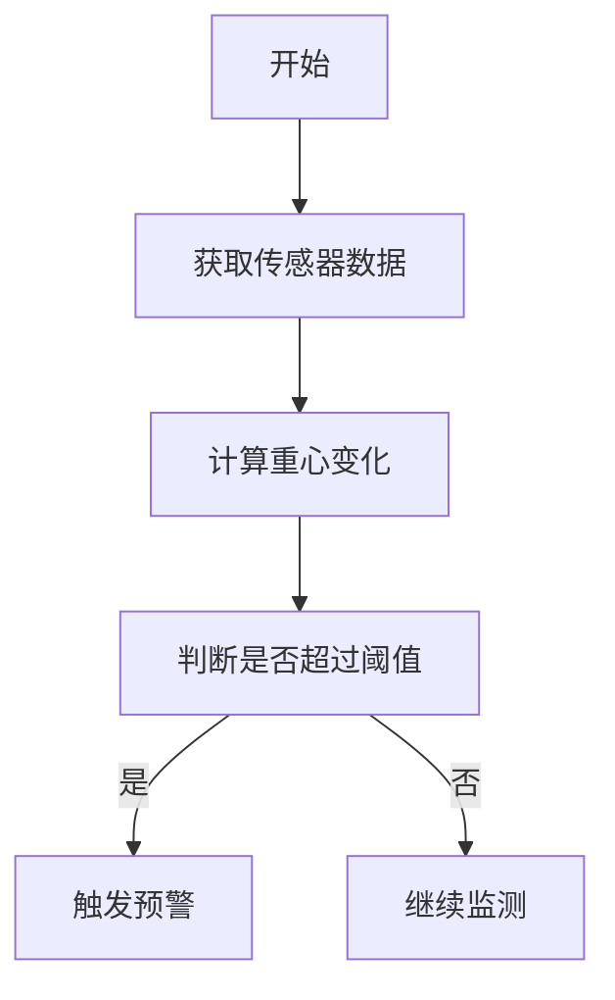
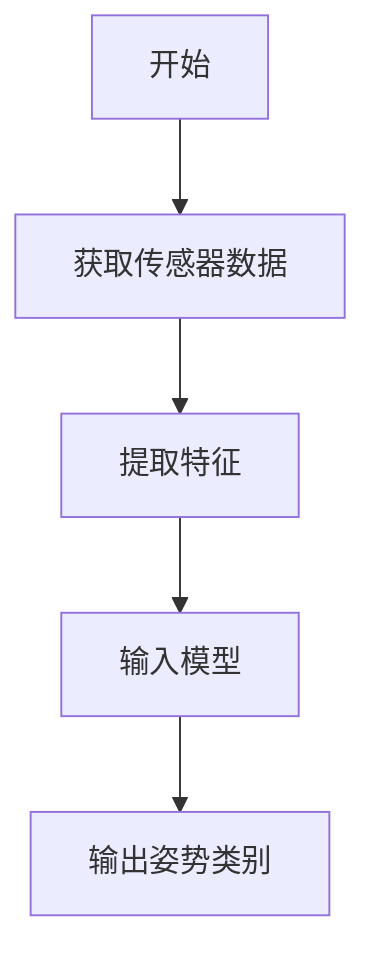
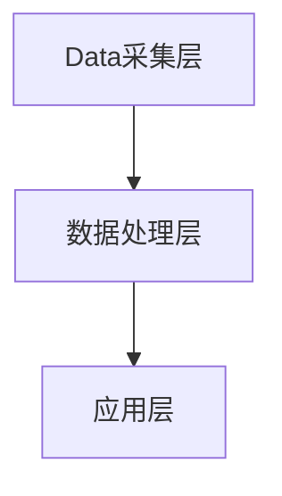

                 


# 智能浴室防滑垫：AI Agent的洗浴安全监护

> 关键词：智能浴室防滑垫，AI Agent，洗浴安全，人体姿态识别，滑动窗口检测，物联网传感器

> 摘要：本文探讨了智能浴室防滑垫的设计与实现，结合AI Agent技术，通过滑动窗口检测和人体姿态识别算法，实现对洗浴安全的实时监护。文章详细分析了系统架构、算法原理、项目实战及优化建议，为读者提供全面的技术解读。

---

# 第1章: 问题背景与需求分析

## 1.1 问题背景

浴室环境潮湿且地面滑，增加了跌倒的风险，尤其是对老人和儿童来说更为危险。传统防滑垫仅能提供基础防滑功能，缺乏主动监测和预警能力。

## 1.2 需求分析

- 实时监测用户的洗浴姿势和动作。
- 快速识别潜在危险动作并发出预警。
- 与智能家居系统联动，提升安全性。

---

# 第2章: AI Agent与防滑垫的核心概念

## 2.1 AI Agent的基本原理

AI Agent通过传感器数据和预设算法，实时分析用户动作，识别危险行为并触发预警机制。

## 2.2 防滑垫的物理特性

防滑垫采用高摩擦系数材料，表面设计防滑纹理，同时内置压力传感器和加速度传感器。

## 2.3 系统实体关系

```mermaid
erDiagram
    user {
        id
        name
    }
    sensor {
        id
        type
    }
    agent {
        id
        status
    }
    user --> sensor : 使用
    sensor --> agent : 传输数据
```

---

# 第3章: AI Agent的算法原理

## 3.1 滑动窗口检测算法

通过连续监测用户的重心变化，识别潜在的滑倒风险。

### 滑动窗口算法流程图



## 3.2 人体姿态识别算法

基于传感器数据，使用机器学习模型识别用户的姿势。

### 人体姿态识别流程图



---

# 第4章: 系统架构与设计

## 4.1 系统架构设计

采用分层架构，包括数据采集层、数据处理层和应用层。

### 系统架构图



---

# 第5章: 项目实战与实现

## 5.1 环境搭建

安装Python、传感器库和机器学习框架。

## 5.2 核心代码实现

### 滑动窗口检测代码

```python
import numpy as np

def sliding_window(data, window_size, step):
    windows = []
    for i in range(0, len(data), step):
        window = data[i:i+window_size]
        windows.append(window)
    return windows

# 示例数据
data = np.random.rand(100)
window_size = 10
step = 5
result = sliding_window(data, window_size, step)
print(result)
```

---

# 第6章: 总结与展望

## 6.1 项目总结

智能浴室防滑垫结合AI Agent技术，有效提升了洗浴安全，通过实时监测和预警，降低了跌倒风险。

## 6.2 未来展望

未来可进一步优化算法，集成更多传感器，提升系统的准确性和响应速度。

---

# 最佳实践与注意事项

- 定期更新传感器校准，确保数据准确性。
- 系统需与智能家居联动，提升用户体验。
- 加强数据隐私保护，确保用户信息安全。

---

# 结语

智能浴室防滑垫不仅是一个技术项目，更是对人们生活安全的守护。通过AI Agent和传感器技术的结合，我们能够为用户提供更安全、更智能的洗浴环境。

