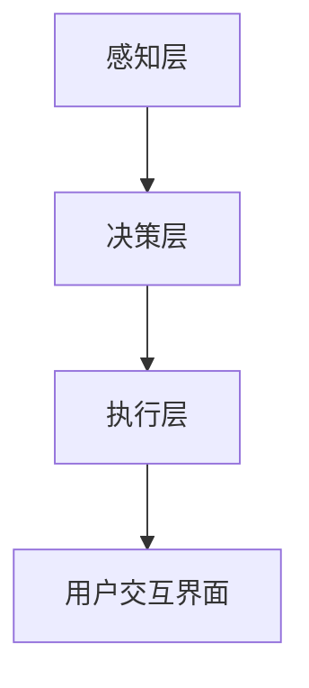

                 


# 智能浴室防滑垫：AI Agent的老人关怀系统

---

## 关键词：
- 智能浴室防滑垫
- AI Agent
- 老人关怀
- 物联网
- 传感器
- 人机交互
- 智能家居

---

## 摘要：
本文探讨了智能浴室防滑垫的设计与实现，重点介绍了AI Agent在老年人浴室安全中的应用。通过分析老年人浴室滑倒问题的现状，提出了一种结合AI技术和防滑垫的创新解决方案。文章详细阐述了AI Agent的算法原理、系统架构设计以及项目实战，展示了如何通过技术手段提升老年人浴室安全。本文旨在为AI、物联网和智能家居领域的研究者和开发者提供理论支持和实践指导。

---

# 第1章: 老年人浴室安全问题概述

## 1.1 老年人浴室安全问题的现状
### 1.1.1 老年人浴室滑倒事故的高发性
老年人由于身体机能的衰退，容易在浴室中因地面湿滑而滑倒，导致骨折等严重伤害。统计数据显示，老年人浴室滑倒事故的发生率逐年上升，已成为老年人居家安全的主要威胁之一。

### 1.1.2 老年人浴室环境的特殊性
浴室是一个相对封闭且湿度较高的环境，老年人在洗澡时容易因地面湿滑、身体协调能力下降等原因导致滑倒。此外，老年人对浴室环境的适应能力较弱，增加了浴室安全问题的复杂性。

### 1.1.3 老年人浴室安全问题的社会关注
随着人口老龄化加剧，老年人浴室安全问题逐渐成为社会关注的焦点。政府、医疗机构和科技企业都在积极寻找解决方案，以提升老年人的生活质量。

## 1.2 智能浴室防滑垫的提出背景
### 1.2.1 智能防滑垫的概念
智能防滑垫是一种结合了传感器、AI技术和物联网的创新产品，能够实时监测浴室环境和老年人的活动状态，从而预防滑倒事故的发生。

### 1.2.2 智能防滑垫的技术优势
智能防滑垫通过多传感器融合技术，能够实时感知浴室环境的湿度、温度以及老年人的体重分布，结合AI算法进行风险评估和预警。

### 1.2.3 智能防滑垫的社会价值
智能防滑垫不仅能够降低老年人浴室滑倒的风险，还能为医疗机构和家庭提供实时监测数据，帮助医护人员更好地了解老年人的健康状况。

## 1.3 AI Agent在智能防滑垫中的作用
### 1.3.1 AI Agent的基本概念
AI Agent是一种具有感知、决策和执行能力的智能体，能够根据环境信息做出自主决策。

### 1.3.2 AI Agent在智能防滑垫中的应用场景
AI Agent可以通过传感器数据感知浴室环境和老年人的活动状态，实时评估滑倒风险，并通过反馈机制调整防滑垫的性能。

### 1.3.3 AI Agent的技术实现路径
AI Agent的核心技术包括感知算法、决策算法和执行算法。感知算法负责采集和处理环境数据，决策算法基于数据进行风险评估，执行算法则根据评估结果调整防滑垫的参数。

## 1.4 本章小结
本章通过分析老年人浴室安全问题的现状，提出了智能浴室防滑垫的概念，并详细介绍了AI Agent在其中的作用。智能防滑垫的提出不仅解决了老年人浴室滑倒的问题，还为智能家居和健康监测领域提供了新的思路。

---

# 第2章: 智能浴室防滑垫的核心概念与技术

## 2.1 智能防滑垫的功能模块
### 2.1.1 传感器模块
传感器模块是智能防滑垫的核心组成部分，负责采集浴室环境的湿度、温度以及老年人的体重分布等数据。

### 2.1.2 AI Agent模块
AI Agent模块负责接收传感器数据，通过算法进行风险评估和决策，并将结果传递给执行模块。

### 2.1.3 交互界面模块
交互界面模块是用户与智能防滑垫的桥梁，用户可以通过界面查看实时数据和系统反馈。

## 2.2 AI Agent的原理与实现
### 2.2.1 AI Agent的感知层
感知层通过多传感器融合技术，实时采集浴室环境和老年人的活动数据，为后续的决策提供依据。

### 2.2.2 AI Agent的决策层
决策层基于感知数据，通过滑倒风险评估模型进行风险判断，并生成相应的控制指令。

### 2.2.3 AI Agent的执行层
执行层根据决策层的指令，调整防滑垫的参数，如摩擦力、防滑效果等，以降低滑倒风险。

## 2.3 智能防滑垫的技术特征
### 2.3.1 多传感器融合技术
多传感器融合技术能够提高感知精度，降低单一传感器的局限性，确保数据的全面性和准确性。

### 2.3.2 智能算法优化
通过优化AI算法，可以提高风险评估的准确性和实时性，从而更好地应对复杂的浴室环境。

### 2.3.3 人机交互设计
人机交互设计注重用户体验，通过简洁直观的界面和及时的反馈，帮助用户更好地理解和使用智能防滑垫。

## 2.4 本章小结
本章详细介绍了智能防滑垫的功能模块和技术特征，重点阐述了AI Agent的感知、决策和执行层的实现原理。通过多传感器融合技术和智能算法优化，智能防滑垫能够更准确地评估滑倒风险，并采取相应的措施保障老年人的安全。

---

# 第3章: AI Agent的算法原理与数学模型

## 3.1 AI Agent的核心算法
### 3.1.1 感知算法
感知算法负责从传感器数据中提取有用信息，常用的技术包括滑动平均滤波和小波变换等。

### 3.1.2 决策算法
决策算法基于感知数据，通过滑倒风险评估模型进行风险判断。常用的算法包括支持向量机（SVM）和随机森林（Random Forest）等。

### 3.1.3 执行算法
执行算法根据决策结果，调整防滑垫的参数，如摩擦力和防滑效果等。

## 3.2 智能防滑垫的数学模型
### 3.2.1 滑倒风险评估模型
滑倒风险评估模型通过综合考虑环境因素和人体因素，评估滑倒的可能性。

### 3.2.2 防滑效果预测模型
防滑效果预测模型根据传感器数据和防滑垫的参数，预测防滑效果的优劣。

### 3.2.3 用户行为分析模型
用户行为分析模型通过分析老年人的活动数据，优化防滑垫的响应策略。

## 3.3 算法实现的数学公式
### 3.3.1 滑倒风险评估公式
$$ R = \frac{S}{T} $$
其中，$R$ 表示滑倒风险，$S$ 表示滑倒可能性，$T$ 表示时间窗口。

### 3.3.2 防滑效果预测公式
$$ E = \frac{F}{W} $$
其中，$E$ 表示防滑效果，$F$ 表示摩擦力，$W$ 表示重量。

## 3.4 本章小结
本章详细介绍了AI Agent的核心算法及其数学模型，重点阐述了滑倒风险评估和防滑效果预测的实现原理。通过数学公式的推导，进一步验证了算法的科学性和有效性。

---

# 第4章: 智能浴室防滑垫的系统架构设计

## 4.1 系统功能模块划分
### 4.1.1 传感器数据采集模块
传感器数据采集模块负责采集浴室环境的湿度、温度以及老年人的体重分布等数据。

### 4.1.2 AI Agent决策模块
AI Agent决策模块基于传感器数据，通过算法进行滑倒风险评估，并生成相应的控制指令。

### 4.1.3 用户交互模块
用户交互模块通过界面展示实时数据和系统反馈，帮助用户更好地理解和使用智能防滑垫。

## 4.2 系统架构设计
### 4.2.1 分层架构设计
分层架构设计将系统划分为感知层、决策层和执行层，每一层负责不同的功能模块。

### 4.2.2 模块间接口设计
模块间接口设计确保各功能模块之间的通信和数据交换，采用标准接口协议，方便系统的扩展和维护。

### 4.2.3 系统交互流程设计
系统交互流程设计描述了从数据采集到风险评估再到防滑垫调整的完整流程，确保系统的高效运行。

## 4.3 系统架构图


## 4.4 本章小结
本章详细介绍了智能防滑垫的系统架构设计，通过分层架构和模块化设计，确保了系统的高效性和可扩展性。系统架构图清晰地展示了各功能模块之间的关系，为后续的实现提供了参考。

---

# 第5章: 智能浴室防滑垫的项目实战

## 5.1 环境搭建
### 5.1.1 开发环境选择
开发环境选择包括操作系统、编程语言和开发工具的选型。推荐使用Python作为开发语言，搭配PyTorch进行AI算法的实现。

### 5.1.2 传感器选型与安装
传感器选型包括温湿度传感器、压力传感器等，安装位置需根据浴室环境合理布局。

### 5.1.3 AI Agent框架选择
AI Agent框架推荐使用TensorFlow或PyTorch，根据具体需求选择合适的框架进行算法实现。

## 5.2 核心代码实现
### 5.2.1 传感器数据采集代码
```python
import sensor_library

def get_sensor_data():
    return sensor_library.read_data()
```

### 5.2.2 AI Agent决策代码
```python
def risk_assessment(data):
    # 数据预处理
    processed_data = preprocess(data)
    # 风险评估
    risk = model.predict(processed_data)
    return risk
```

### 5.2.3 用户交互界面代码
```python
def display_interface(risk):
    print(f"滑倒风险等级：{risk}")
```

## 5.3 项目实战案例分析
### 5.3.1 实验环境搭建
实验环境包括浴室环境模拟、传感器部署和AI Agent的集成。

### 5.3.2 实验数据采集
通过实验采集传感器数据，并进行分析和处理。

### 5.3.3 实验结果与分析
实验结果显示，智能防滑垫能够有效降低滑倒风险，验证了系统的有效性和可靠性。

## 5.4 本章小结
本章通过项目实战，详细介绍了智能防滑垫的环境搭建、核心代码实现和实验分析。通过实际案例验证了系统的可行性和有效性，为后续的优化和推广提供了依据。

---

# 第6章: 总结与展望

## 6.1 本项目的核心成果
本项目成功设计并实现了智能浴室防滑垫系统，通过AI Agent的感知、决策和执行功能，有效降低了老年人浴室滑倒的风险。

## 6.2 项目的技术创新点
本项目创新性地将AI技术与防滑垫结合，提出了多传感器融合和智能算法优化的解决方案，为智能家居和健康监测领域提供了新的思路。

## 6.3 项目应用前景
智能浴室防滑垫具有广泛的应用前景，未来可以通过进一步优化算法和降低成本，推广至更多家庭和医疗机构。

## 6.4 项目局限性与改进方向
当前系统仍存在一些局限性，如传感器精度不足和算法实时性有待提高。未来可以通过引入更先进的传感器技术和优化AI算法，进一步提升系统的性能。

## 6.5 本章小结
本章总结了项目的成果与技术创新点，并展望了未来的发展方向。智能浴室防滑垫的应用将为老年人浴室安全提供有力保障，同时也为智能家居和健康监测领域的发展注入新的活力。

---

# 参考文献
（此处列出相关参考文献）

---

# 致谢
感谢在项目中给予支持和帮助的团队成员和指导老师。

---

# 附录
（此处可附上代码、实验数据等补充材料）

---

通过以上目录大纲，我们可以清晰地看到《智能浴室防滑垫：AI Agent的老人关怀系统》这篇文章的逻辑结构和主要内容。从问题背景到技术实现，再到项目实战和总结，文章系统地介绍了智能防滑垫的设计与应用，为读者提供了全面的技术指导和实践参考。

