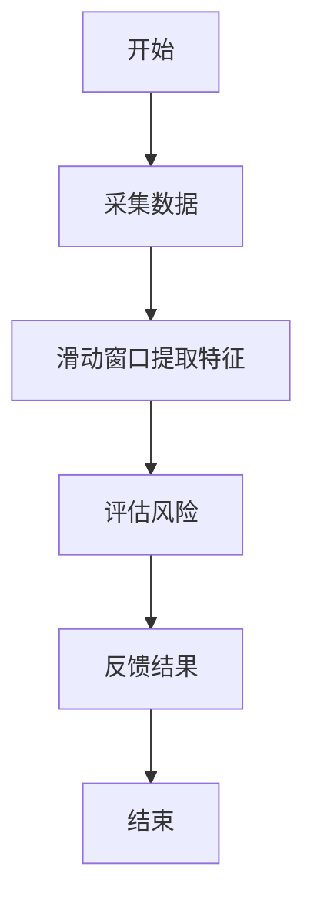
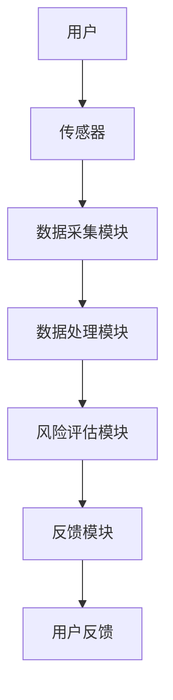

                 


# 智能浴室防滑垫：AI Agent的跌倒风险评估

**关键词**：AI Agent，跌倒风险，防滑垫，智能传感器，浴室安全

**摘要**：本文探讨了利用AI代理评估智能浴室防滑垫的跌倒风险。通过传感器数据和算法模型，实时监测并提供反馈，以降低跌倒风险。文章详细介绍了核心概念、算法原理、系统架构设计以及实际项目案例，为实现智能浴室防滑垫的跌倒风险评估提供了全面的技术指导。

---

## 第一部分: 背景介绍与问题定义

### 第1章: 智能浴室防滑垫与跌倒风险评估概述

#### 1.1 跌倒风险评估的重要性
跌倒是一种严重的健康问题，尤其是对老年人和儿童来说。浴室环境因其湿滑特性，是跌倒事故的高发区。防滑垫在浴室中的应用可以有效减少跌倒风险。

#### 1.2 智能防滑垫的背景与现状
传统防滑垫仅提供基本的防滑功能，无法实时监测环境变化。智能防滑垫结合了传感器技术，能够动态调整防滑性能，提供更安全的环境。

#### 1.3 AI Agent在跌倒风险评估中的应用
AI Agent通过实时采集和分析传感器数据，评估跌倒风险，并提供反馈。这种智能化的解决方案显著提高了防滑垫的安全性能。

---

## 第二部分: 核心概念与原理

### 第2章: 跌倒风险评估的核心概念

#### 2.1 跌倒风险评估的关键因素
- **行人行为特征**：步态、重心转移等。
- **地面摩擦系数**：影响防滑性能的关键因素。
- **环境因素**：湿滑程度、光线等。

#### 2.2 AI Agent的核心原理
- **传感器数据采集**：包括压力、温度、湿度等。
- **数据特征提取**：通过滑动窗口算法提取有用特征。
- **风险评估模型**：基于机器学习模型评估跌倒风险。

#### 2.3 智能防滑垫的物理特性
- **材料特性与摩擦系数**：不同材料对摩擦的影响。
- **防滑垫的形变特性**：形变如何影响防滑性能。
- **防滑垫的自适应能力**：根据环境变化调整防滑性能。

---

## 第三部分: 算法原理与数学模型

### 第3章: 跌倒风险评估算法原理

#### 3.1 滑动窗口算法
滑动窗口算法用于实时监测步态变化，识别潜在跌倒风险。以下是滑动窗口算法的流程图：



#### 3.2 风险评估模型
- **模型输入与输出**：输入传感器数据，输出跌倒风险等级。
- **模型训练与优化**：使用随机森林或神经网络进行训练。
- **模型评估与验证**：通过测试数据验证模型的准确性和可靠性。

#### 3.3 数学模型与公式
- 摩擦系数计算公式：
  $$ f = \mu N $$
  其中，\( \mu \) 是摩擦系数，\( N \) 是法向力。
- 跌倒风险评估公式：
  $$ R = \alpha f + \beta g $$
  其中，\( R \) 是跌倒风险，\( f \) 是摩擦系数，\( g \) 是环境因素，\( \alpha \) 和 \( \beta \) 是权重系数。

---

## 第四部分: 系统分析与架构设计

### 第4章: 智能浴室防滑垫系统架构

#### 4.1 问题场景介绍
浴室环境中的常见跌倒风险因素包括湿滑地面和老年人动作迟缓。实时监测和反馈是减少跌倒的关键。

#### 4.2 系统功能设计
- **数据采集模块**：收集压力、温度、湿度等数据。
- **数据处理模块**：使用滑动窗口算法提取特征。
- **风险评估模块**：基于模型评估跌倒风险。
- **反馈模块**：通过震动或灯光提醒用户。

#### 4.3 系统架构设计
以下是系统架构图：



#### 4.4 系统接口设计
- **系统交互序列图**：
  ```mermaid
  sequenceDiagram
      participant 用户
      participant 传感器
      participant 数据采集模块
      participant 数据处理模块
      participant 风险评估模块
      participant 反馈模块
      用户->传感器: 发送指令
      传感器->数据采集模块: 返回数据
      data采集模块->数据处理模块: 处理数据
      数据处理模块->风险评估模块: 评估风险
      风险评估模块->反馈模块: 发送反馈
      反馈模块->用户: 提供反馈
  ```

---

## 第五部分: 项目实战

### 第5章: 项目实现与案例分析

#### 5.1 环境安装
安装Python和必要的传感器库，配置开发环境。

#### 5.2 核心代码实现
以下是滑动窗口算法的Python代码示例：

```python
import numpy as np

def sliding_window(data, window_size):
    n = len(data)
    output = np.zeros(n - window_size + 1)
    for i in range(n - window_size + 1):
        output[i] = np.mean(data[i:i+window_size])
    return output

# 示例数据
data = np.array([1, 2, 3, 4, 5, 6, 7, 8, 9, 10])
window_size = 3

result = sliding_window(data, window_size)
print(result)
```

#### 5.3 案例分析
通过实际案例分析系统的运行过程，验证模型的准确性和响应速度。

---

## 第六部分: 优化与扩展

### 第6章: 系统优化与应用扩展

#### 6.1 算法优化
优化滑动窗口算法和风险评估模型，提高系统的实时性和准确性。

#### 6.2 应用扩展
将类似技术应用于医院、养老院等高风险环境，或与其他智能家居设备集成，实现更全面的跌倒预防系统。

---

## 第七部分: 总结与展望

### 第7章: 总结与未来展望

#### 7.1 全书总结
本文详细介绍了智能浴室防滑垫在跌倒风险评估中的关键技术和实现方法，展示了AI代理在提升安全性能中的重要作用。

#### 7.2 未来展望
未来，AI技术将在跌倒预防中发挥更大作用，如更智能的传感器和更精准的预测模型。研究方向包括提高算法的实时性和准确性，以及扩展应用场景。

---

### 注意事项

- **传感器数据的漂移问题**：需要定期校准传感器，或在算法中加入自适应机制。

### 最佳实践 Tips

- **数据预处理**：对数据进行标准化或归一化处理，提高模型的训练效率和准确性。

通过以上步骤，本文为实现智能浴室防滑垫的跌倒风险评估提供了全面的技术指导，帮助读者系统地理解和掌握相关知识。

