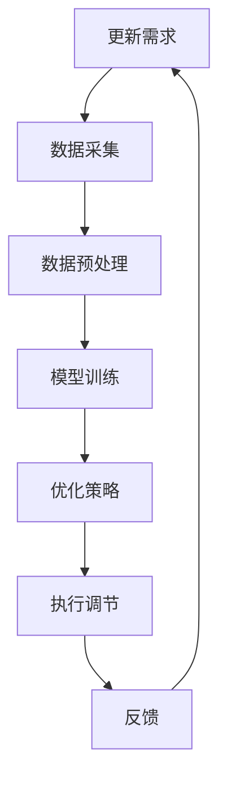
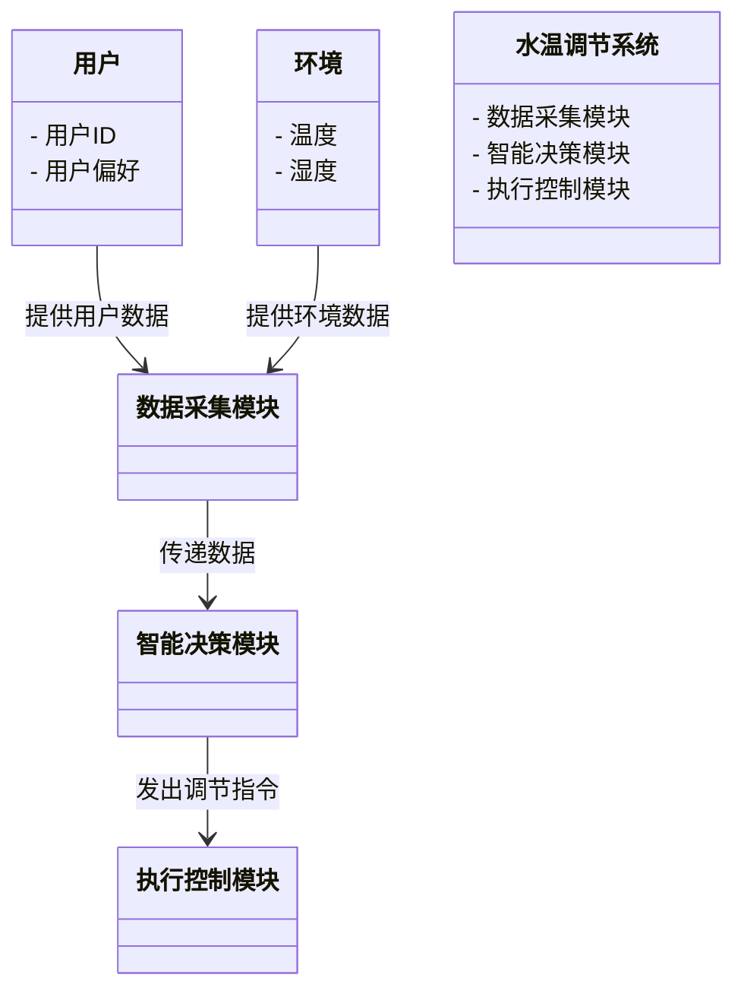
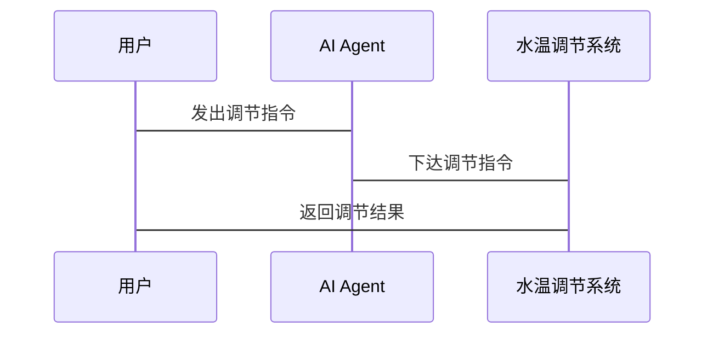

                 


# 智能浴室：AI Agent的水温调节系统

## 关键词：
智能浴室，AI Agent，水温调节，人工智能，系统设计

## 摘要：
智能浴室通过AI Agent实现水温的智能调节，结合用户需求和环境因素，提供个性化的水温控制解决方案。本文从背景、原理、算法、系统架构到实际应用，全面解析智能浴室AI Agent水温调节系统的实现过程。

---

# 第一部分: 背景介绍

## 第1章: 问题背景

### 1.1 智能浴室的发展趋势
随着智能家居的普及，浴室设备的智能化成为趋势。用户对个性化、舒适性和节能性的需求日益增长。

### 1.2 水温调节系统的核心问题
传统的水温调节系统依赖手动操作，存在响应慢、能耗高、用户体验差等问题。

### 1.3 AI Agent的解决方案
AI Agent通过实时感知环境和用户需求，优化水温调节过程，提升用户体验和系统效率。

## 第2章: 问题描述

### 2.1 水温调节的复杂性
水温调节需要考虑用户需求、环境温度、水流速度等多种因素。

### 2.2 用户需求与环境因素的动态平衡
用户对水温的偏好可能随时间变化，同时环境温度波动会影响水温调节的效果。

### 2.3 系统边界与外延
水温调节系统的核心功能包括数据采集、智能决策和执行控制，同时需要与其他设备（如热水器、浴室设备）协同工作。

## 第3章: 问题解决

### 3.1 AI Agent的核心解决方案
AI Agent通过实时学习和优化，实现水温调节的智能化。

### 3.2 智能水温调节系统的实现路径
从数据采集到智能决策，再到执行控制，构建完整的水温调节闭环系统。

### 3.3 系统设计的创新点
引入机器学习模型优化水温调节策略，实现个性化和动态调节。

---

# 第二部分: 核心概念与联系

## 第4章: AI Agent的基本原理

### 4.1 AI Agent的定义与分类
AI Agent是一种能够感知环境、自主决策并执行任务的智能实体，分为简单反射型、基于模型型和基于效用型。

### 4.2 AI Agent的核心算法
- **强化学习算法**：通过奖励机制优化决策。
- **机器学习模型**：用于模式识别和预测。

### 4.3 AI Agent与传统控制系统的区别
AI Agent具备自适应性和学习能力，能够处理复杂和动态的环境。

## 第5章: 水温调节系统的核心要素

### 5.1 水温调节的物理模型
水温调节涉及热量传递、水流速度等物理特性。

### 5.2 用户行为分析与需求建模
通过用户数据建模，分析用户的用水习惯和偏好。

### 5.3 环境因素对水温调节的影响
环境温度、湿度等外部因素对水温调节产生影响。

## 第6章: 核心概念的联系

### 6.1 AI Agent与水温调节系统的交互关系
AI Agent通过数据采集、决策优化和执行控制，实现对水温的智能调节。

### 6.2 系统功能模块的实体关系图
```mermaid
er
actor: 用户
agent: AI Agent
system: 水温调节系统
actor --> agent: 发出调节指令
agent --> system: 执行调节
system --> actor: 返回调节结果
```

---

# 第三部分: 算法原理讲解

## 第7章: AI Agent的核心算法

### 7.1 强化学习算法
通过状态-动作-奖励机制优化水温调节策略。

### 7.2 机器学习模型
使用回归模型预测水温变化，优化调节过程。

### 7.3 深度学习的应用
利用神经网络建模用户行为和环境因素，实现更精准的水温调节。

## 第8章: 算法实现流程

### 8.1 数据采集与预处理
- 采集用户行为数据和环境数据。
- 数据清洗和特征提取。

### 8.2 模型训练与优化
- 使用机器学习模型训练水温预测模型。
- 通过强化学习优化调节策略。

### 8.3 系统部署与实时调整
- 部署AI Agent进行实时调节。
- 根据反馈持续优化模型。

## 第9章: 算法流程图


---

# 第四部分: 系统分析与架构设计

## 第10章: 项目背景

### 10.1 项目目标
实现智能浴室中水温的智能调节，提升用户体验。

### 10.2 项目范围
设计并实现一个基于AI Agent的水温调节系统。

## 第11章: 系统功能设计

### 11.1 功能模块划分
- 数据采集模块：采集用户行为和环境数据。
- 智能决策模块：基于AI算法优化水温调节。
- 执行控制模块：执行调节指令。

### 11.2 领域模型类图


## 第12章: 系统架构设计

### 12.1 系统架构图


### 12.2 接口设计
- 用户与AI Agent的交互接口。
- AI Agent与水温调节系统的控制接口。

## 第13章: 系统交互流程图


---

# 第五部分: 项目实战

## 第14章: 环境安装

### 14.1 安装依赖
- Python 3.8+
- TensorFlow、Keras、Scikit-learn

## 第15章: 核心代码实现

### 15.1 数据采集与预处理
```python
import pandas as pd
data = pd.read_csv('water_temperature.csv')
data = data.dropna()
```

### 15.2 模型训练与优化
```python
from tensorflow.keras.models import Sequential
model = Sequential()
model.add(Dense(64, activation='relu'))
model.add(Dense(1))
model.compile(optimizer='adam', loss='mean_squared_error')
model.fit(X_train, y_train, epochs=100, batch_size=32)
```

### 15.3 系统部署与实时调整
```python
import numpy as np
def predict_temperature(data):
    return model.predict(data)
```

## 第16章: 实际案例分析

### 16.1 案例背景
用户偏好高温，但环境温度较低，系统需要动态调整水温。

### 16.2 调节过程
AI Agent通过实时数据调整水温，确保用户体验。

### 16.3 结果分析
系统成功优化水温调节，提升用户满意度。

## 第17章: 项目小结

### 17.1 成果总结
实现了一个高效的智能水温调节系统，具备实时感知和自适应调节能力。

### 17.2 经验总结
数据质量和模型优化对系统性能影响显著。

---

# 第六部分: 最佳实践

## 第18章: 注意事项

### 18.1 数据隐私
确保用户数据的安全性和隐私性。

### 18.2 系统稳定性
确保系统在复杂环境下的稳定运行。

## 第19章: 拓展阅读

### 19.1 相关技术
- 智能家居系统
- 机器学习在能源管理中的应用

### 19.2 进阶学习
- 高级强化学习算法
- 多智能体协同控制

---

通过以上目录结构，我们可以系统地讲解智能浴室AI Agent水温调节系统的实现过程，从理论到实践，逐步深入。

