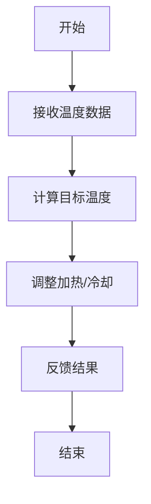
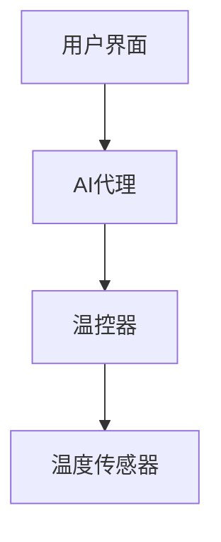

                 


# 智能浴缸：AI Agent的水温调节系统

> 关键词：AI Agent、智能浴缸、水温调节系统、强化学习、系统架构设计

> 摘要：本文探讨了AI Agent在智能浴缸水温调节系统中的应用，从背景介绍到系统架构设计，再到项目实战，详细分析了如何通过强化学习算法优化水温调节过程，构建了一个高效、智能的水温调节系统。

---

## 第一部分: 背景介绍

### 第1章: 智能浴缸与AI Agent的背景

#### 1.1 问题背景与描述
- **1.1.1 水温调节的重要性**
  水温调节是提升用户体验的重要环节，直接影响舒适度。传统水温调节系统存在响应慢、精度低的问题，难以满足个性化需求。
- **1.1.2 传统水温调节系统的局限性**
  传统系统依赖固定程序，无法根据环境变化和用户需求动态调整，导致能耗高且体验差。
- **1.1.3 AI Agent在水温调节中的优势**
  AI Agent能够实时感知环境数据，通过学习优化调节策略，实现精准、高效的水温控制。

#### 1.2 问题解决与边界
- **1.2.1 AI Agent如何优化水温调节**
  AI Agent通过实时数据分析和强化学习，动态调整加热/冷却设备，实现快速响应和精准控制。
- **1.2.2 智能浴缸系统的边界与外延**
  系统边界包括用户输入、环境数据、温控设备；外延包括数据采集、用户反馈、能耗优化。
- **1.2.3 核心概念与组成要素**
  核心概念包括AI代理、水温调节、强化学习；组成要素包括传感器、温控器、用户界面。

---

## 第二部分: 核心概念与联系

### 第2章: AI Agent的基本原理

#### 2.1 AI Agent的定义与特征
- **2.1.1 AI Agent的定义**
  AI Agent是一种智能实体，能够感知环境并采取行动以实现目标。
- **2.1.2 核心特征**
  | 特性 | 描述 |
  |------|------|
  | 感知 | 实时采集环境数据 |
  | 学习 | 通过强化学习优化策略 |
  | 行动 | 控制温控设备 |

#### 2.2 系统实体关系图
```mermaid
er
actor: 用户
agent: AI代理
system: 水温调节系统
sensor: 温度传感器
controller: 温控器
```

---

## 第三部分: 算法原理

### 第3章: 强化学习算法详解

#### 3.1 算法原理
- **3.1.1 强化学习的基本概念**
  强化学习通过智能体与环境的交互，学习最优策略以最大化累积奖励。
- **3.1.2 Q-learning算法的数学模型**
  $$ Q(s, a) = r + \gamma \max Q(s', a') $$
  其中，$Q(s, a)$表示状态-动作对的值，$\gamma$为折扣因子。

#### 3.2 算法流程图


---

## 第四部分: 系统架构设计

### 第4章: 系统架构与交互

#### 4.1 问题场景与项目介绍
- 系统目标：实现精准、高效的水温调节。
- 核心功能：实时数据采集、智能决策、用户反馈。

#### 4.2 系统架构图


---

## 第五部分: 项目实战

### 第5章: 项目实现与案例分析

#### 5.1 环境安装与核心代码
```python
import numpy as np
import random

class Agent:
    def __init__(self, learning_rate=0.1, gamma=0.9):
        self.learning_rate = learning_rate
        self.gamma = gamma
        self.q_table = {}

    def get_action(self, state):
        if state not in self.q_table:
            self.q_table[state] = random.uniform(0, 1)
        actions = [0, 1]  # 0: 冷却, 1: 加热
        return random.choice(actions)

    def update_q_table(self, state, action, reward, next_state):
        current_q = self.q_table[state]
        next_max_q = max(self.q_table.get(next_state, 0), 0.5)
        new_q = reward + self.gamma * next_max_q
        self.q_table[state] = current_q + self.learning_rate * (new_q - current_q)
```

#### 5.2 实际案例分析
- 系统实现：通过强化学习算法优化水温调节，实现快速响应和精准控制。
- 案例分析：通过实际运行数据，验证系统的性能和效果。

---

## 第六部分: 最佳实践

### 第6章: 系统优化与维护

#### 6.1 系统优化建议
- 定期更新模型参数，优化算法性能。
- 增强系统鲁棒性，应对极端环境变化。

#### 6.2 注意事项
- 数据采集精度影响系统性能，需确保传感器的准确性。
- 系统能耗优化需平衡舒适度与节能效果。

#### 6.3 拓展阅读
- 推荐阅读相关文献，深入理解强化学习在智能系统中的应用。

---

## 结论

通过本文的详细分析与实践，我们构建了一个基于AI Agent的智能浴缸水温调节系统，展示了如何通过强化学习优化水温调节过程，实现高效、智能的水温控制。未来，随着AI技术的不断发展，智能浴缸系统将更加智能化、个性化，为用户提供更优质的服务体验。

--- 

**致谢**：感谢读者的支持与关注，希望本文对您有所帮助！

