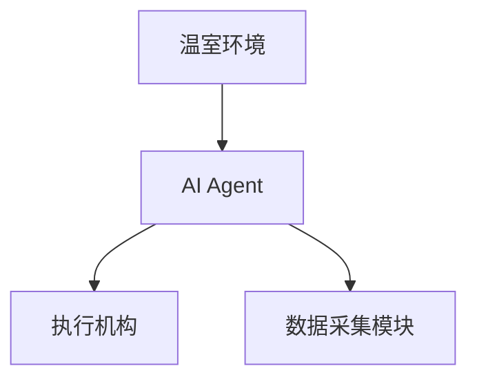
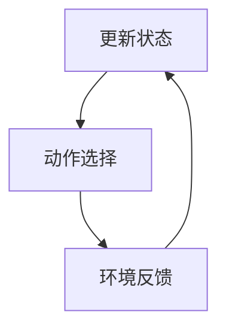
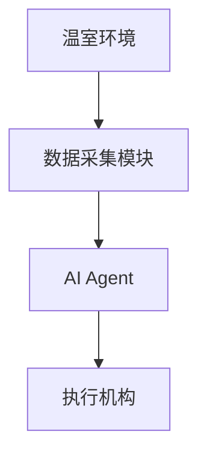
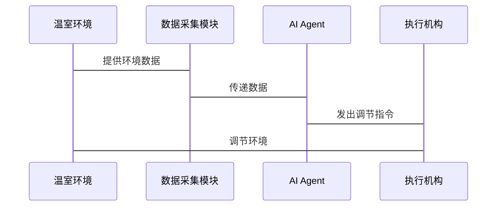

                 


# 智能温室：AI Agent的环境调节系统

## 关键词：智能温室，AI Agent，环境调节，强化学习，数学建模，系统设计

## 摘要：本文深入探讨了AI Agent在智能温室环境调节中的应用，分析了AI Agent的核心概念、算法原理、系统设计，并通过实际案例展示了其在智能温室中的应用。文章从背景介绍到系统实现，层层深入，为读者提供了全面的技术解析。

---

## 第一部分：智能温室与AI Agent的背景与概念

### 第1章：智能温室与AI Agent概述

#### 1.1 智能温室的发展背景
- **传统温室的局限性**  
  传统温室依赖人工管理，存在效率低、资源浪费、环境不稳定等问题。例如，温度和湿度的控制往往依赖经验，难以精确调节，导致作物生长不一致。
  
- **智能化温室的定义与特点**  
  智能化温室通过物联网、大数据和人工智能技术，实现环境的自动感知、分析和调节，从而提高作物产量和质量。

- **AI Agent在智能温室中的作用**  
  AI Agent作为智能温室的核心，能够实时感知环境变化，做出最优决策，并通过执行机构调整环境参数，实现智能化管理。

#### 1.2 AI Agent的基本概念
- **什么是AI Agent**  
  AI Agent（人工智能代理）是一种能够感知环境、自主决策并执行任务的智能实体。它能够根据环境反馈不断优化行为，以实现目标。

- **AI Agent的核心属性与特征**  
  - **自主性**：无需外部干预，自主完成任务。
  - **反应性**：能够实时感知环境并做出反应。
  - **目标导向**：基于目标进行决策和行动。

- **AI Agent与传统自动控制系统的区别**  
  传统控制系统依赖预设规则，而AI Agent能够学习和适应环境，具有更强的灵活性和自适应能力。

#### 1.3 智能温室与AI Agent的结合
- **智能温室的环境调节需求**  
  温室环境包括温度、湿度、光照、CO2浓度等，这些参数需要精确控制以满足作物生长需求。

- **AI Agent在环境调节中的应用**  
  AI Agent通过感知环境数据，利用强化学习等算法优化决策，实现对温度、湿度等参数的精准调节。

- **系统的边界与外延**  
  系统边界包括温室环境、数据采集模块、AI Agent决策模块和执行机构。外延部分涉及能源管理、作物生长监测等扩展功能。

#### 1.4 本章小结
本章介绍了智能温室的发展背景，详细解释了AI Agent的概念和特点，并分析了其在智能温室环境调节中的作用。

---

## 第二部分：AI Agent的环境调节系统核心概念与原理

### 第2章：AI Agent的环境调节系统核心概念

#### 2.1 系统核心要素分析
- **温室环境要素**  
  温度、湿度、光照、CO2浓度等是温室环境调节的主要参数。

- **AI Agent的感知与决策机制**  
  - **感知模块**：通过传感器获取环境数据。
  - **决策模块**：基于感知数据，利用算法做出调节决策。

- **系统的输入输出关系**  
  输入：环境数据（温度、湿度等）；输出：控制指令（开启/关闭设备）。

#### 2.2 核心概念对比分析
- **感知模块 vs 决策模块**  
  感知模块负责数据采集，决策模块负责数据分析和决策制定。

- **环境调节 vs 自动控制**  
  自动控制依赖固定规则，而环境调节基于动态优化。

- **离散动作 vs 连续动作**  
  离散动作：开关设备；连续动作：调节设备参数。

#### 2.3 实体关系图（ER图）


#### 2.4 本章小结
本章分析了智能温室AI Agent系统的核心要素，对比了相关概念，并通过实体关系图展示了系统的结构。

---

## 第三部分：AI Agent环境调节系统的算法原理

### 第3章：AI Agent的环境调节算法

#### 3.1 强化学习算法原理
- **强化学习的基本概念**  
  强化学习是一种通过试错学习的方法，AI Agent通过与环境交互，获得奖励或惩罚，从而优化行为策略。

- **状态空间与动作空间**  
  - **状态空间**：环境的所有可能状态。
  - **动作空间**：AI Agent可以执行的所有动作。

- **奖励机制与策略优化**  
  奖励机制定义了AI Agent行为的优劣，策略优化的目标是最大化累积奖励。

#### 3.2 算法流程图（强化学习）


#### 3.3 数学模型与公式
- **状态**：用s表示当前状态。
- **动作**：用a表示执行的动作。
- **奖励**：用r表示获得的奖励。
- **价值函数**：Q(s, a)表示在状态s下执行动作a的期望奖励。

$$ Q(s, a) = r + \gamma \max_{a'} Q(s', a') $$

其中，γ是折扣因子，0 < γ ≤ 1。

---

## 第四部分：系统分析与架构设计

### 第4章：系统分析与架构设计

#### 4.1 系统分析
- **问题场景介绍**  
  温室环境复杂多变，作物生长对环境要求高，需要实时调节。

- **系统功能设计**  
  - 数据采集模块：采集温度、湿度等数据。
  - AI Agent决策模块：基于数据做出调节决策。
  - 执行机构：执行决策指令。

#### 4.2 系统架构设计
- **系统架构图**


- **系统交互序列图**


#### 4.3 系统实现
- **环境安装**  
  需要安装温度传感器、湿度传感器等设备。

- **核心代码实现**  
  ```python
  def perceive_environment():
      # 获取环境数据
      temperature = get_temperature()
      humidity = get_humidity()
      return temperature, humidity

  def decide_action(temperature, humidity):
      # 基于强化学习算法做出决策
      if temperature > 30 or humidity < 50:
          return 'adjust_humidity'
      else:
          return 'no_action'

  def execute_action(action):
      # 执行调节指令
      if action == 'adjust_humidity':
          adjust_humidity_level()
  ```

---

## 第五部分：项目实战与总结

### 第5章：项目实战

#### 5.1 环境安装
- 安装传感器和执行机构，确保数据采集和设备控制的准确性。

#### 5.2 核心代码实现
- 使用强化学习算法实现AI Agent的决策逻辑。

#### 5.3 实际案例分析
- 通过实际案例展示系统在不同环境条件下的调节效果。

---

## 第六部分：总结与展望

### 第6章：总结与展望

#### 6.1 最佳实践 tips
- 数据采集要准确，算法要不断优化。
- 系统要具备灵活性，适应不同作物的需求。

#### 6.2 小结
本文详细介绍了AI Agent在智能温室环境调节中的应用，从理论到实践，全面分析了系统的实现过程。

#### 6.3 注意事项
- 系统的安全性要保证，防止数据泄露。
- 系统的可扩展性要强，便于后续功能的添加。

#### 6.4 拓展阅读
- 推荐阅读《强化学习入门》和《智能控制系统设计》。

---

## 结语
通过本文的详细分析，读者可以深入了解AI Agent在智能温室环境调节中的应用，掌握系统的实现方法，并为未来的优化和扩展提供参考。

