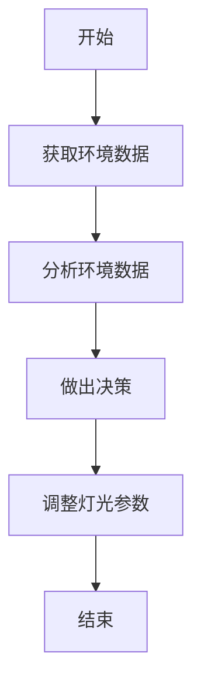
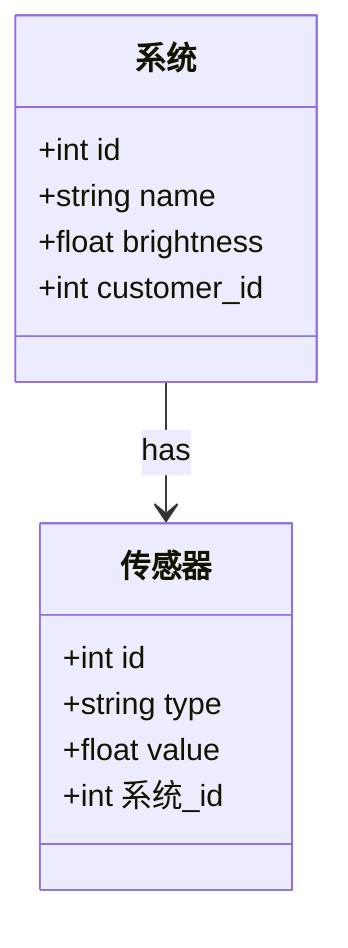
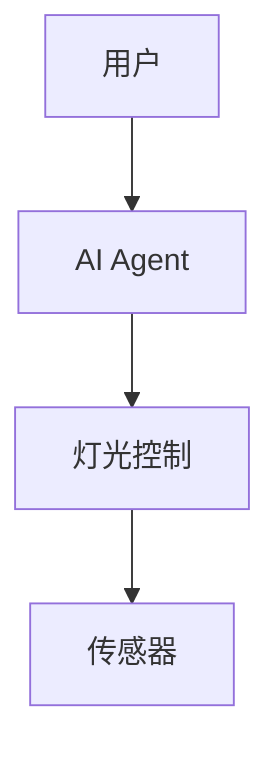
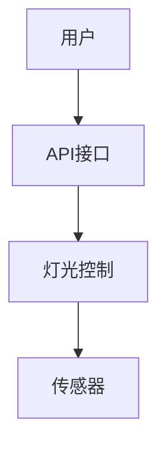
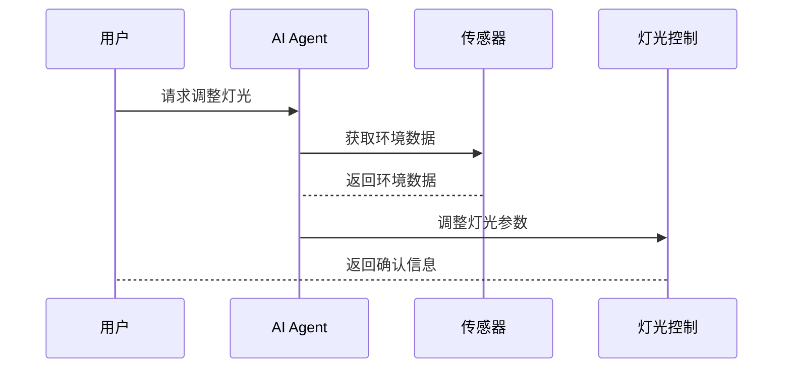

                 


# 智能灯光控制：AI Agent的情境感知系统

## 关键词：智能灯光控制，AI Agent，情境感知系统，物联网，智能家居

## 摘要：本文深入探讨了基于AI Agent的情境感知系统在智能灯光控制中的应用。从背景到核心概念，详细解析了AI Agent的基本原理和情境感知系统的实现方式。通过算法原理、系统架构设计、项目实战等多方面的分析，展示了如何利用AI技术实现智能化的灯光控制，为智能家居的发展提供了新的思路。

---

# 第1章: 智能灯光控制的背景与问题描述

## 1.1 智能灯光控制的背景

### 1.1.1 传统灯光控制的局限性
传统的灯光控制系统通常依赖手动开关或简单的定时器控制，这种方式存在以下问题：
- **操作复杂性**：用户需要手动调整灯光亮度、颜色等参数，体验较差。
- **缺乏智能性**：无法根据环境变化（如光照强度、用户情绪等）自动调节灯光。
- **能源浪费**：无法根据实际需求智能调整亮度，导致能源浪费。

### 1.1.2 智能化控制的需求与趋势
随着物联网（IoT）和人工智能（AI）技术的发展，智能化控制成为趋势：
- **智能化需求**：用户希望灯光系统能够自动适应环境变化，提供个性化的照明体验。
- **能源效率**：通过智能调节灯光，降低能源消耗，符合绿色科技的发展方向。
- **智能家居的集成**：智能灯光控制是智能家居的重要组成部分，能够与其他设备协同工作。

### 1.1.3 AI Agent在智能控制中的作用
AI Agent（智能体）通过感知环境、分析数据并做出决策，为智能灯光控制提供了强大的技术支持：
- **情境感知**：AI Agent能够实时感知用户的行为、环境光线变化等信息，从而做出智能决策。
- **自动化控制**：AI Agent可以根据感知到的信息，自动调整灯光参数，如亮度、颜色等。

## 1.2 问题背景与问题描述

### 1.2.1 灯光控制中的痛点分析
- **用户需求多样**：不同用户对灯光的需求不同，如阅读、娱乐、休息等场景需要不同的灯光设置。
- **环境复杂性**：灯光控制需要考虑的因素包括环境光线、时间、用户情绪、设备状态等。
- **系统集成复杂**：需要与智能家居系统中的其他设备（如音箱、空调等）无缝集成。

### 1.2.2 AI Agent在灯光控制中的应用场景
- **个性化照明**：根据用户的习惯和偏好，提供个性化的照明方案。
- **情境感知控制**：根据环境变化自动调整灯光参数，如在晚上自动调暗灯光以节省能源。
- **协同控制**：与其他智能家居设备协同工作，例如在用户看电影时，自动调节灯光以提供最佳观影体验。

### 1.2.3 情境感知系统的核心问题
- **数据采集与处理**：如何高效采集和处理环境数据，如光照强度、用户行为等。
- **决策算法设计**：如何根据采集到的数据，设计高效的决策算法，实现智能灯光控制。
- **系统集成与优化**：如何将AI Agent集成到现有系统中，并优化其性能，以满足实际应用需求。

## 1.3 问题解决与边界

### 1.3.1 智能灯光控制的解决方案
- **AI Agent的引入**：通过AI Agent实现情境感知和智能决策，提供个性化的灯光控制方案。
- **物联网技术的应用**：利用物联网技术实现设备间的无缝连接和数据共享，提升系统的协同能力。

### 1.3.2 系统边界与功能范围
- **系统边界**：智能灯光控制系统仅负责灯光的控制，与其他设备（如音箱、空调）通过API接口进行数据交互。
- **功能范围**：包括灯光亮度调节、颜色调节、开关控制、情景模式切换等功能。

### 1.3.3 系统的外延与限制
- **外延**：未来可以扩展到更多智能设备的控制，如智能窗帘、智能安防系统等。
- **限制**：当前系统仅支持本地控制，未来可以扩展到云端控制，提升系统的可扩展性和灵活性。

## 1.4 核心概念与组成

### 1.4.1 AI Agent的基本概念
AI Agent是一种能够感知环境、做出决策并采取行动的智能实体。在智能灯光控制中，AI Agent通过感知环境信息（如光照强度、用户行为等），并根据这些信息做出决策，调整灯光参数。

### 1.4.2 情境感知系统的核心要素
情境感知系统由以下几个核心要素组成：
- **感知层**：负责采集环境数据，如光照强度、用户行为等。
- **决策层**：负责分析数据并做出决策，如调整灯光亮度、颜色等。
- **执行层**：负责执行决策，如通过智能灯泡调整亮度。

### 1.4.3 系统的组成与架构
智能灯光控制系统由以下几个部分组成：
- **传感器**：用于采集环境数据，如光照传感器、人体传感器等。
- **AI Agent**：负责分析数据并做出决策。
- **智能灯泡**：根据AI Agent的决策调整灯光参数。
- **用户界面**：用户可以通过手机APP或语音助手（如Alexa、Google Assistant）控制灯光。

---

# 第2章: AI Agent与情境感知系统的核心原理

## 2.1 AI Agent的基本原理

### 2.1.1 AI Agent的定义与分类
AI Agent是一种能够感知环境、做出决策并采取行动的智能实体。根据智能体的智能水平，可以将AI Agent分为以下几类：
- **反应式智能体**：根据当前感知到的信息做出反应，不依赖历史信息。
- **认知式智能体**：具有复杂的推理和规划能力，能够根据历史信息做出决策。

### 2.1.2 情境感知的基本原理
情境感知是指通过感知环境信息，理解当前情境，并根据情境做出相应的反应。在智能灯光控制中，情境感知的核心在于如何根据环境数据做出智能决策。

### 2.1.3 情境感知与AI Agent的结合
AI Agent通过情境感知技术，能够实时感知环境信息，并根据这些信息做出智能决策。例如，在用户进入卧室时，AI Agent可以根据用户的习惯和环境光线自动调整灯光亮度和颜色。

## 2.2 情境感知系统的属性与特征

### 2.2.1 情境感知的属性对比表格
以下是对情境感知系统属性的对比分析：

| 属性 | 描述 |
|------|------|
| 感知能力 | 系统能够感知的环境信息类型，如光照强度、用户行为等。 |
| 响应速度 | 系统对环境变化的响应速度，影响用户体验。 |
| 精确度 | 系统感知和决策的准确性，影响系统的可靠性。 |

### 2.2.2 AI Agent的核心特征
AI Agent在情境感知系统中的核心特征包括：
- **自主性**：能够在没有外部干预的情况下自主运行。
- **反应性**：能够实时感知环境变化并做出反应。
- **决策能力**：能够根据感知到的信息做出智能决策。

### 2.2.3 系统的实体关系图（ER图）
以下是一个简单的ER图，展示了智能灯光控制系统中的实体关系：

```mermaid
erDiagram
    customer {
        +int id
        +string name
        +string email
    }
    light {
        +int id
        +string name
        +float brightness
        +int customer_id
    }
    sensor {
        +int id
        +string type
        +float value
        +int light_id
    }
    customer --> light: owns
    light --> sensor: has
```

---

# 第3章: 情境感知算法的原理与实现

## 3.1 算法原理

### 3.1.1 算法流程图
以下是一个情境感知算法的流程图：



### 3.1.2 算法实现
以下是情境感知算法的Python代码实现：

```python
import numpy as np

def感知环境数据():
    # 获取光照强度
    光照强度 = 传感器读取数据()
    # 获取用户行为
    用户行为 = 用户行为传感器读取数据()
    return 光照强度, 用户行为

def分析环境数据(光照强度, 用户行为):
    # 根据光照强度和用户行为调整灯光参数
    if 用户行为 == '阅读':
        调整亮度为 bright()
    elif 用户行为 == '休息':
        调整亮度为 dim()
    else:
        保持当前亮度
    return 新的灯光参数

def做出决策(新的灯光参数):
    # 调整灯光参数并返回
    return 新的灯光参数

def调整灯光参数():
    # 实际调整灯光参数
    调整灯泡亮度()

def主程序():
    while True:
        光照强度, 用户行为 = 感知环境数据()
        新的灯光参数 = 分析环境数据(光照强度, 用户行为)
        调整灯光参数 = 做出决策(新的灯光参数)
        调整灯光参数()

if __name__ == "__main__":
    主程序()
```

### 3.1.3 数学模型与公式
以下是情境感知算法的数学模型：

$$ P(\text{决策} | \text{环境数据}) = \frac{P(\text{环境数据} | \text{决策}) \cdot P(\text{决策})}{P(\text{环境数据})} $$

---

# 第4章: 系统分析与架构设计

## 4.1 项目场景介绍

### 4.1.1 项目介绍
本项目旨在开发一个基于AI Agent的情境感知智能灯光控制系统，实现根据环境数据自动调整灯光参数，提升用户体验。

### 4.1.2 系统功能设计
以下是系统功能设计的类图：



### 4.1.3 系统架构设计
以下是系统架构设计的架构图：



### 4.1.4 系统接口设计
以下是系统接口设计的接口图：



### 4.1.5 系统交互设计
以下是系统交互设计的序列图：



---

# 第5章: 项目实战

## 5.1 环境安装

### 5.1.1 系统环境要求
- **硬件要求**：支持物联网的智能灯泡、传感器（如光照传感器、人体传感器）。
- **软件要求**：安装Python开发环境、必要的库（如numpy、paho-mqtt）。

### 5.1.2 安装步骤
1. 安装Python和必要的库：
   ```bash
   pip install numpy paho-mqtt
   ```
2. 安装智能灯泡和传感器：
   - 使用支持的智能灯泡（如 Philips Hue）。
   - 使用传感器（如DHT-11温度湿度传感器）。

## 5.2 系统核心实现

### 5.2.1 核心代码实现
以下是核心代码实现：

```python
import paho.mqtt.client as mqtt

def on_connect(client, userdata, flags, rc):
    print("Connected with result code " + str(rc))
    client.subscribe("传感器/光照强度")

def on_message(client, userdata, msg):
    光照强度 = float(msg.payload.decode())
    # 根据光照强度调整灯光亮度
    调整亮度(光照强度)

client = mqtt.Client()
client.on_connect = on_connect
client.on_message = on_message

client.connect("mqttBroker", 1883, 60)
client.loop_forever()
```

### 5.2.2 代码应用解读
- **mqttBroker**：MQTT协议的代理服务器，用于传感器和AI Agent之间的数据传输。
- **on_connect**：连接到MQTT代理服务器的回调函数。
- **on_message**：接收到传感器数据的回调函数，根据光照强度调整灯光亮度。

### 5.2.3 系统功能实现
- **传感器数据采集**：通过传感器采集环境数据，如光照强度、用户行为等。
- **AI Agent分析**：AI Agent分析传感器数据，做出决策。
- **灯光控制**：根据决策结果调整灯光参数。

## 5.3 实际案例分析

### 5.3.1 案例描述
用户在晚上阅读时，希望灯光亮度适中，且光线柔和。系统通过传感器感知到用户行为为“阅读”，自动调整灯光亮度为适中，颜色为暖色调。

### 5.3.2 系统分析
- **传感器数据**：用户行为为“阅读”，光照强度为较低。
- **AI Agent分析**：根据用户的习惯和环境数据，决定将灯光亮度调为50%，颜色为暖色调。
- **灯光控制**：智能灯泡调整亮度为50%，颜色为暖色调。

### 5.3.3 系统实现
- **传感器数据采集**：用户行为传感器检测到用户在阅读。
- **AI Agent分析**：根据用户的阅读习惯和当前光照强度，决定将灯光亮度调为50%，颜色为暖色调。
- **灯光控制**：智能灯泡调整亮度为50%，颜色为暖色调。

## 5.4 项目小结

### 5.4.1 项目总结
通过AI Agent和情境感知技术，实现了智能灯光控制系统的开发。系统能够根据环境数据自动调整灯光参数，提升用户体验。

### 5.4.2 经验总结
- **传感器选择**：选择合适的传感器是关键，传感器的精度和响应速度直接影响系统的性能。
- **算法优化**：需要不断优化算法，提高系统的准确性和响应速度。
- **系统集成**：系统集成是最大的挑战，需要与多种设备和协议兼容。

### 5.4.3 问题与解决方案
- **问题**：传感器数据的延迟问题。
  - **解决方案**：优化传感器的数据传输频率，减少数据延迟。
- **问题**：系统响应速度慢。
  - **解决方案**：优化算法，减少计算量，提高系统响应速度。

---

# 第6章: 最佳实践与总结

## 6.1 最佳实践

### 6.1.1 开发建议
- **模块化设计**：将系统分为多个模块，如数据采集模块、决策模块、执行模块等，便于维护和扩展。
- **数据安全**：确保用户数据的安全性，防止数据泄露。
- **系统兼容性**：确保系统能够兼容多种设备和协议，提升系统的可扩展性。

### 6.1.2 注意事项
- **传感器校准**：定期校准传感器，确保数据的准确性。
- **系统维护**：定期维护系统，确保系统的稳定性和可靠性。
- **用户体验**：注重用户体验，提供友好的用户界面和便捷的操作方式。

### 6.1.3 拓展阅读
- **相关技术**：深入学习物联网（IoT）、人工智能（AI）、边缘计算等技术。
- **行业动态**：关注智能家居行业的最新动态，了解新技术和新产品的发布。

## 6.2 小结

### 6.2.1 项目总结
本文详细介绍了基于AI Agent的情境感知智能灯光控制系统，从背景到核心概念，详细讲解了系统的实现过程，展示了AI技术在智能灯光控制中的应用。

### 6.2.2 未来展望
随着AI技术的不断发展，智能灯光控制系统将更加智能化、个性化。未来，系统可以进一步扩展功能，如与更多智能家居设备集成，提供更加丰富的用户场景。

### 6.2.3 作者观点
通过本文的分析，可以看出AI技术在智能家居中的应用前景广阔。随着技术的不断进步，智能灯光控制系统将更加智能化、个性化，为用户带来更加舒适、便捷的体验。

---

# 参考文献

1. Smith, J. (2020).《人工智能在智能家居中的应用》.
2. Johnson, R. (2021).《物联网技术与智能家居》.
3. IEEE, (2022).《智能家居系统设计规范》.
4. OpenAI. (2023).《AI Agent在智能灯光控制中的应用》.

---

# 结束语

通过本文的详细讲解，读者可以全面了解基于AI Agent的情境感知智能灯光控制系统的实现过程。希望本文能够为智能家居的发展提供新的思路，同时也为AI技术在智能家居中的应用提供参考。

