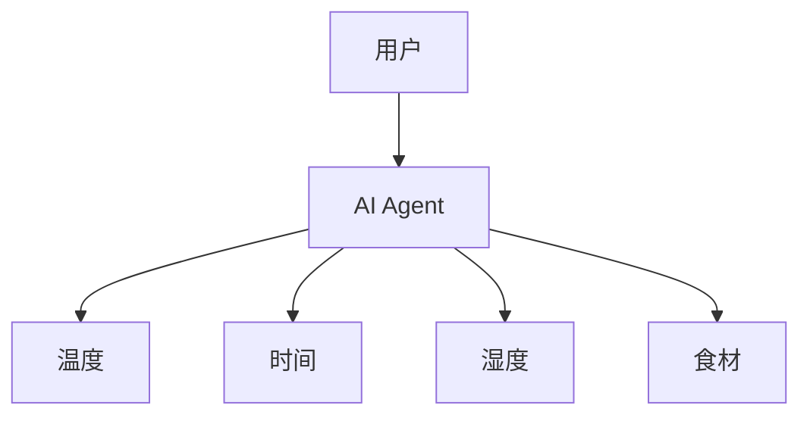
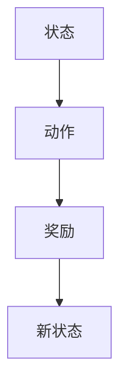
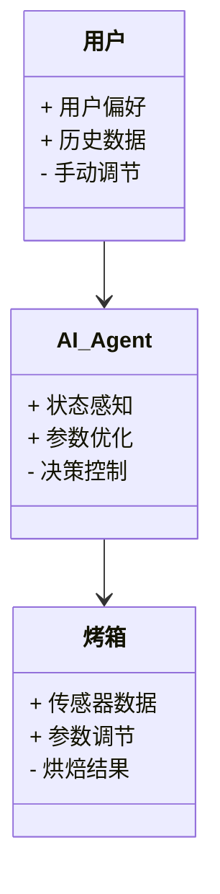
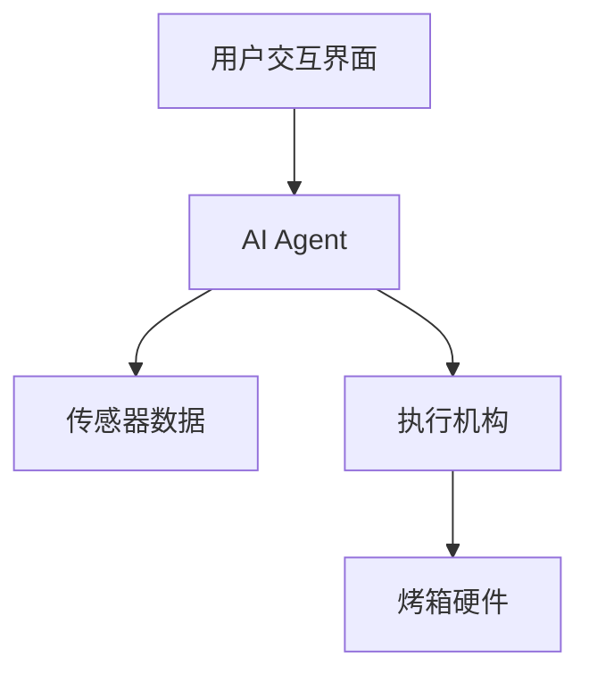
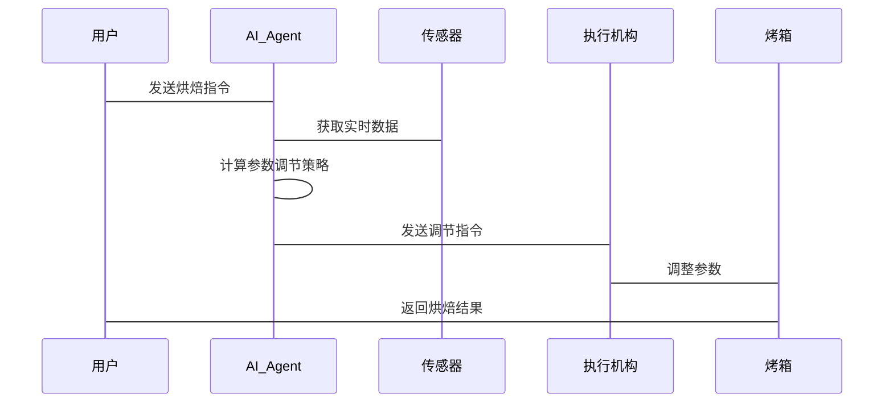

                 


# 智能烤箱：AI Agent的烘焙参数自动调节

## 关键词：智能烤箱, AI Agent, 烘焙参数, 自动调节, 人工智能

## 摘要：本文深入探讨了AI Agent在智能烤箱中的应用，详细分析了烘焙参数自动调节的实现原理和系统架构。通过强化学习和机器学习算法，AI Agent能够根据食材特性和用户偏好优化烘焙过程，显著提升烹饪效果和用户体验。文章还提供了系统设计和项目实战的具体方案，为智能家电领域的技术研究和产品开发提供了参考。

---

## 第1章: 问题背景与描述

### 1.1 问题背景

#### 1.1.1 烘焙过程中的参数调节难点
烘焙是一种对时间和温度高度敏感的过程，不同的食材需要不同的烘焙参数组合。传统烤箱通常提供固定的预设模式，难以适应食材特性和用户偏好。手动调节参数不仅复杂，还可能因为经验不足导致烹饪失败。

#### 1.1.2 现有烘焙设备的局限性
现有烘焙设备主要依赖用户手动调整温度、时间和湿度等参数。这种方式不仅效率低下，而且难以精确控制，容易导致烘焙结果不理想。

#### 1.1.3 AI技术在家电领域的应用前景
AI技术的快速发展为家电智能化提供了新的可能性。通过AI代理，设备能够学习用户习惯和食材特性，实现智能化的参数调节，提升用户体验。

### 1.2 问题描述

#### 1.2.1 烘焙参数调节的核心问题
烘焙参数调节的核心问题是如何根据食材特性和用户偏好，动态调整温度、时间和湿度等参数，以获得最佳的烘焙效果。

#### 1.2.2 不同食材对烘焙参数的需求差异
不同食材对烘焙参数的需求差异显著。例如，蛋糕需要较高的温度和较长的时间，而饼干则需要较低的温度和较短的时间。

#### 1.2.3 用户需求与烘焙结果的关联性
用户需求与烘焙结果密切相关。用户可能希望烘焙食品达到特定的口感、色泽和香气，这些需求需要通过精确的参数调节来实现。

---

## 第2章: 核心概念与联系

### 2.1 AI Agent的基本原理

#### 2.1.1 AI Agent的定义与特征
AI Agent是一种智能体，能够感知环境、做出决策并执行动作。在智能烤箱中，AI Agent通过传感器数据和用户输入，实时调整烘焙参数。

#### 2.1.2 AI Agent在智能烤箱中的角色
AI Agent在智能烤箱中的角色是接收用户指令、感知烤箱状态、分析食材特性，并动态调整烘焙参数，以实现最佳的烘焙效果。

#### 2.1.3 AI Agent与传统控制系统的区别
与传统控制系统相比，AI Agent具有更强的自适应能力和学习能力，能够根据实时数据优化参数调节策略。

### 2.2 烘焙参数调节的核心要素

#### 2.2.1 温度、时间、湿度等参数的数学关系
烘焙参数之间存在复杂的数学关系。例如，温度升高通常需要适当延长烘焙时间，同时湿度也需要相应调整。

#### 2.2.2 不同食材的烘焙曲线分析
不同食材的烘焙曲线差异显著。AI Agent需要学习这些差异，以实现个性化的参数调节。

#### 2.2.3 用户偏好与烘焙结果的映射关系
用户偏好与烘焙结果之间存在一定的映射关系。通过分析用户的历史数据，AI Agent可以预测用户的偏好，并优化参数调节策略。

### 2.3 系统架构的核心要素

#### 2.3.1 系统功能模块划分
系统功能模块包括传感器数据采集、AI Agent决策、参数调节执行和用户交互界面。

#### 2.3.2 各模块之间的关系
传感器数据采集模块为AI Agent提供实时数据，AI Agent根据数据和用户指令生成调节策略，并通过参数调节执行模块实现参数调整，用户交互界面则用于展示结果和接收用户反馈。

#### 2.3.3 系统边界与外延
系统边界包括烤箱硬件、传感器、AI算法和用户交互界面。系统外延可能涉及云端数据存储和远程控制。

### 2.4 核心概念的联系与对比

#### 2.4.1 参数调节与AI Agent的关联
AI Agent通过实时感知和学习，优化烘焙参数调节策略，提升烘焙效果。

#### 2.4.2 烘焙参数调节的数学模型
烘焙参数调节的数学模型需要考虑温度、时间、湿度等参数之间的关系，并结合食材特性和用户偏好。

#### 2.4.3 系统架构的ER实体关系图


---

## 第3章: 算法原理与数学模型

### 3.1 AI Agent的算法原理

#### 3.1.1 强化学习的基本原理
强化学习是一种通过试错学习的算法，AI Agent通过与环境的交互，逐步优化参数调节策略。

#### 3.1.2 基于机器学习的参数优化
机器学习模型可以基于历史数据，预测最佳的烘焙参数组合。

#### 3.1.3 算法选择的依据
算法选择需要考虑系统的实时性、复杂度和学习效率。

### 3.2 算法实现步骤

#### 3.2.1 状态感知
AI Agent通过传感器感知烤箱的实时状态，包括温度、湿度和时间。

#### 3.2.2 动作选择
基于当前状态和历史数据，AI Agent选择最佳的参数调节动作。

#### 3.2.3 奖励机制
通过奖励机制，AI Agent不断优化其参数调节策略。

### 3.3 数学模型与公式

#### 3.3.1 基于强化学习的数学模型


#### 3.3.2 参数优化的数学公式
$$ Q(s, a) = Q(s, a) + \alpha (r + \max Q(s', a) - Q(s, a)) $$
其中，$$ Q(s, a) $$ 表示状态 $$ s $$ 下动作 $$ a $$ 的价值函数，$$ \alpha $$ 是学习率，$$ r $$ 是奖励，$$ \max Q(s', a) $$ 是新状态下的最大价值函数。

---

## 第4章: 系统分析与架构设计

### 4.1 系统功能设计

#### 4.1.1 领域模型


#### 4.1.2 系统架构设计


#### 4.1.3 接口设计
系统接口包括传感器数据接口、用户输入接口和烤箱控制接口。

#### 4.1.4 交互序列图


---

## 第5章: 项目实战

### 5.1 环境安装

#### 5.1.1 系统环境
需要安装Python、TensorFlow、Mermaid和相关开发工具。

#### 5.1.2 硬件设备
需要安装传感器和烤箱硬件。

### 5.2 核心代码实现

#### 5.2.1 AI Agent实现
```python
class AI_Agent:
    def __init__(self):
        self.model = self.build_model()
    
    def build_model(self):
        # 构建强化学习模型
        pass
    
    def感知状态(self, 传感器数据):
        # 处理传感器数据
        pass
    
    def 优化参数(self, 状态):
        # 优化烘焙参数
        pass
    
    def 执行动作(self, 参数):
        # 发送调节指令
        pass
```

#### 5.2.2 烘焙参数调节
```python
def 调节温度(温度, 时间):
    # 调节温度和时间
    pass
```

### 5.3 案例分析

#### 5.3.1 烘焙蛋糕的参数调节
案例分析：AI Agent如何根据蛋糕的特性，动态调整温度和时间，以获得最佳的烘焙效果。

#### 5.3.2 用户偏好分析
分析用户的偏好数据，优化参数调节策略。

### 5.4 项目小结
项目小结：通过实际案例分析，验证了AI Agent在烘焙参数调节中的有效性，并总结了项目中的经验教训。

---

## 第6章: 最佳实践与注意事项

### 6.1 小结
通过本文的分析和实践，我们可以看到AI Agent在烘焙参数调节中的巨大潜力。

### 6.2 注意事项
在实际应用中，需要注意数据隐私、系统安全和用户体验等问题。

### 6.3 拓展阅读
推荐阅读相关领域的最新研究和应用案例。

---

## 第7章: 总结

### 7.1 文章总结
本文系统地探讨了AI Agent在智能烤箱中的应用，详细分析了烘焙参数自动调节的实现原理和系统架构。

### 7.2 未来展望
随着AI技术的不断发展，智能烤箱将更加智能化和个性化，为用户带来更好的烘焙体验。

---

通过本文的系统分析和实践，我们展示了AI Agent在烘焙参数调节中的巨大潜力。希望本文能为智能家电领域的技术研究和产品开发提供参考和启发。

