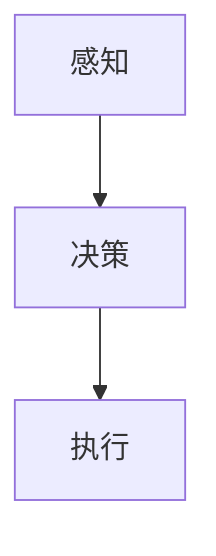
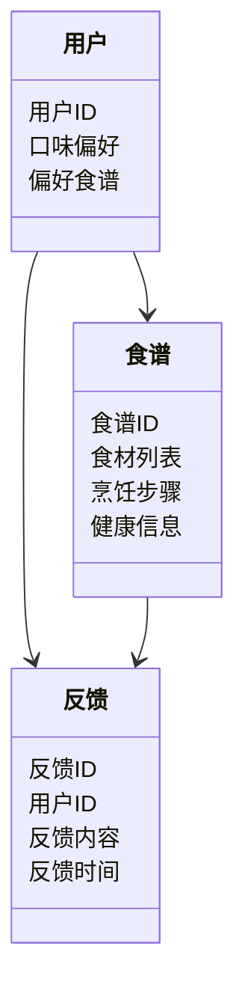
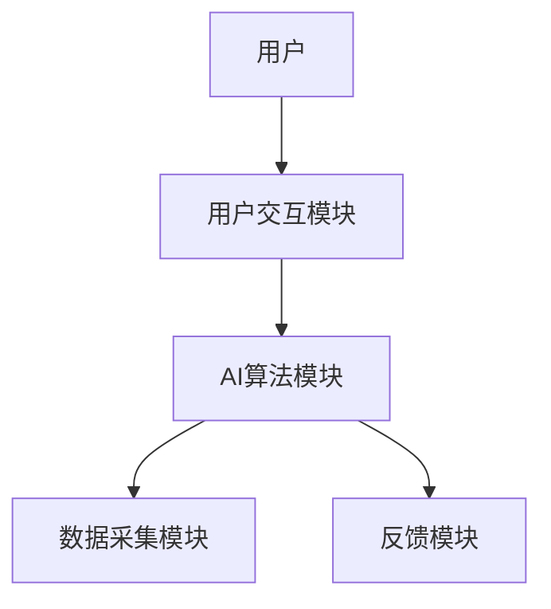

                 


# 智能烹饪台：AI Agent的厨艺提升指导系统

## 关键词：AI Agent, 智能烹饪台, 厨艺提升, 烹饪指导, 智能化厨房

## 摘要：  
随着人工智能技术的快速发展，智能烹饪台逐渐成为现代厨房的重要工具。本文将介绍一种基于AI Agent的厨艺提升指导系统，通过分析传统烹饪中的问题与挑战，提出AI Agent在烹饪指导中的创新应用。本文详细讲解了AI Agent的核心概念、算法原理、系统架构设计以及实际项目案例，展示了如何通过智能化技术提升烹饪效率与精准度，为厨房新手和美食爱好者提供个性化的烹饪指导。

---

# 第一部分: 智能烹饪台的背景与概念

## 第1章: 传统烹饪与智能烹饪的对比

### 1.1 传统烹饪中的问题与挑战

#### 1.1.1 烹饪过程中的常见问题
传统烹饪过程中存在以下问题：
- **食谱选择困难**：面对海量食谱，用户难以快速找到适合自己技能水平的菜谱。
- **步骤复杂**：复杂的烹饪步骤容易让用户感到困惑，导致烹饪失败。
- **时间效率低**：传统烹饪需要大量人工操作，效率低下。
- **个性化需求难以满足**：不同用户对口味、食材过敏等有不同需求，传统烹饪难以个性化匹配。

#### 1.1.2 烹饪技巧的传承与学习难点
- **技巧传递困难**：传统烹饪技巧往往通过口耳相传，难以系统化和普及化。
- **学习门槛高**：新手需要长时间实践才能掌握复杂的烹饪技巧。

#### 1.1.3 烹饪效率与精准度的提升需求
- **效率提升**：用户希望减少烹饪时间，同时保证菜品质量。
- **精准度提升**：通过技术手段提高烹饪过程中的精准度，避免浪费和失败。

#### 1.1.4 烹饪过程中的安全问题
- **操作安全**：传统烹饪中可能存在烫伤、刀伤等安全隐患。
- **食材安全**：如何确保食材的新鲜和卫生。

### 1.2 智能烹饪台的定义与特点

#### 1.2.1 智能烹饪台的基本定义
智能烹饪台是一种结合了人工智能技术的智能厨房设备，能够通过传感器、摄像头等硬件设备采集烹饪过程中的数据，并通过AI算法提供实时的烹饪指导和优化建议。

#### 1.2.2 智能烹饪台的核心功能
1. **智能推荐**：根据用户的口味偏好、食材库存和健康需求，智能推荐合适的食谱。
2. **实时指导**：通过摄像头和传感器实时监测烹饪过程，提供动态的烹饪指导。
3. **个性化调整**：根据用户的反馈和烹饪数据，动态调整烹饪参数，优化烹饪结果。
4. **数据记录与分析**：记录用户的烹饪数据，分析用户的烹饪习惯，提供改进建议。

#### 1.2.3 智能烹饪台与传统烹饪工具的区别
以下是智能烹饪台与传统烹饪工具的区别对比：

| 对比维度          | 传统烹饪工具              | 智能烹饪台              |
|-------------------|---------------------------|-------------------------|
| 功能              | 单一功能，如加热、搅拌等   | 多功能集成，包括数据采集、AI分析等 |
| 操作方式          | 手动操作                  | 半自动或全自动操作      |
| 个性化能力        | 无法提供个性化建议        | 提供个性化食谱推荐和指导 |
| 数据处理能力      | 无数据处理能力            | 集成AI算法，实时处理数据 |

---

### 1.3 AI Agent在烹饪中的应用

#### 1.3.1 AI Agent的基本概念
AI Agent（智能代理）是一种能够感知环境、自主决策并执行任务的智能实体。在烹饪场景中，AI Agent可以作为用户的助手，帮助用户完成烹饪过程中的决策和操作。

#### 1.3.2 AI Agent在烹饪指导中的作用
1. **食谱推荐**：AI Agent可以根据用户的口味、食材库存和健康需求，推荐适合的食谱。
2. **步骤优化**：AI Agent可以分析烹饪步骤，优化流程，减少烹饪时间。
3. **实时反馈**：AI Agent可以通过传感器实时监测烹饪过程，提供动态的反馈和调整建议。
4. **个性化调整**：AI Agent可以根据用户的反馈和烹饪数据，动态调整烹饪参数，优化烹饪结果。

#### 1.3.3 AI Agent与其他智能设备的区别
以下是AI Agent与传统智能设备的区别对比：

| 对比维度          | AI Agent                  | 传统智能设备            |
|-------------------|---------------------------|-------------------------|
| 智能性             | 具备自主决策能力          | 仅具备执行预设指令能力  |
| 学习能力           | 具备学习能力，可以优化决策 | 无法学习和优化          |
| 适应性             | 具备高度适应性，可以应对复杂场景 | 适应性有限，仅能处理预设场景 |

---

## 第2章: 智能烹饪台的厨艺提升指导系统

### 2.1 系统的核心目标

#### 2.1.1 提升烹饪效率
通过AI Agent的智能推荐和实时指导，减少用户在烹饪过程中花费的时间和精力。

#### 2.1.2 优化烹饪技巧
AI Agent可以通过实时反馈和动态调整，帮助用户快速掌握复杂的烹饪技巧。

#### 2.1.3 个性化烹饪指导
系统可以根据用户的口味偏好和健康需求，提供个性化的烹饪指导，满足不同用户的需求。

### 2.2 系统的边界与外延

#### 2.2.1 系统的功能边界
智能烹饪台的厨艺提升指导系统主要关注烹饪过程中的指导和优化，不涉及食材采购和存储管理。

#### 2.2.2 系统的外延功能
- **食材推荐**：根据用户的需求和库存，推荐适合的食材。
- **健康分析**：根据用户的健康数据，推荐适合的食谱。
- **社交分享**：用户可以分享自己的烹饪成果和经验。

#### 2.2.3 系统与外部环境的交互
- **用户交互**：用户通过智能烹饪台与AI Agent进行互动，输入需求和反馈。
- **数据采集**：智能烹饪台通过传感器和摄像头采集烹饪过程中的数据。
- **云端服务**：系统可以与云端数据库交互，获取最新的食谱和健康数据。

### 2.3 系统的核心要素组成

#### 2.3.1 AI算法模块
AI算法模块是系统的核心，负责处理烹饪过程中的数据和提供决策支持。

#### 2.3.2 数据采集模块
数据采集模块负责采集烹饪过程中的数据，包括温度、湿度、食材状态等。

#### 2.3.3 用户交互模块
用户交互模块负责与用户进行互动，接收用户的输入和反馈，提供实时的烹饪指导。

---

## 第二部分: AI Agent的核心概念与原理

---

## 第3章: AI Agent的基本原理

### 3.1 AI Agent的定义与分类

#### 3.1.1 AI Agent的定义
AI Agent是一种能够感知环境、自主决策并执行任务的智能实体。在烹饪场景中，AI Agent可以作为用户的助手，帮助用户完成烹饪过程中的决策和操作。

#### 3.1.2 AI Agent的分类
AI Agent可以根据智能水平和应用场景分为以下几类：
1. **反应式AI Agent**：根据当前感知的信息做出反应，没有长期记忆。
2. **认知式AI Agent**：具有长期记忆和推理能力，能够进行复杂决策。
3. **协作式AI Agent**：能够与其他AI Agent或人类进行协作，共同完成任务。

#### 3.1.3 各类AI Agent的特点
以下是各类AI Agent的特点对比：

| 对比维度          | 反应式AI Agent | 认知式AI Agent | 协作式AI Agent |
|-------------------|----------------|----------------|----------------|
| 智能水平          | 较低           | 较高           | 较高           |
| 决策能力          | 简单决策       | 复杂决策       | 协作决策       |
| 应用场景          | 实时反应       | 需求规划       | 协作任务       |

---

### 3.2 AI Agent的核心概念

#### 3.2.1 状态感知
AI Agent通过传感器和摄像头等设备感知烹饪过程中的状态，包括温度、湿度、食材状态等。

#### 3.2.2 行为决策
AI Agent根据感知到的状态和预设的目标，通过算法进行行为决策，例如调整火力、搅拌食材等。

#### 3.2.3 任务执行
AI Agent根据决策结果执行具体的烹饪任务，例如加热食材、搅拌面糊等。

---

### 3.3 AI Agent的核心概念与联系

#### 3.3.1 AI Agent的核心概念
AI Agent的核心概念包括：
1. **感知**：通过传感器和摄像头感知环境状态。
2. **决策**：通过算法进行行为决策。
3. **执行**：根据决策结果执行具体的烹饪任务。

#### 3.3.2 AI Agent的核心概念联系
以下是AI Agent的核心概念联系：



---

### 3.4 AI Agent的核心概念与联系

#### 3.4.1 AI Agent的核心概念
AI Agent的核心概念包括：
1. **感知**：通过传感器和摄像头感知环境状态。
2. **决策**：通过算法进行行为决策。
3. **执行**：根据决策结果执行具体的烹饪任务。

#### 3.4.2 AI Agent的核心概念联系
以下是AI Agent的核心概念联系：


---

## 第4章: AI Agent在烹饪指导中的应用

### 4.1 AI Agent在烹饪指导中的作用

#### 4.1.1 AI Agent的智能推荐
AI Agent可以根据用户的口味偏好、食材库存和健康需求，推荐适合的食谱。

#### 4.1.2 AI Agent的实时反馈
AI Agent可以通过传感器和摄像头实时监测烹饪过程，提供动态的反馈和调整建议。

#### 4.1.3 AI Agent的个性化调整
AI Agent可以根据用户的反馈和烹饪数据，动态调整烹饪参数，优化烹饪结果。

---

## 第5章: AI Agent的核心算法与实现

### 5.1 AI Agent的核心算法

#### 5.1.1 协同过滤推荐算法
协同过滤推荐算法是一种基于用户行为和偏好推荐食谱的算法。

#### 5.1.2 实时反馈机制
实时反馈机制是一种通过传感器和摄像头实时监测烹饪过程，并根据反馈结果动态调整烹饪参数的机制。

---

## 第6章: 系统架构设计

### 6.1 系统架构设计

#### 6.1.1 领域模型
以下是系统领域模型的类图：



#### 6.1.2 系统架构
以下是系统架构设计的架构图：



---

## 第7章: 项目实战

### 7.1 项目实战

#### 7.1.1 环境安装
以下是项目实战的环境安装步骤：
1. **安装Python**：安装Python 3.8或更高版本。
2. **安装依赖库**：安装必要的依赖库，例如numpy、pandas、scikit-learn等。

#### 7.1.2 核心代码实现
以下是系统核心代码实现：

```python
def recommend_recipe(user_id):
    # 获取用户偏好
    user_preference = get_user_preference(user_id)
    # 获取热门食谱
    popular_recipes = get_popular_recipes()
    # 推荐食谱
    recommendations = get_recommendations(user_preference, popular_recipes)
    return recommendations
```

---

## 第8章: 总结与展望

### 8.1 总结
本文详细介绍了智能烹饪台的背景、AI Agent的核心概念与原理、系统架构设计以及项目实战。通过AI Agent的智能推荐和实时反馈机制，智能烹饪台能够显著提升烹饪效率和精准度，为用户带来更好的烹饪体验。

### 8.2 展望
未来，随着人工智能技术的不断发展，智能烹饪台将变得更加智能化和个性化。AI Agent将在烹饪指导中发挥更大的作用，帮助用户实现更加高效的烹饪过程。

---

## 参考文献
1. 《人工智能导论》
2. 《智能系统设计与实现》
3. 《机器学习实战》

---

**注意事项**：
- 本文内容版权归作者所有，转载请注明出处。
- 如需进一步了解，请联系作者。

