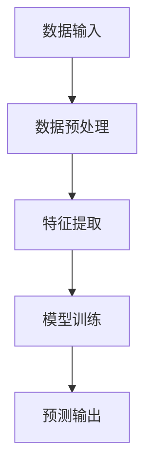
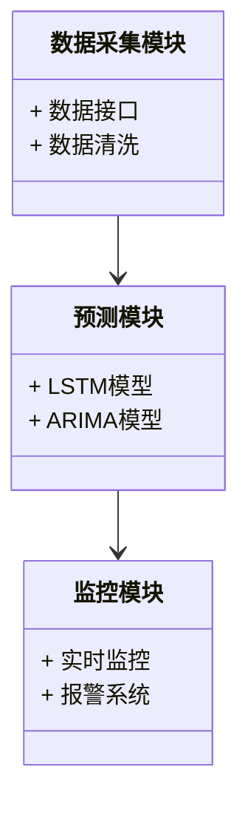

                 


# 智能现金流管理系统

> 关键词：智能现金流管理，人工智能，大数据，现金流预测，机器学习，财务管理

> 摘要：智能现金流管理系统是一种结合人工智能、大数据和财务管理的创新解决方案，旨在通过智能预测、实时监控和优化决策来提升企业的现金流管理效率和准确性。本文将从背景、核心概念、算法原理、系统架构、项目实战到最佳实践，全面解析智能现金流管理系统的实现与应用。

---

## 第一部分: 智能现金流管理系统的背景与核心概念

### 第1章: 智能现金流管理系统的背景介绍

#### 1.1 现金流管理的重要性
现金流是企业运营的核心命脉，直接关系到企业的生存与发展。传统现金流管理依赖人工操作，存在以下问题：
- 数据采集复杂，难以实时更新
- 预测模型单一，准确性不足
- 缺乏智能化手段，难以应对市场波动

智能现金流管理通过引入AI和大数据技术，能够实现预测的高精度和管理的自动化，为企业提供更高效、更可靠的现金流管理方案。

#### 1.2 智能现金流管理的概念
智能现金流管理是指利用人工智能、机器学习和大数据分析技术，对企业的现金流进行实时监测、预测和优化管理的过程。其核心在于通过数据驱动的预测模型，帮助企业做出更精准的现金流决策。

#### 1.3 智能现金流管理的背景与趋势
随着企业数字化转型的加速，现金流管理也在向智能化方向发展。AI和大数据技术的应用，使得现金流预测更加精准，管理更加高效。未来，智能现金流管理将成为企业财务管理的重要组成部分。

---

### 第2章: 智能现金流管理的核心概念与联系

#### 2.1 核心概念原理
智能现金流管理的核心在于数据驱动的预测模型。通过整合企业的财务数据、市场数据和内部数据，利用机器学习算法对未来的现金流进行预测，并结合实时数据进行动态调整。

#### 2.2 核心概念属性对比表
以下是智能现金流管理与传统现金流管理的对比：

| 概念 | 属性 | 传统管理 | 智能管理 |
|------|------|----------|----------|
| 数据来源 | 财务数据 | 单一数据源 | 多数据源（财务、市场、内部） |
| 方法 | 时间序列分析 | 固定模型 | 机器学习、深度学习 |
| 输出 | 简单预测 | 粗略预测 | 精准预测 |

#### 2.3 ER实体关系图
以下是智能现金流管理系统的ER图：

```mermaid
erd
    客户
    供应商
    账户
    交易
    现金流预测
    时间戳
```

---

## 第二部分: 智能现金流管理系统的算法原理

### 第3章: 智能现金流管理的算法原理

#### 3.1 算法原理概述
智能现金流管理的核心算法包括时间序列分析和机器学习模型。常用算法有ARIMA、LSTM等。

#### 3.2 算法流程图
以下是现金流预测的算法流程图：



#### 3.3 算法实现代码
以下是基于LSTM的现金流预测代码示例：

```python
import numpy as np
from keras.models import Sequential
from keras.layers import LSTM, Dense

# 示例数据
data = np.random.rand(100, 1)
train_data = data[:80]
test_data = data[80:]

# 数据预处理
train_x = train_data[:-1]
train_y = train_data[1:]
test_x = test_data[:-1]
test_y = test_data[1:]

# LSTM模型
model = Sequential()
model.add(LSTM(4, input_shape=(1, 1)))
model.add(Dense(1))
model.compile(loss='mean_squared_error', optimizer='adam')

# 训练
model.fit(train_x, train_y, epochs=100, batch_size=1)

# 预测
predicted = model.predict(test_x)
```

---

## 第三部分: 智能现金流管理系统的系统架构设计

### 第4章: 智能现金流管理系统的架构设计

#### 4.1 系统功能设计
以下是系统的功能模块：



#### 4.2 系统架构图
以下是系统的架构图：


---

## 第四部分: 智能现金流管理系统的项目实战

### 第5章: 智能现金流管理系统的项目实战

#### 5.1 环境安装
安装Python、TensorFlow、Keras等工具。

#### 5.2 核心实现代码
以下是现金流预测的核心代码：

```python
import pandas as pd
from sklearn.model_selection import train_test_split
from sklearn.linear_model import LinearRegression

# 数据加载
data = pd.read_csv('cash_flow.csv')
X = data[['revenue', 'expenses']]
y = data['net_cash_flow']

# 数据分割
X_train, X_test, y_train, y_test = train_test_split(X, y, test_size=0.2)

# 模型训练
model = LinearRegression()
model.fit(X_train, y_train)

# 预测
predicted = model.predict(X_test)
```

#### 5.3 案例分析
以下是一个企业的季度现金流预测案例：

```python
# 示例数据
data = {
    'revenue': [100, 200, 300, 400],
    'expenses': [50, 100, 150, 200]
}
df = pd.DataFrame(data)
X = df[['revenue', 'expenses']]
y = df['net_cash_flow']

# 模型训练
model = LinearRegression()
model.fit(X, y)

# 预测下一个季度的现金流
next_data = {'revenue': 500, 'expenses': 250}
predicted_cash_flow = model.predict([[500, 250]])[0]
```

---

## 第五部分: 智能现金流管理系统的最佳实践

### 第6章: 最佳实践与小结

#### 6.1 最佳实践
- 数据质量是关键，确保数据的完整性和准确性
- 定期更新模型，适应市场变化
- 结合企业实际情况，选择合适的算法

#### 6.2 小结
智能现金流管理系统通过AI和大数据技术，显著提升了现金流管理的效率和准确性。企业应积极拥抱这一技术，以实现更高效的财务管理。

---

## 参考文献与扩展阅读

1. 《机器学习实战》
2. 《时间序列分析》
3. 《深度学习》

---

## 结语

智能现金流管理系统是财务管理领域的一项重要创新，通过智能化手段，帮助企业更好地管理和预测现金流。希望本文能为您提供有价值的信息和启发。

--- 

**全文完**

