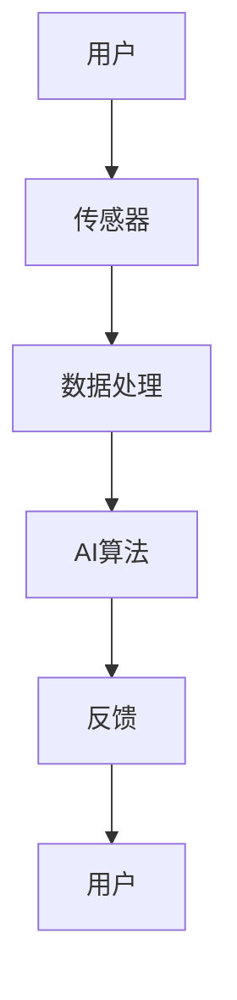
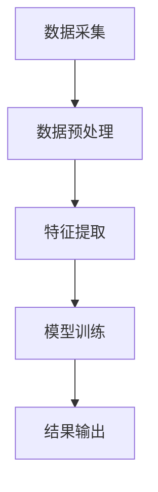
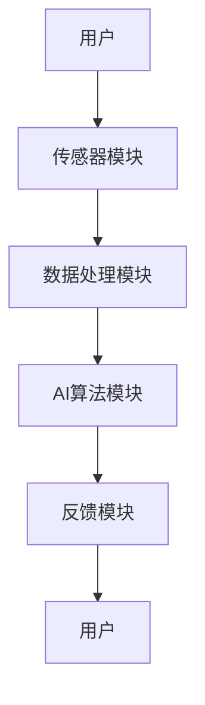

                 


# 智能瑜伽垫：AI Agent的冥想辅助系统

## 关键词：
智能瑜伽垫, AI Agent, 冥想, 传感器, 数据分析, 人工智能

## 摘要：
智能瑜伽垫结合了AI Agent技术，通过传感器和数据分析，为用户提供个性化的冥想指导。本文将详细探讨智能瑜伽垫的工作原理，从传感器数据采集到算法实现，再到系统架构设计，帮助读者全面了解这一创新的冥想辅助系统。

---

## 第1章：智能瑜伽垫与AI Agent概述

### 1.1 智能瑜伽垫的概念与背景
冥想是一种通过调节呼吸和放松身心来提升健康的方法。传统瑜伽垫仅提供物理支撑，无法实时反馈用户的姿势和呼吸状况。随着AI技术的发展，智能瑜伽垫应运而生，它通过集成传感器和AI算法，为用户提供实时反馈和个性化的冥想指导。

#### 1.1.1 瑜伽与冥想的健康价值
- 冥想有助于缓解压力、改善睡眠和提升专注力。
- 瑜伽通过体式练习促进身体柔韧性和肌肉力量。

#### 1.1.2 传统瑜伽垫的局限性
- 传统瑜伽垫无法提供实时反馈，用户无法了解自己的姿势是否正确。
- 缺乏个性化的指导，用户可能无法根据自身情况调整练习。

#### 1.1.3 AI技术在健身领域的应用趋势
- AI技术通过传感器和数据分析，实时监测用户的运动状态。
- 个性化指导成为健身领域的趋势，AI能够根据用户的数据提供定制化的建议。

#### 1.1.4 智能瑜伽垫的定义与核心功能
- 智能瑜伽垫是结合AI技术的智能设备，通过传感器采集用户数据，利用AI算法提供实时反馈和指导。
- 核心功能包括姿势矫正、呼吸调节、心率监测和个性化建议。

### 1.2 AI Agent的基本原理
AI Agent是一种能够感知环境、自主决策并执行任务的智能实体。

#### 1.2.1 什么是AI Agent
- AI Agent能够通过传感器获取环境信息，利用算法进行分析和决策，并通过执行器与环境交互。
- AI Agent的核心能力包括感知、推理、学习和执行。

#### 1.2.2 AI Agent的核心特征
- **自主性**：能够在没有外部干预的情况下独立运行。
- **反应性**：能够实时感知环境变化并做出反应。
- **学习能力**：能够通过数据学习和优化自身算法。

#### 1.2.3 AI Agent与传统软件的区别
| 特性 | AI Agent | 传统软件 |
|------|----------|----------|
| 感知能力 | 高 | 无 |
| 决策能力 | 高 | 低 |
| 学习能力 | 高 | 无 |

### 1.3 智能瑜伽垫与AI Agent的结合
智能瑜伽垫通过AI Agent实现冥想辅助。

#### 1.3.1 智能瑜伽垫的功能实现
- **姿势矫正**：AI Agent通过传感器监测用户的姿势，实时反馈矫正建议。
- **呼吸调节**：AI Agent分析用户的呼吸频率和深度，指导用户调整呼吸节奏。
- **心率监测**：AI Agent监测用户的心率变化，提供个性化的冥想建议。

#### 1.3.2 AI Agent在冥想辅助中的作用
- AI Agent通过实时监测用户的生理数据，提供个性化的冥想指导。
- AI Agent能够根据用户的反馈不断优化算法，提升指导的准确性。

#### 1.3.3 智能瑜伽垫的应用场景
- 家庭冥想：用户可以在家中使用智能瑜伽垫进行冥想练习。
- 健身中心：健身中心可以提供智能瑜伽垫，帮助会员提升冥想效果。
- 康复辅助：智能瑜伽垫可以帮助康复患者进行冥想练习，加速康复进程。

---

## 第2章：AI Agent的核心概念与联系

### 2.1 AI Agent的核心概念原理
AI Agent通过感知、决策和执行三个层次实现功能。

#### 2.1.1 感知层：传感器数据的采集与处理
- 智能瑜伽垫通过内置传感器采集用户的生理数据，如心率、呼吸频率、姿势等。
- 数据采集需要高精度和实时性，确保AI Agent能够及时反馈。

#### 2.1.2 决策层：AI算法的推理与判断
- AI Agent利用机器学习算法对传感器数据进行分析，推理出用户的当前状态。
- 决策层需要根据用户的生理数据和行为模式，提供个性化的指导建议。

#### 2.1.3 执行层：反馈机制的实现
- AI Agent通过反馈机制向用户传递指导信息，如语音提示、震动反馈等。
- 反馈机制需要快速响应，确保用户能够及时调整冥想状态。

### 2.2 AI Agent的核心概念属性特征对比表格
| 概念 | 属性 | 特征 |
|------|------|------|
| 感知层 | 数据采集 | 传感器类型、数据频率、数据精度 |
| 决策层 | 算法模型 | 神经网络、决策树、规则引擎 |
| 执行层 | 反馈机制 | 用户反馈、系统调整 |

### 2.3 ER实体关系图（Mermaid流程图）


---

## 第3章：传感器与数据采集

### 3.1 传感器的作用与分类
- **作用**：传感器用于采集用户的生理数据，为AI Agent提供输入数据。
- **分类**：常用的传感器包括心率传感器、加速度传感器和压力传感器。

### 3.2 数据采集的实现方式
- **心率传感器**：通过光电传感器采集用户的心率数据。
- **加速度传感器**：通过加速度传感器监测用户的运动状态。

### 3.3 数据采集的挑战与解决方案
- **挑战**：传感器数据可能存在噪声和干扰，影响AI算法的准确性。
- **解决方案**：采用滤波算法对数据进行预处理，提升数据质量。

---

## 第4章：算法实现

### 4.1 数据分析与处理
- **时间序列分析**：用于分析用户的呼吸和心率数据，识别规律和异常。
- **机器学习算法**：利用分类算法对用户的行为模式进行分类，提供个性化的指导。

### 4.2 算法流程图（Mermaid）


### 4.3 核心算法代码实现
以下是一个基于时间序列分析的Python代码示例：
```python
import numpy as np
from sklearn import neighbors

# 示例数据：用户的心率数据
data = np.array([60, 65, 70, 75, 80, 85, 90, 95])

# 数据预处理
def preprocess(data):
    # 移动平均法去除噪声
    smoothed_data = []
    for i in range(len(data)):
        if i < 2:
            smoothed_data.append(data[i])
        else:
            smoothed_data.append(np.mean(data[i-2:i+1]))
    return smoothed_data

smoothed_data = preprocess(data)

# 特征提取
features = [smoothed_data[i] for i in range(len(smoothed_data))]

# 模型训练
model = neighbors.KNeighborsClassifier(n_neighbors=3)
model.fit(np.array(features).reshape(-1, 1), np.array([0, 1, 2, 3, 4, 5, 6, 7]))

# 预测结果
test_data = np.array([70, 75, 80, 85])
test_features = [preprocess(test_data)[i] for i in range(len(test_data))]
predicted = model.predict(np.array(test_features).reshape(-1, 1))
print(predicted)
```

---

## 第5章：系统架构设计

### 5.1 系统功能设计
- **用户界面**：显示用户的生理数据和AI Agent的反馈。
- **传感器模块**：采集用户的生理数据。
- **数据处理模块**：对数据进行预处理和特征提取。
- **AI算法模块**：利用机器学习算法对数据进行分析，提供反馈建议。

### 5.2 系统架构图（Mermaid）


---

## 第6章：项目实战

### 6.1 环境安装
- **硬件**：智能瑜伽垫、传感器模块。
- **软件**：Python开发环境、相关库（如numpy、scikit-learn）。

### 6.2 核心代码实现
```python
import numpy as np
from sklearn import neighbors

def preprocess(data):
    smoothed_data = []
    for i in range(len(data)):
        if i < 2:
            smoothed_data.append(data[i])
        else:
            smoothed_data.append(np.mean(data[i-2:i+1]))
    return smoothed_data

data = np.array([60, 65, 70, 75, 80, 85, 90, 95])
smoothed_data = preprocess(data)

features = np.array(smoothed_data).reshape(-1, 1)
labels = np.array([0, 1, 2, 3, 4, 5, 6, 7])

model = neighbors.KNeighborsClassifier(n_neighbors=3)
model.fit(features, labels)

test_data = np.array([70, 75, 80, 85])
test_features = preprocess(test_data)
test_features_np = np.array(test_features).reshape(-1, 1)

predicted = model.predict(test_features_np)
print(predicted)
```

### 6.3 案例分析
- **案例1**：用户心率异常，AI Agent提供呼吸调节建议。
- **案例2**：用户姿势不正确，AI Agent实时反馈矫正建议。

---

## 第7章：总结与展望

### 7.1 总结
智能瑜伽垫结合了AI Agent技术，通过传感器和数据分析为用户提供个性化的冥想指导。AI Agent的核心原理包括感知、决策和执行三个层次，能够实时监测用户的生理数据并提供反馈。

### 7.2 展望
未来，智能瑜伽垫可以通过进一步优化算法和增加更多传感器，提供更精准的冥想指导。同时，AI Agent可以与其他健康设备联动，构建个性化的健康管理系统。

---

通过本文的详细讲解，读者可以全面了解智能瑜伽垫的工作原理和技术实现，为未来的冥想辅助系统提供参考和指导。

