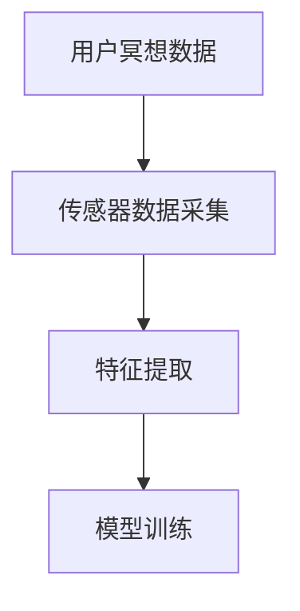
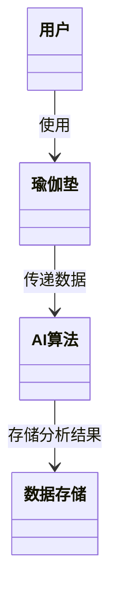
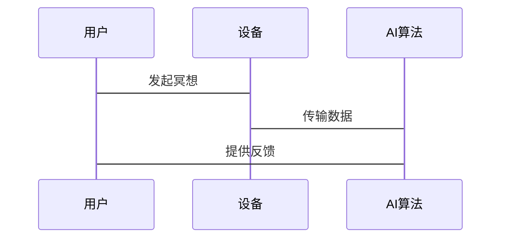

                 


# 智能瑜伽垫：AI Agent的冥想进度追踪系统

---

## 关键词

- 智能瑜伽垫，AI Agent，冥想进度追踪，数据采集与分析，机器学习算法，系统架构设计，传感器技术

---

## 摘要

智能瑜伽垫是一种结合了AI技术的创新健康设备，通过实时追踪用户的冥想姿势和呼吸节奏，提供个性化的冥想指导和进度分析。本文从背景、概念、算法原理到系统架构设计，详细阐述了智能瑜伽垫的核心技术与实现方法，展示了如何通过AI Agent实现冥想进度的智能化追踪。文章内容涵盖数据采集、特征提取、模型训练、系统架构设计等关键环节，并通过实际案例分析，深入探讨了智能瑜伽垫在健康领域的应用价值和未来发展潜力。

---

## 第一部分：背景介绍

### 第1章：智能瑜伽垫与AI Agent概述

#### 1.1 问题背景与目标

现代人生活节奏快，压力大，冥想作为一种有效的减压方式，逐渐受到广泛关注。传统的瑜伽垫仅提供简单的支撑功能，无法满足用户对冥想姿势和呼吸节奏的实时追踪需求。AI技术的快速发展为智能健康设备的创新提供了可能性。智能瑜伽垫的目标是通过AI Agent技术，实时分析用户的冥想数据，提供个性化的指导和进度追踪。

#### 1.2 智能瑜伽垫的核心概念

智能瑜伽垫是一种结合了传感器和AI算法的智能设备，能够实时采集用户的冥想数据，包括身体姿势、呼吸频率和心率等，并通过AI Agent进行分析，生成个性化的冥想报告。

#### 1.3 核心要素与组成结构

- **硬件部分**：压力传感器、加速度传感器、心率传感器
- **软件部分**：AI算法、数据处理模块、用户界面
- **用户交互界面**：手机APP、语音反馈

---

## 第二部分：核心概念与联系

### 第2章：AI Agent与智能瑜伽垫的关系

#### 2.1 AI Agent的原理与特征

- **AI Agent的原理**：通过传感器数据采集、特征提取、模型训练和预测，实现对用户冥想状态的实时分析。
- **AI Agent的特征**：
  | 特征 | 描述 |
  |------|------|
  | 智能性 | 能够自主学习和优化 |
  | 实时性 | 实时分析用户数据 |
  | 个性化 | 提供个性化反馈 |

#### 2.2 智能瑜伽垫的实体关系图

```mermaid
er
actor 用户
actor 设备
actor AI算法
actor 数据存储
```

---

## 第三部分：算法原理讲解

### 第3章：AI Agent的算法实现

#### 3.1 数据采集与特征提取



#### 3.2 算法实现

以下是Python代码示例：

```python
import numpy as np
from sklearn.linear_model import LinearRegression

# 示例数据
X = np.array([[1, 2], [3, 4], [5, 6]])
y = np.array([7, 8, 9])

# 训练模型
model = LinearRegression()
model.fit(X, y)

# 预测
print(model.predict([[2, 3]]))
```

---

## 第四部分：系统分析与架构设计

### 第5章：系统架构设计

#### 5.1 系统功能设计



#### 5.2 系统接口与交互设计



---

## 第五部分：项目实战

### 第6章：环境搭建与核心实现

#### 6.1 环境安装与配置

- **硬件**：智能瑜伽垫、传感器模块
- **软件**：Python编程环境、机器学习库（如scikit-learn）

#### 6.2 核心代码实现

以下是核心代码示例：

```python
import numpy as np
from sklearn.model_selection import train_test_split

# 示例数据集
X = np.array([[1, 2], [3, 4], [5, 6], [7, 8]])
y = np.array([2, 4, 6, 8])

# 划分训练集和测试集
X_train, X_test, y_train, y_test = train_test_split(X, y, test_size=0.2)

# 训练模型
model = LinearRegression()
model.fit(X_train, y_train)

# 验证模型
print(model.score(X_test, y_test))
```

---

## 第六部分：最佳实践

### 7.1 小结

智能瑜伽垫通过AI Agent技术实现了冥想进度的智能化追踪，为用户提供个性化的健康指导。本文详细介绍了系统的实现过程，包括数据采集、算法实现和系统架构设计。

### 7.2 注意事项

- 数据隐私保护是系统设计中的重要考虑因素
- 系统需要定期更新模型以提高准确性
- 用户交互界面应简洁直观

### 7.3 拓展阅读

- 推荐阅读《机器学习实战》和《深度学习入门》
- 关注AI在健康领域的最新应用研究

---

通过以上结构，文章详细介绍了智能瑜伽垫的设计与实现过程，为读者提供了全面的技术解析和实践指导。

