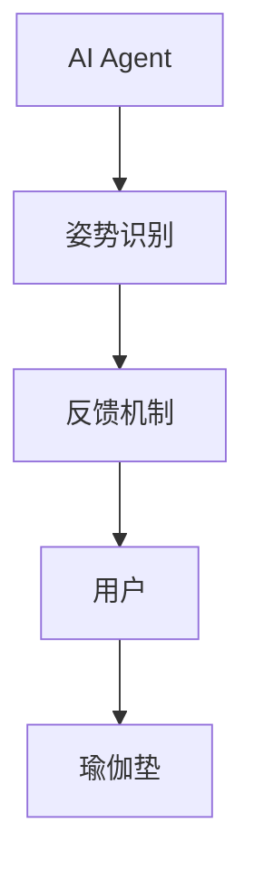
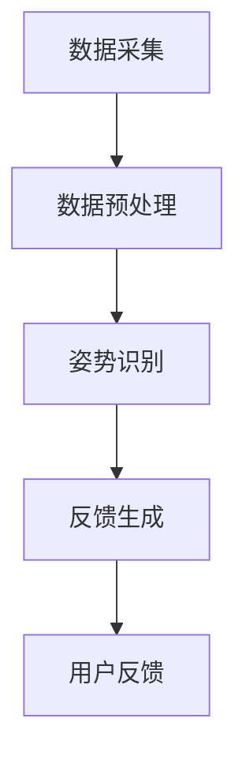
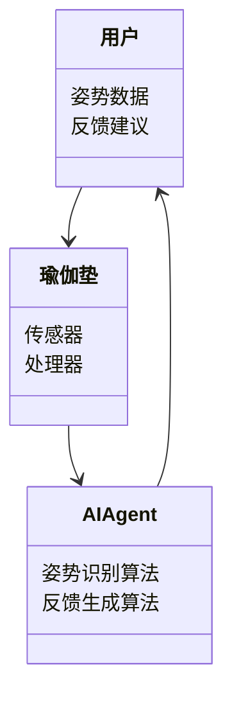
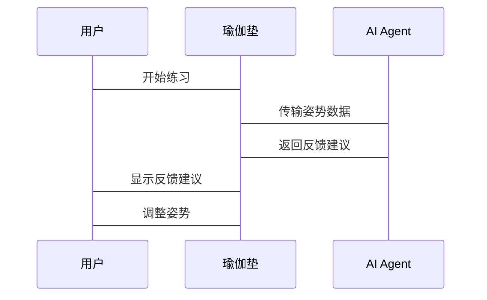

                 


# 智能瑜伽垫：AI Agent的姿势纠正系统

## 关键词
智能瑜伽垫, AI Agent, 姿势纠正, 人工智能, 姿势识别, 反馈机制

## 摘要
智能瑜伽垫是一种结合了人工智能技术的创新产品，旨在通过AI代理实现瑜伽姿势的实时纠正。本文从背景、核心概念、算法原理、系统架构、项目实战到最佳实践，详细探讨智能瑜伽垫的设计与实现过程，分析其技术原理和应用价值，为读者提供全面的技术指导。

---

# 第1章: 智能瑜伽垫的背景与核心概念

## 1.1 问题背景
### 1.1.1 瑜伽练习的重要性
瑜伽作为一种传统的健身方式，可以帮助人们提高身体柔韧性、平衡性和心理健康。然而，不正确的姿势可能导致受伤或效果不佳。

### 1.1.2 瑜伽姿势错误的危害
姿势错误可能导致肌肉拉伤、骨骼错位等问题，影响瑜伽的效果和安全性。

### 1.1.3 传统瑜伽教学的局限性
传统瑜伽教学依赖于教练的现场指导，但在家庭练习中，缺乏实时反馈，容易导致姿势错误。

## 1.2 问题描述
### 1.2.1 瑜伽姿势纠正的难点
瑜伽姿势纠正需要专业的知识和实时反馈，传统方法难以实现。

### 1.2.2 现有技术的不足
现有的瑜伽辅助设备多依赖于传感器或摄像头，缺乏智能化的反馈机制。

### 1.2.3 智能瑜伽垫的提出
智能瑜伽垫通过AI代理实现姿势的实时识别和纠正，提供个性化的反馈，帮助用户正确练习。

## 1.3 问题解决
### 1.3.1 AI Agent的核心作用
AI代理可以实时分析用户姿势，提供即时反馈，帮助用户纠正错误。

### 1.3.2 智能瑜伽垫的技术实现
通过传感器和AI算法，智能瑜伽垫能够实时监测用户姿势，并提供反馈。

### 1.3.3 解决方案的可行性分析
AI技术的成熟和传感器的进步为智能瑜伽垫的实现提供了技术支持。

## 1.4 边界与外延
### 1.4.1 智能瑜伽垫的功能边界
主要功能包括姿势识别和反馈生成，不涉及其他健身领域。

### 1.4.2 相关技术的外延扩展
AI技术可以应用于其他健身领域，如跑步、游泳等。

### 1.4.3 应用场景的限制与扩展
主要应用于家庭健身场景，未来可以扩展至健身房等更广泛的场景。

## 1.5 核心要素与概念结构
### 1.5.1 核心要素组成
- AI代理：负责姿势识别和反馈生成。
- 传感器：采集用户姿势数据。
- 用户：使用智能瑜伽垫进行练习。

### 1.5.2 概念结构图


---

# 第2章: 智能瑜伽垫的核心概念与联系

## 2.1 AI Agent的基本原理
### 2.1.1 AI Agent的定义与特点
AI代理是一种能够感知环境并采取行动以实现目标的智能实体。

### 2.1.2 AI Agent的核心算法
基于深度学习的算法，能够处理多维传感器数据，实现姿势识别和反馈生成。

### 2.1.3 AI Agent在智能瑜伽垫中的应用
AI代理通过分析传感器数据，识别用户的瑜伽姿势，并提供实时反馈。

## 2.2 姿势识别与反馈机制
### 2.2.1 姿势识别的原理
利用传感器数据和深度学习模型，识别用户的瑜伽姿势。

### 2.2.2 反馈机制的设计
根据识别结果，生成个性化的反馈，帮助用户纠正姿势。

### 2.2.3 姿势识别与反馈的优化
通过不断优化算法，提高识别准确率和反馈的有效性。

## 2.3 核心概念对比分析
### 2.3.1 AI Agent与传统传感器的对比
AI Agent能够智能化地处理数据，提供反馈，而传统传感器仅能采集数据。

### 2.3.2 姿势识别与运动跟踪的对比
姿势识别注重准确性，而运动跟踪注重连续性。

### 2.3.3 反馈机制与传统教学的对比
反馈机制实时提供指导，传统教学依赖于人工指导。

## 2.4 实体关系图


---

# 第3章: 智能瑜伽垫的算法原理

## 3.1 数据采集与处理
### 3.1.1 数据采集方式
使用压力传感器和加速度计采集用户在瑜伽垫上的姿势数据。

### 3.1.2 数据预处理步骤
对采集的数据进行去噪和平滑处理，提取关键特征。

### 3.1.3 数据特征提取
通过特征提取算法，提取姿势的关键特征，如压力分布和重心位置。

## 3.2 姿势识别算法
### 3.2.1 基于深度学习的姿势识别
使用卷积神经网络（CNN）进行姿势分类，准确率高，实时性强。

### 3.2.2 姿势识别的数学模型
模型通过多层卷积层提取特征，最终输出分类结果。

### 3.2.3 姿势识别的实现代码
```python
import numpy as np
from tensorflow import keras

# 加载预训练模型
model = keras.models.load_model('pose_classifier.h5')

# 数据预处理
def preprocess(data):
    # 假设data是传感器数据
    # 这里进行数据归一化处理
    return data / 255.0

# 使用模型进行预测
def predict_pose(data):
    processed_data = preprocess(data)
    prediction = model.predict(processed_data)
    return np.argmax(prediction, axis=1)
```

## 3.3 反馈生成算法
### 3.3.1 反馈生成的原理
基于姿势识别结果，生成纠正建议，如“抬头”、“收腹”等。

### 3.3.2 反馈生成的优化
通过用户反馈不断优化算法，提高反馈的准确性和有效性。

### 3.3.3 反馈生成的实现代码
```python
def generate_feedback(prediction):
    feedback_map = {
        0: "抬头",
        1: "收腹",
        2: "挺胸",
        3: "放松"
    }
    return feedback_map.get(prediction, "保持当前姿势")
```

## 3.4 算法流程图


---

# 第4章: 智能瑜伽垫的系统分析与架构设计

## 4.1 系统分析
### 4.1.1 问题场景介绍
用户在家中使用智能瑜伽垫进行瑜伽练习，系统实时监测并纠正姿势。

### 4.1.2 系统功能设计
- 数据采集
- 姿势识别
- 反馈生成
- 用户交互

### 4.1.3 领域模型


## 4.2 系统架构设计
### 4.2.1 分层架构
- 数据采集层：传感器采集数据。
- 数据处理层：AI代理处理数据并生成反馈。
- 用户交互层：用户接收反馈并调整姿势。

### 4.2.2 系统交互流程


---

# 第5章: 智能瑜伽垫的项目实战

## 5.1 环境安装
### 5.1.1 安装Python和相关库
安装Python 3.8及以上版本，以及TensorFlow、Keras等库。

## 5.2 核心代码实现
### 5.2.1 数据采集代码
```python
import serial

ser = serial.Serial('COM3', 9600)
data = ser.readline()
```

### 5.2.2 姿势识别代码
```python
model = keras.models.load_model('pose_classifier.h5')
prediction = model.predict(preprocess(data))
```

### 5.2.3 反馈生成代码
```python
feedback = generate_feedback(prediction)
print(feedback)
```

## 5.3 实际案例分析
通过实际案例分析，展示智能瑜伽垫在不同姿势下的反馈效果。

## 5.4 项目小结
总结项目实现的关键点和经验教训，为后续优化提供参考。

---

# 第6章: 最佳实践与总结

## 6.1 小结
智能瑜伽垫通过AI代理实现了姿势的实时纠正，为用户提供了个性化的练习指导。

## 6.2 注意事项
- 数据采集的准确性会影响识别效果。
- 反馈机制的设计需要考虑用户体验。

## 6.3 拓展阅读
推荐相关书籍和论文，供读者进一步学习和研究。

---

# 总结

智能瑜伽垫结合了AI代理和传感器技术，为瑜伽练习提供了智能化的解决方案。本文通过背景介绍、核心概念、算法原理、系统架构、项目实战和最佳实践，全面分析了智能瑜伽垫的设计与实现过程。希望读者通过本文能够深入了解智能瑜伽垫的技术原理，并能够实际应用到自己的项目中。

