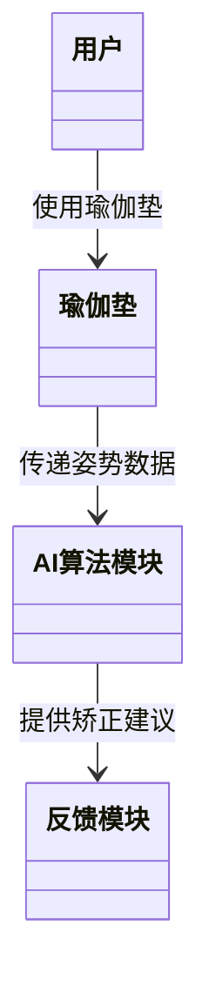
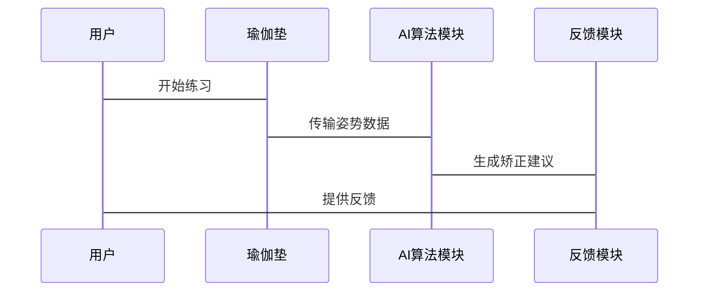

                 


# 智能瑜伽垫：AI Agent的姿势纠正系统

> 关键词：智能瑜伽垫，AI Agent，姿势纠正，深度学习，计算机视觉，实时反馈

> 摘要：随着人工智能和计算机视觉技术的快速发展，智能瑜伽垫作为一种创新的健身辅助工具，利用AI Agent实时纠正用户的瑜伽姿势，帮助用户提高练习效果，避免运动损伤。本文将详细探讨智能瑜伽垫的核心技术，包括AI Agent的工作原理、姿势识别算法、系统架构设计以及实际应用场景，最后通过项目实战展示如何实现这一系统。

---

## 第一部分: 智能瑜伽垫的背景与问题背景

### 第1章: 智能瑜伽垫的背景与问题背景

#### 1.1 传统瑜伽练习的痛点

##### 1.1.1 瑜伽练习的常见问题
瑜伽是一种古老的练习形式，强调身体的柔韧性、平衡性和内在的平静。然而，许多人在练习时容易犯以下几个常见问题：
- **姿势不标准**：错误的姿势可能导致运动损伤，影响练习效果。
- **缺乏指导**：在家练习时，没有专业的教练实时指导，容易出现动作偏差。
- **反馈延迟**：传统瑜伽课程中，反馈通常是课后，无法实时纠正错误。

##### 1.1.2 瑜伽练习中的姿势矫正需求
正确的姿势是瑜伽练习的关键。姿势矫正不仅关乎练习效果，还直接关系到练习者的健康。错误的姿势可能导致肌肉拉伤、关节损伤等问题。因此，实时姿势矫正的需求日益增长。

##### 1.1.3 现有瑜伽辅助工具的局限性
目前市面上的瑜伽辅助工具主要包括镜子、瑜伽砖、 straps 等物理辅助工具。这些工具虽然在一定程度上帮助练习者调整姿势，但存在以下局限性：
- 无法实时反馈错误姿势。
- 无法提供个性化的矫正建议。
- 依赖练习者的自我观察能力。

#### 1.2 AI技术在健身领域的应用趋势

##### 1.2.1 AI在健身领域的应用现状
AI技术在健身领域的应用日益广泛，包括智能手表、健身APP、智能镜子等。这些工具利用AI技术帮助用户监控运动数据、提供个性化建议、实时反馈运动表现。

##### 1.2.2 AI技术如何提升瑜伽练习体验
AI技术可以通过以下方式提升瑜伽练习体验：
- **实时姿势识别**：通过摄像头或传感器捕捉用户姿势，利用AI算法进行实时分析。
- **个性化矫正建议**：根据用户的姿势问题提供针对性的矫正建议。
- **实时反馈**：通过语音或屏幕提示，实时指导用户调整姿势。

##### 1.2.3 智能瑜伽垫的市场前景
智能瑜伽垫结合了AI技术和瑜伽练习的需求，具有广阔的市场前景。随着人们对健康生活的追求不断增加，智能健身设备的需求将持续增长。智能瑜伽垫作为一种创新的产品，将为用户提供更加智能化、个性化的练习体验。

#### 1.3 智能瑜伽垫的定义与目标

##### 1.3.1 智能瑜伽垫的核心定义
智能瑜伽垫是一种结合了AI技术的瑜伽垫，能够实时识别用户的瑜伽姿势，并通过语音或屏幕提示提供实时反馈和矫正建议。

##### 1.3.2 产品目标与用户需求
智能瑜伽垫的目标是帮助用户提高瑜伽练习效果，减少运动损伤，提升练习体验。用户需求包括：
- 实时姿势识别与反馈。
- 个性化矫正建议。
- 简单易用的操作界面。

##### 1.3.3 边界与外延
智能瑜伽垫的功能边界在于提供姿势识别和矫正建议，不涉及其他健身领域的功能。其外延可以扩展到其他类型的健身练习，如 Pilates 或普拉提。

#### 1.4 核心要素与概念结构

##### 1.4.1 智能瑜伽垫的功能模块
智能瑜伽垫主要包括以下功能模块：
- **姿势识别模块**：通过摄像头或传感器捕捉用户姿势。
- **AI算法模块**：利用深度学习算法分析姿势，识别错误。
- **反馈模块**：通过语音或屏幕提示提供矫正建议。

##### 1.4.2 系统的核心要素组成
系统的组成包括：
- **硬件部分**：瑜伽垫、摄像头、传感器。
- **软件部分**：AI算法、姿势识别模型、反馈系统。

##### 1.4.3 系统的层次结构与模块划分
系统的层次结构可以划分为：
1. **数据采集层**：负责采集用户姿势数据。
2. **数据处理层**：对数据进行预处理和分析。
3. **算法层**：利用深度学习算法识别姿势。
4. **反馈层**：将结果反馈给用户。

---

## 第二部分: AI Agent与姿势纠正系统的核心概念

### 第2章: AI Agent的基本原理与实现

#### 2.1 AI Agent的核心概念

##### 2.1.1 AI Agent的定义与特点
AI Agent是一种智能体，能够感知环境并采取行动以实现目标。在智能瑜伽垫中，AI Agent负责分析用户的姿势数据，并提供矫正建议。

##### 2.1.2 AI Agent的分类与应用场景
AI Agent可以分为基于规则的Agent和基于学习的Agent。在智能瑜伽垫中，主要使用基于深度学习的Agent，能够通过大量数据训练，自动识别姿势。

##### 2.1.3 AI Agent在智能瑜伽垫中的角色
AI Agent在智能瑜伽垫中扮演“智能教练”的角色，负责实时分析用户姿势，提供反馈和建议。

#### 2.2 姿势纠正系统的实现原理

##### 2.2.1 姿势识别的基本原理
姿势识别主要依赖于深度学习技术，通过训练大量的瑜伽姿势图像，模型能够识别用户当前的姿势。

##### 2.2.2 姿势纠正的算法流程
姿势纠正的算法流程包括：
1. **数据采集**：获取用户姿势图像。
2. **数据预处理**：调整图像大小，归一化数据。
3. **姿势识别**：利用深度学习模型识别姿势。
4. **错误检测**：判断姿势是否标准。
5. **反馈生成**：生成矫正建议。

##### 2.2.3 系统的反馈机制与用户交互
系统通过语音或屏幕提示反馈矫正建议，用户可以根据反馈调整姿势，系统实时更新分析结果。

#### 2.3 AI Agent与姿势纠正系统的结合

##### 2.3.1 AI Agent在姿势识别中的作用
AI Agent通过深度学习模型，实时分析用户姿势，识别错误动作。

##### 2.3.2 系统的实时反馈机制
系统根据AI Agent的分析结果，实时反馈矫正建议，帮助用户调整姿势。

##### 2.3.3 用户行为分析与个性化建议
系统通过长期记录用户的练习数据，分析用户的习惯和常见错误，提供个性化的矫正建议。

---

## 第三部分: 算法原理与数学模型

### 第3章: 姿势识别算法的实现原理

#### 3.1 姿势识别算法的流程

##### 3.1.1 数据采集与预处理
数据采集通常通过摄像头进行，预处理包括图像增强、噪声消除等。

##### 3.1.2 关键点检测算法
关键点检测是姿势识别的核心，常用的方法包括基于骨骼的姿势识别。

##### 3.1.3 姿势分类与评估
利用预训练的深度学习模型，对用户姿势进行分类，并评估其正确性。

#### 3.2 姿势识别的数学模型

##### 3.2.1 基于深度学习的姿势识别模型
常用的模型包括卷积神经网络（CNN）和图神经网络（GCN）。

##### 3.2.2 模型的训练与优化
训练过程包括数据标注、模型选择、损失函数优化等。

##### 3.2.3 姿势分类与评估的数学公式
例如，使用交叉熵损失函数：
$$ L = -\sum_{i=1}^{n} y_i \log(p_i) + (1-y_i)\log(1-p_i) $$
其中，$y_i$ 是标签，$p_i$ 是模型预测的概率。

---

## 第四部分: 系统分析与架构设计方案

### 第4章: 系统分析与架构设计

#### 4.1 问题场景介绍
用户在家中使用智能瑜伽垫进行瑜伽练习，系统实时监测用户的姿势，提供反馈。

#### 4.2 系统功能设计

##### 4.2.1 领域模型设计
使用Mermaid类图描述系统模块之间的关系。



#### 4.3 系统架构设计

##### 4.3.1 模块划分与交互
使用Mermaid架构图描述系统架构。


#### 4.4 系统接口设计

##### 4.4.1 数据接口
数据接口包括摄像头数据接口和用户输入接口。

##### 4.4.2 API设计
提供RESTful API，供第三方应用调用。

#### 4.5 系统交互设计

##### 4.5.1 交互流程
使用Mermaid序列图描述系统交互流程。



---

## 第五部分: 项目实战

### 第5章: 项目实战

#### 5.1 环境安装

##### 5.1.1 开发环境配置
安装Python、TensorFlow、OpenCV等库。

##### 5.1.2 依赖管理
使用virtualenv管理虚拟环境。

#### 5.2 系统核心实现

##### 5.2.1 姿势识别模块实现
使用OpenCV进行图像采集和预处理。

##### 5.2.2 AI算法实现
基于TensorFlow训练深度学习模型。

##### 5.2.3 反馈模块实现
通过语音库生成反馈提示。

#### 5.3 代码实现

##### 5.3.1 数据预处理代码
```python
import cv2

def preprocess_image(image):
    # 调整图像大小
    image = cv2.resize(image, (224, 224))
    # 归一化处理
    image = image / 255.0
    return image
```

##### 5.3.2 模型训练代码
```python
import tensorflow as tf

model = tf.keras.Sequential([
    tf.keras.layers.Conv2D(32, (3,3), activation='relu', input_shape=(224, 224, 3)),
    tf.keras.layers.MaxPooling2D(2,2),
    tf.keras.layers.Conv2D(64, (3,3), activation='relu'),
    tf.keras.layers.MaxPooling2D(2,2),
    tf.keras.layers.Flatten(),
    tf.keras.layers.Dense(128, activation='relu'),
    tf.keras.layers.Dense(10, activation='softmax')
])

model.compile(optimizer='adam', loss='sparse_categorical_crossentropy', metrics=['accuracy'])
model.fit(x_train, y_train, epochs=10, batch_size=32)
```

#### 5.4 实际案例分析

##### 5.4.1 案例背景
用户在进行树式姿势练习时，系统识别到姿势不正确。

##### 5.4.2 系统反馈
系统通过语音提示：“请调整左脚位置。”

##### 5.4.3 调整后的姿势
用户调整姿势后，系统反馈：“姿势正确，请继续保持。”

#### 5.5 项目小结

##### 5.5.1 实战经验总结
通过项目实战，验证了AI技术在姿势识别中的应用效果。

##### 5.5.2 系统实现的关键点
- 数据采集与预处理。
- 模型训练与优化。
- 系统反馈与用户交互。

##### 5.5.3 项目实现的难点
- 姿势识别的准确性。
- 系统反馈的实时性。

---

## 第六部分: 总结与展望

### 第6章: 总结与展望

#### 6.1 最佳实践 tips

##### 6.1.1 系统设计 tips
- 确保数据采集的准确性和实时性。
- 优化模型的训练效率和识别精度。

##### 6.1.2 项目实现 tips
- 选择合适的深度学习框架和工具。
- 注重系统的反馈机制设计。

#### 6.2 小结
智能瑜伽垫通过AI技术实现了实时姿势纠正，为用户提供了智能化的瑜伽练习体验。

#### 6.3 注意事项

##### 6.3.1 数据隐私
用户数据的隐私保护是系统设计中的重要考虑因素。

##### 6.3.2 系统稳定性
确保系统的稳定性和可靠性，避免因技术问题影响用户体验。

#### 6.4 拓展阅读

##### 6.4.1 深度学习与计算机视觉
推荐学习深度学习和计算机视觉的基础知识。

##### 6.4.2 AI在健身领域的应用
阅读更多关于AI在健身领域的应用案例和研究论文。

---

通过以上内容，我们可以看到，智能瑜伽垫作为一种结合了AI技术的创新产品，能够为用户提供智能化的瑜伽练习体验。随着技术的不断进步，未来智能瑜伽垫的功能将更加完善，用户体验也将不断提升。

