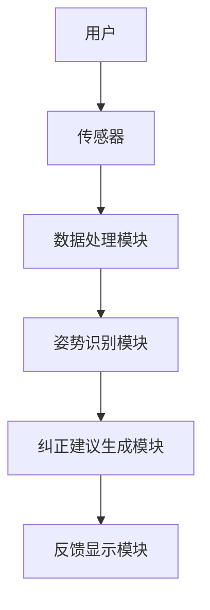
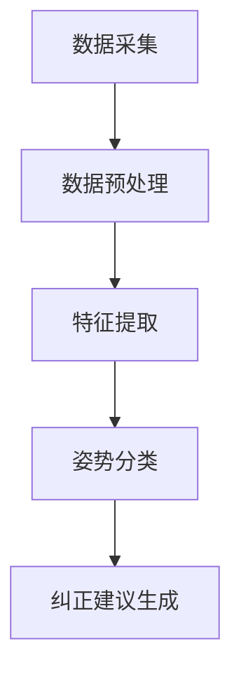

                 


# 智能瑜伽垫：AI Agent的实时姿势纠正系统

> 关键词：AI Agent、实时姿势纠正、物联网技术、传感器数据采集、瑜伽健身、健康科技、智能设备

> 摘要：智能瑜伽垫是一种结合AI技术的创新健身工具，它通过实时姿势纠正帮助用户提高瑜伽练习的效果和安全性。本文详细探讨了智能瑜伽垫的核心概念、算法原理、系统架构设计、项目实现及未来发展方向，为读者提供全面的技术解读。

---

# 第一部分: 智能瑜伽垫的背景与核心概念

## 第1章: 智能瑜伽垫的背景介绍

### 1.1 问题背景与描述

现代人生活节奏快，久坐不动导致身体姿势问题日益严重。瑜伽作为一种有效的健身方式，可以帮助人们改善体态、增强柔韧性和力量。然而，传统瑜伽练习依赖于个人的经验和教练的指导，存在以下问题：

- **姿势不标准**：许多人在没有教练指导的情况下练习瑜伽，容易导致姿势不正确，影响锻炼效果甚至引发运动损伤。
- **缺乏反馈**：传统的瑜伽垫无法提供实时反馈，用户难以及时纠正错误姿势。
- **个性化需求**：每个人的身体条件不同，需要个性化的指导和反馈。

### 1.2 智能瑜伽垫的解决方案

智能瑜伽垫通过集成传感器和AI技术，能够实时监测用户的姿势，并通过反馈系统提供纠正建议。这种创新的解决方案不仅提高了练习的准确性，还能帮助用户避免运动损伤，提升健身效果。

### 1.3 边界与外延

智能瑜伽垫的核心功能包括：

- **实时姿势监测**：通过传感器采集用户姿势数据。
- **姿势纠正建议**：基于AI算法分析数据，提供纠正建议。
- **反馈显示**：通过语音或屏幕显示反馈信息。

系统的边界包括：

- **硬件部分**：智能瑜伽垫本身、传感器、显示模块。
- **软件部分**：AI算法、数据处理模块、反馈模块。

## 第2章: 核心概念与联系

### 2.1 AI Agent的基本原理

AI Agent（智能体）是一种能够感知环境并采取行动以实现目标的实体。在智能瑜伽垫中，AI Agent负责分析传感器数据并生成纠正建议。

- **AI Agent的特点**：
  - 自主性：能够独立决策。
  - 反应性：能够实时响应环境变化。
  - 目标导向：以提高用户姿势的准确性为目标。

### 2.2 实时姿势纠正系统的原理

实时姿势纠正系统通过以下步骤实现：

1. **数据采集**：传感器采集用户的姿势数据。
2. **数据处理**：对采集的数据进行预处理，提取关键特征。
3. **姿势识别**：基于AI算法识别用户当前的姿势。
4. **纠正建议生成**：根据识别结果生成纠正建议。

### 2.3 核心概念对比表

| **核心概念** | **传统健身设备** | **智能瑜伽垫** |
|--------------|------------------|----------------|
| 数据采集     | 无实时反馈       | 实时采集姿势数据 |
| 姿势分析     | 依赖人工经验      | AI自动分析     |
| 反馈机制     | 无或延迟反馈     | 实时语音或屏幕反馈 |

### 2.4 系统架构图



---

# 第二部分: 算法原理与数学模型

## 第3章: 算法原理与数学模型

### 3.1 姿势识别算法

#### 3.1.1 数据采集与预处理

- **数据采集**：使用压力传感器和惯性传感器采集用户在瑜伽垫上的姿势数据。
- **数据预处理**：对采集的数据进行归一化处理，去除噪声。

#### 3.1.2 姿势识别的数学模型

姿势识别的核心是通过机器学习算法对用户姿势进行分类。常用的算法包括支持向量机（SVM）和随机森林（Random Forest）。

- **SVM数学模型**：
  $$ \text{分类结果} = \text{sign}(w \cdot x + b) $$
  其中，\( w \) 是权重向量，\( x \) 是输入特征，\( b \) 是偏置项。

#### 3.1.3 算法流程图



### 3.2 姐妹纠正算法

#### 3.2.1 纠正建议的生成逻辑

纠正建议生成模块根据姿势分类结果，提供具体的纠正建议。例如，如果用户在下犬式中臀部过高，系统会建议调整臀部位置。

#### 3.2.2 算法的数学公式

纠正建议生成模块的数学模型可以表示为：

$$ \text{纠正建议} = f(\text{姿势偏差}) $$

其中，\( f \) 是一个基于机器学习的函数，用于将姿势偏差映射到具体的纠正建议。

---

# 第三部分: 系统分析与架构设计

## 第4章: 系统分析与架构设计

### 4.1 问题场景介绍

用户在练习瑜伽时，可能因为姿势不正确导致运动损伤。智能瑜伽垫通过实时监测和反馈，帮助用户纠正姿势，避免受伤。

### 4.2 系统功能设计

智能瑜伽垫的核心功能包括：

- **数据采集**：通过传感器采集用户姿势数据。
- **姿势识别**：基于AI算法识别用户姿势。
- **纠正建议生成**：根据识别结果生成纠正建议。
- **反馈显示**：通过语音或屏幕显示反馈信息。

### 4.3 系统架构图


### 4.4 系统接口设计

- **传感器接口**：负责采集用户姿势数据。
- **数据处理接口**：负责对传感器数据进行预处理。
- **姿势识别接口**：负责对预处理后的数据进行姿势分类。
- **纠正建议生成接口**：负责生成纠正建议。
- **反馈显示接口**：负责将纠正建议显示给用户。

---

# 第四部分: 项目实战

## 第5章: 项目实战

### 5.1 环境安装

- **硬件环境**：需要安装智能瑜伽垫、传感器模块、显示模块。
- **软件环境**：需要安装Python编程环境、机器学习库（如TensorFlow、Scikit-learn）。

### 5.2 系统核心实现源代码

以下是姿势识别模块的Python代码示例：

```python
import numpy as np
from sklearn import svm

# 数据预处理
def preprocess(data):
    # 归一化处理
    normalized_data = data / np.max(data)
    return normalized_data

# 姿势分类
def pose_classification(data):
    # 初始化SVM分类器
    clf = svm.SVC()
    # 训练模型
    clf.fit(normalized_data, labels)
    # 预测姿势
    predicted_pose = clf.predict(normalized_data)
    return predicted_pose

# 纠正建议生成
def generate_correction_suggestion(predicted_pose):
    correction_map = {
        0: "调整臀部位置",
        1: "调整肩膀位置",
        2: "调整背部姿势"
    }
    return correction_map[predicted_pose]
```

### 5.3 代码应用解读与分析

- **数据预处理**：对传感器数据进行归一化处理，确保数据在相同范围内。
- **姿势分类**：使用SVM算法对预处理后的数据进行分类，识别用户的姿势。
- **纠正建议生成**：根据分类结果，生成具体的纠正建议。

### 5.4 实际案例分析

以下是一个实际案例的分析：

- **用户数据**：传感器采集到用户在下犬式中的姿势数据。
- **数据预处理**：对数据进行归一化处理。
- **姿势分类**：SVM算法识别出用户姿势为下犬式，但臀部过高。
- **纠正建议生成**：系统生成纠正建议“调整臀部位置”。

---

# 第五部分: 最佳实践与展望

## 第6章: 最佳实践与展望

### 6.1 最佳实践 tips

- **定期校准传感器**：确保传感器的准确性。
- **更新算法模型**：定期更新AI算法，提高姿势识别的准确性。
- **用户反馈机制**：根据用户反馈不断优化纠正建议。

### 6.2 未来展望

未来，智能瑜伽垫可能会集成更多传感器，如心率监测器和温度传感器，提供更全面的健身反馈。同时，AI算法可能会更加智能化，能够根据用户的个性化需求提供定制化的健身建议。

---

# 结语

智能瑜伽垫是一种结合AI技术的创新健身工具，它通过实时姿势纠正帮助用户提高瑜伽练习的效果和安全性。本文详细探讨了智能瑜伽垫的核心概念、算法原理、系统架构设计、项目实现及未来发展方向，为读者提供全面的技术解读。

感谢您的阅读！如果对智能瑜伽垫感兴趣，可以进一步了解相关技术或尝试自己动手实现。

---

