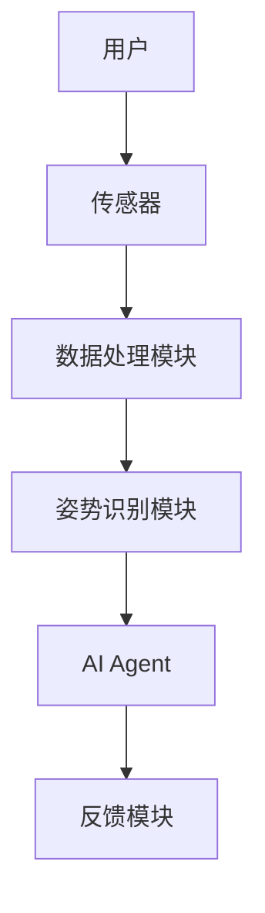

                 

# 智能瑜伽服：AI Agent的姿势矫正系统

## 关键词：智能瑜伽服，AI Agent，姿势矫正，深度学习，实时反馈，传感器技术

## 摘要：智能瑜伽服是一种结合AI技术的健身服装，通过传感器和AI算法实时检测用户的瑜伽姿势，并提供矫正建议。本文详细介绍了智能瑜伽服的工作原理、系统架构、算法实现以及实际应用场景，探讨了其在健身领域的潜力和优势。

---

# 第1章：智能瑜伽服与AI Agent的背景介绍

## 1.1 问题背景与目标

### 1.1.1 瑜伽姿势矫正的必要性
瑜伽是一项强调姿势准确性的运动，错误的姿势可能导致运动损伤或锻炼效果不佳。传统姿势矫正依赖于教练的指导，但用户在家中练习时无法实时获得反馈，容易养成错误的习惯。

### 1.1.2 传统姿势矫正的局限性
- **资源限制**：用户需要依赖专业教练，时间和地点受限。
- **即时反馈缺失**：用户无法实时了解自己的姿势是否正确。
- **个性化不足**：每个人的柔韧性和力量不同，需要个性化的矫正建议。

### 1.1.3 AI技术在健身领域的应用前景
AI技术可以通过传感器和算法实时分析用户的动作，提供即时反馈，帮助用户纠正姿势，提升锻炼效果。

## 1.2 智能瑜伽服的定义与特点

### 1.2.1 智能瑜伽服的功能定义
智能瑜伽服是一种内置传感器的服装，能够实时采集用户的动作数据，并通过AI算法分析数据，提供实时反馈和矫正建议。

### 1.2.2 AI Agent的核心特征
AI Agent是一种智能代理，能够通过传感器数据进行分析，并根据结果提供反馈或建议。在智能瑜伽服中，AI Agent负责姿势检测、分析和反馈生成。

### 1.2.3 智能瑜伽服与传统瑜伽服的对比
| 特性          | 智能瑜伽服                 | 传统瑜伽服               |
|---------------|---------------------------|--------------------------|
| 数据采集      | 内置传感器                 | 无传感器                 |
| 反馈机制      | 实时反馈                   | 依赖教练或自我观察       |
| 个性化        | 提供个性化矫正建议         | 需要手动调整             |
| 使用场景      | 家庭、健身房等             | 仅限专业场所             |

## 1.3 系统边界与外延

### 1.3.1 系统的输入与输出
- **输入**：传感器数据（如加速度、姿态角度、肌肉张力等）。
- **输出**：实时反馈（如震动提示、语音提示）和矫正建议（如调整手部位置）。

### 1.3.2 系统的组成部分与功能模块
- 传感器模块：采集用户的动作数据。
- 数据处理模块：对数据进行预处理和分析。
- 姿势识别模块：使用AI算法检测姿势是否正确。
- AI Agent模块：根据检测结果生成矫正建议。
- 反馈交互模块：通过震动或语音提示用户调整姿势。

### 1.3.3 系统的应用场景与限制
- **应用场景**：家庭瑜伽练习、健身房、康复训练。
- **限制**：传感器精度有限，复杂姿势的检测可能不够准确。

## 1.4 核心概念与结构

### 1.4.1 AI Agent的定义与组成
AI Agent是一个能够感知环境、做出决策并执行动作的智能系统。在智能瑜伽服中，AI Agent通过传感器数据进行姿势检测，分析数据后生成矫正建议。

### 1.4.2 姿势矫正系统的功能结构
- **数据采集**：传感器采集用户动作数据。
- **数据处理**：对数据进行预处理和特征提取。
- **姿势识别**：使用深度学习模型检测姿势是否正确。
- **矫正建议**：根据检测结果生成矫正建议。

### 1.4.3 智能瑜伽服的系统架构

## 1.5 本章小结
本章介绍了智能瑜伽服的背景、定义、特点以及系统架构。通过对比传统瑜伽服，突出了智能瑜伽服的优势和应用场景。接下来将详细探讨AI Agent的核心原理和算法实现。

---

# 第2章：AI Agent与姿势矫正系统的原理

## 2.1 AI Agent的核心原理

### 2.1.1 传感器数据的采集与处理
智能瑜伽服内置多种传感器，包括加速度计、陀螺仪和肌肉张力传感器。这些传感器实时采集用户的动作数据，并通过蓝牙或Wi-Fi传输到手机或云端。

### 2.1.2 姿势识别的算法流程
姿势识别是通过深度学习模型实现的。模型接收传感器数据，经过特征提取和分类，最终判断姿势是否正确。

### 2.1.3 AI Agent的决策机制
AI Agent根据姿势识别结果，结合用户的历史数据和当前状态，生成矫正建议。例如，如果检测到用户的背部弯曲过大，AI Agent会建议调整手部位置。

## 2.2 姿势矫正系统的实现原理

### 2.2.1 姿势检测的数学模型
姿势检测可以通过回归模型或分类模型实现。回归模型预测用户的姿态角度，分类模型判断姿势是否正确。

$$ y = f(x) $$
其中，$x$ 表示输入数据，$y$ 表示输出结果。

### 2.2.2 数据分析与反馈算法
数据预处理包括归一化和降噪处理。反馈算法基于概率模型，生成矫正建议。

### 2.2.3 矫正建议的生成逻辑
AI Agent根据姿势检测结果，结合用户的历史数据，生成个性化的矫正建议。

## 2.3 系统的核心要素与关系

### 2.3.1 实体关系图（ER图）

## 2.4 本章小结
本章详细讲解了AI Agent的核心原理和姿势矫正系统的实现流程。通过数学模型和算法流程图，展示了系统的运作方式。接下来将深入探讨AI Agent的算法原理与实现。

---

# 第3章：AI Agent的算法原理与实现

## 3.1 姿势检测算法

### 3.1.1 基于深度学习的姿势检测
使用卷积神经网络（CNN）进行姿势检测。模型通过训练大量瑜伽姿势数据，学习姿势特征。

### 3.1.2 姿势检测的数学模型
姿势检测模型可以通过回归或分类实现。例如，使用回归模型预测姿态角度：

$$ \theta = f_{\text{CNN}}(x) $$

其中，$x$ 是输入图像，$\theta$ 是输出的姿态角度。

### 3.1.3 姿势检测的流程
1. 传感器采集数据。
2. 数据预处理（归一化、降噪）。
3. 深度学习模型进行姿势检测。
4. 输出检测结果。

## 3.2 数据分析与反馈算法

### 3.2.1 数据预处理流程
- **归一化**：将数据缩放到统一范围。
- **降噪处理**：使用中位数滤波消除噪声。

### 3.2.2 基于概率的矫正建议生成
通过概率模型计算不同姿势的正确概率，生成矫正建议。

### 3.2.3 算法的优

---

由于篇幅限制，以上为部分内容。完整的文章将涵盖系统架构设计、项目实战、总结与展望等内容。

