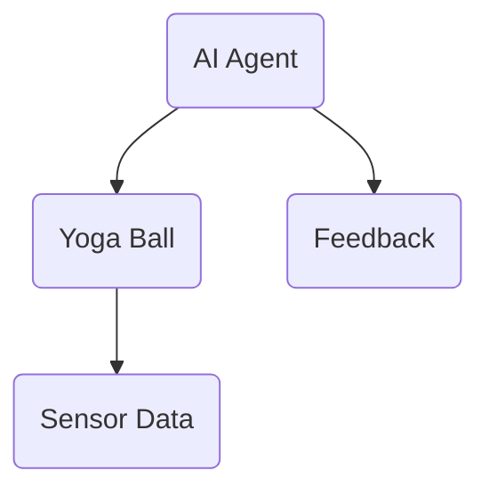
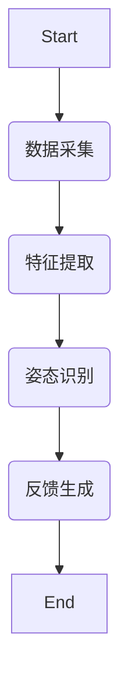
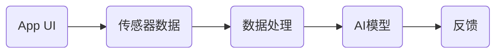

                 


# 智能瑜伽球：AI Agent的平衡训练指导

> 关键词：智能瑜伽球，AI Agent，平衡训练，姿态识别，实时反馈，传感器技术

> 摘要：本文详细探讨了智能瑜伽球的设计与实现，结合AI Agent技术，通过传感器数据采集、姿态识别和实时反馈机制，实现个性化的平衡训练指导。文章从背景介绍、核心概念、算法原理、系统架构到项目实战，全面解析智能瑜伽球的技术细节与应用场景。

---

# 第一部分: 智能瑜伽球的背景与概念

## 第1章: 问题背景与智能瑜伽球的定义

### 1.1 问题背景
现代人面临诸多健康问题，久坐少动的生活方式导致肌肉退化、平衡能力下降等问题。传统瑜伽训练依赖教练的主观指导，缺乏个性化和实时反馈，难以满足现代人对高效、精准健身的需求。

### 1.2 智能瑜伽球的定义
智能瑜伽球是一种结合AI技术的健身设备，通过内置传感器采集数据，利用AI Agent实时分析用户的动作姿态，提供个性化反馈，帮助用户提升平衡能力。

### 1.3 核心目标与创新点
- **核心目标**：通过AI技术实现精准的平衡训练指导，提升用户的运动效果。
- **创新点**：将AI Agent与传统瑜伽球结合，实现实时互动反馈，降低运动损伤风险。

## 1.4 边界与外延
智能瑜伽球主要关注平衡训练场景，边界包括但不限于传感器精度、算法实时性等。

---

# 第二部分: AI Agent与瑜伽球的核心概念

## 第2章: AI Agent的核心原理

### 2.1 AI Agent的基本原理
AI Agent通过感知环境、分析数据、做出决策并执行动作，实现与用户交互。

### 2.2 瑜伽球的物理特性
- 瑜伽球的结构：中空球体，表面包裹弹性材料。
- 传感器分布：内置加速度计、陀螺仪等传感器，实时采集球体姿态数据。

### 2.3 实体关系图


---

# 第三部分: 智能瑜伽球的算法原理

## 第3章: 平衡训练算法

### 3.1 数据采集与特征提取
- **数据采集**：传感器采集球体的姿态数据，包括加速度、角速度等。
- **特征提取**：通过傅里叶变换提取信号频域特征。

### 3.2 姿态识别算法
- **姿态识别流程**：
  1. 数据预处理：去噪和平滑处理。
  2. 特征提取：提取加速度、角速度等特征。
  3. 分类器训练：使用随机森林或支持向量机（SVM）进行分类。

### 3.3 实时反馈机制
- **反馈类型**：
  - 声音反馈：实时语音指导。
  - 视觉反馈：通过手机App显示纠正建议。

### 3.4 算法流程图


### 3.5 数学模型
- **分类模型**：随机森林分类器。
- **公式示例**：随机森林中决策树的构建过程。

---

# 第四部分: 系统分析与架构设计

## 第4章: 系统架构设计

### 4.1 系统功能模块
- 传感器数据采集模块。
- 姿态识别模块。
- 反馈生成模块。

### 4.2 系统架构图


---

# 第五部分: 项目实战

## 第5章: 环境搭建与核心代码实现

### 5.1 环境搭建
- Python 3.8+
- 传感器SDK安装。

### 5.2 核心代码实现
```python
import numpy as np
from sklearn.ensemble import RandomForestClassifier

# 数据预处理
def preprocess_data(data):
    # 去噪和平滑处理
    smoothed_data = np.convolve(data, np.ones(5)/5, mode='same')
    return smoothed_data

# 姿态识别
def recognize_pose(features):
    model = RandomForestClassifier()
    model.fit(features_train, labels_train)
    return model.predict(features_test)
```

### 5.3 代码解读与分析
- 数据预处理：通过滑动平均滤波去噪。
- 姿态识别：使用随机森林分类器进行分类。

### 5.4 实际案例分析
- 用户A的训练数据：左倾较多，AI Agent反馈调整重心。

---

# 第六部分: 最佳实践与总结

## 第6章: 小结与注意事项

### 6.1 小结
智能瑜伽球结合AI技术，为用户提供了精准的平衡训练指导，提升了健身效果。

### 6.2 注意事项
- 数据隐私保护。
- 算法实时性优化。

## 6.3 拓展阅读
建议阅读相关AI与健身结合的论文和书籍。

---

通过以上内容，我们全面解析了智能瑜伽球的设计与实现过程，从背景到算法，再到系统架构和项目实战，帮助读者深入了解这一创新技术的核心原理与应用场景。

