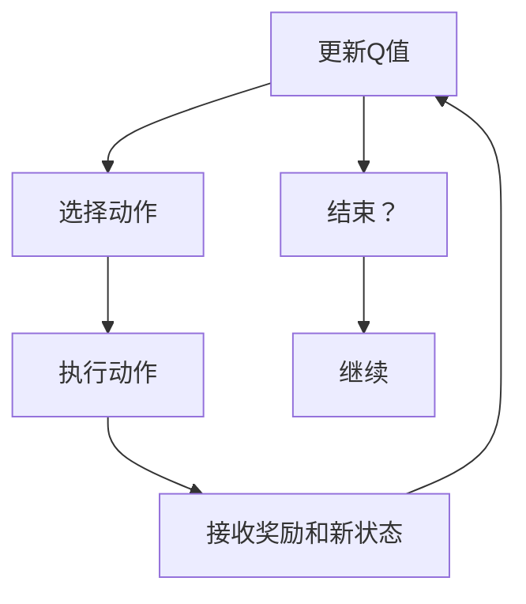
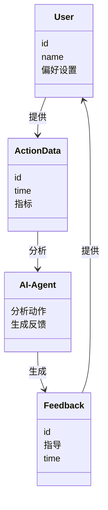

                 


# 智能瑜伽球：AI Agent的核心训练指导系统

> 关键词：AI Agent, 智能瑜伽球, 强化学习, 监督学习, 系统架构, 项目实战

> 摘要：本文探讨了智能瑜伽球作为AI Agent在瑜伽训练中的应用，详细分析了其核心原理、算法实现、系统架构及项目实战。通过结合强化学习和监督学习，智能瑜伽球能够实时指导用户进行科学训练，提升训练效果和安全性。

---

## 第一部分：智能瑜伽球的背景与核心概念

### 第1章：智能瑜伽球的背景与问题背景

#### 1.1 问题背景与问题描述

瑜伽作为一种传统的健身方式，近年来受到广泛关注。然而，传统瑜伽训练存在以下问题：
- 用户缺乏专业指导，可能导致动作错误，引发运动损伤。
- 用户难以持续保持正确的姿势和节奏，影响训练效果。
- 瑜伽教练资源有限，无法满足大规模用户需求。

智能瑜伽球通过集成AI技术，提供实时、个性化的训练指导，解决了上述问题。

#### 1.2 智能瑜伽球的定义与目标

智能瑜伽球是一种结合传统瑜伽球与人工智能技术的健身设备，旨在通过AI Agent实时分析用户的动作，并提供反馈和指导，以优化训练效果和安全性。

核心功能包括：
- 实时动作识别与反馈
- 个性化训练计划生成
- 数据收集与分析

#### 1.3 问题解决与应用场景

AI Agent在瑜伽训练中的作用：
- 提供实时反馈，纠正错误动作
- 根据用户数据优化训练计划
- 监测训练强度，预防受伤

应用场景：
- 家庭健身
- 健身房辅助工具
- 远程健身指导

---

### 第2章：AI Agent的核心概念与原理

#### 2.1 AI Agent的基本概念

AI Agent是一种智能主体，能够感知环境并采取行动以实现目标。它分为两类：
- **反应式AI Agent**：根据当前感知做出反应，适用于实时任务。
- **认知式AI Agent**：具备推理和规划能力，适用于复杂任务。

#### 2.2 AI Agent的核心原理

AI Agent在智能瑜伽球中的工作流程：
1. **感知**：通过传感器收集用户的动作数据。
2. **决策**：基于数据，使用算法生成反馈。
3. **执行**：通过反馈指导用户调整动作。

**实体关系图（ER图）**：

```mermaid
erDiagram
    user {
        用户
        id : int
        name : string
        偏好设置 : string
    }
    action_data {
        动作数据
        id : int
        time : datetime
        指标 : float
    }
    feedback {
        反馈
        id : int
        指导 : string
        time : datetime
    }
    user --> action_data : 提供
    action_data --> feedback : 生成
```

---

## 第二部分：AI Agent的算法原理与数学模型

### 第3章：强化学习算法的数学模型

#### 3.1 Q-learning算法的数学公式

Q-learning是一种常用的强化学习算法，公式如下：

$$ Q(s, a) = r + \gamma \max Q(s', a') $$

其中：
- \( Q(s, a) \)：状态s和动作a的Q值
- \( r \)：奖励
- \( \gamma \)：折扣因子
- \( s' \)：下一状态

**算法流程图（Mermaid）**：



#### 3.2 监督学习算法的数学模型

监督学习通过训练数据学习函数\( f: X \rightarrow Y \)。

**线性回归模型**：

$$ y = \theta x + b $$

**神经网络模型**：

$$ y = f(Wx + b) $$

---

### 第4章：AI Agent的算法实现

#### 4.1 强化学习算法实现

**代码实现（Python）**：

```python
import numpy as np

class QLearning:
    def __init__(self, state_size, action_size, gamma=0.99):
        self.gamma = gamma
        self.q_table = np.zeros((state_size, action_size))
    
    def choose_action(self, state, epsilon=0.1):
        if np.random.random() < epsilon:
            return np.random.randint(action_size)
        return np.argmax(self.q_table[state])
    
    def learn(self, state, action, reward, next_state):
        self.q_table[state][action] = reward + self.gamma * np.max(self.q_table[next_state])
```

---

## 第三部分：系统分析与架构设计方案

### 第5章：系统架构设计

**系统功能设计（Mermaid类图）**：



---

## 第四部分：项目实战

### 第6章：项目实战

#### 6.1 环境安装

安装必要的库：
```bash
pip install numpy matplotlib scikit-learn
```

#### 6.2 核心实现

**AI-Agent实现**：

```python
def analyze_action(user_data):
    # 数据预处理
    # 使用监督学习模型预测反馈
    pass

def generate_feedback(predicted_output):
    return "调整姿势"
```

---

## 第五部分：总结与展望

### 第7章：总结与展望

智能瑜伽球通过AI Agent实现了个性化的瑜伽训练指导，结合强化学习和监督学习，显著提升了训练效果和安全性。未来，可以进一步优化算法，集成更多传感器，提供更精准的指导。

---

通过以上步骤，智能瑜伽球的系统设计和实现得以全面展示，为读者提供了从理论到实践的详细指导。

