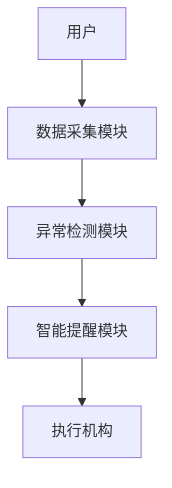

                 

# 第4章: 智能瓦斯炉的系统分析与架构设计

## 4.1 问题场景介绍

在智能瓦斯炉的实际应用中，用户可能面临多种烹饪场景，包括日常烹饪、多人烹饪、紧急情况等。这些场景中，瓦斯炉的安全监控显得尤为重要。例如，用户在烹饪过程中可能忘记关闭火源，或者锅底过热引发火灾风险。此外，家庭成员中可能有老人或儿童使用瓦斯炉，他们可能在操作过程中出现失误，导致安全隐患。因此，设计一个能够实时监控烹饪过程、识别异常情况并及时提醒或干预的智能瓦斯炉系统至关重要。

## 4.2 系统功能设计

智能瓦斯炉的功能设计围绕实时监控、异常检测和智能提醒展开。以下是系统的主要功能模块：

### 4.2.1 实时监控模块
该模块负责采集瓦斯炉的实时数据，包括火焰温度、气体浓度、烟雾浓度等。通过传感器采集数据，并通过无线通信模块将数据传输到AI Agent进行处理。

### 4.2.2 异常检测模块
基于机器学习算法，分析采集到的数据，判断是否存在异常情况。例如，检测到烟雾浓度突然升高，可能意味着烹饪过程中发生火灾风险。

### 4.2.3 智能提醒模块
当检测到异常情况时，系统会通过语音或手机APP通知用户，并建议采取相应的措施，如关闭火源或开启排烟系统。

## 4.3 系统架构设计

智能瓦斯炉的系统架构分为硬件部分和软件部分。硬件部分包括传感器、通信模块和执行机构，软件部分包括数据采集、异常检测和智能提醒模块。

### 4.3.1 硬件架构
硬件部分主要由以下几部分组成：
1. **传感器模块**：包括温度传感器、烟雾传感器、气体传感器等，用于采集烹饪环境的实时数据。
2. **通信模块**：通过Wi-Fi或蓝牙将数据传输到AI Agent。
3. **执行机构**：包括电磁阀、电机等，用于在异常情况下关闭火源或启动排烟系统。

### 4.3.2 软件架构
软件部分包括数据采集、异常检测和智能提醒模块：
1. **数据采集模块**：负责从传感器获取数据，并将其传递给异常检测模块。
2. **异常检测模块**：基于机器学习算法，分析数据，判断是否存在异常情况。
3. **智能提醒模块**：根据检测结果，触发相应的提醒或执行机构。

## 4.4 系统接口设计

系统接口设计包括以下几个方面：

### 4.4.1 传感器接口
传感器模块通过I2C或SPI接口与主控芯片连接，将采集到的环境数据传输到主控芯片。

### 4.4.2 通信接口
主控芯片通过Wi-Fi或蓝牙模块与云端服务器或手机APP进行通信，接收用户的操作指令或发送异常提醒。

### 4.4.3 执行机构接口
主控芯片通过继电器或PWM信号控制电磁阀和电机，实现火源的开启和关闭。

## 4.5 系统交互设计

系统交互设计主要体现在用户与智能瓦斯炉的互动过程中。以下是系统在正常操作和异常情况下的交互流程。

### 4.5.1 正常操作流程
1. 用户通过手机APP或触摸屏启动烹饪程序。
2. 系统采集烹饪环境的实时数据，并将其传输给AI Agent进行分析。
3. AI Agent判断是否存在异常情况，如果没有异常，继续监控。
4. 如果检测到异常情况，AI Agent触发提醒机制，通知用户采取相应措施。

### 4.5.2 异常情况处理流程
1. 系统检测到烟雾浓度突然升高，判断为火灾风险。
2. AI Agent立即关闭火源，并启动排烟系统。
3. 系统通过手机APP或语音提醒用户检查烹饪情况。

## 4.6 系统功能模块的交互关系

以下是系统功能模块的交互关系图：

## 4.7 本章小结

本章详细介绍了智能瓦斯炉的系统分析与架构设计，包括问题场景、系统功能设计、硬件架构、软件架构、系统接口设计和系统交互设计。通过合理的系统架构设计和功能模块划分，确保了智能瓦斯炉的安全性和可靠性。

接下来的章节将进入项目实战部分，详细介绍如何搭建智能瓦斯炉的开发环境，编写核心代码，并通过实际案例分析系统的实现过程。

