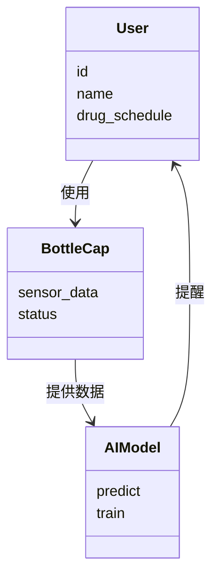
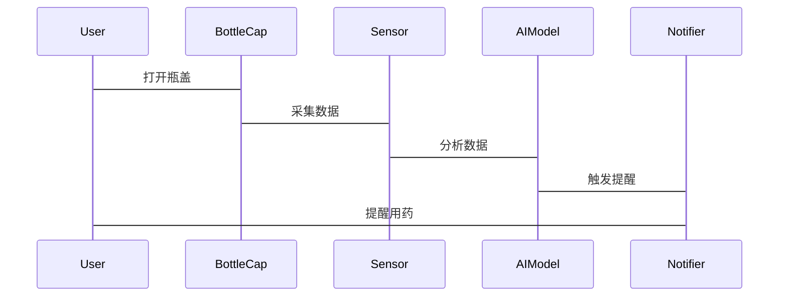

                 


# 智能瓶盖：AI Agent的药物服用提醒

> 关键词：智能瓶盖，AI Agent，药物提醒，物联网，健康管理

> 摘要：本文探讨了智能瓶盖作为AI Agent在药物服用提醒中的应用，分析了其背后的技术原理、系统架构及实现细节，结合实际案例展示了其在健康管理中的潜力。

---

# 第一部分: 背景介绍

# 第1章: 背景与问题描述

## 1.1 智能瓶盖的背景介绍

### 1.1.1 老龄化社会中的用药问题

随着全球人口老龄化的加剧，慢性病患者数量急剧增加。按时服用药物是维持患者健康的关键，但许多患者因记忆力减退或生活节奏混乱而常常忘记服药，导致病情加重。这一问题在老年人群体中尤为突出。

### 1.1.2 药物误服的危害与现状

药物误服或漏服可能导致病情恶化，甚至引发严重并发症。据统计，约30%的老年人因用药不当住院治疗，这不仅增加了医疗负担，也给家庭和社会带来了巨大的压力。

### 1.1.3 智能瓶盖的提出与意义

智能瓶盖通过集成AI技术，能够实时监测用户的用药行为，并在需要时主动提醒用户服药。这一创新不仅提高了用药依从性，还能有效降低医疗风险。

### 1.1.4 核心概念与外延

智能瓶盖作为一个智能设备，集成了传感器、AI算法和通信模块，能够感知用户行为、分析数据并执行提醒操作。其外延包括与云端的连接、与其他健康设备的联动等。

## 1.2 问题背景与目标

### 1.2.1 药物服用提醒的核心问题

如何准确监测用户是否按时服药，并在必要时提供有效提醒，是智能瓶盖需要解决的核心问题。

### 1.2.2 智能瓶盖的目标与边界

智能瓶盖的目标是通过AI技术实现药物服用的智能化提醒，其边界包括不涉及医疗诊断、不处理药物存储以外的功能。

### 1.2.3 核心要素与系统组成

智能瓶盖的核心要素包括：传感器（监测盖子开启状态）、AI算法（分析数据并触发提醒）、通信模块（与手机或云端交互）和用户界面（显示提醒信息）。

---

# 第二部分: 核心概念与联系

# 第2章: AI Agent的核心原理

## 2.1 AI Agent的基本原理

### 2.1.1 感知与数据采集

智能瓶盖通过内置的传感器感知盖子的开闭状态，从而判断用户是否进行了药物取出操作。

### 2.1.2 数据分析与决策

AI算法根据采集的数据分析用户的行为模式，判断是否需要触发提醒。

### 2.1.3 行为与反馈

当系统判定用户未按时服药时，会通过手机APP或语音助手发送提醒。

## 2.2 智能瓶盖的实体关系图

```mermaid
graph TD
    User-->BottleCap: 使用
    BottleCap-->Sensor: 数据采集
    Sensor-->AIModel: 数据分析
    AIModel-->Notifier: 通知
    Notifier-->User: 提醒
```

---

# 第三部分: 算法原理

# 第3章: 算法原理与实现

## 3.1 算法工作流程

### 3.1.1 数据采集

传感器采集盖子的开闭状态，并记录时间戳。

### 3.1.2 特征提取

从采集的数据中提取用户的用药频率、时间规律等特征。

### 3.1.3 模型训练

基于历史数据训练一个分类模型，用于预测用户是否按时服药。

### 3.1.4 决策推理

AI模型根据当前数据和模型预测结果，决定是否需要触发提醒。

### 3.1.5 反馈优化

根据用户反馈优化模型，提高提醒的准确性。

## 3.2 算法实现代码

```python
import pandas as pd
from sklearn.ensemble import RandomForestClassifier
from sklearn.metrics import accuracy_score

# 数据加载与预处理
data = pd.read_csv('drug_data.csv')
X = data[['time_diff', 'freq_pattern']]
y = data['label']

# 模型训练
model = RandomForestClassifier()
model.fit(X, y)

# 模型预测
predicted = model.predict(X)
print("Accuracy:", accuracy_score(y, predicted))
```

## 3.3 数学模型

### 3.3.1 分类模型

使用随机森林模型进行分类，公式如下：

$$
P(y=1|x) = \sum_{i=1}^{n} w_i \cdot I(f_i(x) = 1)
$$

其中，$w_i$ 是树的重要性权重，$f_i(x)$ 是第i棵树的预测结果。

---

# 第四部分: 系统分析与架构设计

# 第4章: 系统架构与实现

## 4.1 问题场景介绍

用户忘记服药时，智能瓶盖需要通过AI Agent分析数据并触发提醒。

## 4.2 系统功能设计

### 4.2.1 领域模型



### 4.2.2 系统架构


## 4.3 接口与交互设计

### 4.3.1 系统接口

定义RESTful API：

- POST /api/training: 提交训练数据
- GET /api/predict: 获取预测结果
- POST /api/notification: 发送提醒

### 4.3.2 交互流程



---

# 第五部分: 项目实战

# 第5章: 项目实战与实现

## 5.1 环境搭建

安装必要的库：

```bash
pip install scikit-learn pandas requests
```

## 5.2 核心代码实现

### 5.2.1 数据采集代码

```python
import requests

def send_sensor_data(data):
    response = requests.post('http://localhost:8000/api/training', json=data)
    return response.status_code
```

### 5.2.2 AI模型训练代码

```python
from sklearn.model_selection import train_test_split

X_train, X_test, y_train, y_test = train_test_split(X, y)
model.fit(X_train, y_train)
print("Accuracy:", accuracy_score(model.predict(X_test), y_test))
```

## 5.3 案例分析

通过实际案例分析模型的准确性和实用性，调整算法参数以提高性能。

---

# 第六部分: 最佳实践

# 第6章: 最佳实践与总结

## 6.1 项目经验总结

总结项目中的关键点和经验教训，如传感器校准的重要性、数据隐私的保护等。

## 6.2 注意事项

提醒读者在使用智能瓶盖时注意数据隐私和系统兼容性问题。

## 6.3 拓展阅读

推荐相关领域的书籍和资源，鼓励读者深入学习AI与物联网的结合。

---

# 结语

智能瓶盖通过AI技术实现了药物服用提醒的功能，不仅提高了用药依从性，也为未来的健康管理提供了新的思路。

