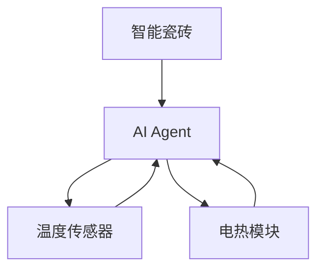
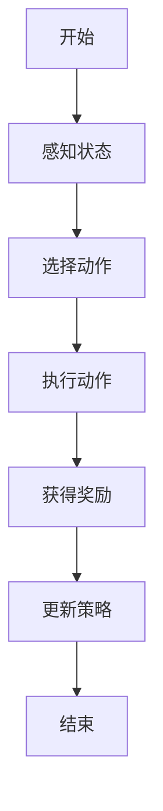
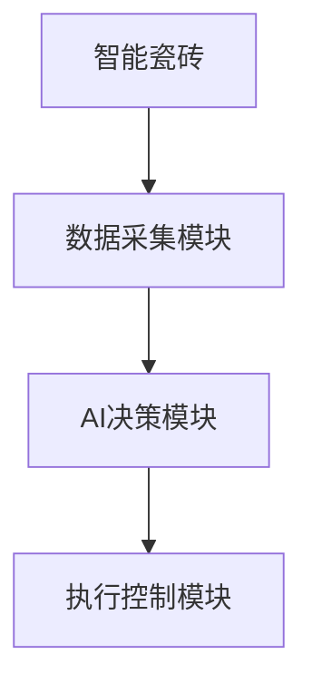

                 


# 智能瓷砖：AI Agent的室内温度均衡系统

## 关键词：智能瓷砖，AI Agent，室内温度，算法原理，系统架构，项目实战

## 摘要：智能瓷砖通过集成AI Agent技术，实现室内温度的智能调节与均衡。本文详细探讨了智能瓷砖的核心概念、AI Agent的算法原理、系统架构设计以及实际应用案例。通过系统分析与项目实战，展示了如何利用AI技术提升室内舒适度，为未来的智能建筑提供参考。

---

# 第1章 智能瓷砖与AI Agent的背景介绍

## 1.1 智能瓷砖的定义与特点

### 1.1.1 智能瓷砖的定义
智能瓷砖是一种集成感知、计算和执行能力的新型建筑材料，能够实时感知环境温度、湿度等参数，并通过AI Agent进行智能决策，实现对室内环境的主动调节。

### 1.1.2 智能瓷砖的核心特点
- **感知能力**：内置传感器，实时采集环境数据。
- **计算能力**：集成AI芯片，进行数据处理与决策。
- **执行能力**：通过电热或制冷模块调节温度。

### 1.1.3 智能瓷砖与传统瓷砖的区别
| 特性       | 传统瓷砖               | 智能瓷砖               |
|------------|------------------------|------------------------|
| 感知能力   | 无                     | 集成传感器             |
| 计算能力   | 无                     | 集成AI芯片             |
| 执行能力   | 无                     | 内置调节模块           |

---

## 1.2 AI Agent的基本概念

### 1.2.1 AI Agent的定义
AI Agent是一种智能体，能够感知环境、自主决策并执行动作，以实现特定目标。

### 1.2.2 AI Agent的核心属性
- **自主性**：无需外部干预，自主运行。
- **反应性**：实时感知环境变化并做出反应。
- **学习能力**：通过数据优化决策策略。

### 1.2.3 AI Agent与智能瓷砖的结合
智能瓷砖作为AI Agent的载体，通过实时数据反馈实现对室内温度的智能调节。

---

## 1.3 智能瓷砖在室内温度均衡中的应用背景

### 1.3.1 室内温度均衡的重要性
- 提高居住舒适度。
- 节能减排，降低能源消耗。

### 1.3.2 传统温度调节系统的局限性
- 响应速度慢，调节不精确。
- 缺乏智能化，无法实现全局优化。

### 1.3.3 智能瓷砖的优势与潜力
- 实现精准温度调节。
- 提高能源利用效率。
- 融入建筑智能化生态。

---

## 1.4 本章小结
本章介绍了智能瓷砖的核心概念、特点及其在室内温度调节中的潜力，为后续章节的深入分析奠定了基础。

---

# 第2章 智能瓷砖与AI Agent的核心概念与联系

## 2.1 AI Agent的决策机制

### 2.1.1 状态空间的定义
状态空间是AI Agent所有可能感知的状态集合，例如温度、湿度等。

### 2.1.2 动作空间的定义
动作空间是AI Agent所有可能执行的动作集合，例如开启电热模块。

### 2.1.3 奖励机制的定义
奖励机制是AI Agent在完成任务时获得的反馈，用于优化决策策略。

---

## 2.2 智能瓷砖的属性与特征

### 2.2.1 智能瓷砖的感知能力
通过传感器实时感知环境数据。

### 2.2.2 智能瓷砖的计算能力
通过AI芯片进行数据处理与决策。

### 2.2.3 智能瓷砖的执行能力
通过执行模块调节室内温度。

---

## 2.3 智能瓷砖与AI Agent的实体关系图



---

## 2.4 本章小结
本章分析了智能瓷砖与AI Agent的核心概念及其相互关系，为后续算法设计提供了理论基础。

---

# 第3章 AI Agent的算法原理

## 3.1 状态空间的构建

### 3.1.1 状态空间的定义
状态空间是AI Agent所有可能感知的状态集合。

### 3.1.2 状态空间的划分
将温度、湿度等参数划分为多个状态。

### 3.1.3 状态空间的表示
使用向量表示状态，例如 `[温度, 湿度]`。

---

## 3.2 动作空间的定义与选择

### 3.2.1 动作空间的定义
动作空间是AI Agent所有可能执行的动作集合。

### 3.2.2 动作空间的选择
根据当前状态选择最优动作。

### 3.2.3 动作空间的优化
通过反馈优化动作空间。

---

## 3.3 奖励机制的设计

### 3.3.1 奖励机制的定义
奖励机制是AI Agent在完成任务时获得的反馈。

### 3.3.2 奖励机制的设计原则
- 鼓励接近目标状态。
- 处罚偏离目标状态。

### 3.3.3 奖励机制的实现
$$ reward = \text{if } \text{当前温度} = \text{目标温度} \text{ then } 1 \text{ else } 0 $$

---

## 3.4 算法流程图



---

## 3.5 本章小结
本章详细讲解了AI Agent的算法原理，包括状态空间、动作空间和奖励机制的设计。

---

# 第4章 系统分析与架构设计

## 4.1 问题场景介绍

### 4.1.1 室内温度不均衡的问题
- 不同区域温度差异大。
- 能源浪费严重。

### 4.1.2 智能瓷砖的解决方案
- 实现实时温度感知。
- 智能调节温度。

---

## 4.2 系统功能设计

### 4.2.1 系统功能模块划分
- 数据采集模块。
- AI决策模块。
- 执行控制模块。

### 4.2.2 功能模块的交互关系
- 数据采集模块向AI决策模块提供环境数据。
- AI决策模块向执行控制模块发送调节指令。

---

## 4.3 系统架构设计

### 4.3.1 系统架构图


### 4.3.2 系统接口设计
- 数据采集模块与AI决策模块通过HTTP接口通信。
- AI决策模块与执行控制模块通过MQTT协议通信。

---

## 4.4 本章小结
本章详细分析了智能瓷砖系统的架构设计，为后续的项目实现提供了指导。

---

# 第5章 项目实战

## 5.1 环境安装

### 5.1.1 系统环境
- 操作系统：Linux。
- 开发工具：Python、TensorFlow。

### 5.1.2 硬件安装
- 智能瓷砖模块。
- 传感器模块。
- 执行模块。

---

## 5.2 系统核心实现源代码

### 5.2.1 数据采集模块
```python
def get_temperature():
    return 25  # 示例温度值
```

### 5.2.2 AI决策模块
```python
def decide_action(current_temp, target_temp):
    if current_temp < target_temp:
        return 'increase'
    else:
        return 'decrease'
```

### 5.2.3 执行控制模块
```python
def control_heating(action):
    if action == 'increase':
        return True
    else:
        return False
```

---

## 5.3 代码应用解读与分析
- 数据采集模块负责获取环境数据。
- AI决策模块根据数据做出决策。
- 执行控制模块根据决策执行调节动作。

---

## 5.4 实际案例分析
在实际应用中，智能瓷砖可以根据室内人员数量自动调节温度，实现舒适与节能的双重目标。

---

## 5.5 本章小结
本章通过实际项目案例，详细讲解了智能瓷砖系统的实现过程。

---

# 第6章 系统优化与扩展

## 6.1 系统优化策略

### 6.1.1 算法优化
- 使用强化学习优化奖励机制。

### 6.1.2 系统性能优化
- 提高传感器的采样频率。
- 优化AI决策模块的计算效率。

---

## 6.2 算法调优

### 6.2.1 调整奖励机制
$$ reward = 0.5 \times \text{温度匹配度} + 0.5 \times \text{能耗效率} $$

### 6.2.2 算法调优案例
通过调整学习率，提高了AI Agent的决策效率。

---

## 6.3 系统扩展

### 6.3.1 系统扩展方向
- 扩展到更多房间。
- 支持更多环境参数。

---

## 6.4 本章小结
本章讨论了系统的优化与扩展策略，为实际应用提供了参考。

---

# 第7章 最佳实践与未来展望

## 7.1 最佳实践

### 7.1.1 系统设计
- 采用模块化设计。
- 确保系统的可扩展性。

### 7.1.2 实施建议
- 分阶段部署。
- 逐步优化系统。

---

## 7.2 未来展望

### 7.2.1 技术发展趋势
- 更高的智能化水平。
- 更强的环境适应能力。

### 7.2.2 应用前景
- 智能建筑。
- 智慧城市。

---

## 7.3 本章小结
本章总结了智能瓷砖系统的最佳实践，并展望了未来的发展方向。

---

# 附录

## 附录A 算法实现代码

```python
def main():
    current_temp = get_temperature()
    action = decide_action(current_temp, target_temp)
    control_heating(action)
```

---

## 附录B 系统架构图


---

## 附录C 参考文献

1. 《人工智能导论》。
2. 《智能建筑技术》。

---

# 结语

智能瓷砖与AI Agent的结合为室内温度调节带来了新的可能性。通过本文的详细讲解，读者可以深入了解系统的实现原理与实际应用，为未来的智能建筑发展提供参考。

