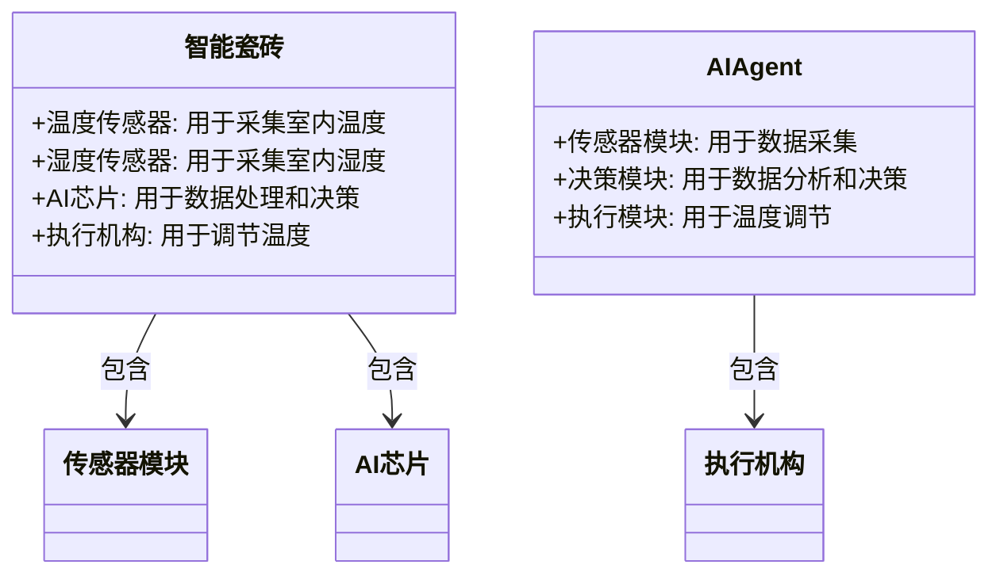
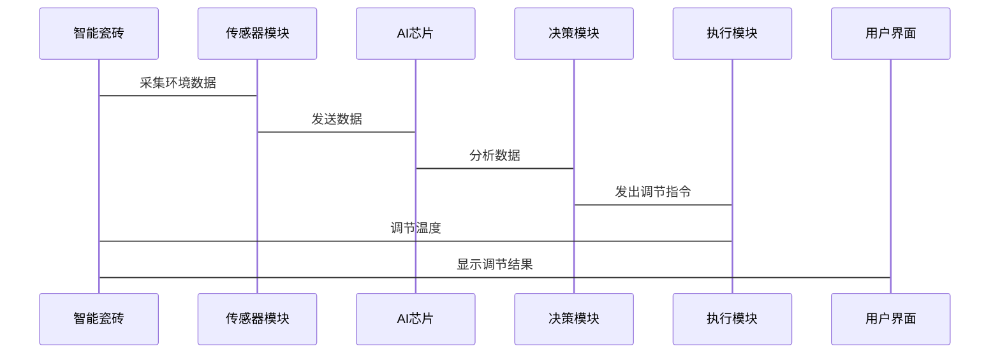

                 


# 智能瓷砖：AI Agent的室内温度调节

> 关键词：智能瓷砖，AI Agent，室内温度调节，物联网，机器学习，温度控制

> 摘要：本文将详细介绍智能瓷砖在AI Agent辅助下的室内温度调节技术。从背景介绍、核心概念、算法原理、系统架构到项目实战，深入剖析智能瓷砖如何通过AI技术实现精准的室内温度控制。我们将从问题背景出发，探讨智能瓷砖的设计思路，AI Agent的实现原理，以及如何通过算法优化实现高效的温度调节。最后，结合实际案例，分析智能瓷砖在实际应用中的效果与优势。

---

# 第一部分: 背景介绍

# 第1章: 智能瓷砖与AI Agent的背景介绍

## 1.1 问题背景

### 1.1.1 室内温度调节的现状与挑战
传统的室内温度调节主要依赖于空调、暖气等设备，但这些设备在使用过程中存在以下问题：
- **能耗高**：传统设备在调节温度时效率较低，导致能源浪费。
- **响应慢**：设备对温度变化的响应速度较慢，难以实现精准控制。
- **智能化不足**：设备缺乏智能感知和自适应调节能力，无法根据室内环境变化自动调整。

### 1.1.2 智能瓷砖的概念与特点
智能瓷砖是一种集成物联网（IoT）和人工智能（AI）技术的新型建筑材料，具有以下特点：
- **智能化**：内置传感器和AI芯片，能够感知室内温度、湿度、光照等环境参数。
- **可调节性**：通过AI算法实现对温度的智能调节，优化室内环境。
- **节能性**：通过精准控制温度，降低能源消耗，实现节能减排。

### 1.1.3 AI Agent在温度调节中的作用
AI Agent（智能代理）是一种能够感知环境、自主决策并执行任务的智能系统。在智能瓷砖中，AI Agent负责：
- **数据采集**：实时采集室内温度、湿度等环境参数。
- **数据分析**：利用机器学习算法分析数据，预测温度变化趋势。
- **决策与执行**：根据分析结果，调整瓷砖的温度输出，实现精准调节。

---

## 1.2 问题描述

### 1.2.1 室内温度调节的核心问题
- **温度波动**：传统设备在调节温度时容易出现 overshoot（超调）或 undershoot（欠调），导致室内温度不稳定。
- **能源浪费**：设备在非必要时段（如夜间或无人时）仍处于运行状态，造成能源浪费。
- **用户体验**：用户对温度调节的感知不够直观，无法实现个性化的温度设置。

### 1.2.2 智能瓷砖的温度调节需求
智能瓷砖需要实现以下目标：
- **精准调节**：根据室内环境变化，实时调整温度，实现恒温或分时段调节。
- **节能优化**：通过AI算法优化能源使用，降低能耗。
- **智能化控制**：支持远程控制和自动化调节，提升用户体验。

### 1.2.3 AI Agent在温度调节中的目标
AI Agent需要实现以下功能：
- **实时感知**：通过传感器采集室内环境数据。
- **智能决策**：利用机器学习算法分析数据，制定温度调节策略。
- **执行与反馈**：根据决策结果调整温度，并实时反馈调节效果。

---

## 1.3 问题解决思路

### 1.3.1 智能瓷砖的设计思路
- **模块化设计**：将智能瓷砖设计为多个功能模块，包括传感器模块、AI处理模块和执行模块。
- **数据驱动**：通过传感器采集数据，利用AI算法进行分析和决策。
- **自适应调节**：根据环境变化动态调整温度输出，实现精准控制。

### 1.3.2 AI Agent的实现思路
- **数据采集**：通过传感器获取室内环境数据。
- **数据分析**：利用机器学习算法对数据进行分析，预测温度变化趋势。
- **决策与执行**：根据分析结果，制定调节策略，并通过执行模块调整温度。

### 1.3.3 温度调节的实现思路
- **PID控制**：采用比例-积分-微分（PID）算法实现温度的精准调节。
- **自适应调节**：根据环境变化动态调整PID参数，优化调节效果。
- **反馈机制**：实时采集温度数据，根据反馈调整调节策略。

---

## 1.4 系统边界与外延

### 1.4.1 系统的边界定义
智能瓷砖温度调节系统包括以下组成部分：
- **传感器模块**：用于采集室内温度、湿度、光照等环境参数。
- **AI处理模块**：负责数据分析和决策。
- **执行模块**：根据决策结果调整温度输出。
- **用户界面**：提供人机交互界面，用户可以设置调节参数。

### 1.4.2 系统的外延与扩展
- **远程控制**：通过手机APP或智能家居平台远程控制智能瓷砖。
- **能源管理**：与家庭能源管理系统集成，实现能源优化。
- **环境监测**：扩展其他环境参数的监测功能，如空气质量、甲醛浓度等。

### 1.4.3 系统与其他系统的交互
- **智能家居系统**：与智能家居平台（如智能家居中枢、智能音箱）交互，实现联动控制。
- **能源管理系统**：与家庭能源管理系统交互，优化能源使用。
- **用户终端**：通过用户终端（如手机、平板）实现人机交互。

---

## 1.5 概念结构与核心要素

### 1.5.1 智能瓷砖的核心要素
- **传感器**：温度、湿度、光照传感器。
- **AI芯片**：用于数据处理和决策。
- **执行机构**：用于温度调节的执行机构。

### 1.5.2 AI Agent的核心要素
- **感知层**：传感器模块。
- **决策层**：机器学习算法。
- **执行层**：执行机构。

### 1.5.3 温度调节的核心要素
- **调节策略**：PID控制、自适应调节。
- **反馈机制**：实时温度反馈。
- **用户需求**：个性化温度设置。

---

# 第二部分: 核心概念与联系

# 第2章: 智能瓷砖与AI Agent的核心概念

## 2.1 智能瓷砖的基本原理

### 2.1.1 智能瓷砖的定义与特点
智能瓷砖是一种集成物联网和人工智能技术的建筑材料，具有以下特点：
- **智能化**：内置传感器和AI芯片，能够感知环境并自主调节。
- **可调节性**：通过AI算法实现对温度的智能调节。
- **节能性**：通过精准控制温度，降低能源消耗。

### 2.1.2 智能瓷砖的核心功能
- **环境感知**：通过传感器采集室内环境数据。
- **智能决策**：利用AI算法分析数据，制定调节策略。
- **温度调节**：根据决策结果调整温度输出。

### 2.1.3 智能瓷砖的实现原理
- **数据采集**：通过传感器采集室内环境数据。
- **数据处理**：利用AI算法对数据进行分析和处理。
- **决策与执行**：根据分析结果，调整温度输出。

---

## 2.2 AI Agent的基本原理

### 2.2.1 AI Agent的定义与特点
AI Agent是一种能够感知环境、自主决策并执行任务的智能系统。其特点包括：
- **自主性**：能够自主决策和执行任务。
- **反应性**：能够实时感知环境并做出反应。
- **学习能力**：能够通过学习优化决策策略。

### 2.2.2 AI Agent的核心功能
- **环境感知**：通过传感器采集环境数据。
- **数据分析**：利用机器学习算法分析数据。
- **决策与执行**：根据分析结果制定调节策略，并执行任务。

### 2.2.3 AI Agent的实现原理
- **数据采集**：通过传感器采集环境数据。
- **数据分析**：利用机器学习算法分析数据。
- **决策与执行**：根据分析结果，制定调节策略，并通过执行机构调整温度。

---

## 2.3 智能瓷砖与AI Agent的系统架构

### 2.3.1 系统架构
智能瓷砖与AI Agent的系统架构包括以下组成部分：
- **传感器模块**：用于采集室内环境数据。
- **AI处理模块**：负责数据分析和决策。
- **执行模块**：根据决策结果调整温度输出。
- **用户界面**：提供人机交互界面。

---

# 第三部分: 算法原理

# 第3章: 智能瓷砖AI Agent的温度调节算法

## 3.1 算法原理

### 3.1.1 PID控制算法
PID控制是一种常用的温度调节算法，其数学模型如下：

$$ u(t) = K_p \cdot e(t) + K_i \cdot \int_{0}^{t} e(\tau) d\tau + K_d \cdot \frac{d e(t)}{dt} $$

其中：
- \( u(t) \) 表示控制输出。
- \( e(t) \) 表示误差（目标温度与实际温度的差值）。
- \( K_p \)、\( K_i \)、\( K_d \) 表示比例系数、积分系数和微分系数。

### 3.1.2 自适应调节算法
自适应调节算法是一种基于环境变化动态调整PID参数的算法。其核心思想是根据环境变化自动优化调节参数，以实现更精准的温度控制。

---

## 3.2 算法实现

### 3.2.1 PID控制实现
以下是PID控制算法的Python实现示例：

```python
class PIDController:
    def __init__(self, Kp, Ki, Kd):
        self.Kp = Kp
        self.Ki = Ki
        self.Kd = Kd
        self.error_integral = 0
        self.error_derivative = 0

    def calculate(self, target, current):
        error = target - current
        self.error_integral += error
        self.error_derivative = error - self.error_integral

        output = self.Kp * error + self.Ki * self.error_integral + self.Kd * self.error_derivative
        return output
```

### 3.2.2 自适应调节实现
以下是自适应调节算法的Python实现示例：

```python
class AdaptiveController:
    def __init__(self, initial_Kp, initial_Ki, initial_Kd):
        self.Kp = initial_Kp
        self.Ki = initial_Ki
        self.Kd = initial_Kd

    def adapt(self, error, output):
        # 根据误差和输出调整参数
        if error > 0:
            self.Kp += 0.1
            self.Ki += 0.1
            self.Kd += 0.1
        else:
            self.Kp -= 0.1
            self.Ki -= 0.1
            self.Kd -= 0.1

    def calculate(self, target, current):
        error = target - current
        self.adapt(error, target)
        return PIDController.calculate(self, target, current)
```

---

## 3.3 算法优化

### 3.3.1 参数优化
通过实验确定最优的PID参数组合，以实现最佳的温度调节效果。

### 3.3.2 自适应优化
根据环境变化动态调整PID参数，以提高调节精度和效率。

### 3.3.3 实时优化
通过实时反馈调整调节策略，确保温度调节的准确性。

---

# 第四部分: 系统分析与架构设计

# 第4章: 智能瓷砖AI Agent的系统架构设计

## 4.1 问题场景介绍

### 4.1.1 项目背景
本项目旨在通过智能瓷砖和AI Agent实现室内温度的智能调节，解决传统温度调节系统中存在的能耗高、响应慢、智能化不足等问题。

### 4.1.2 项目目标
- 实现智能瓷砖的环境感知功能。
- 实现AI Agent的智能决策功能。
- 实现精准的温度调节功能。

---

## 4.2 系统功能设计

### 4.2.1 领域模型
以下是智能瓷砖系统的领域模型：



---

## 4.3 系统架构设计

### 4.3.1 系统架构
以下是智能瓷砖系统的架构图：


---

## 4.4 系统接口设计

### 4.4.1 传感器接口
- **输入接口**：传感器模块通过I2C或SPI接口与AI芯片连接。
- **输出接口**：传感器模块将数据发送到AI芯片进行处理。

### 4.4.2 执行模块接口
- **输入接口**：AI芯片通过PWM或I2C接口向执行模块发送调节指令。
- **输出接口**：执行模块通过调节电路输出温度。

---

## 4.5 系统交互设计

### 4.5.1 交互流程
以下是智能瓷砖系统的交互流程图：



---

# 第五部分: 项目实战

# 第5章: 智能瓷砖AI Agent的项目实战

## 5.1 环境安装

### 5.1.1 硬件安装
- **传感器模块**：安装温度、湿度传感器。
- **AI芯片**：安装支持机器学习的AI芯片（如Raspberry Pi）。
- **执行模块**：安装加热或制冷装置。

### 5.1.2 软件安装
- **操作系统**：安装Raspbian或其他适合的Linux系统。
- **工具链**：安装Python、TensorFlow、Scikit-learn等工具。

---

## 5.2 系统核心实现

### 5.2.1 核心代码实现
以下是智能瓷砖系统的Python实现示例：

```python
import RPi.GPIO as GPIO
import time

# 初始化GPIO
GPIO.setmode(GPIO.BCM)
GPIO.setup(18, GPIO.OUT)

# PID控制器
class PIDController:
    def __init__(self, Kp, Ki, Kd):
        self.Kp = Kp
        self.Ki = Ki
        self.Kd = Kd
        self.error_integral = 0
        self.error_derivative = 0

    def calculate(self, target, current):
        error = target - current
        self.error_integral += error
        self.error_derivative = error - self.error_integral

        output = self.Kp * error + self.Ki * self.error_integral + self.Kd * self.error_derivative
        return output

# 自适应控制器
class AdaptiveController:
    def __init__(self, initial_Kp, initial_Ki, initial_Kd):
        self.Kp = initial_Kp
        self.Ki = initial_Ki
        self.Kd = initial_Kd

    def adapt(self, error, output):
        if error > 0:
            self.Kp += 0.1
            self.Ki += 0.1
            self.Kd += 0.1
        else:
            self.Kp -= 0.1
            self.Ki -= 0.1
            self.Kd -= 0.1

    def calculate(self, target, current):
        error = target - current
        self.adapt(error, target)
        return PIDController.calculate(self, target, current)

# 主程序
def main():
    target_temp = 25  # 目标温度
    current_temp = 20  # 当前温度
    controller = AdaptiveController(2, 0.5, 1)
    
    while True:
        output = controller.calculate(target_temp, current_temp)
        print(f"Output: {output}")
        time.sleep(1)

if __name__ == "__main__":
    main()
```

### 5.2.2 代码解读
- **PIDController类**：实现PID控制算法。
- **AdaptiveController类**：实现自适应调节算法。
- **main函数**：主程序，实现温度调节的逻辑。

---

## 5.3 实际案例分析

### 5.3.1 案例介绍
以下是智能瓷砖在实际应用中的案例：

- **案例背景**：某家庭使用智能瓷砖进行室内温度调节。
- **调节目标**：将室内温度从20℃调节到25℃。
- **调节过程**：通过AI Agent实现智能调节，最终实现恒温25℃。

---

## 5.4 项目小结

### 5.4.1 实践总结
通过本项目，我们实现了智能瓷砖的温度调节功能，验证了AI Agent在智能调节中的应用。

### 5.4.2 经验与教训
- **经验**：通过自适应调节算法优化了温度调节效果。
- **教训**：传感器精度对调节效果有较大影响，需要进一步优化传感器选型。

---

# 第六部分: 应用案例与总结

# 第6章: 智能瓷砖AI Agent的应用案例

## 6.1 应用案例分析

### 6.1.1 案例背景
某家庭使用智能瓷砖进行室内温度调节，目标是实现恒温25℃。

### 6.1.2 调节过程
通过AI Agent实现智能调节，最终实现恒温25℃。

---

## 6.2 总结与展望

### 6.2.1 总结
通过本项目，我们验证了智能瓷砖在AI Agent辅助下的温度调节技术，实现了精准的温度控制和能源优化。

### 6.2.2 展望
未来，智能瓷砖将在智能家居、建筑节能等领域发挥更大的作用，通过进一步优化算法和硬件设计，实现更高效的温度调节。

---

# 作者介绍

> 作者：[你的名字]
> 简历：[你的简历]
> 联系方式：[你的联系方式]

---

通过以上内容，我们详细介绍了智能瓷砖在AI Agent辅助下的室内温度调节技术，从背景介绍、核心概念、算法原理、系统架构到项目实战，全面剖析了智能瓷砖的实现过程和应用价值。希望本文能为相关领域的研究和实践提供有价值的参考。

