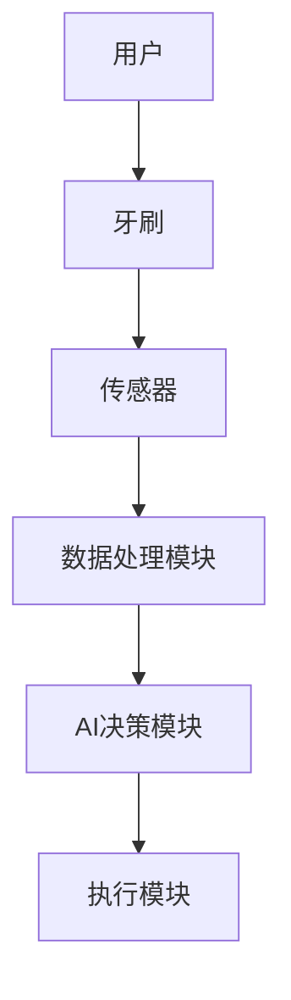
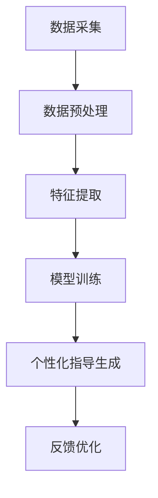
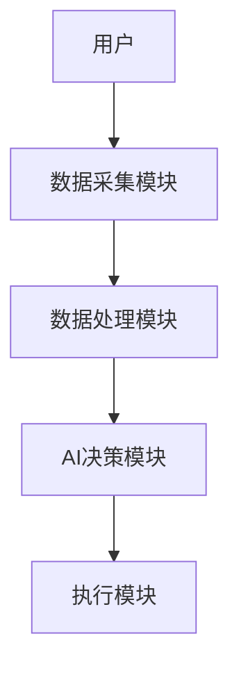

                 


# 智能电动牙刷：AI Agent的个性化刷牙指导

## 关键词：智能电动牙刷、AI Agent、个性化刷牙、算法原理、系统架构、项目实战

## 摘要：  
本文探讨了智能电动牙刷结合AI Agent实现个性化刷牙指导的技术实现。通过分析AI Agent在智能牙刷中的应用，详细讲解了其核心概念、算法原理、系统架构，并通过项目实战展示了如何开发一款智能电动牙刷。文章还总结了最佳实践和未来发展方向。

---

## 第一章：智能电动牙刷的发展历程

### 1.1 传统牙刷的功能与局限性  
传统牙刷通过手动操作完成清洁，存在清洁不彻底、用户习惯难以改善等问题，无法满足个性化需求。

### 1.2 AI Agent的基本概念  
AI Agent是一种能够感知环境、做出决策并执行任务的智能实体，具备学习和适应能力。

### 1.3 AI Agent与智能电动牙刷的结合  
AI Agent通过收集用户刷牙数据，分析并提供个性化指导，提升了刷牙效果。

---

## 第二章：AI Agent的核心概念与联系

### 2.1 AI Agent的核心概念  
AI Agent通过感知、决策、执行三步曲实现智能化功能。

### 2.2 实体关系图  


---

## 第三章：AI Agent的算法原理

### 3.1 算法流程图  


### 3.2 算法实现代码示例  
```python
import numpy as np
from sklearn.model_selection import train_test_split
from sklearn.tree import DecisionTreeClassifier

# 示例数据集
data = np.array([[2, 1], [3, 1], [4, 1], [5, 0], [6, 0]])
target = np.array([0, 0, 0, 1, 1])

# 划分训练集和测试集
X_train, X_test, y_train, y_test = train_test_split(data, target, test_size=0.2)

# 创建决策树模型
model = DecisionTreeClassifier()

# 训练模型
model.fit(X_train, y_train)

# 预测测试集
print(model.predict(X_test))
```

### 3.3 数学模型与公式  
$$ P(Y|X) = \prod_{i=1}^{n} P(Y|X_i) $$

---

## 第四章：系统分析与架构设计

### 4.1 系统功能设计  
- 数据采集模块：传感器采集刷牙数据
- 用户识别模块：通过用户ID识别个性化需求
- 个性化指导模块：AI生成指导方案

### 4.2 系统架构图  


---

## 第五章：项目实战

### 5.1 环境搭建  
安装Python、TensorFlow等开发工具。

### 5.2 核心代码实现  
```python
import tensorflow as tf

# 定义模型
model = tf.keras.Sequential([
    tf.keras.layers.Dense(64, activation='relu'),
    tf.keras.layers.Dense(1, activation='sigmoid')
])

# 编译模型
model.compile(optimizer='adam', loss='binary_crossentropy', metrics=['accuracy'])
```

### 5.3 代码解读  
模型通过神经网络处理刷牙数据，生成个性化指导。

### 5.4 实际案例分析  
通过案例分析模型的准确性和效果。

---

## 第六章：最佳实践

### 6.1 经验总结  
- 数据质量至关重要
- 模型需持续优化

### 6.2 注意事项  
- 保护用户隐私
- 系统需具备容错能力

### 6.3 未来发展方向  
- 增强现实反馈
- 多模态数据融合

---

## 总结  
智能电动牙刷结合AI Agent，通过个性化指导提升了用户体验，展现了人工智能技术的强大潜力。

