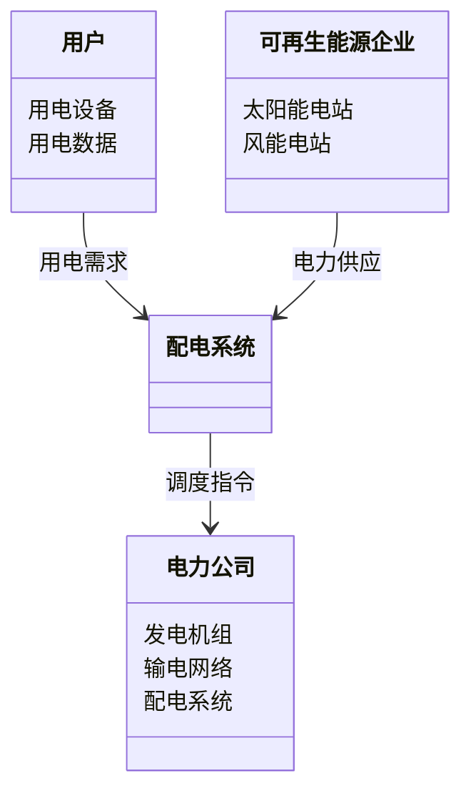
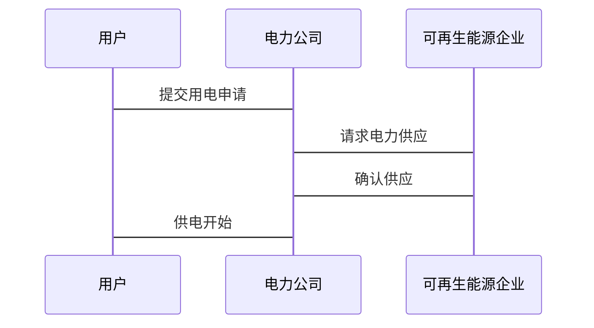

                 


# 智能电网技术在能源转型中的作用与投资

> **关键词**：智能电网、能源转型、可再生能源、投资分析、技术趋势  
> **摘要**：智能电网技术作为能源转型的核心支撑，通过优化电力系统运行、支持可再生能源接入和提高能源利用效率，正在改变全球能源结构。本文从智能电网的定义、技术原理、系统架构、投资价值及未来趋势等方面进行详细分析，探讨其在能源转型中的关键作用。

---

## 第一部分：智能电网技术的背景与概念

### 第1章：智能电网技术概述

#### 1.1 智能电网的定义与核心概念

智能电网是一种以数字化技术为基础，能够实现电力系统中各环节（发电、输电、配电、用电）智能化管理的新型电网系统。其核心特征包括：

- **智能化**：通过传感器、通信技术和数据分析，实现电网的实时监控和智能决策。
- **分布式能源接入**：支持大量分布式可再生能源（如太阳能、风能）的接入和管理。
- **高效性**：通过优化电力生产和分配，减少能量损耗，提高能源利用效率。

与传统电网相比，智能电网更加注重信息的实时传递和系统的自我调节能力，能够更好地应对可再生能源的波动性和不确定性。

#### 1.2 能源转型的背景与挑战

能源转型是指从以化石能源为主的能源结构向以可再生能源为主的清洁化、低碳化方向转变。这一转型面临以下挑战：

- **可再生能源的间歇性**：风能和太阳能等可再生能源的输出具有波动性，给电网的稳定运行带来了挑战。
- **电力系统灵活性不足**：传统电网的设计基于稳定的化石能源发电，难以适应可再生能源的快速变化。
- **技术与政策障碍**：智能电网技术的推广需要大量的资金投入和技术研发，同时需要政策支持和法规配合。

#### 1.3 智能电网在能源转型中的作用

智能电网在能源转型中扮演着关键角色：

- **提高能源利用效率**：通过智能电网技术，可以实现电力需求侧的精准管理，减少浪费。
- **支持可再生能源的接入与整合**：智能电网能够协调分布式能源的输出，确保电网的稳定运行。
- **优化电力系统运行与管理**：智能电网通过实时数据采集和分析，优化电力生产和分配，降低运营成本。

---

### 第2章：智能电网技术的核心概念与联系

#### 2.1 智能电网的核心技术原理

智能电网的核心技术包括：

- **电力系统通信技术**：通过光纤、无线通信等方式实现电网设备之间的数据传输。
- **数据采集与监控系统（SCADA）**：实时采集电网运行数据，进行监控和管理。
- **能源互联网**：通过互联网技术实现能源的共享和协同，支持多种能源形式的灵活接入。

#### 2.2 智能电网技术的关键属性对比

| **属性**       | **传统电网**                 | **智能电网**                 |
|----------------|----------------------------|----------------------------|
| 数据采集       | 间断性采集，缺乏实时性       | 实时采集，高频数据          |
| 能源类型       | 主要依赖化石能源             | 多种能源，尤其是可再生能源   |
| 系统灵活性     | 较低，难以适应变化           | 较高，支持分布式能源接入     |
| 运行效率       | 较低，能量损耗较大           | 较高，优化能源分配           |

#### 2.3 智能电网的ER实体关系图

```mermaid
er
actor: 用户
actor: 电力公司
actor: 政府机构
actor: 可再生能源企业
```

---

## 第二部分：智能电网技术的算法原理与数学模型

### 第3章：智能电网算法原理

#### 3.1 智能电网中的优化算法

##### 3.1.1 线性规划模型

目标函数：
$$ \text{目标函数：} \min \sum_{i=1}^{n} c_i x_i $$

约束条件：
$$ \sum_{i=1}^{n} a_i x_i = b $$
$$ x_i \geq 0 \quad (i=1,2,\dots,n) $$

##### 3.1.2 遗传算法

1. 初始化种群。
2. 计算适应度。
3. 选择优秀个体。
4. 进行交叉和变异。
5. 重复迭代，直到满足条件。

##### 3.1.3 模拟退火算法

1. 初始化当前解。
2. 计算当前解的能量。
3. 随机选择一个邻域解。
4. 根据能量差决定是否接受新解。
5. 逐步降低温度，直到收敛。

#### 3.2 智能电网中的数据处理算法

##### 3.2.1 时间序列分析

时间序列分析用于预测电力需求的变化趋势。例如，使用ARIMA模型进行预测。

##### 3.2.2 聚类分析

聚类分析用于将用户用电行为进行分类，例如居民用电和工业用电的区分。

##### 3.2.3 分类算法

分类算法用于识别异常用电行为，例如检测非法用电。

#### 3.3 智能电网中的预测模型

##### 3.3.1 负荷预测模型

负荷预测模型用于预测电力需求，帮助电力公司合理安排发电计划。

##### 3.3.2 可再生能源预测模型

通过气象数据预测风能和太阳能的输出，确保电网的稳定性。

##### 3.3.3 电力市场预测模型

预测电力市场价格波动，帮助电力公司制定交易策略。

---

## 第三部分：智能电网技术的系统架构与投资

### 第4章：智能电网的系统架构设计

#### 4.1 领域模型mermaid类图



#### 4.2 系统架构图


#### 4.3 系统交互序列图



### 第5章：智能电网技术的投资分析

#### 5.1 投资机会

- **可再生能源基础设施**：投资于智能电网中的可再生能源接入设备。
- **智能电表和用户终端**：推广智能电表，提升用户端的智能化水平。
- **数据平台和分析工具**：建设数据分析平台，提供电力市场预测服务。

#### 5.2 风险评估

- **技术风险**：智能电网技术的复杂性和不确定性可能导致项目失败。
- **经济风险**：前期投资大，回报周期长。
- **政策风险**：政策变化可能影响项目的可行性和收益。

#### 5.3 成功案例

- **案例1**：某地区通过智能电网技术实现了可再生能源的高效接入，降低了电力成本。
- **案例2**：某电力公司通过智能电网优化了电力分配，提高了能源利用效率。

---

## 第四部分：智能电网技术的未来展望与挑战

### 第6章：智能电网技术的未来展望

#### 6.1 技术发展趋势

- **智能化和数字化**：进一步提升人工智能和大数据技术的应用。
- **多能源协同**：实现电、热、气等多种能源的协同优化。

### 第7章：智能电网技术面临的挑战

#### 7.1 技术挑战

- **数据安全**：智能电网涉及大量的数据传输和存储，数据安全问题不容忽视。
- **隐私保护**：用户用电数据的隐私保护需要加强。

#### 7.2 经济与社会挑战

- **成本高昂**：智能电网的建设和维护成本较高。
- **政策支持**：需要政府的政策支持和资金投入。

### 第8章：应对挑战的策略

#### 8.1 技术创新

- 加大研发投入，突破关键核心技术。
- 推动国际合作，共享技术成果。

#### 8.2 政策支持

- 制定合理的政策法规，鼓励智能电网技术的推广。
- 提供财政补贴和税收优惠。

#### 8.3 公众教育

- 提高公众对智能电网的认知，增强用户参与度。

---

## 总结

智能电网技术是能源转型的核心支撑，其在优化电力系统运行、支持可再生能源接入和提高能源利用效率方面发挥着重要作用。然而，智能电网的推广也面临技术、经济和社会等多重挑战。通过技术创新、政策支持和公众教育，可以有效应对这些挑战，推动智能电网技术的广泛应用，为能源转型注入新的活力。

---

以上就是《智能电网技术在能源转型中的作用与投资》的完整内容。

