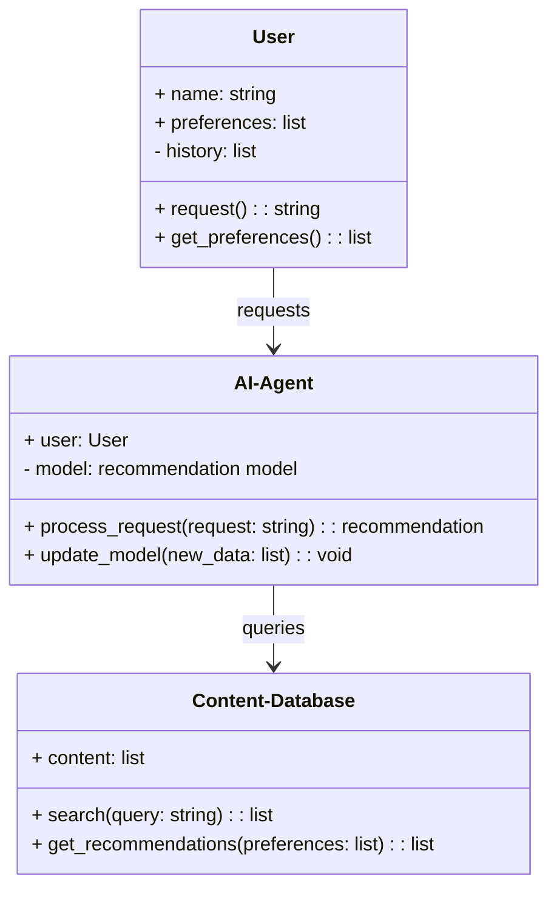
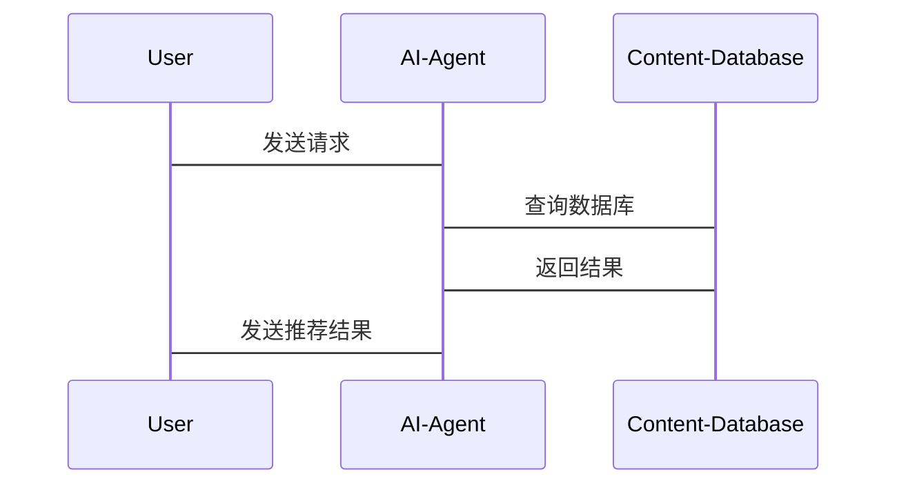

                 


# 智能电视：AI Agent的家庭娱乐管家系统

> 关键词：智能电视，AI Agent，家庭娱乐，自然语言处理，推荐系统，系统架构

> 摘要：随着人工智能技术的快速发展，智能电视正逐渐从单一的娱乐设备向多功能的家庭娱乐管家转变。通过AI Agent的支持，智能电视能够理解用户需求，提供个性化的娱乐推荐，并协助管理家庭娱乐事务。本文将详细探讨AI Agent在智能电视中的应用，分析其核心原理、系统架构，并通过实际案例展示其在家庭娱乐中的潜力。

---

## 第一章: 智能电视与AI Agent的背景与概念

### 1.1 智能电视的发展历程

#### 1.1.1 传统电视的功能局限
传统电视的功能相对单一，主要局限于接收电视节目和简单的频道切换。用户无法根据个人喜好定制内容，且缺乏智能化的交互方式。

#### 1.1.2 智能电视的定义与特点
智能电视是指集成操作系统、应用程序和互联网功能的电视设备。它能够连接互联网，提供丰富的应用程序和在线内容，支持多点触控、语音控制等交互方式。

#### 1.1.3 AI Agent的引入与意义
AI Agent（智能代理）是一种能够理解用户需求、执行任务并提供个性化服务的智能系统。引入AI Agent后，智能电视能够实现更智能化的娱乐推荐、内容搜索和家庭娱乐管理。

### 1.2 AI Agent的核心概念

#### 1.2.1 AI Agent的基本定义
AI Agent是一种能够感知环境、理解用户需求并执行相应操作的智能系统。它通过自然语言处理、机器学习等技术实现与用户的交互。

#### 1.2.2 AI Agent的核心属性与特征
- **自主性**：能够在没有人工干预的情况下执行任务。
- **反应性**：能够实时感知环境并做出反应。
- **推理能力**：能够基于上下文进行推理和决策。
- **学习能力**：能够通过数据和反馈不断优化自身性能。

#### 1.2.3 AI Agent在家庭娱乐中的应用场景
- **个性化推荐**：根据用户的观看历史和偏好推荐内容。
- **内容搜索**：帮助用户快速找到所需的内容。
- **娱乐管理**：协助用户管理娱乐时间表、订阅服务等。

### 1.3 智能电视与AI Agent的结合

#### 1.3.1 智能电视的功能扩展
- 提供个性化的娱乐内容推荐。
- 支持多设备联动，如智能家居控制。
- 提供语音交互功能，方便用户操作。

#### 1.3.2 AI Agent在家庭娱乐中的角色
- **内容推荐**：基于用户的观看历史和偏好推荐节目。
- **信息检索**：快速查找用户所需的内容。
- **娱乐管理**：帮助用户管理娱乐时间表、订阅服务等。

#### 1.3.3 智能电视+AI Agent的系统架构
- **用户交互层**：通过语音或手势与用户进行交互。
- **数据处理层**：处理用户的输入并生成相应的指令。
- **内容推荐层**：基于用户数据推荐相关内容。
- **执行层**：执行用户的指令并反馈结果。

---

## 第二章: AI Agent的核心原理与数学模型

### 2.1 AI Agent的核心原理

#### 2.1.1 自然语言处理（NLP）基础
自然语言处理是AI Agent理解用户指令的关键技术。通过NLP，AI Agent能够解析用户的语音输入，提取关键词和意图。

#### 2.1.2 用户意图识别
用户意图识别是AI Agent的核心任务之一。通过分析用户的语言和行为，AI Agent能够准确理解用户的意图并生成相应的响应。

#### 2.1.3 决策与推理机制
AI Agent需要基于用户的指令和环境信息进行推理和决策，以实现对用户的个性化服务。

### 2.2 AI Agent的数学模型

#### 2.2.1 概率模型与条件概率公式
概率模型在自然语言处理和推荐系统中广泛应用。条件概率公式如下：
$$ P(A|B) = \frac{P(B|A)P(A)}{P(B)} $$

#### 2.2.2 决策树模型与信息增益
决策树是一种常用的分类方法。信息增益用于选择最优特征，公式如下：
$$ I(G) = \sum_{i=1}^{n} p_i \log_2 \frac{1}{p_i} $$

---

## 第三章: 算法原理与实现

### 3.1 算法原理

#### 3.1.1 马尔可夫链模型
马尔可夫链模型用于预测用户的下一步操作。状态转移概率公式如下：
$$ P(next state | current state) = \frac{P(current state, next state)}{P(current state)} $$

#### 3.1.2 决策树算法
决策树算法用于分类用户的需求。通过信息增益最大化选择最优特征进行分类。

#### 3.1.3 协同过滤算法
协同过滤算法用于推荐系统，基于用户的相似性进行推荐。公式如下：
$$ \text{相似度} = \frac{\sum_{i=1}^{n} (r_i - \bar{r})(s_i - \bar{s})}{\sqrt{\sum_{i=1}^{n} (r_i - \bar{r})^2} \sqrt{\sum_{i=1}^{n} (s_i - \bar{s})^2}}} $$

### 3.2 算法实现

#### 3.2.1 环境安装
- 安装Python和相关库（如NumPy、scikit-learn）。

#### 3.2.2 核心实现代码
```python
import numpy as np
from sklearn.tree import DecisionTreeClassifier
from sklearn.metrics import accuracy_score

# 示例数据
X = np.array([[2, 3], [5, 4], [3, 6], [7, 8], [4, 7]])
y = np.array([0, 1, 0, 1, 0])

# 训练决策树模型
model = DecisionTreeClassifier()
model.fit(X, y)

# 预测
test_data = np.array([[4, 5]])
prediction = model.predict(test_data)

print("预测结果:", prediction)
print("准确率:", accuracy_score(y_true=y, y_pred=model.predict(X)))
```

#### 3.2.3 代码解读与分析
- 使用决策树算法对用户需求进行分类。
- 通过训练数据构建模型，并对测试数据进行预测。

---

## 第四章: 系统分析与架构设计

### 4.1 系统功能设计

#### 4.1.1 用户交互模块
- 语音识别与理解。
- 手势识别与交互。

#### 4.1.2 内容推荐模块
- 基于用户历史数据推荐内容。
- 实时更新推荐结果。

#### 4.1.3 娱乐管理模块
- 管理用户的娱乐时间表。
- 控制智能家居设备。

### 4.2 系统架构设计

#### 4.2.1 类图设计


#### 4.2.2 序列图设计


---

## 第五章: 项目实战与案例分析

### 5.1 项目实战

#### 5.1.1 环境安装
- 安装Python和相关库。

#### 5.1.2 核心代码实现
```python
import numpy as np
from sklearn.metrics.pairwise import cosine_similarity

# 示例数据
user_preferences = np.array([[4, 5, 3], [3, 2, 4], [5, 5, 4]])

# 计算余弦相似度
similarity_matrix = cosine_similarity(user_preferences)

print("相似度矩阵:\n", similarity_matrix)
```

#### 5.1.3 代码解读与分析
- 使用余弦相似度计算用户的相似性，用于推荐系统。

### 5.2 案例分析

#### 5.2.1 某用户的实际使用案例
- 用户观看历史：电视剧、电影。
- 用户偏好：动作片、科幻片。
- 推荐结果：推荐新的动作片和科幻片。

#### 5.2.2 系统小结
- 系统能够准确理解用户的偏好，并提供个性化的推荐。

---

## 第六章: 优化与未来展望

### 6.1 性能优化

#### 6.1.1 算法优化
- 使用更高效的推荐算法，如深度学习模型。

#### 6.1.2 系统优化
- 提高系统的响应速度和准确性。

### 6.2 数据安全与隐私保护

#### 6.2.1 数据加密
- 对用户数据进行加密存储和传输。

#### 6.2.2 隐私保护
- 遵守数据隐私保护法规，确保用户隐私不被滥用。

### 6.3 未来展望

#### 6.3.1 边缘计算
- 在智能电视本地进行数据处理，减少对云端的依赖。

#### 6.3.2 增强现实
- 引入增强现实技术，提升用户的娱乐体验。

---

## 第七章: 最佳实践与小结

### 7.1 最佳实践 tips

#### 7.1.1 系统设计
- 采用模块化设计，便于后续扩展和维护。

#### 7.1.2 代码实现
- 使用高效的算法和数据结构，确保系统的性能。

### 7.2 小结

通过本文的详细讲解，我们了解了AI Agent在智能电视中的应用，从核心原理到系统架构，再到实际案例分析，全面探讨了智能电视的家庭娱乐管家系统。

### 7.3 注意事项

- 确保系统的安全性和稳定性。
- 定期更新模型和算法，以适应用户需求的变化。

### 7.4 拓展阅读

- 探索更多AI技术在家庭娱乐中的应用，如虚拟现实、人工智能助手等。

---

通过以上内容，我们希望能够为读者提供一个全面的视角，深入理解AI Agent在智能电视中的应用，为未来的家庭娱乐带来更多的可能性。

