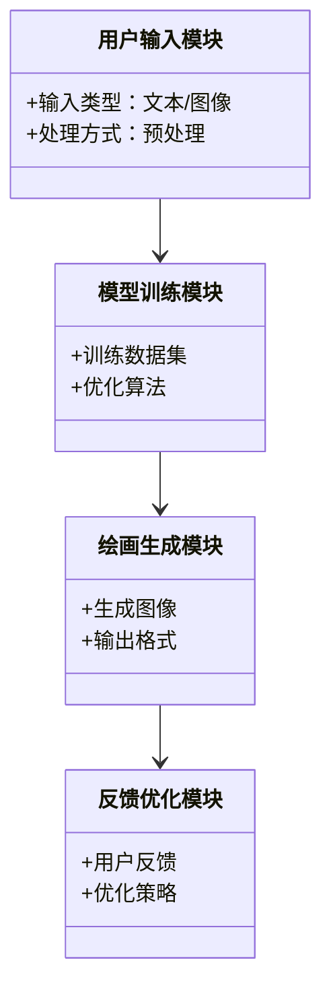
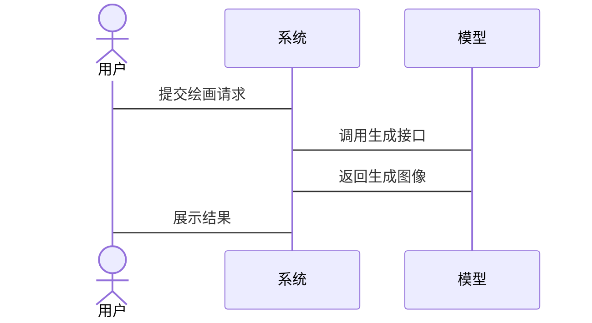

                 


# 智能画架：AI Agent的绘画技巧指导

## 关键词：AI Agent，智能画架，AI绘画，深度学习，生成对抗网络，变体自编码器

## 摘要：本文详细探讨了AI Agent在绘画领域的应用，从背景介绍到算法原理，再到系统设计和项目实战，全面解析AI绘画的技术细节和实现方法。通过分析不同模型的优缺点，结合实际案例，帮助读者掌握AI绘画的核心技巧和最佳实践。

---

## 第一部分：AI绘画的背景与核心概念

### 第1章：AI绘画的背景与现状

#### 1.1 AI绘画的背景介绍

- **1.1.1 数字艺术的兴起与发展**  
  数字艺术的兴起离不开技术的进步，尤其是计算机图形学和人工智能的发展。艺术家们开始利用数字工具创作，而AI技术的引入进一步推动了这一领域的创新。

- **1.1.2 AI技术在艺术领域的应用趋势**  
  AI技术在艺术领域的应用日益广泛，从图像生成到风格迁移，AI正在改变传统艺术创作的方式。智能画架作为一种新兴的工具，结合了AI技术和传统绘画的优势，为艺术家提供了新的创作途径。

- **1.1.3 智能画架的定义与应用场景**  
  智能画架是一种结合AI技术的绘画工具，能够根据用户的输入生成或辅助创作绘画作品。应用场景包括艺术创作、教育、设计等多个领域。

#### 1.2 AI绘画的核心概念

- **1.2.1 AI Agent的基本定义**  
  AI Agent是一种能够感知环境并采取行动以实现目标的智能体。在绘画领域，AI Agent可以理解为一种能够辅助或生成绘画作品的智能系统。

- **1.2.2 智能画架的功能与特点**  
  智能画架具有实时生成、风格迁移、自动优化等功能，其特点包括高效性、智能化和个性化。

- **1.2.3 AI绘画的边界与外延**  
  AI绘画的边界在于其生成能力，外延则涉及与其他技术（如自然语言处理）的结合，扩展其应用场景。

#### 1.3 AI绘画的技术基础

- **1.3.1 深度学习与生成模型**  
  深度学习是AI绘画的核心技术，生成模型（如GAN和VAE）是实现绘画生成的关键。

- **1.3.2 图像处理与计算机视觉**  
  计算机视觉技术用于图像分析和处理，帮助AI理解绘画内容并进行优化。

- **1.3.3 自然语言处理在绘画中的应用**  
  NLP技术可以将文本描述转化为绘画，扩展了AI绘画的创作方式。

#### 1.4 AI绘画工具的现状与挑战

- **1.4.1 现有AI绘画工具的分类**  
  工具可以分为基于GAN的生成工具和基于VAE的优化工具，每种工具都有其独特的优势和限制。

- **1.4.2 工具的优缺点对比**  
  | 工具类型 | 优点 | 缺点 |
  |----------|------|------|
  | GAN      | 高度生成能力 | 训练时间长 |
  | VAE      | 快速生成 | 结果多样性较低 |

- **1.4.3 AI绘画技术的局限性与未来发展方向**  
  当前技术在生成高质量作品方面仍有不足，未来需要在模型优化和算法创新方面进一步突破。

### 第2章：AI Agent的基本原理

#### 2.1 AI Agent的核心原理

- **2.1.1 AI Agent的定义与分类**  
  AI Agent可以根据任务类型分为创作型和辅助型，创作型用于生成作品，辅助型用于优化创作过程。

- **2.1.2 基于深度学习的AI绘画模型**  
  深度学习模型通过大量数据训练，学习绘画的特征和风格，生成高质量的作品。

- **2.1.3 AI Agent与传统绘画工具的对比**  
  AI Agent的优势在于自动化和智能化，能够快速生成作品，而传统工具则依赖于人类的技巧和创意。

#### 2.2 AI绘画模型的工作流程

- **2.2.1 数据输入与处理**  
  数据输入包括图像和文本描述，处理步骤包括预处理和特征提取。

- **2.2.2 模型训练与优化**  
  训练过程涉及损失函数的定义和优化算法的选择，如Adam优化器。

- **2.2.3 生成绘画的输出与反馈**  
  模型生成绘画后，通过反馈机制进行优化，提升生成质量。

#### 2.3 AI绘画的核心要素

- **2.3.1 数据集的作用与重要性**  
  数据集的质量直接影响生成结果，高质量的数据集有助于模型学习复杂的绘画技巧。

- **2.3.2 算法的选择与优化**  
  根据具体需求选择合适的算法，并通过超参数调整优化模型性能。

- **2.3.3 计算资源的需求与配置**  
  高性能计算资源是训练深度学习模型的基础，配置包括GPU和TPU的选择。

### 第3章：AI绘画模型的对比与分析

#### 3.1 不同AI绘画模型的原理对比

- **3.1.1 GAN（生成对抗网络）模型**  
  GAN由生成器和判别器组成，通过对抗训练生成逼真的图像。

- **3.1.2 VAE（变体自编码器）模型**  
  VAE通过学习数据的潜在表示，生成多样化的图像。

- **3.1.3 其他生成模型的优缺点**  
  其他模型如PixelCNN在特定场景下表现优异，但应用场景有限。

#### 3.2 AI绘画模型的优缺点对比

- **3.2.1 生成对抗网络（GAN）**  
  优点：生成图像质量高；缺点：训练不稳定，难收敛。

- **3.2.2 变体自编码器（VAE）**  
  优点：训练稳定，生成速度快；缺点：多样性不足。

#### 3.3 AI绘画模型的ER实体关系图架构

```mermaid
er
actor(AI绘画系统) -[输入绘画请求]-> model(绘画生成模型)
model -[生成绘画]-> output(绘画作品)
actor -[提供反馈]-> model(优化生成策略)
```

---

## 第四部分：算法原理讲解

### 第4章：AI绘画模型的算法原理

#### 4.1 生成对抗网络（GAN）的算法原理

- **4.1.1 GAN的结构**  
  GAN由生成器和判别器组成，生成器尝试生成真实的图像，判别器则试图区分生成图像和真实图像。

- **4.1.2 GAN的损失函数**  
  生成器的损失函数为：$$ \mathcal{L}_G = \log(1 - D(G(x))) $$
  判别器的损失函数为：$$ \mathcal{L}_D = \log(D(x)) + \log(1 - D(G(x))) $$

- **4.1.3 GAN的训练流程**  
  使用交替训练策略，先优化判别器，再优化生成器，直到达到平衡。

#### 4.2 变体自编码器（VAE）的算法原理

- **4.2.1 VAE的结构**  
  VAE由编码器和解码器组成，编码器将输入映射到潜在空间，解码器将潜在向量转换为图像。

- **4.2.2 VAE的损失函数**  
  VAE的损失函数包括重构损失和KL散度：$$ \mathcal{L} = \mathcal{L}_{\text{reconstruction}} + \mathcal{L}_{\text{KL}} $$

- **4.2.3 VAE的训练流程**  
  使用随机重参数化技巧，将VAE的训练转化为可微分的形式，便于优化。

#### 4.3 AI绘画模型的代码实现

- **4.3.1 GAN的Python代码实现**

```python
import torch
import torch.nn as nn

class Generator(nn.Module):
    def __init__(self):
        super(Generator, self).__init__()
        self.fc = nn.Linear(100, 784)
    
    def forward(self, x):
        return torch.sigmoid(self.fc(x))

class Discriminator(nn.Module):
    def __init__(self):
        super(Discriminator, self).__init__()
        self.fc = nn.Linear(784, 1)
    
    def forward(self, x):
        return torch.sigmoid(self.fc(x))

# 初始化模型
generator = Generator()
discriminator = Discriminator()

# 定义损失函数
criterion = nn.BCELoss()
```

- **4.3.2 VAE的Python代码实现**

```python
class VAE(nn.Module):
    def __init__(self, input_size, hidden_size, output_size):
        super(VAE, self).__init__()
        self.fc1 = nn.Linear(input_size, hidden_size)
        self.fc2 = nn.Linear(hidden_size, output_size)
    
    def forward(self, x):
        mu, log_var = self.fc1(x), self.fc2(x)
        z = reparameterize(mu, log_var)
        return self.decode(z)
    
    def decode(self, z):
        return torch.sigmoid(z)
    
    def reparameterize(self, mu, log_var):
        eps = torch.randn_like(log_var)
        return mu + torch.exp(0.5*log_var)*eps
```

---

## 第五部分：系统分析与架构设计方案

### 第5章：系统功能设计

#### 5.1 系统功能模块划分

- **5.1.1 用户输入模块**  
  用户可以通过文本或图像输入创作需求。

- **5.1.2 模型训练模块**  
  根据用户输入进行模型训练和优化。

- **5.1.3 绘画生成模块**  
  根据训练好的模型生成绘画作品。

- **5.1.4 反馈优化模块**  
  根据用户反馈优化生成策略。

#### 5.2 系统功能的领域模型



### 第6章：系统架构设计

#### 6.1 系统架构分层

- **6.1.1 数据层**  
  存储和管理训练数据集。

- **6.1.2 计算层**  
  执行模型训练和生成任务。

- **6.1.3 应用层**  
  提供用户交互界面和生成结果展示。

#### 6.2 系统架构的Mermaid图


### 第7章：系统接口设计

#### 7.1 系统接口设计

- **7.1.1 用户输入接口**  
  接收用户的绘画请求，包括文本描述和图像输入。

- **7.1.2 模型调用接口**  
  调用AI绘画模型生成图像。

- **7.1.3 结果输出接口**  
  返回生成的绘画作品。

#### 7.2 系统交互的Mermaid序列图



---

## 第六部分：项目实战

### 第8章：项目实战

#### 8.1 项目环境安装

- **8.1.1 安装Python**  
  安装最新版本的Python，推荐使用Anaconda环境。

- **8.1.2 安装深度学习框架**  
  安装TensorFlow或PyTorch，选择适合自己的框架。

- **8.1.3 安装其他依赖库**  
  根据代码需求安装numpy、matplotlib等库。

#### 8.2 项目核心代码实现

- **8.2.1 GAN模型的训练代码**

```python
# 训练GAN模型的代码示例
import torch
from torch import optim

# 定义生成器和判别器
generator = Generator()
discriminator = Discriminator()

# 定义优化器
g_optimizer = optim.Adam(generator.parameters(), lr=0.0002)
d_optimizer = optim.Adam(discriminator.parameters(), lr=0.0002)

# 训练循环
for epoch in range(num_epochs):
    for i, (x, y) in enumerate(dataloader):
        # 生成假数据
        z = torch.randn(batch_size, 100)
        fake = generator(z)
        
        # 判别器训练
        d_optimizer.zero_grad()
        real_output = discriminator(x)
        fake_output = discriminator(fake)
        d_loss = criterion(real_output, y) + criterion(fake_output, 1 - y)
        d_loss.backward()
        d_optimizer.step()
        
        # 生成器训练
        g_optimizer.zero_grad()
        g_loss = criterion(fake_output, y)
        g_loss.backward()
        g_optimizer.step()
```

- **8.2.2 VAE模型的训练代码**

```python
# 训练VAE模型的代码示例
import torch
import torch.nn as nn
from torch import optim

class VAE(nn.Module):
    def __init__(self, input_size, hidden_size, output_size):
        super(VAE, self).__init__()
        self.fc1 = nn.Linear(input_size, hidden_size)
        self.fc2 = nn.Linear(hidden_size, output_size)
    
    def forward(self, x):
        mu, log_var = self.fc1(x), self.fc2(x)
        z = reparameterize(mu, log_var)
        return torch.sigmoid(z)
    
    def reparameterize(self, mu, log_var):
        eps = torch.randn_like(log_var)
        return mu + torch.exp(0.5*log_var)*eps

# 初始化模型和优化器
vae = VAE(input_size, hidden_size, output_size)
optimizer = optim.Adam(vae.parameters(), lr=0.001)

# 定义损失函数
criterion = nn.MSELoss()

# 训练循环
for epoch in range(num_epochs):
    for batch in dataloader:
        x, y = batch
        outputs = vae(x)
        loss = criterion(outputs, y) + 0.5*(vae.fc1(y).pow(2).mean() + (torch.exp(vae.fc2(y))**2).mean())
        loss.backward()
        optimizer.step()
```

#### 8.3 项目实战的案例分析

- **8.3.1 案例一：风景画生成**  
  使用GAN模型生成风景画，展示生成结果的多样性和质量。

- **8.3.2 案例二：人物风格迁移**  
  使用VAE模型将不同风格的人物图像进行迁移，展示模型的灵活性和适应性。

#### 8.4 项目小结

- 项目实现了基于GAN和VAE的AI绘画系统，验证了不同模型在绘画生成中的应用。
- 通过实际案例分析，展示了AI绘画技术的优势和局限性。

---

## 第七部分：总结与展望

### 第9章：最佳实践

- **9.1 实践建议**  
  根据具体需求选择合适的模型，优化数据集，合理配置计算资源。

- **9.2 技术优化方向**  
  提升生成图像的质量，降低计算成本，探索多模态生成技术。

### 第10章：小结

- 本文全面介绍了AI Agent在绘画领域的应用，从背景到算法，从系统设计到项目实战，帮助读者掌握AI绘画的核心技术和实现方法。
- AI绘画技术的应用前景广阔，未来随着技术的进步，其在艺术、教育和设计领域的影响力将进一步扩大。

### 第11章：注意事项

- 在使用AI绘画工具时，需注意数据隐私和版权问题，避免侵权风险。
- 选择合适的模型和工具，确保生成结果的质量和稳定性。

### 第12章：拓展阅读

- 推荐阅读相关书籍和论文，深入学习AI绘画的技术细节和最新进展。

---

## 附录

### 术语表

- **AI Agent**：智能体，能够感知环境并采取行动以实现目标的系统。
- **GAN**：生成对抗网络，由生成器和判别器组成，用于生成逼真的图像。
- **VAE**：变体自编码器，通过学习潜在表示生成多样化图像。

### 工具安装指南

- **Python安装**：访问[官方文档](https://www.python.org/)，下载并安装适合的版本。
- **TensorFlow安装**：运行`pip install tensorflow`安装。
- **PyTorch安装**：运行`pip install torch`安装。

### 代码下载链接

- 本文的代码示例可从[Github仓库](https://github.com/yourusername/AI-Painting-Agent)下载。

### 参考文献

- Goodfellow, I., Pouget-Abadie, J., ... (2014). *Generative Adversarial Nets*. In *Proceedings of the NIPS conference*.
- Kingma, D. P., & Welling, M. (2013). *Variational autoencoders*. arXiv preprint arXiv:1312.6114.

---

通过以上结构，我详细分析了AI Agent在绘画中的应用，从背景到技术，再到系统设计和实战项目，全面覆盖了AI绘画的核心内容。希望这篇文章能够为读者提供有价值的指导和启发。

