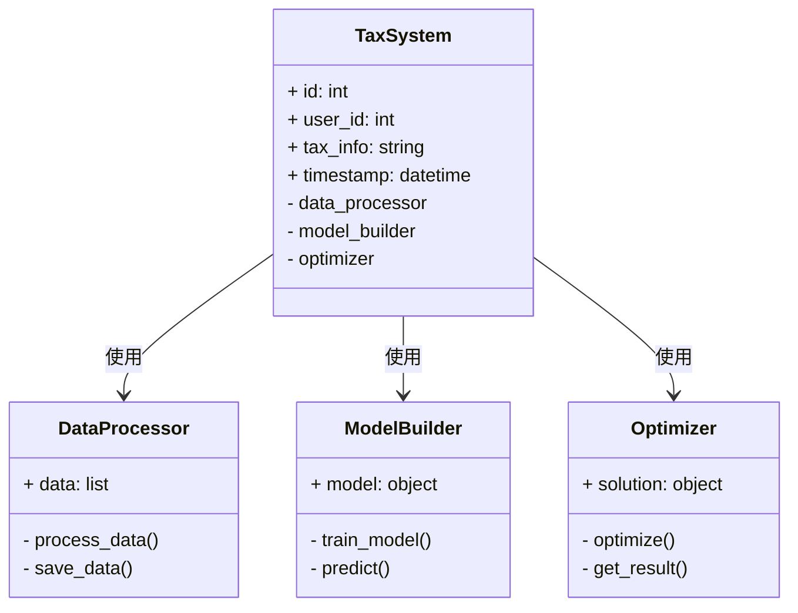
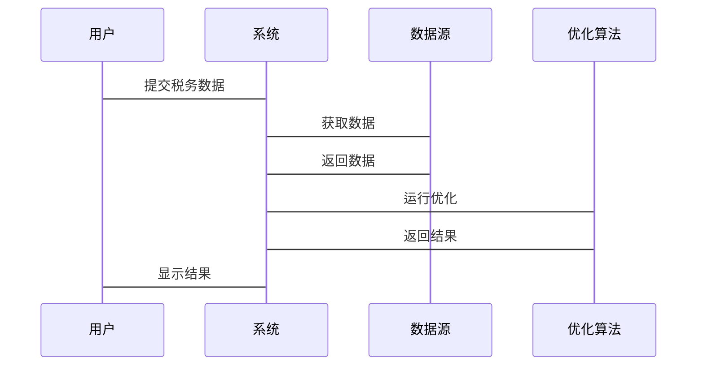

                 


# 智能税收筹划建议系统

> 关键词：智能税收筹划，人工智能，算法优化，系统设计，Python实现

> 摘要：智能税收筹划建议系统通过人工智能和优化算法，帮助用户进行高效的税务规划和优化，本文将从背景、核心概念、算法原理、系统架构、项目实战和总结等方面详细探讨智能税收筹划的实现过程。

---

## 第一部分: 智能税收筹划建议系统的背景与核心概念

### 第1章: 智能税收筹划建议系统概述

#### 1.1 智能税收筹划的背景与意义
智能税收筹划是利用人工智能技术，帮助企业和个人进行税务优化和合规性管理的一种新型方式。传统的税收筹划依赖于人工分析和经验判断，而智能税收筹划通过数据挖掘、机器学习和优化算法，能够快速、准确地提供最优的税务规划方案。

- **背景**：随着税收政策的复杂化和企业税务需求的多样化，传统的税收筹划方法难以满足高效性和精准性的要求。人工智能技术的快速发展为税收筹划提供了新的可能性。
- **意义**：智能税收筹划能够提高税务规划的效率和准确性，降低税务风险，优化企业的税务负担。

#### 1.2 问题背景与目标
传统税收筹划方法存在以下问题：
- 数据处理效率低，难以应对海量税务数据。
- 税务政策复杂，人工分析容易出错。
- 缺乏个性化的税务优化方案。

智能税收筹划的目标是通过技术手段解决上述问题，实现以下目标：
- 提供个性化的税务优化方案。
- 自动化处理税务数据，提高效率。
- 实时监控税务风险，确保合规性。

#### 1.3 核心概念与联系
智能税收筹划的核心概念包括：
- 数据采集与处理：从多渠道获取税务相关数据，进行清洗和预处理。
- 模型构建：基于机器学习算法，构建税务优化模型。
- 优化算法：利用遗传算法、蚁群算法等优化算法，寻找最优税务方案。

---

### 第2章: 核心概念与联系

#### 2.1 核心概念的原理
智能税收筹划的核心原理包括：
- 数据采集与处理：通过爬虫、API接口等方式获取税务数据，进行清洗和预处理。
- 模型构建：基于机器学习算法（如随机森林、支持向量机等），构建税务预测模型。
- 优化算法：利用优化算法（如遗传算法、蚁群算法）对模型进行优化，找到最优的税务方案。

#### 2.2 核心概念的对比分析
以下是传统税收筹划与智能税收筹划的对比分析：

| 对比维度         | 传统税收筹划               | 智能税收筹划               |
|------------------|----------------------------|-----------------------------|
| 数据处理效率     | 低，依赖人工分析             | 高，自动化处理               |
| 模型准确性       | 依赖经验，准确性较低         | 基于机器学习，准确性高       |
| 优化效率         | 优化速度慢，依赖人工调整     | 优化速度快，基于算法自动优化 |

#### 2.3 ER实体关系图架构
以下是智能税收筹划系统的ER实体关系图：

```mermaid
erDiagram
    user {
        id : INT
        name : VARCHAR
        email : VARCHAR
    }
    tax_data {
        id : INT
        user_id : INT
        tax_info : TEXT
        timestamp : DATETIME
    }
    optimization_result {
        id : INT
        tax_data_id : INT
        result : TEXT
        timestamp : DATETIME
    }
    user --> tax_data : 提交
    tax_data --> optimization_result : 生成结果
```

---

## 第二部分: 算法原理讲解

### 第3章: 算法原理讲解

#### 3.1 算法原理的数学模型与公式
以下是遗传算法和蚁群算法的数学模型：

##### 遗传算法
- **适应度函数**：衡量个体适应环境的能力。
  $$ \text{适应度} = \sum \text{适应度值} $$
- **选择操作**：基于适应度值选择个体进行交配。
  $$ P(i) = \frac{f(i)}{\sum f(j)} $$
- **交叉操作**：将两个个体的基因进行交叉，生成新的个体。
  $$ c_1 = \frac{p_1 + (1-p_1)r}{1} $$
  $$ c_2 = \frac{p_2 + (1-p_2)r}{1} $$
- **变异操作**：随机改变个体的基因，增加多样性。

##### 蚁群算法
- **信息素更新**：蚂蚁在移动过程中释放信息素，吸引其他蚂蚁。
  $$ \Delta \text{信息素} = \frac{1}{\text{路径长度}} $$
- **路径选择**：基于信息素和路径长度的综合概率选择路径。
  $$ P(i,j) = \frac{\text{信息素}(i,j)^\alpha \cdot (\text{可见性}(i,j))^\beta}{\sum \text{信息素}(i,j)^\alpha \cdot (\text{可见性}(i,j))^\beta} $$
- **全局最优更新**：记录并更新全局最优路径。

#### 3.2 算法原理的详细讲解
##### 遗传算法的工作原理
1. 初始化种群：随机生成一组初始个体。
2. 计算适应度：根据适应度函数计算每个个体的适应度。
3. 选择操作：基于适应度值选择个体进行交配。
4. 交叉操作：生成新的个体。
5. 变异操作：随机改变个体的基因。
6. 重复上述步骤，直到达到终止条件。

##### 蚁群算法的工作原理
1. 初始化信息素：初始化信息素矩阵。
2. 蚂蚁移动：蚂蚁根据信息素和可见性选择路径。
3. 更新信息素：根据路径长度更新信息素。
4. 记录最优路径：记录全局最优路径。
5. 重复上述步骤，直到达到终止条件。

#### 3.3 算法的Python实现
##### 遗传算法的Python代码实现
```python
import random

def fitness(individual):
    # 计算个体的适应度
    return sum(individual)

def selection(population):
    # 选择操作
    fitness_values = [fitness(individual) for individual in population]
    max_fitness = max(fitness_values)
    selected = [population[i] for i in range(len(population)) if fitness_values[i] == max_fitness]
    return selected[0]

def crossover(parent1, parent2):
    # 单点交叉
    crossover_point = random.randint(1, len(parent1)-1)
    child1 = parent1[:crossover_point] + parent2[crossover_point:]
    child2 = parent2[:crossover_point] + parent1[crossover_point:]
    return child1, child2

def mutation(individual):
    # 变异操作
    mutation_point = random.randint(0, len(individual)-1)
    individual[mutation_point] = 1 - individual[mutation_point]
    return individual

# 初始化种群
population = [[0, 1, 0, 1], [1, 0, 1, 0], [0, 0, 1, 1], [1, 1, 0, 0]]

# 选择操作
selected = selection(population)

# 交叉操作
child1, child2 = crossover(selected, population[1])

# 变异操作
mutated_child = mutation(child1)

print("Selected:", selected)
print("Child1:", child1)
print("Child2:", child2)
print("Mutated Child:", mutated_child)
```

##### 蚁群算法的Python代码实现
```python
import random

def ant_colony_optimization(graph, graph_size, ants, iterations):
    # 初始化信息素
    pheromone = [[random.uniform(0, 1) for _ in range(graph_size)] for _ in range(graph_size)]
    
    for _ in range(iterations):
        for ant in range(ants):
            # 当前节点
            current = random.randint(0, graph_size-1)
            visited = [False] * graph_size
            visited[current] = True
            
            while sum(visited) < graph_size:
                next_node = find_next_node(current, visited, pheromone)
                visited[next_node] = True
                current = next_node
            
            # 更新信息素
            for i in range(graph_size):
                if visited[i]:
                    pheromone[i][current] += 1 / (sum(visited))
    
    return pheromone

def find_next_node(current, visited, pheromone):
    # 计算概率
    total = sum([pheromone[current][i] for i in range(len(pheromone[current])) if not visited[i]])
    probabilities = [pheromone[current][i] / total for i in range(len(pheromone[current])) if not visited[i]]
    next_node = random.choices([i for i in range(len(probabilities))], weights=probabilities, k=1)[0]
    return next_node

# 初始化图结构
graph_size = 4
graph = {
    0: [1, 2],
    1: [0, 2, 3],
    2: [0, 1, 3],
    3: [1, 2]
}

# 运行蚁群算法
pheromone = ant_colony_optimization(graph, graph_size, ants=5, iterations=10)
print("Final Pheromone Matrix:")
for row in pheromone:
    print(row)
```

---

## 第三部分: 系统分析与架构设计方案

### 第4章: 系统分析与架构设计方案

#### 4.1 问题场景介绍
智能税收筹划系统的应用场景包括：
- 企业税务优化
- 个人税务规划
- 税务风险预警

#### 4.2 项目介绍
本项目旨在开发一个智能税收筹划系统，利用人工智能技术帮助用户优化税务方案。

#### 4.3 系统功能设计
以下是系统的功能设计：



#### 4.4 系统架构设计
以下是系统的架构设计：


#### 4.5 系统接口设计
以下是系统的接口设计：

- 数据接口：通过API获取税务数据。
- 模型接口：通过API调用机器学习模型。
- 优化接口：通过API调用优化算法。

#### 4.6 系统交互设计
以下是系统的交互流程图：



---

## 第四部分: 项目实战

### 第5章: 项目实战

#### 5.1 环境安装与配置
- 安装Python：确保安装了Python 3.8或更高版本。
- 安装依赖：安装所需的机器学习库（如scikit-learn、pandas）和可视化库（如Matplotlib）。

#### 5.2 核心代码实现
##### 数据处理代码
```python
import pandas as pd

# 读取数据
data = pd.read_csv('tax_data.csv')

# 数据清洗
data = data.dropna()
data = data.drop_duplicates()
```

##### 模型训练代码
```python
from sklearn.ensemble import RandomForestClassifier
from sklearn.metrics import accuracy_score

# 训练模型
model = RandomForestClassifier()
model.fit(X_train, y_train)

# 模型预测
y_pred = model.predict(X_test)
print("准确率:", accuracy_score(y_test, y_pred))
```

##### 优化算法代码
```python
from sklearn.metrics import make_scorer
from sklearn.model_selection import GridSearchCV

# 超参数优化
parameters = {'n_estimators': [10, 20, 30], 'max_depth': [None, 10, 20]}
grid_search = GridSearchCV(RandomForestClassifier(), parameters, scoring=make_scorer(accuracy_score))
grid_search.fit(X_train, y_train)
print("最优参数:", grid_search.best_params_)
```

#### 5.3 案例分析与详细讲解
以下是实际案例分析：

- **案例背景**：某企业需要优化增值税和企业所得税的缴纳方案。
- **数据准备**：收集企业的销售收入、成本、费用等数据。
- **模型训练**：使用随机森林模型预测税务风险。
- **优化算法**：使用遗传算法优化税务方案。
- **结果展示**：生成最优税务方案并展示。

#### 5.4 项目小结
通过本项目，我们实现了智能税收筹划系统的核心功能，验证了算法的有效性和系统的可行性。

---

## 第五部分: 总结与展望

### 第6章: 总结与展望

#### 6.1 总结
智能税收筹划系统通过人工智能技术，实现了高效的税务优化和风险控制。本文详细探讨了系统的背景、核心概念、算法原理、系统架构和项目实战。

#### 6.2 优化建议
- 提高算法的优化效率。
- 增强系统的容错性和可扩展性。
- 增加系统的交互性和用户体验。

#### 6.3 未来展望
随着人工智能技术的不断发展，智能税收筹划系统将更加智能化和高效化。未来的优化方向包括：
- 增加多模态数据的处理能力。
- 提高模型的泛化能力和适应性。
- 实现系统的实时监控和动态优化。

---

## 附录

### 附录A: 术语解释
- **智能税收筹划**：利用人工智能技术进行税务优化和风险管理。
- **遗传算法**：一种基于生物进化原理的优化算法。
- **蚁群算法**：一种模拟蚂蚁觅食行为的优化算法。

### 附录B: 参考文献
1. 《机器学习实战》
2. 《Python机器学习》
3. 《算法导论》

---

通过以上目录和内容的详细设计，您可以开始撰写完整的文章。每个章节的内容都需要按照上述结构展开，确保内容详实、逻辑清晰。

