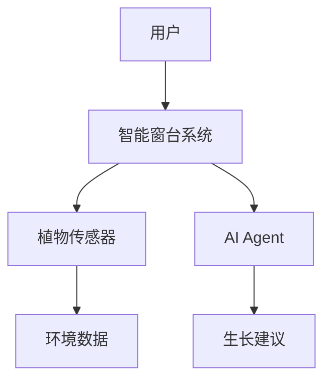
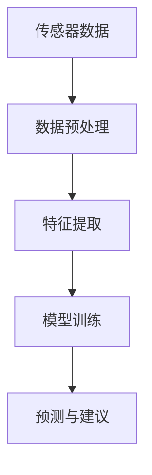
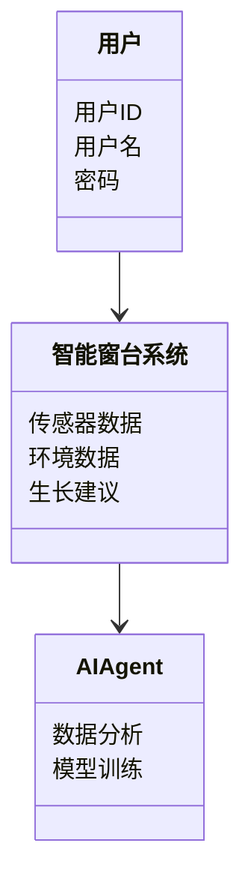
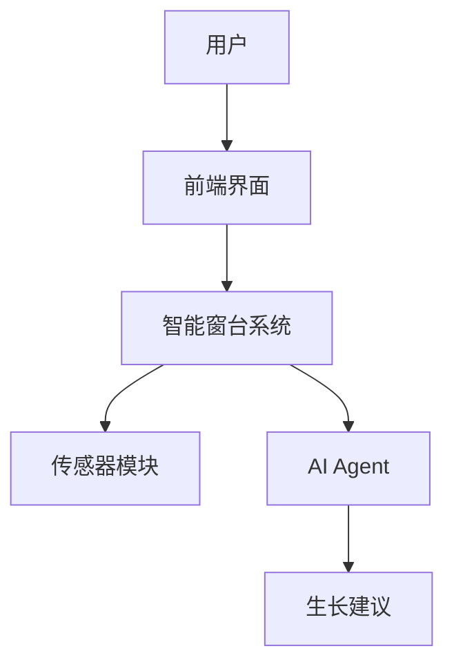

                 


# 智能窗台：AI Agent的室内植物生长监测

> 关键词：AI Agent，室内植物监测，传感器技术，数据采集与分析，系统架构设计，机器学习

> 摘要：本文介绍了一种基于AI Agent的室内植物生长监测系统——智能窗台。通过传感器和AI技术的结合，智能窗台能够实时监测植物的生长环境，并提供个性化的生长建议。本文详细探讨了系统的核心概念、算法原理、系统架构设计以及实现方法，为读者提供了一套完整的解决方案。

---

## 第一章: 智能窗台与AI Agent的背景与概述

### 1.1 问题背景与描述

#### 1.1.1 室内植物生长监测的现状与挑战
随着城市化进程的加快，越来越多的人选择在室内种植植物，以改善生活环境和缓解压力。然而，室内植物的生长受到多种因素的影响，如光照、温度、湿度、土壤酸碱度等。传统的植物监测方法依赖人工观察，存在效率低、误差大且难以实时反馈的问题。

#### 1.1.2 AI Agent在植物监测中的应用潜力
AI Agent（人工智能代理）是一种能够感知环境、自主决策并采取行动的智能体。通过结合物联网技术，AI Agent可以实时采集植物生长环境数据，并通过机器学习算法分析这些数据，为植物提供个性化的生长建议。

#### 1.1.3 智能窗台的概念与定义
智能窗台是一种集成AI Agent和物联网技术的室内植物生长监测系统。它通过多种传感器实时采集植物的生长环境数据，利用AI算法分析数据并生成生长建议，帮助用户优化植物的生长条件。

### 1.2 问题解决与边界

#### 1.2.1 智能窗台的目标与功能
智能窗台的目标是通过实时监测植物的生长环境，提供个性化的生长建议，优化植物的生长条件。其主要功能包括：
1. 实时采集植物的生长环境数据（如光照、温度、湿度等）。
2. 分析数据并生成生长建议。
3. 提供用户友好的交互界面。

#### 1.2.2 系统的边界与外延
智能窗台系统的边界包括传感器、AI算法、用户界面等核心模块，但不包括植物的实际种植和用户的具体操作。系统的外延包括数据存储、网络通信等支持模块。

#### 1.2.3 核心要素与组成结构
智能窗台的核心要素包括：
- 传感器模块：用于采集环境数据。
- AI Agent：用于数据分析和决策。
- 用户界面：用于展示数据和交互。

---

## 第二章: AI Agent的核心概念与原理

### 2.1 AI Agent的基本原理

#### 2.1.1 AI Agent的定义与特征
AI Agent是一种能够感知环境、自主决策并采取行动的智能体。其主要特征包括：
1. 自主性：能够自主决策。
2. 反应性：能够感知环境并实时响应。
3. 目标导向：能够根据目标采取行动。

#### 2.1.2 AI Agent的分类与应用场景
AI Agent可以根据功能和应用场景分为多种类型，如监视型AI Agent、控制型AI Agent、交互型AI Agent等。在智能窗台中，AI Agent主要用于数据分析和决策，属于监视型AI Agent。

#### 2.1.3 AI Agent在智能窗台中的角色
在智能窗台中，AI Agent负责接收传感器数据，分析数据并生成生长建议。它是系统的智能核心，能够根据植物的生长环境数据，优化植物的生长条件。

### 2.2 核心概念与联系

#### 2.2.1 实体关系图（ER图）分析


#### 2.2.2 概念属性对比表
| 概念       | 属性                       |
|------------|---------------------------|
| AI Agent   | 自主性、反应性、目标导向   |
| 植物传感器 | 类型、精度、数据频率       |

---

## 第三章: 算法原理与实现

### 3.1 数据流与处理流程

#### 3.1.1 数据流分析


#### 3.1.2 数据处理流程
1. 数据预处理：对传感器数据进行清洗和标准化。
2. 特征提取：从数据中提取有意义的特征。
3. 模型训练：利用机器学习算法训练模型。
4. 预测与建议：根据模型预测结果生成生长建议。

### 3.2 算法实现

#### 3.2.1 决策树分类算法
```mermaid
graph TD
    Start --> Check[检查根节点特征]
    Check --> Left[左子节点]
    Left --> Check2[检查左子节点特征]
    Check2 --> Left2[左子节点]
    ...  # 简化展示
    Leaf[叶子节点]
```

#### 3.2.2 数学模型与公式
1. 决策树的分类公式：
   $$ y = \text{argmax}_{c} P(y=c | x) $$

2. 信息增益公式：
   $$ \text{信息增益} = H(y) - H(y|x) $$

---

## 第四章: 系统分析与架构设计

### 4.1 系统功能设计

#### 4.1.1 领域模型


### 4.2 系统架构设计

#### 4.2.1 系统架构图


#### 4.2.2 接口设计
- 用户与智能窗台系统的接口：HTTP API。
- 智能窗台系统与传感器的接口：串口通信或蓝牙通信。

---

## 第五章: 项目实战

### 5.1 环境安装与配置

#### 5.1.1 环境要求
- Python 3.8+
- 传感器模块（如DHT11、MQ-135）
- 机器学习库（如scikit-learn、TensorFlow）

#### 5.1.2 安装依赖
```bash
pip install numpy scikit-learn matplotlib
```

### 5.2 系统核心实现

#### 5.2.1 传感器数据采集
```python
import time
from Adafruit import DHT11

sensor = DHT11.DHT11(pin=4)
while True:
    humidity, temperature = sensor.read()
    print(f"湿度: {humidity}%，温度: {temperature}°C")
    time.sleep(60)
```

#### 5.2.2 数据分析与模型训练
```python
from sklearn.tree import DecisionTreeClassifier
import pandas as pd

# 数据预处理
data = pd.read_csv('plant_data.csv')
X = data[['湿度', '温度', '光照']]
y = data['健康状态']

# 模型训练
model = DecisionTreeClassifier()
model.fit(X, y)

# 预测与建议
def generate_recommendation(humidity, temperature, light):
    prediction = model.predict([[humidity, temperature, light]])
    if prediction == 0:
        return "建议增加光照"
    elif prediction == 1:
        return "建议增加湿度"
    else:
        return "生长状况良好"
```

### 5.3 项目小结
通过本项目的实现，我们可以看到智能窗台系统的核心在于传感器数据的采集和AI算法的应用。通过实时监测植物的生长环境并提供个性化的生长建议，智能窗台能够显著提高室内植物的生长效率。

---

## 第六章: 最佳实践与总结

### 6.1 最佳实践

#### 6.1.1 系统优化建议
- 引入多传感器融合技术，提高监测精度。
- 引入边缘计算技术，降低云依赖。

#### 6.1.2 用户注意事项
- 定期校准传感器，确保数据准确性。
- 及时处理系统建议，优化植物生长条件。

### 6.2 总结与展望

#### 6.2.1 总结
智能窗台系统通过AI Agent和物联网技术的结合，实现了室内植物生长的智能化监测和管理。本文详细探讨了系统的背景、核心概念、算法原理、系统架构设计以及实现方法，为读者提供了一套完整的解决方案。

#### 6.2.2 展望
未来，随着AI技术的不断发展，智能窗台系统将更加智能化和个性化。我们可以通过引入更多传感器和更复杂的AI算法，进一步优化植物的生长环境，实现更高效的植物监测和管理。

---

## 附录

### 附录A: 参考文献
1. [1] 《机器学习实战》, 周志华.
2. [2] 《Python机器学习》， Aurelien Geron.

### 附录B: 项目源代码
```python
# 省略具体代码实现
```

---

通过以上内容，我们完成了《智能窗台：AI Agent的室内植物生长监测》一文的撰写。希望本文能够为读者提供清晰的思路和实用的技术指导。

