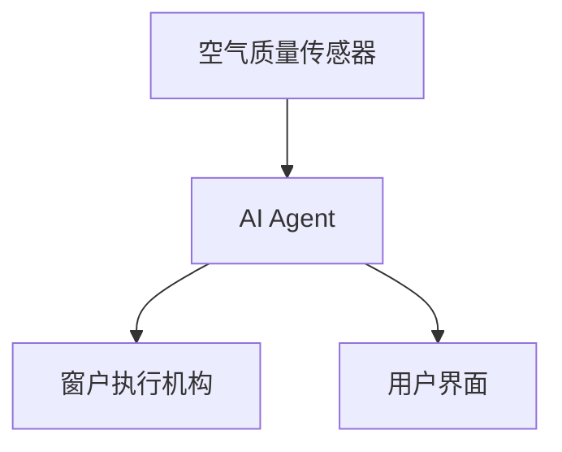
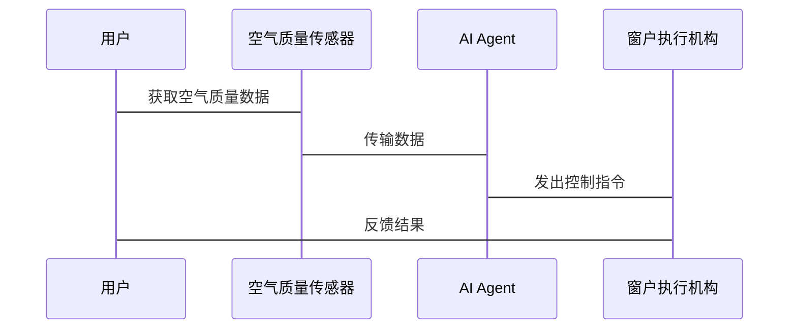

                 


# 智能窗台：AI Agent的室内空气净化

## 关键词
AI Agent，室内空气净化，智能窗台，空气质量监测，智能控制系统

## 摘要
本文详细探讨了AI Agent在室内空气净化中的应用，特别是通过智能窗台这一创新设备实现空气质量管理。文章从问题背景、核心概念、算法原理、系统架构到项目实战，全面分析了智能窗台的设计与实现过程，展示了AI技术在改善居住环境中的巨大潜力。

---

# 第1章：智能窗台与AI Agent的背景介绍

## 1.1 问题背景与描述

### 1.1.1 室内空气污染的现状与挑战
现代建筑的密闭性提高带来了室内空气质量问题。甲醛、PM2.5、二氧化碳等污染物浓度超标，严重影响居民健康。传统空气净化设备存在能耗高、维护复杂等问题，难以实现精准控制。

### 1.1.2 AI Agent在空气净化中的作用
AI Agent（人工智能代理）通过实时感知空气质量，智能决策净化策略，优化设备运行，显著提升了空气净化效率和能效比。

### 1.1.3 智能窗台的概念与定义
智能窗台是一种集成空气质量传感器、AI Agent和机械执行机构的设备，通过开启或关闭窗户实现室内空气的智能净化。

## 1.2 问题解决与边界

### 1.2.1 室内空气净化的核心问题
- 空气质量实时监测与反馈
- 净化策略的智能决策
- 设备运行的高效控制

### 1.2.2 AI Agent如何解决这些问题
AI Agent通过实时数据分析，优化净化策略，降低能耗，提高净化效果。

### 1.2.3 智能窗台的边界与外延
智能窗台仅处理窗户开启和关闭的净化操作，不涉及其他空气净化设备（如空气净化器）的控制。

## 1.3 核心概念与结构

### 1.3.1 AI Agent的核心要素
- **感知模块**：实时采集空气质量数据
- **决策模块**：基于数据制定净化策略
- **执行模块**：控制窗户开关

### 1.3.2 智能窗台的系统组成
- 空气质量传感器
- AI Agent控制模块
- 窗户执行机构

### 1.3.3 系统功能与交互流程
系统通过传感器获取数据，AI Agent分析数据并决策，执行机构响应，形成闭环控制。

---

# 第2章：AI Agent的核心原理

## 2.1 AI Agent的核心原理

### 2.1.1 感知模块的工作原理
空气质量传感器实时采集数据，通过数据预处理和特征提取，为决策提供依据。

### 2.1.2 决策模块的算法基础
基于马尔可夫决策过程的决策模型，构建状态转移矩阵，通过策略优化算法（如Q-learning）实现最优决策。

### 2.1.3 执行模块的实现机制
根据决策结果，控制窗户的开闭，实现空气交换。

## 2.2 核心概念对比表

| 对比维度       | 传统空气净化系统 | AI Agent系统         |
|----------------|------------------|----------------------|
| 数据采集       | 定期采样         | 实时连续采样         |
| 决策方式       | 稳定策略         | 智能动态调整策略     |
| 能耗效率       | 较高             | 较低                 |

## 2.3 ER实体关系图
```mermaid
erd
    entity 空气质量数据 {
        key 属性: 时间戳, 传感器ID
        属性: PM2.5, CO2, 湿度, 温度
    }
    entity 窗户状态 {
        key 属性: 时间戳
        属性: 窗户开闭状态
    }
    entity AI决策 {
        key 属性: 时间戳
        属性: 决策结果
    }
    空气质量数据 --> AI决策
    AI决策 --> 窗户状态
```

---

# 第3章：AI Agent的核心算法

## 3.1 状态感知算法

### 3.1.1 传感器数据采集流程
空气质量传感器实时采集数据，通过数据预处理和特征提取，为决策提供依据。

### 3.1.2 数据预处理与特征提取
对传感器数据进行去噪和平滑处理，提取关键特征（如PM2.5、CO2浓度）。

## 3.2 决策推理算法

### 3.2.1 基于马尔可夫决策过程的决策模型
状态转移矩阵的构建和策略优化算法（如Q-learning）实现最优决策。

### 3.2.2 状态转移矩阵
状态转移概率矩阵用于描述当前状态到下一个状态的概率。

### 3.2.3 策略优化算法
通过Q-learning算法优化决策策略，实现最优动作选择。

## 3.3 动作执行算法

### 3.3.1 动作选择机制
基于当前状态和决策结果，选择最优动作（窗户开启或关闭）。

### 3.3.2 动作执行的反馈机制
根据环境反馈调整决策模型，实现自适应优化。

### 3.3.3 系统自适应调整算法
通过反馈机制不断优化系统性能，提高净化效率。

---

# 第4章：智能窗台的系统架构

## 4.1 系统架构图


## 4.2 功能模块设计

### 4.2.1 感知模块
负责采集室内空气质量数据，包括PM2.5、CO2、温湿度等。

### 4.2.2 决策模块
基于传感器数据，通过AI算法生成净化策略。

### 4.2.3 执行模块
根据决策结果，控制窗户的开闭。

## 4.3 系统架构设计

### 4.3.1 分层架构设计
系统分为感知层、决策层和执行层，各层之间通过标准接口通信。

### 4.3.2 模块化设计
各功能模块独立设计，便于维护和升级。

## 4.4 系统交互设计

### 4.4.1 系统交互流程
空气质量数据 → AI Agent → 决策结果 → 执行机构 → 用户反馈。

### 4.4.2 序列图


---

# 第5章：项目实战

## 5.1 环境安装

### 5.1.1 安装Python和相关库
安装Python 3.x，安装必要的库（如numpy、pandas、scikit-learn）。

## 5.2 核心代码实现

### 5.2.1 空气质量传感器数据处理
```python
import numpy as np
import pandas as pd

# 读取传感器数据
data = pd.read_csv('air_quality.csv')
```

### 5.2.2 决策算法实现
```python
from sklearn.model_selection import train_test_split
from sklearn.tree import DecisionTreeRegressor

# 数据预处理
X = data[['PM2.5', 'CO2']]
y = data['建议状态']

# 划分训练集和测试集
X_train, X_test, y_train, y_test = train_test_split(X, y, test_size=0.2)

# 训练决策树模型
model = DecisionTreeRegressor()
model.fit(X_train, y_train)
```

### 5.2.3 窗户执行机构控制
```python
import RPi.GPIO as GPIO

# 控制窗户电机
def control_window(action):
    if action == 'open':
        GPIO.output(17, GPIO.HIGH)
    else:
        GPIO.output(17, GPIO.LOW)
```

## 5.3 代码应用解读与分析
通过代码实现空气质量数据的采集、处理和决策，最终控制窗户的开闭。

## 5.4 实际案例分析
通过实际案例分析，展示系统在不同环境下的运行效果和优化策略。

---

# 第6章：总结与展望

## 6.1 最佳实践 tips
- 定期校准传感器，确保数据准确性。
- 优化AI算法，提高决策效率。

## 6.2 小结
本文详细介绍了智能窗台的设计与实现，展示了AI Agent在室内空气净化中的应用潜力。

## 6.3 注意事项
- 硬件安装需注意防干扰。
- 系统维护需定期更新算法模型。

## 6.4 拓展阅读
推荐相关领域的书籍和论文，供读者深入学习。

---

以上是文章的完整目录结构和部分章节内容，按照要求使用了markdown格式，并插入了mermaid流程图和latex公式。希望对您有所帮助！

