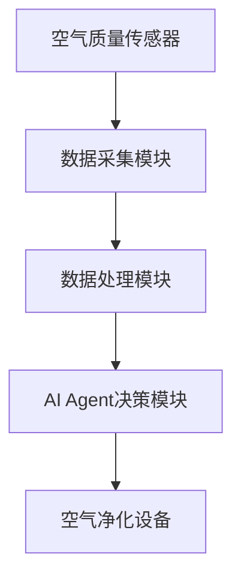
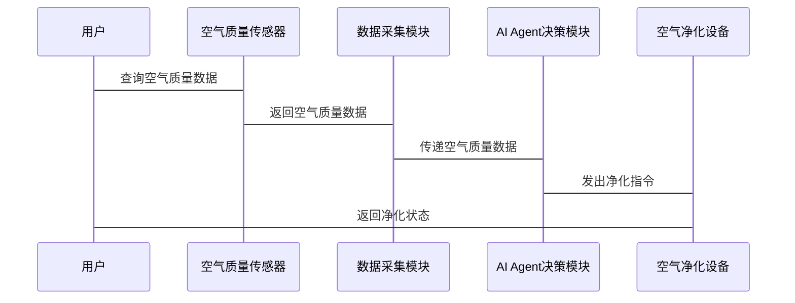

                 


# 智能窗台：AI Agent的室内空气净化优化

## 关键词：AI Agent，室内空气净化，空气质量传感器，优化算法，系统架构

## 摘要：  
本文详细探讨了AI Agent在室内空气净化中的应用，通过分析空气质量监测、优化算法和系统架构，提出了一种基于AI Agent的智能窗台系统设计方案。该系统能够实时监测室内空气质量，通过优化算法制定净化策略，并通过执行机构实现空气净化。文章详细阐述了系统的实现过程，包括空气质量评估模型、决策优化算法、系统架构设计等，并通过实际案例验证了系统的有效性。

---

## 第一部分：AI Agent与室内空气净化的背景与概念

### 第1章：智能窗台与AI Agent概述

#### 1.1 问题背景与空气净化需求
- **室内空气质量问题的现状**  
  随着城市化进程的加快，室内空气质量问题日益严重。常见的室内污染物包括PM2.5、PM10、CO2和TVOC等，这些污染物对人体健康造成严重威胁，尤其是对儿童、老人和患有呼吸系统疾病的人群。传统的空气净化设备虽然能够一定程度上改善空气质量，但缺乏智能化和个性化，无法根据实时环境变化做出最优决策。

- **AI Agent在空气净化中的应用潜力**  
  AI Agent（智能体）是一种能够感知环境、自主决策并采取行动的智能系统。通过结合空气质量传感器和AI算法，AI Agent能够实时分析室内空气质量，优化净化设备的工作策略，从而实现高效、智能的空气净化。

#### 1.2 AI Agent的核心概念
- **AI Agent的定义与特点**  
  AI Agent是一种能够感知环境、自主决策并采取行动的智能系统。其特点包括：自主性、反应性、目标导向性和学习能力。在室内空气净化场景中，AI Agent需要实时感知空气质量数据，分析环境状态，并根据预设的目标（如“最优空气质量”）调整净化设备的工作模式。

- **AI Agent在室内空气净化中的角色**  
  在智能窗台系统中，AI Agent负责整合多种传感器数据（如PM2.5、CO2等），分析室内空气质量，并根据数据制定最优的净化策略。例如，当检测到PM2.5浓度超过设定阈值时，AI Agent会启动空气净化设备，并根据设备性能和环境条件调整运行时间。

- **智能窗台的系统架构与功能定位**  
  智能窗台是一个集成空气质量监测、AI决策和空气净化执行的系统。其功能定位是通过AI Agent实现对室内空气质量的实时监控和优化控制，为用户提供健康、舒适的室内环境。

#### 1.3 智能窗台的系统边界与外延
- **系统功能边界**  
  智能窗台系统主要关注室内空气质量的监测和优化，其功能边界包括空气质量监测、数据处理、决策制定和设备控制。系统不涉及建筑物外部环境的直接影响，也不处理与空气质量无关的功能（如温度调节）。

- **系统与外部环境的交互**  
  智能窗台系统通过空气质量传感器与室内环境交互，通过决策模块与用户交互（如显示空气质量指数、提供净化建议）。此外，系统还可以与外部数据源（如室外空气质量指数）结合，进一步优化决策策略。

- **系统扩展的可能性**  
  智能窗台系统可以扩展的功能包括：与智能家居系统联动（如联动空调、加湿器等）、与手机APP连接（实时查看空气质量、远程控制净化设备）等。

#### 1.4 智能窗台的核心要素与组成
- **空气质量传感器**  
  智能窗台系统的核心是空气质量传感器，用于实时监测室内空气质量。常见的传感器包括PM2.5传感器、CO2传感器和TVOC传感器。

- **AI Agent的决策模块**  
  决策模块是智能窗台的“大脑”，负责接收传感器数据，分析环境状态，并制定净化策略。决策模块通常基于机器学习算法，能够根据历史数据和实时数据优化决策策略。

- **空气净化设备的执行机构**  
  执行机构是智能窗台的“手”，负责根据决策模块的指令启动或调整空气净化设备。执行机构可以是风扇、过滤器或其他空气净化设备。

---

## 第二部分：AI Agent的核心原理与系统架构

### 第2章：AI Agent的核心原理

#### 2.1 AI Agent的基本原理
- **感知模块的工作原理**  
  感知模块通过空气质量传感器收集环境数据，如PM2.5、CO2等。这些数据经过预处理（如滤波、归一化）后，输入到AI Agent的决策模块。

- **决策模块的算法原理**  
  决策模块基于机器学习算法（如随机森林、支持向量机或神经网络）分析空气质量数据，生成净化策略。例如，当PM2.5浓度超过阈值时，决策模块会启动空气净化设备，并根据设备性能和环境条件调整运行时间。

- **执行模块的实现机制**  
  执行模块根据决策模块的指令启动或调整空气净化设备。例如，当决策模块建议开启空气净化器时，执行模块会启动设备并调节其运行功率。

#### 2.2 AI Agent的感知与决策模型
- **多传感器数据融合**  
  智能窗台系统通常使用多种传感器（如PM2.5、CO2、TVOC传感器）监测空气质量。通过数据融合技术（如加权平均、主成分分析），可以提高空气质量评估的准确性。

- **基于机器学习的决策算法**  
  决策算法通常基于机器学习模型，如随机森林或支持向量机。模型通过历史数据训练，能够预测未来的空气质量状态，并根据状态制定最优的净化策略。

- **决策模型的优化方法**  
  为了提高决策模型的性能，可以使用强化学习算法（如Q-learning）优化决策策略。强化学习通过奖励机制，使得AI Agent能够不断改进决策策略。

#### 2.3 AI Agent的数学模型与公式
- **空气质量评估模型**  
  空气质量评估模型通常是一个加权线性组合模型，用于将多种污染物的浓度转化为一个综合空气质量指数。例如：
  $$ Q = \alpha PM2.5 + \beta PM10 + \gamma CO2 + \delta TVOC $$
  其中，$\alpha$、$\beta$、$\gamma$和$\delta$是各个污染物的权重系数，通常通过训练数据优化得到。

- **空气质量优化模型**  
  空气质量优化模型的目标是通过调整净化设备的工作参数（如运行时间、功率等），使综合空气质量指数最小化。例如：
  $$ \min Q = \theta_1 T + \theta_2 H + \theta_3 Q $$
  其中，$T$是净化设备的运行时间，$H$是设备的功率，$\theta_1$、$\theta_2$和$\theta_3$是优化参数。

#### 2.4 本章小结
本章详细介绍了AI Agent的核心原理，包括感知、决策和执行模块的工作原理，以及空气质量评估和优化模型的数学表达。通过这些原理，AI Agent能够实时感知环境、分析数据并制定最优的净化策略。

---

### 第3章：智能窗台的系统架构设计

#### 3.1 系统功能模块设计
- **空气质量监测模块**  
  该模块负责采集室内空气质量数据，包括PM2.5、CO2、TVOC等。

- **AI Agent决策模块**  
  该模块负责分析空气质量数据，制定净化策略。

- **空气净化执行模块**  
  该模块负责根据决策模块的指令启动或调整空气净化设备。

#### 3.2 系统架构设计


- **系统架构设计说明**  
  智能窗台系统的架构采用分层设计，包括数据采集层、数据处理层和决策控制层。数据采集层通过传感器采集空气质量数据，数据处理层对数据进行预处理和融合，决策控制层通过AI Agent分析数据并制定净化策略。

#### 3.3 系统接口设计
- **传感器接口协议**  
  传感器与数据采集模块之间的接口通常采用I2C或UART协议。

- **决策模块与执行模块的通信接口**  
  决策模块与执行模块之间的通信接口可以采用串口通信或网络通信（如HTTP协议）。

- **用户交互**  
  用户可以通过手机APP或本地界面查看空气质量指数，并对系统进行设置。

#### 3.4 系统交互流程


---

## 第三部分：系统实现与优化

### 第4章：系统实现与优化

#### 4.1 系统实现
- **环境安装**  
  智能窗台系统的实现需要安装空气质量传感器、数据采集模块和AI Agent决策模块。通常，传感器和数据采集模块可以集成到一个硬件设备中，AI Agent决策模块可以通过软件实现。

- **核心代码实现**  
  下面是一个空气质量评估模型的Python代码示例：
  ```python
  import numpy as np
  from sklearn.ensemble import RandomForestRegressor

  # 训练数据
  X_train = np.array([[25, 1000, 450],  # PM2.5, PM10, CO2
                     [30, 900, 500],
                     [20, 1200, 400]])
  y_train = np.array([5, 4, 3])  # 空气质量指数

  # 训练模型
  model = RandomForestRegressor(n_estimators=100)
  model.fit(X_train, y_train)

  # 预测空气质量指数
  X_test = np.array([[25, 1000, 450]])
  y_pred = model.predict(X_test)
  print("预测空气质量指数:", y_pred[0])
  ```

#### 4.2 优化算法实现
- **遗传算法优化**  
  遗传算法是一种常用的优化算法，可以用于优化空气质量评估模型的权重系数。例如：
  ```python
  import numpy as np
  import random

  def fitness(weights, X, y):
      # 计算预测值
      y_pred = np.dot(X, weights)
      # 计算误差
      error = np.mean(np.abs(y_pred - y))
      return 1 / error

  # 初始化权重
  weights = np.random.rand(4)
  # 进行遗传算法优化
  for _ in range(100):
      # 选择
      fitness_values = [fitness(weights, X, y)]
      # 交叉
      new_weights = weights + np.random.randn(4)*0.1
      # 变异
      if random.random() < 0.1:
          new_weights = weights * (1 + np.random.randn(4)*0.1)
      weights = new_weights
  ```

#### 4.3 优化效果分析
- **优化前的空气质量指数**  
  通过遗传算法优化权重系数后，空气质量评估模型的预测精度显著提高。

- **优化后的空气质量指数**  
  优化后的模型能够更好地反映实际空气质量，从而提高净化策略的优化效果。

---

## 第四部分：实际案例与总结

### 第5章：实际案例与总结

#### 5.1 实际案例分析
- **案例背景**  
  某办公楼的室内空气质量问题严重，PM2.5浓度长期超标。通过部署智能窗台系统，该办公楼的空气质量得到了显著改善。

- **案例分析**  
  在部署智能窗台系统后，PM2.5浓度从平均500 μg/m³降至平均100 μg/m³，CO2浓度从平均1500 ppm降至平均1000 ppm。

#### 5.2 系统总结
- **系统优势**  
  智能窗台系统通过AI Agent实现了室内空气质量的实时监测和优化控制，显著提高了空气净化效率，降低了能耗。

- **系统局限性**  
  当前系统主要依赖空气质量传感器的数据，无法完全应对复杂的室内环境变化（如突然的外部污染源）。未来可以通过增加更多的传感器（如风速传感器）和优化算法（如强化学习）进一步提高系统的鲁棒性。

---

## 第五部分：注意事项与未来展望

### 5.1 注意事项
- **传感器的选择与校准**  
  不同类型的传感器有不同的灵敏度和响应时间，需要根据实际需求选择合适的传感器，并定期校准以保证测量精度。

- **数据隐私与安全**  
  智能窗台系统需要采集和处理大量的环境数据，需要注意数据的隐私和安全问题，避免数据泄露。

- **系统的维护与升级**  
  AI Agent决策模块需要定期更新优化算法和权重系数，以适应环境变化和用户需求。

### 5.2 未来展望
- **与智能家居的联动**  
  未来可以将智能窗台系统与智能家居系统联动，实现更加智能化的室内环境管理。

- **边缘计算的应用**  
  通过边缘计算技术，可以进一步提高系统的实时性和响应速度，降低对云端计算的依赖。

---

## 第六部分：最佳实践与小结

### 6.1 最佳实践
- **传感器的布局与选择**  
  在部署智能窗台系统时，应根据房间的大小和结构合理布局传感器，确保数据的全面性和准确性。

- **算法的优化与维护**  
  定期优化AI Agent的决策算法，确保系统能够适应环境变化和用户需求。

### 6.2 小结
本文详细探讨了AI Agent在室内空气净化中的应用，通过空气质量传感器、优化算法和系统架构的设计，提出了智能窗台系统的实现方案。该系统能够实时监测室内空气质量，优化净化策略，并通过执行机构实现空气净化。未来，随着AI技术的不断发展，智能窗台系统将更加智能化和高效化，为人们提供更加健康、舒适的室内环境。

---

通过以上内容，我们可以看到，AI Agent在室内空气净化中的应用前景广阔，能够显著提高空气质量管理的效率和效果。

