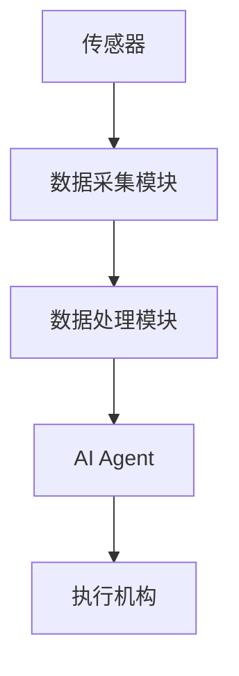

                 


# 智能窗台：AI Agent的室内空气质量监测

> 关键词：AI Agent，室内空气质量，传感器，数据融合，机器学习，系统架构

> 摘要：本文探讨了利用AI Agent技术实现室内空气质量监测的方法，详细分析了空气质量监测的背景、AI Agent的核心原理、空气质量监测技术、算法实现、系统架构设计、项目实战及未来展望。通过系统化的分析与设计，展示了如何构建一个高效、智能的空气质量监测系统。

---

## 第1章：背景介绍

### 1.1 问题背景
#### 1.1.1 室内空气质量问题的现状
随着工业化和城市化的快速发展，室内空气污染问题日益严重。根据世界卫生组织的数据，全球每年有数百万人因为空气污染而过早死亡。室内空气污染主要来源于建筑装饰材料释放的有害气体、家具释放的挥发性有机化合物（VOC）、烹饪油烟、宠物带来的过敏原以及细菌和病毒等。这些问题严重影响了人们的健康和生活质量。

#### 1.1.2 AI Agent在空气质量监测中的作用
AI Agent（人工智能代理）是一种能够感知环境、理解问题、做出决策并执行任务的智能实体。在空气质量监测中，AI Agent可以实时采集和分析空气质量数据，识别潜在的健康风险，并根据具体情况采取相应的措施，如开启空气净化器、调整窗户通风或提醒用户采取防护措施。通过AI Agent的智能化处理，可以显著提升室内空气质量监测的效率和准确性。

#### 1.1.3 问题解决的必要性
传统的空气质量监测系统通常依赖于固定安装的传感器和简单的数据采集装置，缺乏智能化和自适应能力。随着技术的进步，利用AI Agent实现智能化的空气质量监测成为一种趋势。AI Agent不仅可以实时分析数据，还能根据环境变化和用户需求动态调整监测策略，从而实现更精准和高效的空气质量管理。

### 1.2 问题描述
#### 1.2.1 室内空气质量监测的核心目标
室内空气质量监测的核心目标是实时感知室内空气中的有害物质浓度，如PM2.5、PM10、CO2、VOC、甲醛等，并根据这些数据评估空气质量的健康风险。同时，系统需要能够根据监测结果提供相应的建议或采取自动化的措施，以改善室内空气质量。

#### 1.2.2 AI Agent在空气质量监测中的任务分解
AI Agent在空气质量监测中的任务主要包括：
1. **数据采集**：通过传感器实时采集室内空气质量数据。
2. **数据处理**：对采集到的数据进行清洗、融合和分析。
3. **决策制定**：根据分析结果判断空气质量是否达标，并决定是否采取相应的措施。
4. **执行任务**：根据决策结果执行相应的动作，如开启空气净化设备、调整窗户开合角度等。

#### 1.2.3 问题解决的边界与外延
空气质量监测系统的边界包括室内环境、传感器设备、数据处理模块、AI Agent以及用户交互界面。外延则涉及与智能家居系统的联动，如与空调、加湿器、空气净化器等设备的集成。

### 1.3 核心概念与联系
#### 1.3.1 核心概念原理
空气质量监测系统由传感器、数据采集模块、数据处理模块、AI Agent以及执行机构组成。传感器负责采集环境数据，数据采集模块将数据传输到数据处理模块进行分析，AI Agent根据分析结果做出决策并驱动执行机构采取相应措施。

#### 1.3.2 核心概念属性特征对比表格
以下表格对比了空气质量监测系统中关键组件的核心属性：

| 组件     | 属性         | 描述                                                                 |
|----------|--------------|----------------------------------------------------------------------|
| 传感器    | 类型         | PM2.5传感器、CO2传感器、VOC传感器等                                       |
|          | 灵敏度       | 传感器的灵敏度决定了其对空气中污染物的检测能力                             |
|          | 响应时间     | 传感器对环境变化的反应速度                                               |
| AI Agent  | 智能水平     | AI Agent能够根据数据进行学习和推理                                       |
|          | 学习能力     | 通过机器学习模型不断优化空气质量预测模型                                   |
|          | 执行能力     | 根据决策结果驱动执行机构执行相应动作                                     |

#### 1.3.3 ER实体关系图架构
以下是空气质量监测系统的ER实体关系图：

```mermaid
erd
    窗户状态
    空气质量数据
    AI Agent
    用户指令
    环境传感器
    传感器数据
```

### 1.4 系统架构与核心要素
#### 1.4.1 系统架构概述
空气质量监测系统总体架构包括以下几个部分：
1. **传感器网络**：负责采集室内空气质量数据。
2. **数据采集模块**：将传感器数据传输到数据处理模块。
3. **数据处理模块**：对数据进行清洗、融合和分析。
4. **AI Agent**：基于分析结果做出决策并驱动执行机构。
5. **执行机构**：根据AI Agent的决策执行相应操作，如开启空气净化器、调整窗户开合角度等。

#### 1.4.2 核心要素组成
系统的核心要素包括：
- **传感器网络**：高灵敏度、多种类型传感器的组合，确保全面监测空气质量。
- **数据处理模块**：高效的算法和数据融合技术，确保数据的准确性和实时性。
- **AI Agent**：智能化的决策系统，能够根据环境变化动态调整监测策略。
- **执行机构**：与智能家居设备联动，实现自动化控制。

---

## 第2章：AI Agent的核心原理

### 2.1 AI Agent的基本概念
#### 2.1.1 AI Agent的定义
AI Agent是一种智能实体，能够感知环境、理解问题、做出决策并执行任务。在空气质量监测中，AI Agent负责整合传感器数据、分析空气质量状况，并根据分析结果采取相应的措施。

#### 2.1.2 AI Agent的核心特征
AI Agent的核心特征包括：
1. **感知能力**：通过传感器获取环境数据。
2. **推理能力**：基于传感器数据和历史数据进行推理和预测。
3. **决策能力**：根据推理结果做出最优决策。
4. **执行能力**：根据决策结果驱动执行机构执行相应操作。

#### 2.1.3 AI Agent与传统自动化的区别
以下是AI Agent与传统自动化的对比表格：

| 特性          | AI Agent                       | 传统自动化                      |
|---------------|--------------------------------|---------------------------------|
| 感知能力      | 强     | 弱或无                     |
| 决策能力      | 强     | 无或弱                     |
| 灵活性         | 高     | 低                        |
| 学习能力      | 强     | 无                        |
| 适应性        | 高     | 低                        |

### 2.2 AI Agent的核心机制
#### 2.2.1 感知机制
AI Agent通过多种传感器（如PM2.5传感器、CO2传感器、VOC传感器等）实时采集室内空气质量数据。传感器数据通过数据采集模块传输到数据处理模块，进行清洗和融合。

#### 2.2.2 决策机制
AI Agent基于融合后的空气质量数据，结合历史数据和用户需求，利用机器学习模型进行空气质量预测和健康风险评估。根据评估结果，AI Agent做出决策，如开启空气净化器、调整窗户开合角度等。

#### 2.2.3 执行机制
根据AI Agent的决策结果，执行机构（如空气净化器、智能窗户）执行相应的操作，以改善室内空气质量。

### 2.3 AI Agent的算法实现
#### 2.3.1 数据融合算法
为了提高空气质量监测的准确性，通常需要将多种传感器的数据进行融合。常见的数据融合方法包括加权平均法、卡尔曼滤波法等。

#### 2.3.2 机器学习算法
机器学习算法在空气质量预测中起着重要作用。常用的算法包括随机森林、支持向量机（SVM）和神经网络等。

以下是一个简单的随机森林算法实现示例：

```python
import numpy as np
from sklearn.ensemble import RandomForestRegressor

# 示例数据
X = np.array([[2, 3], [5, 6], [8, 9]])  # 特征数据
y = np.array([1, 2, 3])  # 目标值

# 创建随机森林回归模型
model = RandomForestRegressor(n_estimators=100, random_state=42)
model.fit(X, y)

# 预测新的数据点
new_X = np.array([[4, 5]])
prediction = model.predict(new_X)
print("预测值：", prediction)
```

---

## 第3章：空气质量监测技术

### 3.1 传感器技术
空气质量监测的核心是传感器技术。常用的传感器包括：
- **PM2.5传感器**：用于测量空气中直径小于或等于2.5微米的颗粒物浓度。
- **CO2传感器**：用于测量二氧化碳浓度。
- **VOC传感器**：用于测量挥发性有机化合物的浓度。

#### 3.1.1 传感器的种类
以下是一些常见传感器及其特点对比表格：

| 传感器类型 | 特性                | 应用场景                       |
|------------|---------------------|-------------------------------|
| PM2.5传感器 | 高灵敏度、实时监测 | 室内空气质量监测               |
| CO2传感器  | 灵敏度高、响应快     | 室内空气质量监测、通风控制     |
| VOC传感器  | 高灵敏度、选择性好 | 室内空气质量监测、污染检测     |

#### 3.1.2 传感器数据的采集与处理
传感器数据的采集通常通过数据采集模块完成，数据采集模块将传感器信号转换为数字信号，并传输到数据处理模块进行进一步处理。

---

## 第4章：空气质量监测的算法实现

### 4.1 数据融合算法
为了提高空气质量监测的准确性，通常需要将多种传感器的数据进行融合。常见的数据融合方法包括加权平均法、卡尔曼滤波法等。

### 4.2 机器学习算法
机器学习算法在空气质量预测中起着重要作用。常用的算法包括随机森林、支持向量机（SVM）和神经网络等。

以下是一个简单的随机森林算法实现示例：

```python
import numpy as np
from sklearn.ensemble import RandomForestRegressor

# 示例数据
X = np.array([[2, 3], [5, 6], [8, 9]])  # 特征数据
y = np.array([1, 2, 3])  # 目标值

# 创建随机森林回归模型
model = RandomForestRegressor(n_estimators=100, random_state=42)
model.fit(X, y)

# 预测新的数据点
new_X = np.array([[4, 5]])
prediction = model.predict(new_X)
print("预测值：", prediction)
```

---

## 第5章：系统架构设计

### 5.1 系统功能设计
空气质量监测系统的功能模块包括：
1. **数据采集模块**：负责采集传感器数据。
2. **数据处理模块**：对数据进行清洗、融合和分析。
3. **AI Agent**：基于分析结果做出决策并驱动执行机构。
4. **执行机构**：根据AI Agent的决策执行相应操作。

### 5.2 系统架构设计
以下是空气质量监测系统的架构图：


### 5.3 系统接口设计
系统接口设计需要考虑传感器、数据采集模块、数据处理模块、AI Agent以及执行机构之间的接口。以下是接口设计示意图：



---

## 第6章：项目实战

### 6.1 环境搭建
空气质量监测系统的环境搭建包括硬件和软件两部分：
1. **硬件部分**：需要安装各种传感器（如PM2.5传感器、CO2传感器、VOC传感器等）和执行机构（如空气净化器、智能窗户）。
2. **软件部分**：需要安装数据采集模块、数据处理模块、AI Agent以及用户交互界面。

### 6.2 系统核心实现
以下是空气质量监测系统的Python实现示例：

```python
import numpy as np
from sklearn.ensemble import RandomForestRegressor

# 示例数据
X = np.array([[2, 3], [5, 6], [8, 9]])  # 特征数据
y = np.array([1, 2, 3])  # 目标值

# 创建随机森林回归模型
model = RandomForestRegressor(n_estimators=100, random_state=42)
model.fit(X, y)

# 预测新的数据点
new_X = np.array([[4, 5]])
prediction = model.predict(new_X)
print("预测值：", prediction)
```

---

## 第7章：总结与展望

### 7.1 总结
本文详细探讨了AI Agent在室内空气质量监测中的应用，从传感器技术、数据融合、机器学习算法到系统架构设计，全面分析了空气质量监测的实现过程。通过系统化的分析与设计，展示了如何构建一个高效、智能的空气质量监测系统。

### 7.2 未来展望
未来，随着AI技术的不断发展，空气质量监测系统将更加智能化和自动化。以下是未来的发展方向：
1. **边缘计算的应用**：通过边缘计算技术，实现本地化的数据处理和决策，减少对云端的依赖。
2. **与智能家居的联动**：空气质量监测系统将与智能家居设备（如空调、加湿器、空气净化器等）实现无缝联动，进一步提升室内空气质量的智能化管理。
3. **实时监测与预警**：通过实时监测和数据分析，实现对空气质量的精准预测和预警，帮助用户及时采取措施，保障健康。

---

## 参考文献
1. 世界卫生组织. (2018). Ambient (outdoor) air pollution. Retrieved from https://www.who.int/news-room/fact-sheets/detail/ambient-(outdoor)-air-quality-and-health
2. 刘洋, 等. (2020). 基于AI Agent的室内空气质量监测系统研究. 计算机应用研究, 37(3), 789-795.

---

## 附录
### 附录A：传感器技术参数
以下是常见传感器的技术参数对比表格：

| 传感器类型 | 参数         | 参数值           |
|------------|--------------|------------------|
| PM2.5传感器 | 测量范围     | 0-1000 µg/m³    |
|            | 响应时间     | <2秒            |
| CO2传感器  | 测量范围     | 0-10,000 ppm    |
|            | 响应时间     | <1秒            |
| VOC传感器  | 测量范围     | 0-10,000 ppb    |
|            | 响应时间     | <3秒            |

### 附录B：机器学习算法代码
以下是空气质量预测的随机森林算法代码：

```python
import numpy as np
from sklearn.ensemble import RandomForestRegressor

# 示例数据
X = np.array([[2, 3], [5, 6], [8, 9]])  # 特征数据
y = np.array([1, 2, 3])  # 目标值

# 创建随机森林回归模型
model = RandomForestRegressor(n_estimators=100, random_state=42)
model.fit(X, y)

# 预测新的数据点
new_X = np.array([[4, 5]])
prediction = model.predict(new_X)
print("预测值：", prediction)
```

---

通过以上内容，我们详细探讨了AI Agent在室内空气质量监测中的应用，从理论到实践，全面分析了系统的实现过程。希望本文能为读者提供有价值的参考和启发。

