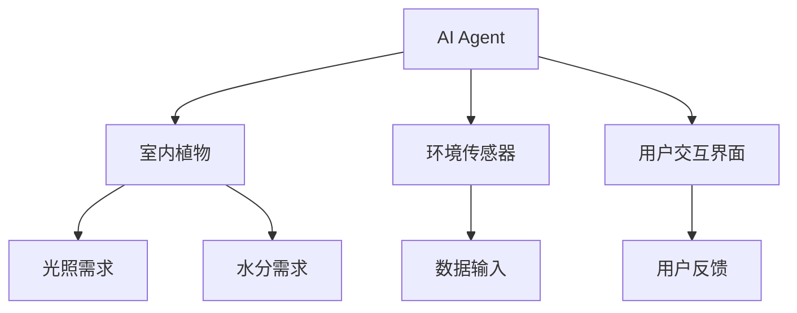
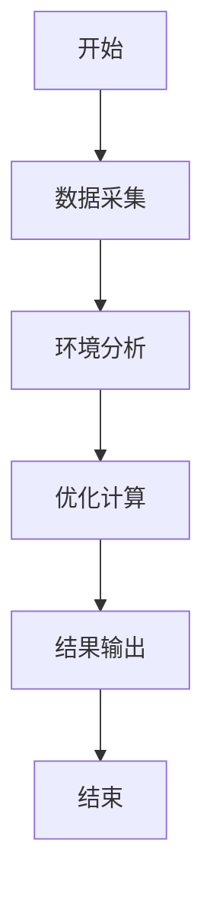
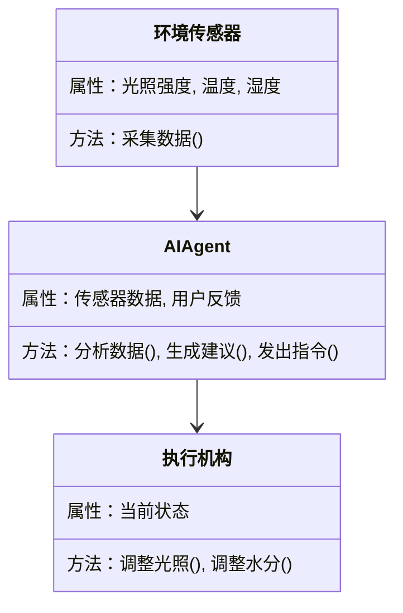
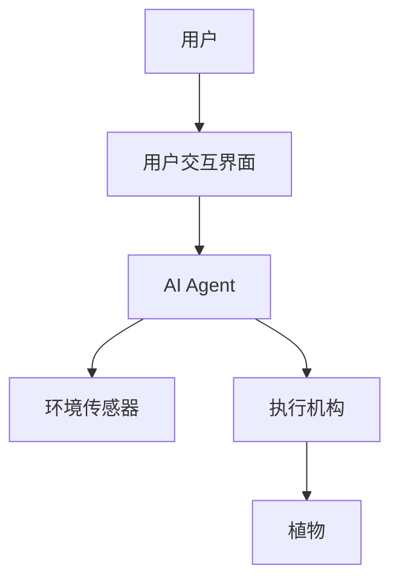
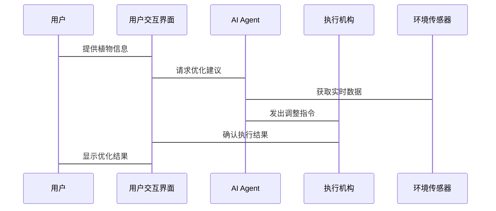

                 


# 智能窗台：AI Agent的室内绿化优化系统

> **关键词**：AI Agent、室内绿化、环境优化、智能系统、算法优化

> **摘要**：本文介绍一种结合AI Agent的室内绿化优化系统，通过分析当前室内绿化管理的痛点，提出基于AI代理的解决方案。文章详细探讨了系统的背景、核心概念、算法原理、系统架构以及实际项目实现，为读者提供全面的技术解读。

---

## 第一部分：智能窗台与AI Agent的背景介绍

### 第1章：问题背景与描述

#### 1.1 室内绿化的重要性
随着城市化进程的加快，人们在室内环境中度过了大部分时间。室内绿化不仅能够美化环境，还能改善空气质量，提升居住和工作效率。然而，室内植物的管理却成为一个难题，尤其是对于没有专业知识的用户来说，很难准确判断植物的需求。

#### 1.2 当前室内绿化管理的痛点
- **管理复杂**：不同植物对光照、水分的需求不同，传统方法依赖人工经验，效率低且容易出错。
- **资源浪费**：过度浇水或施肥会导致资源浪费，甚至可能损害植物。
- **环境变化**：室内环境受季节、温度等因素影响，需要动态调整管理策略。

#### 1.3 AI Agent在室内绿化中的应用潜力
AI Agent（人工智能代理）能够通过传感器实时采集环境数据，结合优化算法，为植物提供个性化的管理建议。AI Agent不仅可以自动调整环境参数，还能通过学习不断优化管理策略，显著提升室内绿化的效率和效果。

---

### 第2章：AI Agent与室内绿化的核心概念

#### 2.1 核心概念与原理
- **AI Agent**：一种能够感知环境、做出决策并采取行动的智能系统。在室内绿化中，AI Agent通过传感器数据和历史信息，优化植物的生长条件。
- **室内绿化**：指在室内环境中种植和管理植物的过程，涉及光照、水分、温度等多个环境因素。

#### 2.2 核心概念对比表
| **属性**         | **AI Agent**               | **传统室内绿化管理**          |
|-------------------|-----------------------------|-------------------------------|
| 数据来源         | 环境传感器、历史数据       | 人工观察、经验                 |
| 决策方式         | 基于算法的优化决策         | 依赖人工判断                   |
| 执行方式         | 自动调整环境参数           | 需要人工操作                   |
| 适应性           | 能够动态优化                | 固定策略，适应性差              |

#### 2.3 实体关系图


---

## 第二部分：算法原理与实现

### 第3章：算法原理与实现

#### 3.1 优化算法概述
- **遗传算法**：模拟自然选择的过程，通过交叉和变异生成新的解。
- **粒子群优化算法**：通过模拟鸟群觅食行为，找到问题的最优解。
- **对比分析**：粒子群优化算法在处理动态环境问题时表现更优。

#### 3.2 算法流程图


#### 3.3 Python实现代码
```python
import numpy as np
import random

def particle_swarm_optimization(target):
    # 初始化粒子群
    particles = 10
    dimensions = 3  # 光照、水分、温度
    target = np.array(target)
    # 初始化位置和速度
    positions = np.random.rand(particles, dimensions)
    velocities = np.zeros((particles, dimensions))
    
    # 迭代优化
    max_iter = 100
    for _ in range(max_iter):
        # 计算适应度
        fitness = [np.sum((target - positions[i])**2) for i in range(particles)]
        # 找到最优解
        best_index = np.argmin(fitness)
        best = positions[best_index]
        
        # 更新速度和位置
        for i in range(particles):
            velocities[i] = 0.8 * velocities[i] + 1.2 * (best - positions[i]) * random.random()
            positions[i] += velocities[i]
    
    return best

# 示例目标向量
target = [80, 60, 22]
result = particle_swarm_optimization(target)
print("优化结果：", result)
```

---

## 第三部分：系统分析与架构设计

### 第4章：系统分析与架构设计

#### 4.1 系统功能设计
- **环境监测**：实时采集光照、温度、湿度等数据。
- **优化建议**：基于算法生成植物的管理建议。
- **用户交互**：提供友好的操作界面，接收用户反馈。
- **数据管理**：存储历史数据，支持数据分析和可视化。

#### 4.2 领域模型类图


#### 4.3 系统架构图


#### 4.4 接口设计与交互序列图


---

## 第四部分：项目实战

### 第5章：项目实战

#### 5.1 环境安装
- **Python环境**：安装Python 3.8及以上版本。
- **库依赖**：numpy、pandas、scikit-learn、matplotlib。
- **工具安装**：安装Jupyter Notebook用于开发和调试。

#### 5.2 核心功能实现
- **数据采集模块**：使用Raspberry Pi采集光照、温度、湿度数据。
- **优化算法模块**：实现粒子群优化算法，生成管理建议。
- **执行机构控制模块**：通过继电器控制LED灯和喷水装置。

#### 5.3 案例分析
- **案例1**：优化某植物的光照条件，从每天6小时增加到8小时，促进光合作用。
- **案例2**：根据土壤湿度调整浇水频率，减少水资源浪费。

#### 5.4 项目小结
- 通过实际案例验证了系统的有效性和实用性。
- 系统能够根据环境变化动态调整，显著提升室内植物的生长状态。

---

## 第五部分：最佳实践与扩展

### 第6章：最佳实践与扩展

#### 6.1 最佳实践
- **数据采集**：使用高精度传感器，确保数据的准确性。
- **算法调优**：根据具体场景调整算法参数，提升优化效果。
- **系统维护**：定期检查传感器和执行机构，确保系统稳定运行。

#### 6.2 小结
本文详细介绍了智能窗台系统的背景、核心概念、算法原理和系统架构，并通过实际项目展示了系统的实现过程和优化效果。AI Agent在室内绿化中的应用前景广阔，未来可以通过引入更多传感器和更复杂的优化算法，进一步提升系统的智能化水平。

#### 6.3 注意事项
- 数据隐私：确保用户数据的安全性。
- 传感器精度：选择合适的传感器以保证数据的准确性。
- 系统维护：定期检查和维护系统硬件和软件。

#### 6.4 拓展阅读
- **书籍推荐**：《强化学习入门》、《机器学习实战》。
- **论文推荐**：《基于粒子群优化的智能控制系统研究》。

---

通过以上内容，我们详细探讨了智能窗台系统的各个方面，从理论到实践，为读者提供了一个全面的技术解读。

