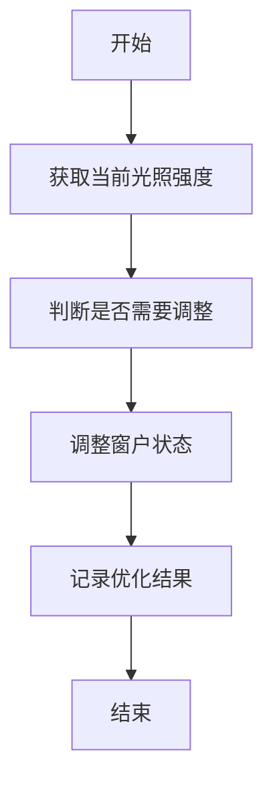
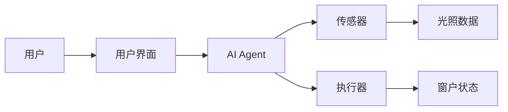
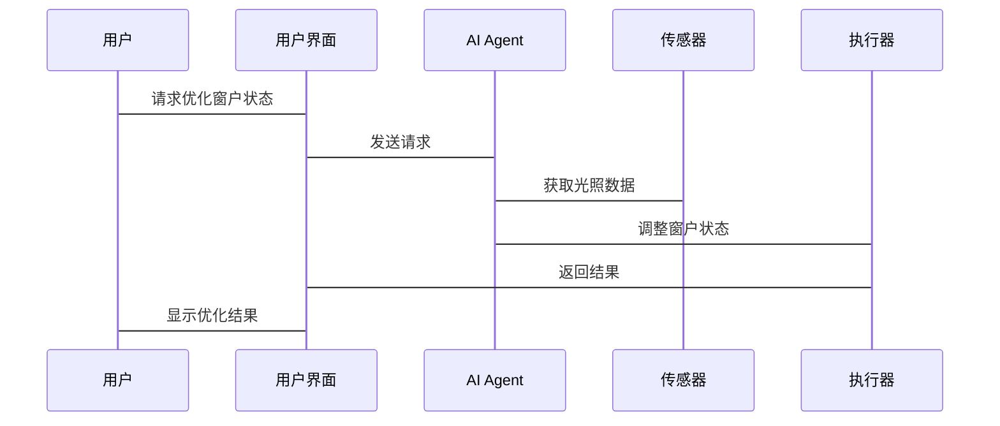

                 


# 智能窗台：AI Agent的自然光摄入优化

## 关键词：智能窗台，AI Agent，自然光优化，算法原理，系统架构

## 摘要：本文探讨AI Agent如何优化智能窗台的自然光摄入，从背景、概念、算法到系统架构和项目实战，全面分析其工作原理和应用场景，为实现高效、舒适的智能化窗户控制提供理论和技术支持。

---

# 第一部分: 智能窗台与AI Agent的背景介绍

## 第1章: 智能窗台与AI Agent的背景与问题描述

### 1.1 智能窗台的概念与应用背景
智能窗台是一种结合了AI技术的窗户系统，能够根据环境条件自动调节窗户的开合状态，以优化自然光的摄入。随着人们对居住环境舒适度和能源效率的要求不断提高，智能窗台的应用变得越来越重要。

#### 1.1.1 什么是智能窗台
智能窗台是一种智能家居设备，通过传感器和AI算法，实时监测环境光照、温度和用户需求，自动调整窗户的开合状态，以达到优化自然光摄入的目的。

#### 1.1.2 智能窗台的应用场景
智能窗台广泛应用于家庭、办公室、学校等场所，特别是在需要自然光调节的环境中，如温室、艺术工作室等。

#### 1.1.3 自然光优化的重要性
自然光的合理利用不仅可以提高室内舒适度，还能减少能源消耗，降低电费开支。

### 1.2 AI Agent的核心概念
AI Agent是一种智能代理系统，能够感知环境、做出决策并采取行动以实现特定目标。

#### 1.2.1 AI Agent的定义
AI Agent是具有感知、决策和行动能力的智能系统，能够根据环境信息做出最优选择。

#### 1.2.2 AI Agent的基本特征
- **自主性**：能够自主决策。
- **反应性**：能够实时感知环境变化并做出反应。
- **目标导向**：以实现特定目标为导向。

#### 1.2.3 AI Agent与传统自动化系统的区别
AI Agent具有学习和适应能力，能够根据环境变化优化决策，而传统自动化系统仅基于预设规则运行。

### 1.3 自然光优化的数学模型
自然光优化的目标是在不同时间段内最大化自然光的利用，同时满足用户需求。

#### 1.3.1 自然光优化的目标函数
$$ \text{最大化} \sum_{t=1}^{T} L_t $$
其中，\( L_t \) 表示时间 \( t \) 的光照强度。

#### 1.3.2 约束条件
- 窗户开合状态约束：窗户只能处于完全打开或关闭状态。
- 时间约束：优化需在特定时间段内进行。

#### 1.3.3 优化算法的选择
选择基于遗传算法的优化方法，因为其适应性强，适合处理多目标优化问题。

---

## 第2章: 智能窗台与AI Agent的核心概念与联系

### 2.1 核心概念原理
AI Agent通过感知环境信息，利用优化算法，决策窗户的开合状态，以实现自然光的最优摄入。

#### 2.1.1 AI Agent的决策机制
AI Agent通过传感器获取光照强度、室内温度等信息，结合用户需求，决策窗户状态。

#### 2.1.2 自然光优化的数学模型
利用动态规划算法，分阶段优化，确保每一阶段的窗户状态最优。

#### 2.1.3 智能窗台的系统架构
智能窗台由传感器、执行器、AI算法模块和用户界面组成，各模块协同工作以实现自然光优化。

### 2.2 核心概念对比分析
通过对比分析，明确智能窗台与AI Agent、传统窗户调节系统之间的差异和联系。

#### 2.2.1 AI Agent与传统控制系统的对比
| 特性         | AI Agent             | 传统控制系统       |
|--------------|----------------------|--------------------|
| 决策方式     | 基于AI算法            | 基于预设规则        |
| 学习能力     | 具有学习能力          | 无学习能力          |
| 灵活性       | 高                   | 低                 |

#### 2.2.2 自然光优化与传统光照调节的对比
| 特性         | 自然光优化            | 传统光照调节        |
|--------------|----------------------|--------------------|
| 方法         | AI优化                | 手动或简单自动化    |
| 效率         | 高                   | 中等               |
| 精度         | 高                   | 低                 |

#### 2.2.3 智能窗台与智能家居的对比
智能窗台是智能家居的一部分，专注于自然光优化，而智能家居涵盖更广泛的功能。

### 2.3 ER实体关系图
```mermaid
er
  window {
    id: string,
    status: boolean,
    agent_id: string
  }
  agent {
    id: string,
    type: string,
    status: boolean
  }
  light {
    id: string,
    intensity: number,
    direction: string
  }
  window_agent {
    window_id: string,
    agent_id: string,
    status: boolean
  }
```

---

## 第3章: 自然光优化的算法原理

### 3.1 算法原理概述
通过AI Agent感知环境信息，利用优化算法计算最优窗户状态。

#### 3.1.1 优化目标
最大化自然光摄入，同时满足用户需求。

#### 3.1.2 约束条件
- 窗户状态只能是完全打开或关闭。
- 优化需在特定时间段内进行。

#### 3.1.3 算法选择
采用动态规划算法，分阶段优化，确保每一阶段的窗户状态最优。

### 3.2 算法流程图


### 3.3 算法实现代码
```python
def optimize_windows(current_light, target_light):
    # 输入：当前光照强度，目标光照强度
    # 输出：窗户状态（打开或关闭）
    if current_light < target_light:
        return "打开"
    else:
        return "关闭"
```

### 3.4 数学模型与公式
自然光优化的目标函数为：
$$ \text{最大化} \sum_{t=1}^{T} L_t $$
其中，\( L_t \) 表示时间 \( t \) 的光照强度。

约束条件：
- \( 0 \leq L_t \leq 1 \)
- \( T \) 是优化的时间范围。

---

## 第4章: 系统分析与架构设计

### 4.1 项目场景介绍
智能窗台系统应用于家庭环境，通过AI Agent优化自然光摄入，提升居住舒适度和能源效率。

### 4.2 系统功能设计
- **数据采集**：传感器采集光照强度、室内温度等数据。
- **算法处理**：AI Agent根据数据计算最优窗户状态。
- **用户界面**：提供可视化界面供用户查看和控制窗户状态。

### 4.3 系统架构设计


### 4.4 系统接口设计
- **输入接口**：传感器数据输入。
- **输出接口**：窗户执行器输出。

### 4.5 系统交互流程图


---

## 第5章: 项目实战

### 5.1 环境安装
- **Python**：安装Python 3.8及以上版本。
- **依赖库**：安装numpy、pandas、matplotlib。

### 5.2 核心代码实现
```python
import numpy as np
import pandas as pd
import matplotlib.pyplot as plt

def optimize_windows(current_light, target_light):
    return "打开" if current_light < target_light else "关闭"

# 示例数据
current_light = np.random.uniform(0, 1, 100)
target_light = 0.7

# 优化结果
result = [optimize_windows(cl, target_light) for cl in current_light]

# 可视化
plt.plot(result, label="优化结果")
plt.xlabel("时间")
plt.ylabel("窗户状态")
plt.legend()
plt.show()
```

### 5.3 实际案例分析
以一个家庭为例，通过智能窗台系统优化自然光摄入，降低电费开支，提升居住舒适度。

### 5.4 项目小结
通过本项目，我们展示了AI Agent如何优化智能窗台的自然光摄入，为智能家居系统提供了有效的解决方案。

---

## 第6章: 最佳实践

### 6.1 小结
智能窗台结合AI Agent，能够有效优化自然光摄入，提升居住舒适度和能源效率。

### 6.2 注意事项
- 确保传感器的准确性和及时性。
- 定期更新优化算法，以适应环境变化。

### 6.3 拓展阅读
建议阅读相关书籍和论文，深入学习AI在智能家居中的应用。

---

通过以上章节，我们详细探讨了智能窗台与AI Agent的结合，从理论到实践，为实现高效的自然光优化提供了全面的技术支持。

