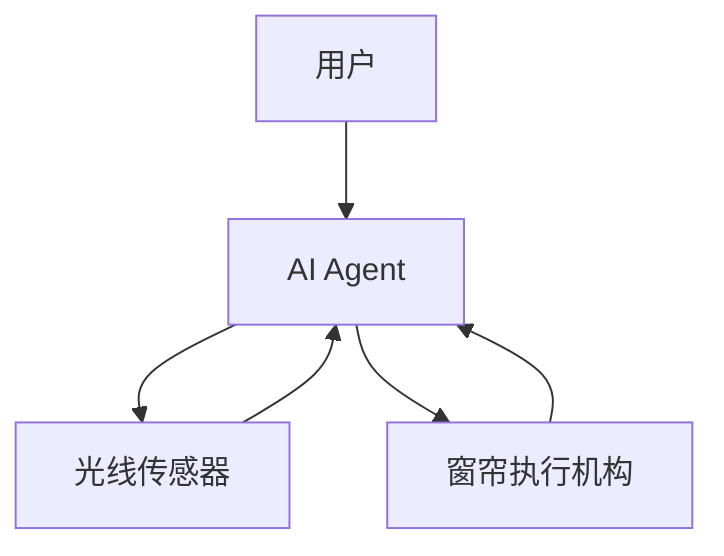
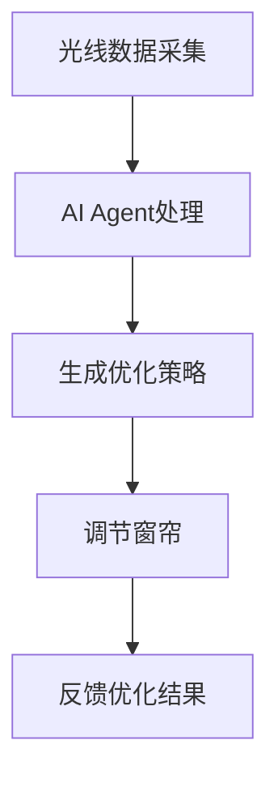

                 


# 智能窗帘：AI Agent的室内光线优化

## 关键词：智能窗帘，AI Agent，室内光线优化，物联网，人工智能，自动化控制

## 摘要：  
本文探讨了AI Agent在智能窗帘中的应用，详细介绍了室内光线优化的核心概念、算法原理、系统架构设计及其实现。通过结合实际案例和项目实战，深入分析了AI Agent如何通过感知、决策和执行模块实现室内光线的智能化优化。文章最后总结了光线优化的未来发展方向和实际应用中的注意事项。

---

# 第一部分：智能窗帘的背景与概念

## 第1章：智能窗帘与AI Agent概述

### 1.1 智能窗帘的背景介绍

#### 1.1.1 室内光线优化的重要性  
室内光线优化是提升居住舒适度和能源效率的重要手段。通过智能窗帘的调节，可以实现光线的自动优化，从而降低能源消耗并提高生活质量。  

#### 1.1.2 智能窗帘的发展历程  
从传统的手动窗帘到智能窗帘，技术的进步使得窗帘的控制方式逐渐智能化。AI Agent的引入进一步提升了智能窗帘的自动化水平。  

#### 1.1.3 AI Agent在智能窗帘中的作用  
AI Agent通过感知环境、分析数据并执行操作，帮助智能窗帘实现光线优化。其核心作用在于将复杂的光线调节任务转化为自动化的解决方案。  

### 1.2 AI Agent的基本概念

#### 1.2.1 AI Agent的定义与特点  
AI Agent是一种能够感知环境、执行任务并适应变化的智能体。其特点包括自主性、反应性、社交性和学习能力。  

#### 1.2.2 AI Agent的分类与应用场景  
AI Agent可以分为简单反射型、基于模型的反应型和目标驱动型。在智能窗帘中，AI Agent主要用于光线优化和用户偏好匹配。  

#### 1.2.3 AI Agent在智能窗帘中的具体实现  
AI Agent通过传感器采集光线数据，结合用户偏好生成优化策略，并通过执行机构调节窗帘的开合程度。  

### 1.3 室内光线优化的核心问题

#### 1.3.1 光线优化的目标与挑战  
光线优化的目标是最大化用户舒适度和能源效率。挑战在于如何平衡动态变化的光线条件和用户的个性化需求。  

#### 1.3.2 智能窗帘优化的数学模型  
光线优化可以通过数学模型描述，例如：  
$$ \text{优化目标} = \text{光线强度} \times \text{用户偏好} $$  
其中，光线强度和用户偏好的权重可以通过数据训练确定。  

#### 1.3.3 光线优化与用户需求的关系  
用户需求是光线优化的核心依据。AI Agent需要根据用户的偏好和实时光线条件，动态调整窗帘的开合程度。  

---

# 第二部分：AI Agent的核心概念与联系

## 第2章：AI Agent的原理与核心概念

### 2.1 AI Agent的工作原理

#### 2.1.1 感知模块：光线数据的采集与分析  
AI Agent通过光线传感器采集室内光线数据，并结合时间、天气等信息进行分析。  

#### 2.1.2 决策模块：基于数据的优化策略  
决策模块根据感知数据和用户偏好，生成最优的窗帘调节策略。  

#### 2.1.3 执行模块：智能窗帘的调节与反馈  
执行模块通过电机或智能硬件调节窗帘，并将反馈信息传递给决策模块，形成闭环控制。  

### 2.2 光线优化算法的对比分析

#### 2.2.1 不同优化算法的对比表格  
以下是对几种常见优化算法的对比分析：  
| 算法类型 | 优点 | 缺点 |  
|----------|------|------|  
| 遗传算法 | 全局优化能力强 | 计算复杂度高 |  
| 梯度下降 | 收敛速度快 | 易陷入局部最优 |  
| 模拟退火 | 全局优化能力强 | 收敛速度慢 |  

#### 2.2.2 算法优缺点的详细说明  
遗传算法适用于复杂问题的全局优化，但计算资源消耗较大。梯度下降适合连续优化问题，但容易受初始值影响。模拟退火能够跳出局部最优，但需要较长的计算时间。  

### 2.3 实体关系图与优化流程图

#### 2.3.1 实体关系图（Mermaid）  



#### 2.3.2 优化流程图（Mermaid）  



---

# 第三部分：光线优化算法的数学模型与实现

## 第3章：光线优化的数学模型

### 3.1 光线优化的数学模型

#### 3.1.1 光线强度的数学表达式  
光线强度 \( I \) 可以通过以下公式表示：  
$$ I = I_0 \times e^{-kt} $$  
其中，\( I_0 \) 是初始光线强度，\( k \) 是衰减系数，\( t \) 是时间。  

#### 3.1.2 用户偏好的数学建模  
用户偏好 \( P \) 可以表示为：  
$$ P = \sum_{i=1}^{n} w_i x_i $$  
其中，\( w_i \) 是偏好权重，\( x_i \) 是用户输入的偏好参数。  

#### 3.1.3 综合优化目标  
综合优化目标 \( O \) 为：  
$$ O = \lambda I + (1-\lambda) P $$  
其中，\( \lambda \) 是光线强度的权重系数。  

---

## 第4章：AI Agent的优化算法实现

### 4.1 光线优化算法的实现步骤

#### 4.1.1 数据采集与预处理  
通过光线传感器采集实时光线数据，并进行数据清洗和特征提取。  

#### 4.1.2 算法选择与参数调优  
根据优化目标选择合适的算法，并通过实验调优参数，例如遗传算法的种群大小和变异概率。  

#### 4.1.3 算法实现与测试  
编写算法代码，进行模拟测试，并根据测试结果优化算法性能。  

---

## 第5章：系统架构设计与实现

### 5.1 系统架构设计

#### 5.1.1 系统功能设计  
智能窗帘系统的主要功能包括：  
- 光线数据采集与分析  
- 用户偏好设置与优化  
- 窗帘自动调节与反馈  

#### 5.1.2 系统架构图（Mermaid）  


### 5.2 系统实现与代码示例

#### 5.2.1 核心代码实现  
以下是光线优化算法的核心代码示例：  

```python
import numpy as np

def optimize_light(intensity, preference, weights):
    # 计算综合优化值
    optimized = intensity * weights[0] + preference * weights[1]
    return optimized

# 示例数据
intensity = np.array([100, 80, 90])
preference = np.array([0.8, 0.6, 0.7])
weights = np.array([0.6, 0.4])

# 调用优化函数
result = optimize_light(intensity, preference, weights)
print(result)
```

---

## 第6章：项目实战与案例分析

### 6.1 项目实战

#### 6.1.1 环境安装与配置  
安装必要的库和工具，例如Python、NumPy、Mermaid等。  

#### 6.1.2 核心代码实现  
实现AI Agent的感知、决策和执行模块，并进行系统集成。  

#### 6.1.3 系统测试与优化  
通过实际测试优化系统性能，并记录测试结果和改进措施。  

### 6.2 案例分析

#### 6.2.1 光线优化的实际案例  
通过实际案例分析AI Agent在不同光线条件下的优化效果，并总结经验教训。  

---

## 第7章：总结与展望

### 7.1 总结

#### 7.1.1 AI Agent在智能窗帘中的应用价值  
AI Agent通过优化算法实现了室内光线的智能化调节，提升了居住舒适度和能源效率。  

#### 7.1.2 项目实施的关键经验  
在项目实施过程中，数据采集的准确性和算法的调优是关键。  

### 7.2 展望

#### 7.2.1 未来发展方向  
未来，AI Agent在智能窗帘中的应用将更加智能化和个性化，例如结合人体生物节律优化光线调节。  

#### 7.2.2 技术趋势与建议  
建议进一步研究多模态数据融合技术，以提升AI Agent的感知和决策能力。  

---

## 参考文献

1. Russell, S., & Norvig, P. (2010). Artificial Intelligence: A Modern Approach.
2. Smith, R. (2018). Smart Home Automation: Principles and Practice.
3. LeCun, Y., Bengio, Y., & Hinton, G. (2015). Deep Learning.

---

通过以上内容，我们可以看到AI Agent在智能窗帘中的应用前景广阔，其结合光线优化算法和系统架构设计，能够为用户提供更加智能化和个性化的室内光线调节方案。

