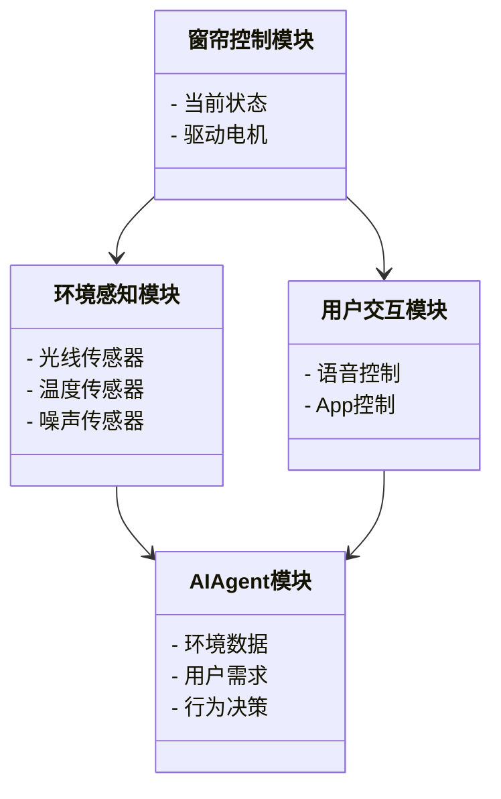

                 


# 智能窗帘：AI Agent的室内环境全面调节

## 关键词：
智能窗帘、AI Agent、环境感知、物联网、智能家居

## 摘要：
智能窗帘作为智能家居的重要组成部分，通过AI Agent技术实现了室内环境的智能调节。本文从AI Agent的核心原理出发，详细分析了智能窗帘的环境感知技术、系统架构设计以及实际应用场景，展示了如何通过AI技术实现室内环境的全面优化。文章还结合实际案例，探讨了智能窗帘系统的优化方向与未来发展趋势。

---

## 第1章: 智能窗帘的定义与现状

### 1.1 智能窗帘的定义
#### 1.1.1 智能窗帘的基本概念
智能窗帘是一种结合了物联网和人工智能技术的智能设备，能够根据环境变化和用户需求自动调节窗帘的开合状态，以实现室内环境的优化。

#### 1.1.2 智能窗帘的功能特点
- 自动调节：基于环境感知数据（如光照强度、温度、湿度等）自动调整窗帘开合。
- 用户交互：支持语音控制、手机App远程操作和自动化场景设置。
- 多设备联动：与智能家居系统（如智能灯、空调、安防系统等）联动，实现整体环境优化。

#### 1.1.3 智能窗帘的市场现状
智能窗帘市场近年来快速增长，主要得益于物联网技术的普及和人工智能算法的进步。目前市场上的智能窗帘产品主要集中在家庭场景，未来将向商业和公共场所扩展。

---

### 1.2 智能窗帘的技术基础
#### 1.2.1 物联网技术在智能窗帘中的应用
物联网技术为智能窗帘提供了数据采集、传输和远程控制的基础支持。通过传感器、通信模块和云端平台，智能窗帘能够实现与外部设备的联动。

#### 1.2.2 人工智能技术在智能窗帘中的应用
人工智能技术（如机器学习、自然语言处理）为智能窗帘提供了环境感知、行为决策和用户交互的核心能力。

#### 1.2.3 智能窗帘的硬件与软件组成
硬件部分包括：电机驱动模块、光线传感器、温度湿度传感器、噪声传感器、通信模块（Wi-Fi/蓝牙）和电源管理模块。软件部分包括：环境感知算法、行为决策算法、用户交互界面和云端控制平台。

---

## 第2章: AI Agent的核心概念与原理

### 2.1 AI Agent的基本概念
#### 2.1.1 AI Agent的定义
AI Agent是一种能够感知环境、自主决策并执行任务的智能实体。它能够根据环境信息和用户需求，做出最优的行为选择。

#### 2.1.2 AI Agent的核心属性
- **自主性**：能够在没有外部干预的情况下自主运行。
- **反应性**：能够实时感知环境变化并做出响应。
- **目标导向性**：基于目标导向的行为决策能力。

#### 2.1.3 AI Agent与传统算法的区别
传统算法（如规则引擎）基于固定的规则执行任务，而AI Agent能够通过学习和适应环境，实现更复杂的任务处理。

---

### 2.2 AI Agent的决策机制
#### 2.2.1 状态感知与目标识别
AI Agent通过传感器获取环境数据（如光照强度、温度、湿度等），并结合用户需求（如隐私保护、节能降耗）进行目标识别。

#### 2.2.2 行为决策与策略优化
基于环境感知数据和用户需求，AI Agent通过强化学习算法优化行为策略，实现最优决策。

#### 2.2.3 多目标平衡与优先级排序
在复杂的环境中，AI Agent需要在多个目标之间进行平衡，例如在隐私保护和节能降耗之间找到最优解。

---

### 2.3 AI Agent的学习与进化
#### 2.3.1 监督学习与无监督学习
- **监督学习**：基于标注数据训练AI Agent的行为模型。
- **无监督学习**：通过环境数据的自我学习和模式识别。

#### 2.3.2 强化学习在AI Agent中的应用
通过强化学习算法，AI Agent能够在复杂环境中实现自主决策和策略优化。

#### 2.3.3 迁移学习与知识共享
通过迁移学习技术，AI Agent能够将已有的知识和经验迁移到新的应用场景中，提升学习效率和效果。

---

### 2.4 AI Agent的环境建模
#### 2.4.1 环境感知数据的采集
通过多种传感器（如光线传感器、温度传感器、噪声传感器）采集环境数据。

#### 2.4.2 环境特征的提取与分析
基于传感器数据，提取环境特征（如光照强度、温度、湿度等），并进行分析和建模。

#### 2.4.3 环境模型的构建与优化
通过机器学习算法构建环境模型，并不断优化模型的准确性和实时性。

---

## 第3章: 智能窗帘的环境感知技术

### 3.1 环境感知的主要技术
#### 3.1.1 光线传感器的应用
光线传感器用于感知室内光照强度，根据光照变化自动调节窗帘的开合状态。

#### 3.1.2 温度与湿度传感器的应用
温度和湿度传感器用于感知室内环境的舒适度，结合用户需求进行智能调节。

#### 3.1.3 噪声传感器的应用
噪声传感器用于感知室内噪声水平，通过窗帘的开合调节室内声音的隔绝与流通。

---

### 3.2 多传感器数据融合技术
#### 3.2.1 数据融合的基本原理
通过多种传感器的数据融合，提高环境感知的准确性和全面性。

#### 3.2.2 数据融合的实现方法
采用加权融合、主分量分析等方法，实现多源数据的优化融合。

#### 3.2.3 数据融合的优化策略
基于动态权重调整和自适应学习算法，提升数据融合的实时性和准确性。

---

### 3.3 环境模型的构建与应用
#### 3.3.1 环境模型的构建过程
通过传感器数据和机器学习算法，构建室内环境的动态模型。

#### 3.3.2 环境模型的动态更新
根据实时环境数据，不断优化和更新环境模型。

#### 3.3.3 环境模型在智能窗帘中的应用
通过环境模型实现窗帘的智能调节，优化室内环境的舒适度和用户体验。

---

## 第4章: 智能窗帘的系统架构与设计

### 4.1 系统架构的总体设计
#### 4.1.1 系统组成与功能划分
- **传感器模块**：负责环境数据的采集。
- **控制模块**：负责窗帘的开合控制。
- **通信模块**：负责与云端平台和用户终端的通信。
- **AI Agent模块**：负责环境感知、行为决策和用户交互。

#### 4.1.2 系统功能设计
- **环境感知功能**：实时采集和分析环境数据。
- **行为决策功能**：根据环境数据和用户需求，做出最优决策。
- **用户交互功能**：支持多种交互方式（如语音、App、自动化场景）。

#### 4.1.3 系统架构设计
采用分层架构设计，包括数据采集层、数据处理层、决策控制层和用户交互层。

---

### 4.2 系统功能设计
#### 4.2.1 领域模型设计
通过Mermaid图展示智能窗帘系统的领域模型。



---

### 4.3 系统架构设计
#### 4.3.1 系统架构图
通过Mermaid图展示智能窗帘系统的架构设计。


---

## 第5章: 智能窗帘的项目实战

### 5.1 环境搭建与开发工具安装
#### 5.1.1 开发环境搭建
安装Python、Node.js、ROS（机器人操作系统）等开发工具。

#### 5.1.2 传感器与硬件配置
配置光线传感器、温度湿度传感器和噪声传感器，确保硬件正常工作。

---

### 5.2 系统核心功能实现
#### 5.2.1 环境感知算法实现
基于Python的环境感知算法实现，代码示例如下：

```python
import numpy as np
from sklearn import linear_model

# 传感器数据
X = np.array([[0.5, 22, 45], [0.6, 23, 50], [0.7, 24, 55]]).T
y = np.array([0, 1, 2])

# 线性回归模型
model = linear_model.LinearRegression()
model.fit(X, y)

# 预测窗帘开合状态
predicted = model.predict(X)
print(predicted)
```

#### 5.2.2 行为决策算法实现
基于强化学习的决策算法实现，代码示例如下：

```python
import gym
import numpy as np

# 创建环境
env = gym.make('CustomCurtainEnv-v0')
env.reset()

# 强化学习算法
policy = np.random.rand(env.action_space.n)
for _ in range(1000):
    action = np.argmax(policy)
    observation, reward, done, info = env.step(action)
    if done:
        env.reset()
```

---

### 5.3 系统功能测试与优化
#### 5.3.1 功能测试
测试智能窗帘的环境感知、行为决策和用户交互功能，确保系统正常运行。

#### 5.3.2 性能优化
优化传感器数据的采集频率和算法的运行效率，提升系统的响应速度和准确性。

---

### 5.4 系统部署与维护
#### 5.4.1 系统部署
将智能窗帘系统部署到实际应用场景中，确保系统的稳定性和可靠性。

#### 5.4.2 系统维护
定期更新系统软件和优化算法模型，确保系统的持续优化和性能提升。

---

## 第6章: 智能窗帘系统的优化与展望

### 6.1 系统优化方向
#### 6.1.1 算法优化
优化强化学习算法，提升决策的准确性和实时性。

#### 6.1.2 硬件优化
引入更高精度的传感器，提升环境感知的准确性。

#### 6.1.3 系统集成
实现与更多智能家居设备的联动，构建完整的智能家居生态系统。

---

### 6.2 未来发展趋势
#### 6.2.1 智能化升级
通过AI技术的不断进步，实现更加智能化和个性化的室内环境调节。

#### 6.2.2 万物互联
随着物联网技术的普及，智能窗帘将实现与更多设备的无缝连接，构建更加智能和便捷的居住环境。

#### 6.2.3 用户体验优化
通过人机交互技术的创新，提升用户的使用体验和满意度。

---

### 6.3 实际案例分析
结合实际应用场景，分析智能窗帘系统的实际效果和优化方向。

---

## 第7章: 总结与展望

### 7.1 章节小结
总结智能窗帘AI Agent的核心技术与实际应用，强调AI技术在室内环境调节中的重要作用。

### 7.2 最佳实践 Tips
- 在实际应用中，建议优先选择高精度的传感器和高效的算法模型。
- 系统部署前，需进行全面的功能测试和性能优化。

### 7.3 注意事项
- 系统维护需定期进行，确保设备的正常运行和算法的持续优化。
- 用户在使用智能窗帘时，需注意隐私保护和设备安全。

### 7.4 拓展阅读
推荐相关领域的优秀书籍和论文，供读者进一步学习和研究。

---

通过以上章节的详细分析，我们可以看到，智能窗帘作为智能家居的重要组成部分，其背后涉及了丰富的技术细节和复杂的系统设计。AI Agent技术的引入，为智能窗帘的环境调节能力带来了质的飞跃，也为未来的智能家居发展提供了新的思路和方向。

